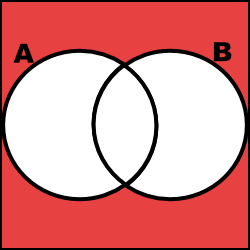
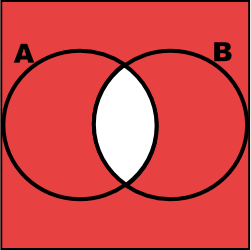
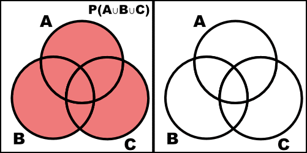

Problems: 1.2, 1.4, 1.6 + R Problem

* Do not remove this line (it will not be displayed)
{:toc}

# 1.2
**Two six-sided dice are thrown sequentially, and the face values that come up are recorded.**

## a.
**List the sample space.**

$$
    \begin{align}
        \Omega =  \{ & 11, 12, 13, 14, 15, 16, \\
             & 21, 22, 23, 24, 25, 26, \\
             & 31, 32, 33, 34, 35, 36, \\
             & 41, 42, 43, 44, 45, 46, \\
             & 51, 52, 53, 54, 55, 56, \\
             & 61, 62, 63, 64, 65, 66 \}
    \end{align}
$$

## b.
**List the elements that make up the following events:**

### (1)
**$A=$ the sum of the two values is at least 5** 

$$
    \begin{align}
        A = \{ & 14, 15, 16, \\
            & 23, 24, 25, 26, \\
            & 32, 33, 34, 45, 36, \\
            & 41, 42, 43, 44, 45, 46, \\
            & 51, 52, 53, 54, 55, 56, \\
            & 61, 62, 63, 64, 65, 66 \}
    \end{align}
$$

### (2) 
**$B=$ the value of the first die is higher than the value of the second**

$$
    \begin{align}
        B = \{ & 21, \\
            & 31, 32, \\
            & 41, 42, 43, \\
            & 51, 52, 53, 54, \\
            & 61, 62, 63, 64, 65 \}
    \end{align}
$$

### (3)
**$C=$ the first value is 4**

$$
    C = \{ 41, 42, 43, 44, 45, 46 \}
$$

## c.
*List the elements of the following events*

### (1)
*$A \cap C$*

$$
    A \cap C = \{41, 42, 43, 44, 45, 46 \}
$$

### (2)
*$B \cup C$*

$$
    \begin{align}
        B \cup C = \{ & 21, \\
            & 31, 32, \\
            & 41, 42, 43, 44, 45, 46, \\
            & 51, 52, 53, 54, \\
            & 61, 62, 63, 64, 65 \}
    \end{align}
$$

### (3)
*$A \cap (B \cup C)$*

$$
 \begin{align}
    A \cap (B \cup C)  = &  \\
    
    = & \begin{Bmatrix} 
            14, & 15, & 16, \\
            23, & 24, & 25, & 26, \\
            32, & 33, & 34, & 45, & 36, \\
            41, & 42, & 43, & 44, & 45, & 46, \\
            51, & 52, & 53, & 54, & 55, & 56, \\
            61, & 62, & 63, & 64, & 65, & 66 
        \end{Bmatrix}
            \cap 
        \begin{Bmatrix} 
            \\
            21, \\
            31, & 32, \\
            41, & 42, & 43, & 44, & 45, & 46, \\
            51, & 52, & 53, & 54, \\
            61, & 62, & 63, & 64, & 65 
          \end{Bmatrix} \\

     = & \{ 32, \\
        & 41, 42, 43, 44, 45, 46 \\
        & 51, 52, 53, 54, \\ 
        & 61, 62, 63, 64, 65 \}
          
          
 \end{align}
$$

# 1.4
**Draw Venn diagrams to illustrate De Morgan's laws:**

Note: The Red indicates the expressed region.

$$(A \cup B)^{C} = A^{C} \cap B^{C}$$

$$(A \cap B)^{C} = A^{C} \cup B^{C} $$

# 1.6

*Verify the following extension of the addition rule (a) by an appropriate Venn diagram and (b) by a formal argument using the axioms of probability and teh propositions in this chapter.*

$$ P(A \cup B \cup C) =  P(A) + P(B) + P(C) - P(A \cap B) - P(A \cap C) - P(B \cap C) + P(A \cap B \cap C)$$

## a.

## b.

$$
    \begin{align}
        P(A \cup B \cup C) & =  P(A \cup (B \cup C)) \\
            & = P(A) + P(B \cup C) - P(A \cap (B \cup C)) \\
            & = P(A) + P(B) + P(C) - P(B \cap C) - P(A \cap (B \cup C)) \\
            & = P(A) + P(B) + P(C) - P(B \cap C) - P( (A \cap B) \cup (A \cap C)) \\
            & = P(A) + P(B) + P(C) - P(B \cap C) - (P(A \cap B) + P( A \cap C) - P(A \cap B \cap C)) \\
            & = P(A) + P(B) + P(C) - P(A \cap B) - P(A \cap C) - P(B \cap C) + P(A \cap B \cap C)
    \end{align}
$$

# R Problem

[You can view the R problem and solution here.](https://github.com/JimmyJHickey/Fundamentals-of-Statistical-Inference-1/blob/master/homework1.R)