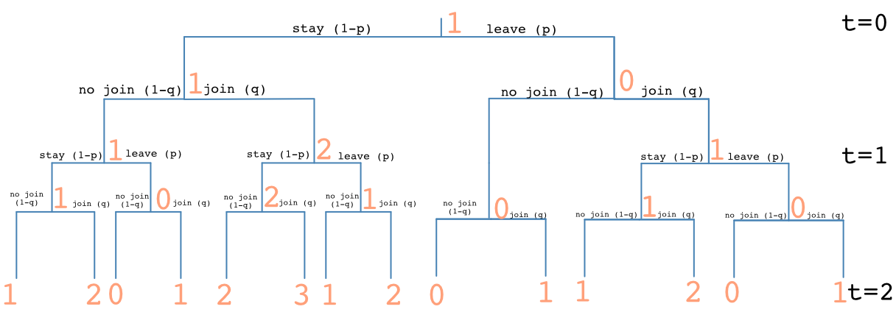

Problems: 1.9, 1.12, 1.15, 1.19, 1.27, 1.32, 1.33, 1.37, 1.45, 1.46, 1.50, 1.53, 1.69, 1.70, 1.76 + R Problem

* Do not remove this line (it will not be displayed)
{:toc}

# 1.9
**The weather forecaster says that the probability of rain on Saturday is 25% and that the probability of rain on Sunday is 25%. Is the probability of rain for the weekend 50%? Why or why not?**

The probability is not 50%. The probability for rain this weekend is the same as asking if it will rain on Saturday or on Sunday. Note that these are mutually exclusive events. Thus,

$$
    \begin{align}
        P(A \cup B) & = P(A) + P(B) - P(A \cap B)  & \text{by Axiom 3}\\
        & = 0.25 + 0.25 - (0.25 * 0.25) \\
        & = 0.4375
    \end{align}
$$

# 1.12
**In a game of poker, five players are each dealt 5 cards from 52-card deck. How many ways are there to deal the cards?**

You can think of each player as being a slot where 5 cards are chosen. Note that a hand is not ordered.

| Player 1 | Player 2 | Player 3 | Player 4 | Player 5 |
| :---: | | :---: | | :---: | | :---: | | :---: | 
| $52 \choose 5$ | $47 \choose 5$ | $42 \choose 5$ | $37 \choose 5$ | $32 \choose 5$ |

By the Multiplication Principle:

$$
    {52 \choose 5} * {47 \choose 5} * {42 \choose 5} * {37 \choose 5} * {32 \choose 5} \\[20pt]
    \dfrac{52!}{(52-5)!5!} * \dfrac{47!}{(47-5)!5!} * \dfrac{42!}{(42-5)!5!} * \dfrac{37!}{(37-5)!5!} * \dfrac{32!}{(32-5)!5!} \\[20pt]
    \dfrac{52!}{27!*(5!)^{5}} \\[20pt]
    297686658367751290178415114240
$$

# 1.15
**How many different meals can be made from four kinds of meat, six vegetables, and three starches if a meal consists of one selection from each group?**

By the Multiplication Principle:

$$
4 * 6 * 3 = 72
$$

# 1.19
**A committee consists of five Chicanos, two Asians, three African Americans, and two Caucasians.**

## a.
**A subcommittee of four is chosen at random. What is the probability that all the ethnic groups are represented on the subcommittee?**

The total number of ways to choose a subcommittee is ${12 \choose 4}$. Since only one Chicano can be chose, there are ${5 \choose 1}=5$ ways to choose a Chicano member. Similarly, there are 2 ways to choose an Asian member, 3 ways to choose and African American member, and 2 ways to choose a Caucasian member. Thus, the number of ways to choose this subcommittee is

$$
    \dfrac{5*2*3*2}{12 \choose 4} \\[20pt]
    \dfrac{60}{\dfrac{12!}{8!*4!}} \\[20pt]
    \dfrac{4}{33} \\[20pt]
    0.1212
$$

## b.
**Answer the question for part (a) is a subcommittee of five is chosen.**

There are now ${12 \choose 5}$ ways to choose a subcommittee. Since there is an extra member, there will be 2 people from one ethnic group and 1 from the rest. Thus, there are ${5 \choose 2}$ ways to choose the Chicano members. Similarly, there are ${2 \choose 2}$, ${3 \choose 2}$, and ${2 \choose 2}$ ways to choose the Asian, African American, and Caucasian members, respectively.

$$
    \dfrac{ {5 \choose 2} * {2 \choose 2} * {3 \choose 2} * {2 \choose 2} }{ {12 \choose 5} } \\[20pt]
    \dfrac{ 10 * 1 * 3 * 1 }{ {12 \choose 5} } \\[20pt]
    \dfrac{5}{132} \\[20pt]
    0.037878788
$$

# 1.27
**If a five-letter word is formed at random (meaning that all sequences of five letters are equally likely), what is the probability that no letter occurs more than once?**

The probability of no letter occurring once is the proportion of there being no repeats to the total number (including repeats). Think of each letter as a slot.

|  | Letter 1 | Letter 2 | Letter 3 | Letter 4 | Letter 5 |
| :---: | :---: | | :---: | | :---: | | :---: | | :---: | 
| Without Repeats | $26$ | $25$ | $24$ | $23$ | $22$ |
| With Repeats | $26$ | $26$ | $26$ | $26$ | $26$ | 

$$
    \dfrac{26*25*24*23*22}{26^{5}} \\[20pt]
    \dfrac{18975}{28561} \\[20pt]
    0.664367
$$

# 1.32
**A wine taster claims that she can distinguish four vintages of a particular Cabernet. What is the probability that she can do this by merely guessing. (She is confronted with unlabeled glasses.)**

Assuming there is no replacement (that she doesn't guess the same wine twice), she could guess 4 wines for the first glass, 3 wines for the second, 2 for the third, and 1 for the last. Thus, the probability of getting each glass right by chance is

$$
    \dfrac{1}{4*3*2*1} = \dfrac{1}{24}
$$

# 1.33
**An elevator containing five people can stop at any of seven floors. What is the probability that no two people get off at the same floor? Assume that the occupants act independently and that all floors are equally likely for each occupant.**

Similar to problem 1.27, there are $7^{5}$ total possibilities. 

The first occupant will have 7 floors to choose from. The other occupants will have 6, 5, 4, and 3 floors respectively. 

$$
    \dfrac{7*6*5*4*3}{7^{5}} = 0.149938
$$

# 1.37
**What is the coefficient of \$x^{3}y^{4}\$ in the expansion of $(x+y)^{7}$?**

Using the multinomial theorem,

$$
    {7 \choose 3, 4} = \dfrac{7!}{3!*4!} = 35
$$

# 1.45
**Show that if the conditional probabilities exist, then**
$$
    \begin{align}
        P(A_{1} \cap A_{2} \cap \dots \cap A_{n}) & = \\
        & = P(A_{1})P(A_{2}|A_{1})P(A_{3}|A_{1} \cap A_{2}) \dots P(A_{n}|A_{1} \cap A_{2} \cap \dots \cap A_{n-1})
    \end{align}
$$

Starting with $A_1$ and $A_2$,

$$
    \begin{align}
        P(A_{1} \cap A_{2} \cap \dots \cap A_{n}) & = P(A_{1})* P(A_{2} \cap \dots \cap A_{n} | A_{1})\\
        & = P(A_{1})* P(A_{2} | A_{1}) * P(A_{3} \cap \dots \cap A_{n} | A_{1} \cap A_{2}) \\
        \vdots
    \end{align}
$$

Since the conditional probabilities exist for all $A_{i}$, this process can be repeated. And, by induction,

$$
    \begin{align}
        P(A_{1} \cap A_{2} \cap \dots \cap A_{n}) & = \\
        & = P(A_{1})P(A_{2}|A_{1})P(A_{3}|A_{1} \cap A_{2}) \dots P(A_{n}|A_{1} \cap A_{2} \cap \dots \cap A_{n-1})
    \end{align}
$$

# 1.46
**Urn $A$ has three red balls and two white balls, and urn $B$ has two red balls and five white balls. A fair coin is tossed. If it lands heads up, a ball is drawn from urn $A$; otherwise, a ball is drawn from urn $B$.**

## a.
**What is the probability that a red ball is drawn?**

A ball from either bag can be represented as 

$$
    P(Red) = P(A_{red} \cup B_{red}) = P(A_{red}) + P(B_{red}) -  P(A_{red} \cap B_{red}) = P(A_{red}) + P(B_{red})  \\
    0.5*\frac{3}{5} + 0.5*\frac{2}{7} = \dfrac{31}{70} = 0.442857
$$

## b.
**If a red ball is drawn, what is the probability that the coin landed heads up?**

$$
    P(Heads | Red) = \dfrac{P(Head \cap Red)}{P(Red)} \\
    \dfrac{0.5*\frac{3}{5}}{\frac{31}{70}} \\
    0.677419
$$

# 1.50
**Two dice are rolled, and the sum of the face values is six. What is the probability that at least one of the dice came up a three?**

The sample space for two dice being rolled has $6^2 = 36$ elements $\Omega = \{11, 12, \dots 66\}$. Given the constraint that the sum of the dice has to equal 6, that shrinks to $\Omega_{sum} = \{15, 24, 33, 42, 51\}$. Only one of these entries has a 3, so 

$$P(\text{at least one die is three} | \text{sum = 6}) = \frac{1}{5}$$

# 1.53
**A fire insurance company has high-risk, medium-risk, and low-risk clients, who have respectively, probabilities of 0.02, 0.01, and 0.0025 of filing claims within a given year. The proportions of the numbers of clients in the three categories are 0.10, 0.20, and 0.70, respectively. What proportion of the claims filed each year come from high-risk clients?**

$$
    \dfrac{\text{claims filed by high risk clients}}{\text{all claims filed}}\\[20pt]
    \dfrac{\text{claims filed by high risk clients}}{\text{claims filed by high risk clients * claims filed by medium risk clients * claims filed by low risk clients}}\\[20pt]
    \dfrac{0.02*0.10}{0.02*0.10+0.01*0.20+0.0025*0.70} = 0.347826
$$

# 1.69
**If $A$ and $B$ are disjoint, can they be independent?**

No. For example, if you know an element $x\in B$, then you know that $x\notin A$ because they are disjoint. Since knowing that an element is in one of the sets changes the knowledge of whether or not it is in the other set, $A$ and $B$ cannot be independent.

# 1.70
**If $A \subset B$, can $A$ and $B$ be independent?**

No. For example, if you know that $x \in A$, then you also know that $x \in B$ because A is a subset. Since knowing that an element is in $A$ provides the information that the element is also in $B$, $A$ and $B$ cannot be independent.

# 1.76
**Here is a simple model of a queue. The queue runs in discrete time ($t = 0, 1, 2, \dots$), and at each unit of time the first person in the queue is served with probability $p$ and independently, a new person arrives with a probability $q$. At time $t=0$, there is one person in the queue. Find the probabilities that there are 0, 1, 2, 3 people in line at time $t=2$.**

The possible outcomes of this situation can be clearly displayed in a tree.

Now add up all of the probabilities that there are 0, 1, 2, or 3 people at time $t=2$.

$$
    \begin{align}
        P(0) & = (1 - q)*p*q*q + (1 - q)*p*(1 - q) (1 - p) \\
        & = -p (-1 + q) (1 + p (-1 + q) + (-1 + q) q) \\[20pt]
        P(1) & = q*p*q*p + (1 - q)*(1 - p)*q*p + q*(1 - q)*p + (1 - q)*p*q*(1 - p) + (1 - q) (1 - p) (q) (1 - p) + q*p*(1 - q) (1 - p) + (1 - q) (1 - p) (1 - q) (1 - p) \\
        & = 1 - q + p (-1 + 2 q) (2 - p + 2 (-1 + p) q) \\[20pt]
        P(2) & = q (1 - p) (1 - q) (1 - p) + (1 - q) (1 - p) q (1 - p) + q*p*q*(1 - p) + q (1 - p) q*p \\
        & = -2 (-1 + p) q (1 - q + p (-1 + 2 q))\\[20pt]
        P(3) & = q (1 - p) (q) (1 - p) \\
        & = (-1 + p)^{2} q^{2}
    \end{align}
$$
# R Problem

[You can view the R problem and solution here.](https://github.com/JimmyJHickey/Fundamentals-of-Statistical-Inference-1/blob/master/homework2.R)