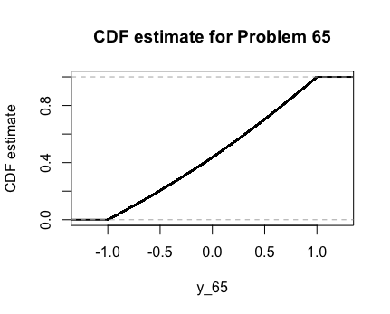
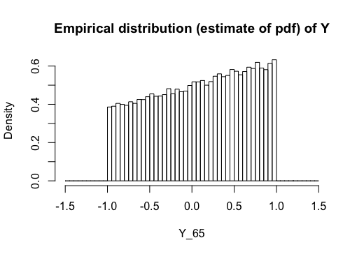
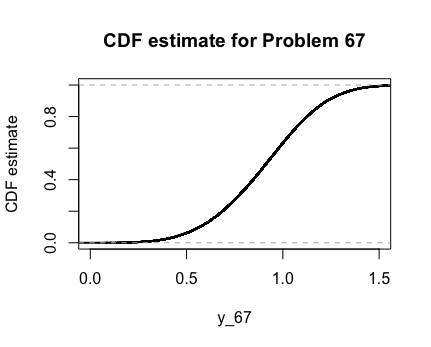
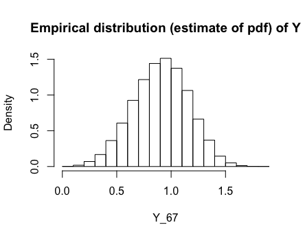

Problems: 2.56, 2.59, 2.60, 2.61, 2.62, 2.65, 2.67, 2.69, 3.3

* Do not remove this line (it will not be displayed)
{:toc}

# 2.56
**If $X \sim N(\mu, \sigma ^2)$, find the density of $Y = |X|$.**

Let's use the CDF Method.

$$
    \begin{align}
        F_Y(y) = P(Y \leq y) & = P(|X| \leq y) \\
            & = P(-y \leq X \leq y) & \text{Splitting the absolute value} \\
            & = P(X \leq y ) - P(X \geq -y) & \text{Splitting the inequality} \\
            & = P(X \leq y ) - ( 1 - P(X \leq -y)) & \text{Using the complement} \\
            & = F_X(y) - F_X(-y) - 1
    \end{align}
$$

Now with the $Y$ CDF in terms of the known $X$ CDF, we can find the density.

$$
	\begin{align}
		f_Y(y) = \frac{d}{dy}F_Y(y) & = \frac{d}{dy}[F_X(y) - F_X(-y) - 1] \\
            & = f_X(y) \cdot 1 - f_X(-y)\cdot -1 - 0 & \text{Chain Rule}\\
            & = \frac{1}{\sqrt{2 \pi \sigma}} e^{-\frac{1}{2 \sigma^2}(y-\mu)^2} + \frac{1}{\sqrt{2 \pi \sigma}} e^{-\frac{1}{2 \sigma^2}(-y-\mu)^2} \\
            & = \frac{1}{\sqrt{2 \pi \sigma}} e^{-\frac{1}{2 \sigma^2}(y-0)^2} + \frac{1}{\sqrt{2 \pi \sigma}} e^{-\frac{1}{2 \sigma^2}(-y-0)^2} & \mu \text{ = 0} \\
            & = 2 \cdot \frac{1}{\sqrt{2 \pi \sigma}} e^{-\frac{1}{2 \sigma^2}y^2}
	\end{align}
$$

# 2.59
**If $U$ is uniform on $[-1,1]$, find the density function of $U^2$.**

For notation, say $Y = U^2$. Let's use the CDF method.

$$
	\begin{align}
		F_Y(y) = P(Y\leq y) & = P(U^2 \leq y) \\
            & = P(U \leq \sqrt{y}) & \text{Could take positive or negative}\\
            & = F_U(\sqrt{y})
	\end{align}
$$ 

Now with $Y$'s CDF in terms of the known $U$ CDF, we can find the density. Note that since we will be differentiating, the positive and negative square root will give the same result, so we will proceed with the positive. 

$$
	\begin{align}
        f_Y(y) = \frac{d}{dy} F_Y(y) & = \frac{d}{dy}[F_U(\sqrt{y})] \\
            & = f_U(\sqrt{y}) \cdot (\frac{1}{2} y^{-\frac{1}{2}}) \\
            & = \frac{1}{\theta_1 - \theta_0} \cdot \frac{1}{2}\cdot\frac{1}{\sqrt{y}} \\
            & = \frac{1}{1- (-1)} \cdot \frac{1}{2}\cdot\frac{1}{\sqrt{y}} \\
            & = \frac{1}{4 \sqrt{y}} & y \in [-1,1] \\
            & = 0 & \text{Otherwise}
	\end{align}
$$

# 2.60
**Find the density function of $Y=e^X$, where $Z \sim N(\mu, \sigma^2$. This is the _lognormal density_, since $\log{Y}$ is normally distributed.**

Let's use the CDF Method.

$$
	\begin{align}
		F_Y(y) = P(Y\leq y) & = P(e^Z \leq y) \\
            & = P(Z \leq \ln{y}) \\
            & = F_Z(\ln{y})
	\end{align}
$$

Now with $Y$'s CDF in terms of the known $Z$ CDF, we can find the density.

$$
	\begin{align}
        f_Y(y) =  \frac{d}{dy} F_Y(y) & = \frac{d}{dy}[F_Z(\ln{y})] \\
            & = f_Z(\ln{y}) \cdot \frac{1}{y} \\
            & = \frac{1}{\sqrt{2 \pi \sigma}} e^{-\frac{1}{2 \sigma^2}(\ln{y}-\mu)^2} \cdot \frac{1}{y} \\
	\end{align}
$$

# 2.61
**Find the density of $cX$ when $X$ follow a gamma distribution. Show that only $\lambda$ is affected by such a transformation, which justifies calling $\lambda$ a scale parameter.**

For notation, say $Y = xX$. Let's use the CDF method.

$$
	\begin{align}
		F_Y(y) = P(Y\leq y) & = P(c X \leq y)\\
            & = P(X \leq \frac{y}{c}) \\
            & = F_X\Big(\frac{y}{c}\Big)
	\end{align}
$$

Now with $Y$'s CDF in terms of the known $X$ CDF, we can find the density.

$$
	\begin{align}
		f_Y(y) = \frac{d}{dy} F_Y(y) & = \frac{d}{dy}[F_X\Big(\frac{y}{c}\Big)] \\
            & = \frac{1}{c} \cdot \frac{\lambda^{\alpha}}{\Gamma(\alpha)} \Big(\frac{y}{c} \Big)^{\alpha-1} \exp(\lambda \frac{y}{c}) \\
             & = \frac{1}{c^{\alpha}} \cdot \frac{\lambda^{\alpha}}{\Gamma(\alpha)} y^{\alpha-1} \exp(\frac{\lambda}{c} y) \\
             & = \frac{ \Big( \frac{\lambda}{c}\Big) ^{\alpha}}{\Gamma(\alpha)} y^{\alpha-1} \exp(\frac{\lambda}{c} y)
	\end{align}
$$

Notice that $Y \sim Gamma(\frac{\lambda}{c}, \alpha)$. Since $\alpha$ was unaffected and $c$ only scales the distribution, it makes sense to call $\lambda$ a scaling parameter.

# 2.62
**Show that if $X$ has a density function of $f_X$ and $Y = aX + b$, then**

$$
f_Y(y) = \frac{1}{|a|}\cdot f_X\Big(\frac{y-b}{a}\Big)
$$

Let's use the CDF Method. 

$$
	\begin{align}
		F_Y(y) = P(Y \leq y) & = P(aX + b \leq y) \\
        & = P(X \leq \frac{y-b}{a}) & \text{for } a > 0 \\
        & = F_X \Big(\frac{y-b}{a} \Big) \\
        & = P(X \geq \frac{y-b}{a}) & \text{for } a < 0 \\
        & = 1 - P(X \leq \frac{y-b}{a}) \\
        & = 1 - F_X \Big(\frac{y-b}{a} \Big)
	\end{align}
$$

Now with $Y$'s CDF in terms of the known $X$ CDF, we can find the density.

$$
	\begin{align}
		f_Y(y) & = \frac{d}{dy} F_Y(y) \\
            & =\frac{d}{dy} \Big[F_X \Big(\frac{y-b}{a} \Big)\Big] & \text{for } a > 0 \\ 
            & = \frac{1}{a} \cdot f_X\Big(\frac{y-b}{a} \Big) \\
            \\
        f_Y(y) & = \frac{d}{dy} F_Y(y) \\
            & = \frac{d}{dy} \Big[1 - F_X \Big(\frac{y-b}{a} \Big)\Big]& \text{for } a < 0 \\ 
            & = \frac{-1}{a} \cdot f_X\Big(\frac{y-b}{a} \Big)
	\end{align}
$$

Since $a$ is negative and multiplied by $-1$, the overall expression is positive. Thus, we can combine the cases.

$$
 f_Y(y) = \frac{1}{|a|} \cdot f_X\Big(\frac{y-b}{a} \Big)
$$

# 2.65
**How could random variables with the following density function be generated from a uniform random number generator?**

$$
	\begin{align}
		f(x) = \frac{1 + \alpha x}{x}, & -1\leq x \leq 1, & -1 \leq \alpha \leq 1
	\end{align}
$$

We would find the CDF and its inverse. Then we could generate random values through the inverse.

The CDF is,

$$
	\begin{align}
		F_X(x) & = \int_{-1}^{x}\frac{1+\alpha t}{2} \\
            & = \frac{1}{2} + \frac{x}{2} - \frac{\alpha}{4} + \frac{\alpha x^2}{4}
	\end{align}
$$

Now, to find it's inverse.

$$
	\begin{align}
		F^{-1}_X(x) = x & = \frac{1}{2} + \frac{y}{2} - \frac{\alpha}{4} + \frac{\alpha y^2}{4}\\
            & = \frac{-1 \pm \sqrt{1 - 2 \alpha + 4 \alpha x + \alpha ^2}}{\alpha}\\
	\end{align}
$$

We will take the positive square root for our support.

Here are the graphs of the PDF and CDF as estimated by R with $\alpha = 0.25$.

# 2.67
**The _Weibull_ cumulative distribution function is**

$$
	\begin{align}
		F(x) = 1 - e^{-(x/\alpha)^\beta}, & x \geq 0, & \alpha > 0, & \beta > 0
	\end{align}
$$

## a.
**Find the density function.**

$$
	\begin{align}
		f_X(x) = \frac{d}{dx}F_X(x) & = \frac{d}{dx}\Big[ 1 - e^{-(x/\alpha)^\beta} \Big] \\
        & = - e^{(-\alpha / x)^\beta} \cdot (\frac{-\beta}{\alpha} x^{\beta-1}) \\
        & = \frac{e^{-(\alpha / x )^{\beta}} \cdot \beta \ \cdot x^{\beta - 1}}{\alpha^\beta}
	\end{align}
$$

## b. 
**Show that if $W$ follow a Weibull distribution, then $X=(W/\alpha^\beta$ follows an exponential distribution.**

Let's use the CDF Method.

$$
	\begin{align}
		F_X(x) = P(X \leq x) & = P\Big(\Big(\frac{W}{\alpha}\Big)^\beta \leq x\Big) \\
            & = P\Big(W \leq \alpha x^{1/\beta}\Big) \\
            & = F_X(\alpha x^{1/\beta})
	\end{align}
$$

Now that we have $X$'s CDF in terms of the known $W$ CDF, we can find the density. 

$$
	\begin{align}
		f_X(x) = \frac{d}{dx}F_X(x) & = \frac{d}{dx} \Big[F_X(\alpha x^{1/\beta}) \Big] \\
            & = f_W(\alpha x^{1/\beta}) \cdot \alpha \frac{1}{\beta} x^{1/\beta -1} \\
            & = \frac{\alpha}{\beta} x^{1/\beta -1} \cdot \frac{\beta}{\alpha^\beta} \cdot (\alpha x^{1/\beta})^{\beta - 1} \cdot  e^{-(\frac{\alpha x^{1/\beta}}{\alpha})^\beta} \\
            & = x^{1/\beta - 1} \cdot x^{\frac{\beta - 1}{\beta}} \cdot e^{-x}\\
            & = x^{\frac{1}{\beta} + \frac{\beta-1}{\beta} - 1} \cdot e^{-x}\\
            & = x^{1-1} \cdot e^{-x} \\
            & = e^{-x}
	\end{align}
$$

So, $X \sim Exp(1)$

## c.
**How could Weibull random variables be generated from a random number generator?**

We would find its inverse CDF. Then we could generate random values through the inverse. The inverse CDF is:

$$
	\begin{align}
        F^{-1}_W(w) = w & = 1 - e^{-(y/\alpha)^\beta} \\
            1 -w & = e^{-(y/\alpha)^\beta} \\
            \ln (1-x) & = -\Big( \frac{y}{\alpha}\Big)^\beta \\
            y & = \alpha \cdot ( -\ln(1-x))^{1/\beta}
	\end{align}
$$

Here are the graphs of the PDF and CDF as estimated by R with $\alpha = 1$ and $\beta = 4$.

# 2.69
**If the radius of a sphere is an exponential random variable, find the density function of the volume.**

Take $R \sim Exp(\lambda)$ to be our radius function and $V = \frac{4}{3}R^3$ to be our volume function. Now, using the CDF method,

$$
	\begin{align}
		F_V(v) = P(V \leq v) & = P(\frac{4}{3}R^3 \leq v) \\
            & = P(R \leq \Big( \frac{3}{4} v \Big)^{1/3} )\\
            & = F_R\Big(\Big( \frac{3}{4} v \Big)^{1/3} \Big)
	\end{align}
$$

Now with $V$'s CDF in terms of the known $R$ CDF, we can find the density.

$$
	\begin{align}
		f_V(v) &= \frac{d}{dv}\Big( F_R\Big(\Big( \frac{3}{4} v \Big)^{1/3} \Big) \Big)\\
            & = \Big(\frac{3}{4} \Big)^{1/3}\cdot \frac{1}{3} v^{-2/3}\cdot -\lambda \cdot \exp\Big(-\lambda \Big( \Big( \frac{3}{4} v \Big)^{1/3} \Big) \Big) & \text{for } v > 0 \\
            & 0 & \text{otherwise}
	\end{align}
$$

# 3.3
**Three players play 10 independent rounds of a game, and each player has a probability of $\frac{1}{3}$ of winning each round. Find the joint distribution of the number of games won by each player.**

We can name the players $Y_1, Y_2, Y_3$ respectively. Notice that each of the player's distribution follows a Binomial distribution. Thus, this problem follows a Multinomial distribution.

$$
\pmb{Y} \sim Multinom(10, 1/3, 1/3, 1/3)
$$

Also, notice that $y_3 = 10 - y_2 - y_1$. That is, player 3 win all of the games that player 1 and player 2 do not win. So,

$$
	\begin{align}
		P(Y_1 = y_1, Y_2 = y_2, Y_3 = y_3) & = { 10 \choose y_1, y_2, 10 - y_1 - y_2} (1/3)^{y_1} \cdot (1/3)^{y_2} \cdot (1/3)^{10 - y_2 - y_1}
	\end{align}
$$
