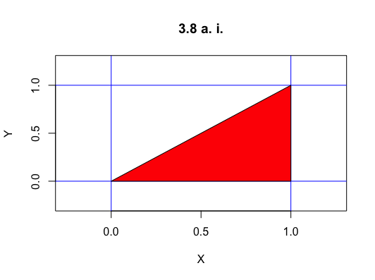
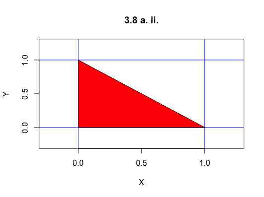
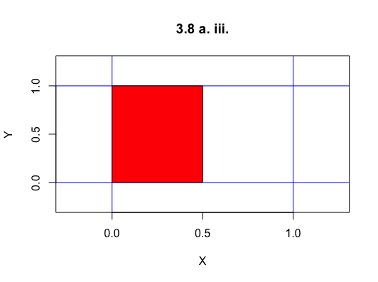

Problems: 3.7, 3.8 - Just set up the integrals, no need to solve them out, 3.14, 3.18, 3.27, 4.25, 4.44, 4.48, 4.50, 4.55, 4.56

* Do not remove this line (it will not be displayed)
{:toc}

# 3.7
Find the joint and marginal densities corresponding to the cdf

$$
	\begin{align}
		F(x,y) = (1-e^{-\alpha x}) (1-e^{-\beta y}), & & x \geq 0, y \geq 0, \alpha > 0, \beta > 0.
	\end{align}
$$

Multiplying gives

$$
	\begin{align}
		F_{X,Y}(x,y) & = 1 - e^{-\beta y} - e^{-\alpha x} + e^{-\alpha x + -\beta y}.
	\end{align}
$$

The joint PDF is

$$
	\begin{align}
		f_{X,Y}(x,y) & = \frac{\partial ^2 F_{X,Y}}{\partial x \partial y} \\
            & = \frac{\partial}{\partial x} \Big( 0 - (-\beta) e^{-\beta y} - 0 + (-\beta) e^{-\alpha x + -\beta  y} \Big) \\
            & = (-\alpha)  (-\beta) e^{-\alpha x + -\beta  y} \\
            & = \alpha \beta e^{-\alpha x + -\beta  y}.
	\end{align}
$$

The marginal distribution of $Y$ is

$$
	\begin{align}
		f_Y(y) & = \int_{0}^{\infty} \alpha \beta e^{-\alpha x + -\beta  y} dx \\
            & = \beta e^{-\beta y}.
	\end{align}
$$

The marginal distribution of $X$ is

$$
	\begin{align}
		f_X(x) & = \int_{0}^{\infty} \alpha \beta e^{-\alpha x + -\beta  y} dy \\
            & = \alpha e^{-\alpha x}.
	\end{align}
$$

# 3.8
**Let $X$ and $Y$ have the joint density**

$$
	\begin{align}
		f(x,y)=\frac{6}{7}(x+y)^2, & 0 \leq x \leq 1, & 0 \leq y \leq 1
	\end{align}
$$

## a.
**By integrating over the appropriate regions, find**

### i.
**$P(X>Y)$**

$$
	\begin{align}
		P(X>Y) & = \int_{0}^{1} \int_{0}^{x} \frac{6}{7}(x+y)^2 dy dx
	\end{align}
$$

### ii.
**$P(X+Y \leq 1)$**

$$
	\begin{align}
		P(X + Y \leq 1) & = \int_{0}^{1} \int_{0}^{1-x} \frac{6}{7}(x+y)^2 dy dx
	\end{align}
$$

### iii.
**$P(X\leq \frac{1}{2})$**

$$
	\begin{align}
		P(X\leq \frac{1}{2}) & = \int_{0}^{1/2} \int_{0}^{1} \frac{6}{7}(x+y)^2 dy dx
	\end{align}
$$

## b.
**Find the marginal densities of $X$ and $Y$.**

$$
	\begin{align}
		f_Y(y) &= \int_{0}^{1} \frac{6}{7}(x+y)^2 dx \\
        f_X(x) & = \int_{0}^{1} \frac{6}{7}(x+y)^2 dy
	\end{align}
$$

## c.
**Find the two conditional densities.**

$$
	\begin{align}
		f_{X|Y} & = \frac{\frac{6}{7}(x+y)^2}{\int_{0}^{1} \frac{6}{7}(x+y)^2 dx} \\
        f_{Y|X} & = \frac{\frac{6}{7}(x+y)^2}{\int_{0}^{1} \frac{6}{7}(x+y)^2 dy}
	\end{align}
$$

# 3.14
**Suppose that**

$$
	\begin{align}
		f_{X,Y}(x,y) = x e^{-x(y+1)}, & & 0\leq x < \infty &  0\leq y < \infty
	\end{align}
$$

## a.
**Find the marginal densities of $X$ and $Y$. Are $X$ and $Y$ independent?**

The $X$ marginal distribution is

$$
	\begin{align}
        f_X(x) & = \int_{0}^{\infty} x e^{-x(y+1)} dy \\
            & = x \cdot e^{-x}  \int_{0}^{\infty} e^{-xy} dy \\
            & = x \cdot e^{-x} \Big[-\frac{1}{x} e^{-xy}\Big]_{0}^{infty} \\
            & = x \cdot e^{-x} \Big[ -\frac{1}{x} \cdot 0 - -\frac{1}{x} \Big] \\
            & = e^{-x}.
	\end{align}
$$

The $Y$ marginal distribution is

$$
	\begin{align}
		f_Y(y) & = \int_{0}^{\infty} x e^{-x(y+1)} dx \\
            & = \frac{1}{(1+y)^2}.
	\end{align}
$$

We can multiply them together to check if they are independent. If their product is equal to the joint distribution, then they are independent. Otherwise they are not.

$$
	\begin{align}
		f_X \cdot f_Y & = e^{-x} \cdot \frac{1}{(1+y)^2}\\
            & \neq x e^{-x(y+1)} \\
            & \neq f_{X,Y}(x,y)
	\end{align}
$$

Thus, $X$ and $Y$ are not independent.
## b.
**Find the conditional densities of $X$ and $Y$.**

The conditional density of $X$ is

$$
	\begin{align}
		f_{X|Y}(x|y) & = \frac{x e^{-x(y+1)}}{\frac{1}{(1+y)^2}} \\
            & = x(y+1)^2 \cdot e^{-x(y+1)}.
	\end{align}
$$

The conditional density of $Y$ is

$$
	\begin{align}
		f_{Y|X}(y|x) & = \frac{x e^{-x(y+1)}}{e^{-x}} \\
            & = x \cdot e^{-xy}.    
    \end{align}
$$

# 3.18
**Let $X$ and $Y$ have the joint density function**

$$
	\begin{align}
		f(x,y) = k(x-y), & & 0 \leq y \leq x \leq 1
	\end{align}
$$

**and 0 elsewhere.**

## a.
**Sketch the region over which the density is positive and use it in determining limits of integration to answer the following questions.**

## b.
**Find $k$.**

Since $f_{X,Y}(x,y)$ is a PDF, we know that integrating over the whole area will give $1$. So,

$$
	\begin{align}
		1 & = \int_{0}^{1} \int_{0}{x} k(x-y) dy dx \\
            & = k \int_{0}^{1} \int_{0}{x} (x-y) dy dx \\
            & = k \int_{0}^{1} \Big[ xy - \frac{1}{2} y^2 \Big]_{0}^{x} dx \\
            & = k \int_{0}^{1} (x^2 - \frac{1}{2} x^2) dx \\
            & = k \cdot \frac{1}{6} \\
        k & = 6.
	\end{align}
$$

## c.
**Find the marginal densities of $X$ and $Y$.**

The marginal distribution of $X$ is

$$
	\begin{align}
		f_X(x) & = \int_{0}^{x} 6x - 6y dy \\
            & = 6 x y - 3 y^2 |_{0}^{x} \\
            & = 6 x^2 - 3x^2 \\
            & = 3x^2.
	\end{align}
$$

The marginal distribution of $Y$ is

$$
	\begin{align}
		f_Y(y) & = \int_{0}^{1} 6x - 6y dx \\
            & = 3x^2 - 6xy |_{0}^{1} \\
            & = 3 - 6y.
	\end{align}
$$

## d.
**Find the conditional densities of $Y$ given $X$ and $X$ given $Y$.**

The conditional density of $X$ is

$$
	\begin{align}
		f_{X|Y} & = \frac{6x - 6y}{3-6y} \\
            & = 3 \Big( \frac{2(x-y)}{1-y} \Big).
	\end{align}
$$

The conditional density of $Y$ is

$$
	\begin{align}
		f_{Y|X} & = \frac{6x - 6y}{3x^2} \\
            & = 3 \Big( \frac{2(x-y)}{x^2} \Big).
	\end{align}
$$

# 3.27
**Prove that $X$ and $Y$ are independent if and only if $f_{X|Y}(x|y)=f_X(x)$ for all $x$ and $y$.**

We must prove both the forward implication, $X$ and $Y$ are independent if 
$f_{X|Y}(x|y)=f_X(x)$ for all $x$ and $y$, and the backwards implication, $f_{X|Y}(x|y)=f_X(x)$ for all $x$ and $y$ if $X$ and $Y$ are independent.

_Proof of forward_

If $X \perp Y$ then $f_{X,Y}(x,y) = f_X \cdot f_Y$. So,

$$
	\begin{align}
		f_{X|Y}(x,y) & = \frac{f_(X,Y)}{f_Y} \\
            & = \frac{f_X \cdot f_Y}{f_Y} \\
            & = f_X. 
	\end{align}
$$

 🐙 

_Proof of backward_

If $f_{X\|Y}(x\|y) = f_X(x)$, then

$$
	\begin{align}
	   f_X(x) & = \frac{f_{X,Y}(x,y)}{f_Y(y)}\\
       f_X(x) \cdot f_Y(y) & = f_{X,Y}(x,y)
	\end{align}
$$

Thus, $X$ and $Y$ are independent.

 🐙 

# 4.25
**If $X_1$ and $X_2$ are independent random variables following a gamma distribution with parameters $\alpha$ and $\lambda$, find $E(R^2)$, where $R^2=X_1^2+X_2^2$.**

$$
	\begin{align}
		E(R^2) & = E(X_1^2 + X_2^2) \\
            & = E(X_1^2) + E(X_2^2) & \text{by } \perp \\
            & = (Var(X_1) + E(X_1)^2 ) + (Var(X_2) + E(X_2)^2 ) \\
            & = \Big(\frac{\alpha}{\lambda^2} + \Big(\frac{\alpha}{\lambda}\Big)^2 \Big) + \Big(\frac{\alpha}{\lambda^2} + \Big(\frac{\alpha}{\lambda}\Big)^2 \Big) \\
            & = 2 \alpha \Big( \frac{1+\alpha}{\lambda^2} \Big)
	\end{align}
$$

# 4.44
**If $X$ and $Y$ are independent random variables with equal variances, find $Cov(X+Y, X-Y)$.**

$$
	\begin{align}
		Cov(X+Y, X-Y) & = E((X+Y)(X_Y)) - E(X+Y)E(X-Y) \\
            & = E(X^2-Y^2) - E(X+Y)E(X-Y) \\
            & = E(X^2) - E(Y^2) - E(X+Y)E(X-Y) & \text{by } \perp \\
            & = E(X^2) - E(Y^2) - (E(X) + E(Y)) (E(X) - E(Y)) & \text{by } \perp \\
            & = E(X^2) - E(Y^2) - E(X)^2 + E(Y^2) \\
            & = \Big[ E(X^2) - E(X)^2 \Big] - \Big[ E(Y^2) - E(Y)^2 \Big] \\
            & = Var(X) - Var(Y) \\
            & = 0
	\end{align}
$$

# 4.48
**Let $U$ and $V$ be independent random varaibles with means $\mu$ and variances $\sigma^2$. Let $Z = \alpha U + V \sqrt{1-\alpha^2}$. Find $E(Z)$ and $\rho_{UZ}$.**

To find $E(Z)$ we can use properties of independent variables.

$$
	\begin{align}
		E(Z) = E(\alpha U + V\sqrt{1-\alpha^2}) & = E(\alpha U) + E(V\sqrt{1-\alpha^2}) & \text{by } \perp \\
            & = \alpha E(U) + \sqrt{1-\alpha^2} E(V) \\
            & = \alpha \mu + \sqrt{1-\alpha^2} \cdot \mu \\
            & = \mu \Big(\alpha + \sqrt{1-\alpha^2}\Big)
	\end{align}
$$

To find $\rho_{UZ} = \frac{Cov(U, Z)}{\sqrt{Var(U)\cdot Var(Z)}}$, we need to find $Cov(U, Z)$ and $Var(Z)$.

$$
	\begin{align}
		Cov(U, Z) & = E(UZ) - E(U)E(Z) \\
            & = E\Big(U\Big(\alpha U + V \sqrt{1-\alpha^2}\Big)\Big) - \mu \cdot \mu \Big(\alpha + \sqrt{1-\alpha^2}\Big) \\
            & = E\Big(\alpha U^2 + U\cdot V \sqrt{1-\alpha^2}\Big) - \mu^2 \Big(\alpha + \sqrt{1-\alpha^2}\Big) \\
            & = \alpha E(U^2) + \sqrt{1-\alpha^2} E(U) E(V) - \mu^2 \Big(\alpha + \sqrt{1-\alpha^2}\Big) & \text{by } \perp \\
            & = \alpha (Var(U) + E(U)^2) + \sqrt{1-\alpha^2} \cdot \mu^2 - \mu^2 \alpha - \mu^2 \cdot \sqrt{1-\alpha^2}\Big) \\
            & = \alpha (\sigma^2 + \mu^2) - \mu^2 \alpha \\
            & = \alpha \cdot \sigma ^2 + \alpha \cdot \mu ^2 - \mu^2 \alpha \\
            & = \alpha \cdot \sigma^2 \\
        Var(Z) & = E(Z^2) - E(Z)^2 \\
            & = E\Big(\Big(\alpha U + \sqrt{1-\alpha^2} V\Big)^2\Big) - \mu^2\Big( \alpha + \sqrt{1-\alpha^2} \Big)^2 \\
            & = E\Big( \alpha^2 U^2 + 2 \alpha \sqrt{1-\alpha^2} U V + (1-\alpha ^2) V \Big) - \mu^2\Big( \alpha + \sqrt{1-\alpha^2} \Big)^2 \\
            & = \alpha^2 E(U^2) + 2\alpha \sqrt{1-\alpha^2} E(U) E(V) + (1-\alpha ^2 E(V) - \mu^2\Big( \alpha + \sqrt{1-\alpha^2} \Big)^2 & \text{by } \perp \\
            & = \alpha^2 (\sigma^2 + \mu^2) + 2 \alpha \sqrt{1-\alpha ^2} \mu^2 + (1-\alpha^2)(\sigma^2 + \mu^2) - \mu^2\Big( \alpha + \sqrt{1-\alpha^2} \Big)^2 \\
            & = \sigma^2
	\end{align}
$$

Thus,

$$
	\begin{align}
		\rho_{UZ} & = \frac{Cov(U, Z)}{\sqrt{Var(U)\cdot Var(Z)}}\\
            & = \frac{\alpha \sigma^2}{\sqrt{\sigma^2 \sigma ^2})} \\
            & = \alpha.
	\end{align}
$$

# 4.50
**Suppose that $X_i$ wehre $i = 1, \dots, n$ and independent random variables with $E(X_i)=\mu$ and $Var(X_i)=\sigma^2$. Let $\bar{X}=n^{-1}\sum_{i=1}^{n}X_i$. Show that $E(\bar{X}) = \mu$ and $Var(\bar{X})=\sigma^2/n$.**

$$
	\begin{align}
		E(\bar{X}) & = E\Big(\frac{1}{n} \sum_{i=1}^{n}X_i\Big) \\
            & = \frac{1}{n} E\Big( \sum_{i=1}^{n}X_i\Big)\\
            & = \frac{1}{n} (E(X_1) + E(X_2) + \dots + E(X_n)) & \text{by } \perp \\
            & = \frac{1}{n} (\mu + \mu + \dots + \mu ) \\
            & = \frac{1}{n} \cdot n \cdot \mu \\
            & = \mu \\
        Var(\bar{X}) & = Var\Big(\frac{1}{n} \sum_{i=1}^{n}X_i\Big) \\
            & = \frac{1}{n^2} \Big( \sum_{i=1}^{n}X_i\Big) \\
            & = \frac{1}{n^2} \Big[ Var(X_1) + Var(X_2) \dots + Var(X_n) + \sum_{i=1}^{n-1} \sum_{j>i}^{n} Cov(X_i, X_j) \Big] \\
            & = \frac{1}{n^2} \Big[ Var(X_1) + Var(X_2) \dots + Var(X_n) + 0 \Big] & \text{by } \perp \\\
            & = \frac{1}{n^2} (\sigma^2 + \sigma^2 + \dots \sigma^2) \\
            & = \frac{1}{n^2} \cdot n \sigma^2 \\
            & = \frac{\sigma^2}{n}
	\end{align}
$$

# 4.55
**Let $T=\sum_{k=1}^{n}kX_{k}$ where the $X_{k}$ are independent random variables with means $\mu$ and variances $\sigma^2$. Find $E(T)$ and $Var(T)$.**

$$
	\begin{align}
		E(T) & = E\Big(\sum_{k=1}^{n} X_k\Big) \\
            & = E(1 \cdot X_1) + E(2 \cdot X_2) + \dots + E(n \cdot X_n) & \text{by } \perp
            & = 1 E(X_1) + 2 E(X_2) + \dots + n E(X_n) \\
            & = 1 \mu + 2 \mu + \dots n \mu \\
            & = \frac{n(n+1)}{2} \mu \\
        Var(T) & = Var\Big(\sum_{k=1}^{n} X_k\Big) \\
            & = Var(1 \cdot X_1) + Var(2 \cdot X_2) + \dots + Var(n \cdot X_n) + \\
            & = 1^2 Var(X_1) + 2^2 Var(X_2) + \dots + n^2 Var(X_n) + \sum_{i=1}^{n-2} \sum_{j>i}^{n} Cov(X_i, X_j)\\
            & = 1^2 Var(X_1) + 2^2 Var(X_2) + \dots + n^2 Var(X_n) & \text{by } \perp \\
            & = 1^2 \sigma ^2 + 2^2 \sigma ^2 + \dots n^2 \sigma ^2 \\
            & = \frac{n(n+1)(2n+1)}{6} \sigma^2
	\end{align}
$$

# 4.56
**Let $S=\sum_{k=1}^{n}X_{k}$ where $X_{k}$ are as in Problem 55. Find the covariance and the correlation of $S$ and $T$.**

To find $Corr(S,T) = \frac{Cov(S,T)}{\sqrt{Var(S)Var(T)}}$, we need to find $Cov(S,T) = E(ST) - E(S)E(T)$. Thus, we will also need to find $E(S)$, $Var(S)$, and $E(ST)$.

$$
	\begin{align}
		E(S) & = E\Big( \sum_{i=1}^{n} X_i \Big) \\
            & = E(X_1) + E(X_2) + \dots E(X_n) & \text{by } \perp \\
            & = \mu + \mu + \dots + \mu \\
            & = n \cdot \mu
	\end{align}
$$

$$
	\begin{align}
		Var(S) & = Var\Big( \sum_{i=1}^{n} X_i \Big) \\
            & = Var( X_1 ) + \dots + Var( X_n ) + \sum_{i=1}^{n-1} \sum_{j>i}^{n} Cov(X_i, X_j) \\
            & = \sigma^2 + \dots + \sigma^2 + 0 & \text{by } \perp \\
            & = n \cdot \sigma^2
	\end{align}
$$

$$
	\begin{align}
		Cov(S,T) & = E(ST) - E(S)E(T) \\
            & = E \Big(\sum_{k=1}^{n} \sum_{i=1}^{n} X_k \cdot i \cdot X_i \Big) + E\Big(\sum_{k=1}^{n} X_k\Big) \cdot E\Big(\sum_{i=1}^{n} i \cdot X_i \Big) \\
            & = \sum_{k=1}^{n} \sum_{i=1}^{n}  i \cdot E (X_k \cdot X_i ) + \sum_{k=1}^{n} E( X_k) \cdot \sum_{i=1}^{n} i \cdot E( X_i) \\
            & = \sum_{k=1}^{n} \sum_{i=i}^{n}  i  \Big[ E (X_k \cdot X_i ) + E( X_k) \cdot E( X_i) \Big]
	\end{align}
$$

Notice that the part inside the brackets is $Cov(X_k, X_i)$. Since each $X_j$ is independent, every term with $k \neq i$ is $0$. Also, any term with $k = i$ is $\sigma^2$ because $Cov(X_i, X_i) = \sigma^2$. Thus,

$$
	\begin{align}
		Cov(S, T) & = 1 \cdot \sigma^2 + 2 \cdot \sigma^2 + \dots + n \cdot \sigma^2 \\
            & = \frac{n(n+1)}{2} \cdot \sigma^2.
	\end{align}
$$

Thus,

$$
	\begin{align}
		Corr(S, T) & = \frac{Cov(S,T)}{\sqrt{Var(S)Var(T)}} \\
            & = \frac{\frac{n(n+1)}{2} \cdot \sigma^2}{\sqrt{ n \cdot \sigma^2 \cdot \frac{n(n+1)(2n+1)}{6} \sigma^2}} \\
            & = \frac{\frac{n+1}{2}}{\sqrt{\frac{n(n+1)(2n+1)}{6}}}.
	\end{align}
$$