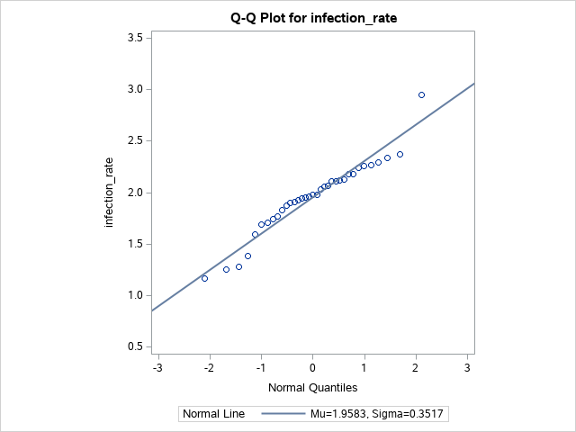
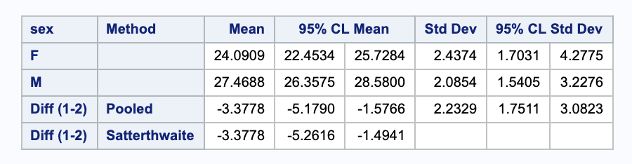

Problems: 4.4 [p.145] part (a) only, 4.5 [p.146] part (b) only, 4.8 [p.147] part (d) only, 4.10 [p.148] part (b) only.


* Do not remove this line (it will not be displayed)
{:toc}

# 4.4 a
**Construct a 90% confidence interval for $\mu$, the true mean infection rate among responding patients, and interpret the interval you obtain.**

This problem deals with looking for $\mu$ of a single variable (i.e. no pairing or differences). Notice that we do not know $\sigma$, however our sample size is fairly large. We will check a qqplot to see if we can reasonably assume that the data are normal.

```
* In order to check normailty, we can check the qq plot;

proc univariate data=hcl plots alpha=.10;
  var infection_rate;
  qqplot infection_rate / normal(mu=est sigma=est) square;
run;
```



Our data look fairly normal, so we will assume normality. We can now use `proc means` to construct a confidence interval.

```
proc means n lclm uclm alpha=.10;
  var infection_rate;
  title "90% Confidence Interval for the infection rate";
run;
title;
```


We are 90% confident that the true mean infection rate is in (1.8577546, 2.0588169) in 1000*infections/month.

# 4.5 b
**Making the assumptions asked for in (a) (using a one sample t-test), construct a 90% confidence interval for the mean $\mu$ of the population from which the sample was selected.**

We are again looking for $\mu$ of a single variable. Again, we do not know $\sigma$, so we will have to check the qqplot to check if we can reasonably assume normality.

```
proc univariate data=social_index plots alpha=.10;
  var index;
  qqplot index / normal(mu=est sigma=est) square;
run;
```


Our data look fairly normal, so we will assume normality. We can now use `proc means` to construct a confidence interval.

```
proc means data=social_index n lclm uclm alpha=.10;
  var index;
  title "90% Confidence Interval for the social perceptiveness index";
run;
```


We are 90% confident that the true mean index is in (57.0674095, 64.3075905) points.

# 4.8 d
**Construct a 95% confidence interval for the difference between the means of dental measurements in the two populations. Interpret the interval you construct.**

In this problem we are looking for the difference between two independent samples. Again, we do not know $\sigma$ and the sample sizes are fairly small, 16 boys and 11 girls. We will rely on the qqplots to check if normality is a reasonable assumption.


Although the male measurements (shown in the second graph) do not seem to be perfectly normal, the female measurements (shown in the first graph) seem to be very normally distributed. Thus, we will assume normality going forward. We can use `proc ttest` to construct our confidence interval for the difference in the samples.

```
proc ttest data=pituiatry alpha=.05;
	var distance;
	class sex;
run;
```



Using the Pooled method, we are 95% sure that the true difference in mean between females and males is within (-5.1790, -1.5766) millimeters.

# 4.10 b

**Construct a 95% confidence interval for the average difference in tumor weights for the treated and untreated animals. Interpret the interval.**

In this problem we looking at the difference between paired, dependent data. Again, we do not know $\sigma$ and the sample sizes are fairly small. We will rely on the qqplots to check if normality is a reasonable assumption.


The data look fairly normal, so we will use that assumption. We can pair the data using `proc ttest` and find the confidence interval.

```
proc ttest data=mice_buddies alpha=0.05;
	paired control*treatment;
run;
```


We are 95% sure that the true difference in mean between the control and treatment groups is within (0.2739 0.7264) grams.