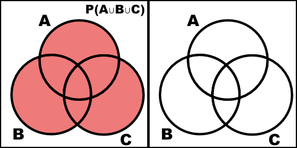

Problems: 1.1, 1.4, 1.5, 1.13, 1.23, Problem 6

* Do not remove this line (it will not be displayed)
{:toc}

# 1.1
**For each of the following experiments, describe the sample space.**

## a.
**Toss a coin four times.**

This will look like a sequence of 4 heads or tails. e.g $\{HHHH, HHHT, HHTH, \dots TTTT\}$. There will be 16 elements.

## b.
**Count the number of insect damaged leaves on a plant.**

This will be the natural numbers, $\[0, \infty)$, assuming there is no limit to the possible number of leaves on a plant.

## c.
**Measure the lifetime (in hours) of a particular brand of light bulb.**

This can be any real number greater than or equal to 0, $\[0, \infty)$.

## d.
**Record the weights of 10-day-old rats.**

This can be any real number greater than 0, $(0, \infty)$.

## e.
**Observe the proportion of defectives in a shipment of electronic components.**

This can be any real number between 0 and 1, $\[0, 1\]$.

# 1.4
**For events $A$ and $B$, find formulas for the probabilities of the following events in terms of quantities $P(A)$, $P(B)$, and $P(A\cap B)$.**

## a.
**either in $A$ or $B$ or both**

$$
	\begin{align}
		P(A\cup B) & = P(A) + P(B) - P(A \cap B) & \text{by theorem 3.2}
	\end{align}
$$

## b.
**either $A$ or $B$ but not both**

$$
	\begin{align}
		P( (A\cup B) - (A\cap B) ) & = P(A) + P(B) - 2 P(A \cap B)
	\end{align}
$$

## c.
**at least one of $A$ or $B$**

$$
	\begin{align}
		P(A\cup B) & = P(A) + P(B) - P(A \cap B) & \text{by theorem 3.2}
	\end{align}
$$

## d.
**at most one of $A$ or $B$**

$$
1-P(A\cap B)
$$

# 1.5
**Approximately one-third of all human twins are identical (one-egg) and two-thirds are fraternal (two-egg) twins. Identical twins are necessarily the same sex, with male and female being equally likely. Among fraternal twins, approximately one-fourth are both female, one-fourth are both male, and half are one male and one female. Finally, among all U.S. births, approximately 1 in 90 is a twin birth. Define the following events:**

$$
	\begin{align}
		A = & \text{\{ a U.S. birth results in twin females \}}\\
		B = & \text{ \{ a U.S. birth results in identical twins \} } \\
		C = & \text{ \{ a U.S. birth results in twins. \} }
	\end{align}
$$

## a.
**State in words, the event $A\cap B \cap C$.**

The set of U.S. birth results in female, identical twins. (Notice that $A$ and $B$ are subsets of $C$.)

## b.
**Find $P(A \cap B \cap C)$.**

$$P(A \cap B \cap C) = \frac{ 1 }{ 90 } \cdot \frac{ 1 }{ 3 } \cdot \frac{ 1 }{ 2 } = \frac{ 1 }{ 450 }$$

Where 

$$
	\begin{align}
		\frac{ 1 }{ 90 } = & \text{The proportion of twin births,}\\
		\frac{ 1 }{ 3 } = & \text{The proportion of twins that are identical,} \\
		\frac{ 1 }{ 2 } = & \text{The proportion of identical twins that are female.}
	\end{align}
$$

# 1.13
**If $P(A)=\frac{ 1 }{ 3 }$ and $P(B^C) = \frac{ 1 }{ 4 }$, can $A$ and $B$ be disjoint? Explain.**

No, $A$ and $B$ cannot be disjoint. Notice that $P(B) = 1 - P(B^C) = \frac{ 3 }{ 4 }$. If we assume that $A$ and $B$ are disjoint, then $A\cap B = \varnothing$; however $P(A) + P(B) = \frac{ 13 }{ 12 } > 1$. Thus, $A$ and $B$ cannot be disjoint and some elements must be in their intersection. 

# 1.23
**Two people each toss a fair coin $n$ times. Find the probability that they will toss the same number of heads. (Answer: $(\frac{ 1 }{ 4 })^n \cdot {2n \choose n}$ )**

Notice that the process of flipping a coin is a binomial distribution with $n$ trials and a probability of success $1/2$. To find the number of times the two people match we can multiply their CDFs together:

$$
	\begin{align}
		\sum_{k=1}^{n} \Big[ {n \choose k} \frac{ 1 }{ 2 }^k \frac{ 1 }{ 2 }^{n-k} \Big] \cdot \Big[ {n \choose k} \frac{ 1 }{ 2 }^k \frac{ 1 }{ 2 }^{n-k} \Big] & = \sum_{k=1}^{n} {n \choose k} {n \choose k} \frac{ 1 }{ 2 }^{2n} \\
		& = \frac{ 1 }{ 2 }^{2n} \sum_{k=1}^{n} {n \choose k} {n \choose k} \\
		& = \frac{ 1 }{ 2 }^{2n} \cdot {2n \choose n} & \text{by Vandermonde's identity} \\
		& = \Big( \frac{ 1 }{ 4 } \Big)^n \cdot {2n \choose n}
	\end{align}
$$

# 6
**Prove rigorously that**

$$P(A\cup B\cup C) = P(A) + P(B) + P(C) - P(A\cap B) - P(A\cap C) - P(B\cap C) + P(A\cap B\cap C)$$ 

**(Hint: use $P(A\cup B) = P(A) + P(B) - P(A\cap B)$ and Theorem 1.1.4 in the textbook.) Note Venn diagram is not sufficient for a proof here.**

$$
    \begin{align}
        P(A \cup B \cup C) & =  P(A \cup (B \cup C)) \\
            & = P(A) + P(B \cup C) - P(A \cap (B \cup C)) \\
            & = P(A) + P(B) + P(C) - P(B \cap C) - P(A \cap (B \cup C)) \\
            & = P(A) + P(B) + P(C) - P(B \cap C) - P( (A \cap B) \cup (A \cap C)) \\
            & = P(A) + P(B) + P(C) - P(B \cap C) - (P(A \cap B) + P( A \cap C) - P(A \cap B \cap C)) \\
            & = P(A) + P(B) + P(C) - P(A \cap B) - P(A \cap C) - P(B \cap C) + P(A \cap B \cap C)
    \end{align}
$$

We can check this with a Venn diagram.

