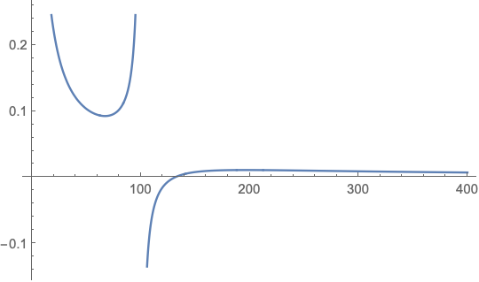

* Do not remove this line (it will not be displayed)
{:toc}

# 1
**In a case-control study conducted in France a while ago to investigate the association between esophageal cancer and alcohol assumption, the following data was collected
from 200 cases and 775 controls (so the total sample size is 975)**

$$
	\begin{array}{l | l l}
		\text{Alcohol Consumption} & \text{Esophageal Cancer} & \text{No Esophageal Cancer} \\ \hline
		\text{Heavy} & 96 & 109 \\
		\text{Light} & 104 & 666 \\ \hline
	\end{array}
$$

**where "Heavy" is defined as "Average daily alcohol assumption $\geq$ 80g", "Light" is defined as "Average daily alcohol assumption $<$ 80g".**

## a.
**Can you estimate the proportion of heavy drinkers in French at the time when the study was conducted. State your reason. If you can, please provide your estimate.**

We cannot estimate the proportion of heavy drinkers in France using a case-control study. Using the law of total probability, 

$$
P(E) = P(E|D) \cdot P(D) + P(E|\bar{D}) \cdot P(\bar{D}).
$$

However, we do not have estimates for $P(D)$ and $P(\bar{D})$ since those are set by the experimenter.

## b.
**Can you estimate the prevalence of esophageal cancer in French at the time when the study was conducted. State your reason. If you can, please provide your estimate**

We cannot calculate the prevalence of esophageal cancer in France using a case-control study. The formula for prevalence is

$$
\text{prevalence} = P(D) = \frac{ n_{+1} }{ n_{++} }.
$$

We do not have estimates for $n_{+1}$ nor $n_{++}$ since they both have been set by the experimenter.

## c.
**Can you estimate the prevalence of esophageal cancer among heavy drinkers in French at the time when the study was conducted. State your reason. If you can, please provide your estimate.**

We cannot estimate the prevalence of esophageal cancer among heavy drinkers in France ($P(D\|E)$) using a case-control study because the the experimenter chose the participants based on whether or not the have esophageal cancer.

## d.
**Can you estimate the prevalence of esophageal cancer among light drinkers in French at the time when the study was conducted. State your reason. If you can, please provide your estimate.**

For the same reason as in (c), we cannot estimate the prevalence of esophageal cancer among light drinkers in France ($P(D\|\bar{E})$) using a case-control study because the the experimenter chose the participants based on whether or not the have esophageal cancer.

## e.
**Can you estimate the relative risk of having the esophageal cancer between heavy
drinkers and light drinkers in French at the time when the study was conducted.
State your reason. If you can, please provide your estimate and interpret your result.**

For the same reason as in (c) and (d), we cannot caclulate a relative risk of having esophageal cancer between heavy drinkers and light drinkers in France because the the experimenter chose the participants based on whether or not the have esophageal cancer. However, if the disease is rare, then we would be able to estimate the relative risk to be the same as the odds ratio.

## f.
**Can you estimate the odds-ratio of having the esophageal cancer between heavy
drinkers and light drinkers in French at the time when the study was conducted.
State your reason. If you can, please provide your estimate and interpret your result.
Can your odds-ratio estimate help you make inference on the relative risk in (e)?**

We can calculate the odds ratio.

$$
	\begin{align}
		\hat{\theta} & = \frac{ \frac{ \hat{P}(D|E) }{ 1-\hat{P(D|E)} } }{ \frac{ \hat{P}(D| \bar{E}) }{ 1-\hat{P(D|\bar{E})} } } \\
			& = \frac{ \frac{ \hat{P}(E|D) }{ 1-\hat{P(E|D)} } }{ \frac{ \hat{P}(E|\bar{D}) }{ 1-\hat{P(E|\bar{D})} } } \\
			& = \frac{ n_{11} n_{22} }{ n_{12} n_{21} } \\
			& = \frac{ 96 \cdot 666 }{ 109 \cdot 104 } \\
			& = 5.64
	\end{align}
$$

If esophageal cancer is determined to be a rare disease, then we can also say $\hat{\theta} \approx \hat{\psi}$.

## g.
**Find a 95% CI for the true odds-ratio of having the esophageal cancer between heavy
drinkers and light drinkers. What is the conclusion based on this CI?**

We can use the confidence interval formula to find a 95% CI for the true odds ratio

$$
	\begin{align}
	(\hat{\theta}_L, \hat{\theta}_U) & = \hat{\theta} \pm z_{\alpha/2} \Big[ \widehat{Var}(\hat{\theta}) \Big]^{1/2}\\
		& = 5.64\, \pm 1.96 \sqrt{5.64^2 \left(\frac{1}{96}+\frac{1}{109}+\frac{1}{104}+\frac{1}{666}\right)}\\
		& = (3.70289, 7.57714)
	\end{align}
$$

We are 95% confident that the true odds ratio is in the range $(3.70289, 7.57714)$.

# 2
**An investigator wants to investigate the association between heart attack and
coffee drinking. Since heart attack is a rare event, she would like to conduct a case-control
study to improve the efficiency of the estimate of the odds-ratio of having heart attack
between coffee drinkers and non coffee drinkers. The cost to sample a control is $1 and the
cost to sample a case is $4. The investigator has $400 for this study.**

**For design purpose, let us assume the following joint probabilities of having a heart attack
(or no heart attack) and being a coffee drinker (or non-drinker)**

$$
	\begin{array}{l | l l}
		 & \text{Heart Attack} & \text{No Heart Attack} \\ \hline
		\text{Coffee Drinker} & 0.006 & 0.495 \\
		\text{Non Coffee Drinker} & 0.004 & 0.495 \\ \hline
	\end{array}
$$

## a.
**Find the true relative risk and odds-ratio of having heart attack between coffee drinkers
and non-drinkers using the given information. Are they close to each other?**

We can calculate the odds-ratio using the formula.

$$
	\begin{align}
		\hat{\theta} & = \frac{ n_{11} n_{22} }{ n_{12} n_{21} } \\
			& = \frac{ 0.006 \cdot 0.495 }{ 0.004 \cdot 0.495 } \\
			& = 1.5
	\end{align}
$$

We find the true relative risk from a case-control study as it could be artificially inflated or deflated; however, with the knowledge that heart attacks are a rare even, we can say that $\hat{\psi} \approx \hat{\theta} = 1.5$.

## b.
**Find the conditional probabilities of being a coffee drinker given cases and controls
and find the odds-ratio of being a coffee drinker between cases and controls. Is it the
same as the odds ratio you got in (a)?**

$$
	\begin{align}
		P(\text{coffee drinker} | \text{heart attack}) & = \frac{ n_{11} }{ n_{+1} }\\
			& = \frac{ 0.006 }{ 0.006 + 0.004 }\\
			& = 0.6
	\end{align}
$$

$$
	\begin{align}
		P(\text{coffee drinker} | \text{no heart attack}) & = \frac{ n_{12} }{ n_{+2} }\\
			& = \frac{ 0.495 }{ 0.495 + 0.495 }\\
			& = 0.5
	\end{align}
$$

We can use these to recalculate the odds ratio.

$$
	\begin{align}
		\hat{\theta} & = \frac{ \frac{ P(E|D) }{ 1-P(E|D) } }{ \frac{ P(E|\bar{D}) }{ 1 - P(E|\bar{D}) } }\\
			& = \frac{ \frac{ 0.6 }{ 1-0.6 } }{ \frac{ 0.5 }{ 1-0.5 } }\\
			& = 1.5
	\end{align}
$$

This matches the odds ratio that we calculated in part a.
## c.
**If the investigator would like to have equal sample size for cases and controls, how
many cases and controls can she have in her study given her budget constraint? and
how many individuals can she expect for the following $2 \times 2$ table?**

$$
	\begin{array}{l | l l}
		 & \text{Heart Attack} & \text{No Heart Attack} \\ \hline
		\text{Coffee Drinker} &  &  \\
		\text{Non Coffee Drinker} & &  \\ \hline
	\end{array}
$$

**Based on the numbers in your table, find the variance of $\log(\hat{\theta})$.**

We can start by finding the number of participants. We know that $n_{case} = n_{control}$ and from the budget constraint we get $ 4 n_{case} + 1 n_{control} \leq 400 $. Thus,

$$
	\begin{align}
		4 n_{case} + 1 n_{control} & \leq 400\\
		4 n_{case} + 1 n_{case} \leq 400 \\
		n_{case} \leq 80
	\end{align}
$$

We'll take $n_{case} = n_{control} = 80$.

$$
	\begin{array}{l | l l}
		 & \text{Heart Attack} & \text{No Heart Attack} \\ \hline
		\text{Coffee Drinker} & 80 \cdot \frac{ 0.006 }{ 0.006 + 0.004 } = 48 &  80 \cdot \frac{ 0.495 }{ 0.495 + 0.495 } = 40\\
		\text{Non Coffee Drinker} & 80 \cdot \frac{ 0.004 }{ 0.006 + 0.004 } = 32 &  80 \cdot \frac{ 0.495 }{ 0.495 + 0.495 } = 40\\ \hline
	\end{array}
$$

With these estimates, we can calculate the estimated variance of the log odds.

$$
	\begin{align}
		\widehat{Var}(\log(\hat{\theta})) & = \frac{ 1 }{ n_{11} } + \frac{ 1 }{ n_{12} } + \frac{ 1 }{ n_{21} } + \frac{ 1 }{ n_{22} }\\
			& = \frac{1}{48}+\frac{1}{32}+\frac{1}{40}+\frac{1}{40} \\
			& = 0.102083
	\end{align}
$$

## d.
**Find the optimal design for the investigator. That is, how many cases and how many controls should the investigator sample to yield the most efficient (having the smallest variance) estimate $\log(\hat{\theta})$ giving the budget constraint. Find the variance of $\log(\hat{\theta})$ for this optimal design. Is it smaller than the variance you got in (c)? (Hint: Denote the case sample size by $x$. Then the budget constraint says that the control sample size has to be $400-4x$ and $x \in (0,100)$.  Try $x$ as a real number so that you can do maximization more easily. Then find out the variance of $\log(\hat{\theta})$ for two integers around the optimal value of $x$. The $x_0$ with the smaller variance gives you the sample size for cases and $400-4x_0$ is the sample size for controls)**

We will begin by constructing our formula for $\widehat{Var}(\log(\hat{\theta}))$.

$$
\frac{ 1 }{ \frac{ 0.006 }{ 0.006 + 0.004 } \cdot x_{case}} + \frac{ 1 }{ \frac{ 0.004 }{ 0.006 + 0.004 } \cdot x_{case}} + \frac{ 1 }{ \frac{ 0.495 }{ 0.495 + 0.495 } \cdot x_{control}} + \frac{ 1 }{ \frac{ 0.495 }{ 0.495 + 0.495 } \cdot x_{control}}
$$

Using our budget constraint, we will take $x_{control} = 400 - 4x_{case}$. Comibing the two equations gives the following.

$$
\frac{ 1 }{ \frac{ 0.006 }{ 0.006 + 0.004 } \cdot x_{case}} + \frac{ 1 }{ \frac{ 0.004 }{ 0.006 + 0.004 } \cdot x_{case}} + \frac{ 1 }{ \frac{ 0.495 }{ 0.495 + 0.495 } \cdot (400 - 4x_{case})} + \frac{ 1 }{ \frac{ 0.495 }{ 0.495 + 0.495 } \cdot (400 - 4x_{case})}
$$

To optimize this, we can take its derivative and find where it is equal to 0.

$$
	\begin{align}
		\frac{16.}{(400-4 x)^2}-\frac{4.16667}{x^2} & = 0\\
		x & = 67.1187, \ 196.039
	\end{align}
$$

Looking at the graph shows that 67.1187 is a minimum.

We can now plug this back into our inequality to get the optimal number of case participants.
$$
	\begin{align}
		x_case & = 400 - 4x_{case}\\
		x_{case} & = 131.525
	\end{align}
$$

Thus, the optimal number of cases and controls, given the budget constraint, are about 67.1187 and 131.525, respectively.

Now we divide the participants up and calculate the variance.
$$
	\begin{array}{l | l l}
		 & \text{Heart Attack} & \text{No Heart Attack} \\ \hline
		\text{Coffee Drinker} & 67.1187 \cdot \frac{ 0.006 }{ 0.006 + 0.004 } = 40.2712 &  131.525 \cdot \frac{ 0.495 }{ 0.495 + 0.495 } = 33.5594\\
		\text{Non Coffee Drinker} & 67.1187 \cdot \frac{ 0.004 }{ 0.006 + 0.004 } = 26.8475 & 131.525 \cdot \frac{ 0.495 }{ 0.495 + 0.495 } = 33.5594\\ \hline
	\end{array}
$$

$$
	\begin{align}
		\widehat{Var}(\log(\hat{\theta})) & = \frac{ 1 }{ n_{11} } + \frac{ 1 }{ n_{12} } + \frac{ 1 }{ n_{21} } + \frac{ 1 }{ n_{22} }\\
			& = \frac{1}{40.2712}+\frac{1}{33.5594}+\frac{1}{26.8475}+\frac{1}{33.5594} \\
			& = 0.091877
	\end{align}
$$

The variance is smaller than with equal number of casese and controls.

# 3
**Suppose the joint distribution of an exposure variable and a disease variable in the target population is given in the following table.**

$$
	\begin{array}{l | l l}
		 & D & \bar{D} \\ \hline
		E & 0.05 & 0.35 \\
		\bar{E} & 0.02 & 0.58 \\ \hline
	\end{array}
$$

## a.
**If an investigator conducts a prospective study with equal (but large) sample sizes ($n$) for the exposure and non-exposure groups, find the variance estimate for the estimate of $\log(\hat{\theta})$ in terms of $n$. (Hint: You can replace $n_{ij}$'s in the variance formula for $\log(\hat{\theta})$ by their expectations.)**

We first need to estimate the number of people in each group. For a prospective study, we can do this by estimating $P(D\|E), \ P(D\|\bar{E}), \ P(\bar{D}\|E), \ P(\bar{D}\|\bar{E})$.

$$
	\begin{array}{l | l | l | l}
		 & D & \bar{D} & \\ \hline
		E &  
			\begin{align}
				E(n_{11}) & = n\cdot P(D|E)\\
				& = n\cdot \frac{ 0.05 }{ 0.05+0.35 }\\
				& = 0.125n
			\end{align} & 	
			0.875n & n \\ \hline
		\bar{E} & 0.0\bar{3}n & 0.9\bar{6}n & n\\ \hline
	\end{array}
$$

We can use these estimates to calculate the variance of the log odds.

$$
	\begin{align}
		\widehat{Var}(\log(\hat{\theta})) & = \frac{ 1 }{ n_{11} } + \frac{ 1 }{ n_{12} } + \frac{ 1 }{ n_{21} } + \frac{ 1 }{ n_{22} } \\
			& = \frac{1}{\frac{0.02 n}{0.02\, +0.58}}+\frac{1}{\frac{0.58 n}{0.02\, +0.58}}+\frac{1}{0.875 n}+\frac{1}{0.125 n} \\
			& = \frac{ 1 }{ n }\cdot 40.1773
	\end{align}
$$

## b.
**If the investigator conducts a case-control study with the same sample size ($n$) as in (a) for cases and controls, find the variance estimate for the estimate of $\log(\hat{\theta})$ in terms of $n$.**

We first need to estimate the number of people in each group. For a case-control study, we can do this by estimating $P(E\|D), \ P(E\|\bar{D}), \ P(\bar{E}\|D), \ P(\bar{E}\|\bar{D})$.

$$
	\begin{array}{l | l | l}
		 & D & \bar{D} \\ \hline
		E &  
			\begin{align}
				E(n_{11}) & = n\cdot P(E|D)\\
				& = n\cdot \frac{ 0.05 }{ 0.05+0.002 }\\
				& = 0.714n
			\end{align} & 	
			0.376n \\ \hline
		\bar{E} & 0.2857n & 0.624n \\ \hline
		& n & n \\
	\end{array}
$$

We can use these estimates to calculate the variance of the log odds.

$$
	\begin{align}
		\widehat{Var}(\log(\hat{\theta})) & = \frac{ 1 }{ n_{11} } + \frac{ 1 }{ n_{12} } + \frac{ 1 }{ n_{21} } + \frac{ 1 }{ n_{22} } \\
			& = \frac{1}{\frac{0.05 n}{0.05\, +0.02}}+\frac{1}{\frac{0.35 n}{0.35\, +0.58}}+\frac{1}{\frac{0.58 n}{0.35\, +0.58}}+\frac{1}{\frac{0.02 n}{0.05\, +0.02}} \\
			& = \frac{1}{n} \cdot 9.16059
	\end{align}
$$

## c.
**Based on your results, find the ratio of the variances in (a) and (b). Which study is more efficient?**

The ratio of (a) to (b) is 

$$\frac{ \frac{ 1 }{ n }\cdot 40.1773 }{ \frac{1}{n} \cdot 9.16059 } = 4.38589.$$ 

Thus, the prospective study describe in part (a) has a variance of log odds that is 4.38589 times higher than the case-control study describe in part (b). Thus, the case-control study described in part (b) is more efficient.