Problems: 4.4, 4.11, 6.2, 6.4, 6.19


* Do not remove this line (it will not be displayed)
{:toc}

# 4.4

## b.
**Perform a statistical test to see if the observed data support the conclusion that the infection rate for the responding treated patients is less than 2.5 per month.**

First we will state our hypotheses.

$$
	\begin{align}
		H_0: & \mu \geq 2.5\\
		H_A: & \mu < 2.5
	\end{align}
$$

Notice that we do not know $\sigma$, though we have a fairly large sample size and the qqplot from part a. showed that we can reasonably assume that the data are normal, so we can use a t-statistic.

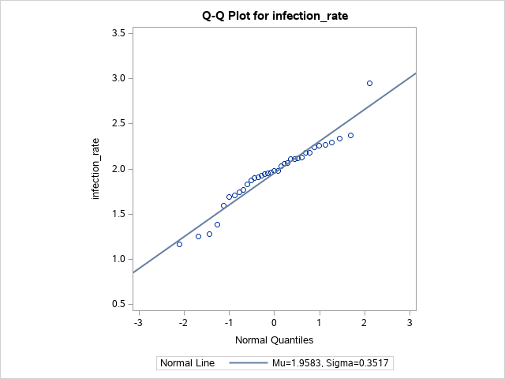

We can use a t-staistic $T = \frac{ \bar{Y}-\mu_0 }{ S / \sqrt{n} }$. Alternatively, we can use SAS to calculate our p-value. For this problem, and its following parts, we will be using $\alpha=0.1$. Notice that we have our null hypothesis accounted for and are calculating a lower bound.

```
proc ttest data=hcl sides=l h0=2.5 alpha=0.1;
  var infection_rate;
run;
```

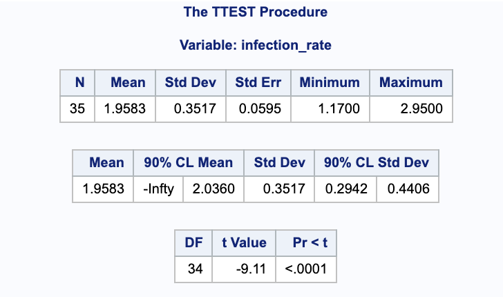

Since the $p < 0.0001 < 0.10$, we have evidence to reject the null in favor of the alternative and to state that the average infection rate for the responding treated patients is less that 2.5 per month.

## c.
**Compute the power of the test to detect that the true infection rate for the responding treated patients is 2.4 per month.**

Using the same assumptions above, we can use SAS to calculate the power using a t-test and a normal distribution. Notice that the null hypothesis is taken into account in `nullmean=2.5` and that we are looking at only the lower side with `sides=l`. Again, we are using $\alpha = 0.1$.

```
proc power;
  onesamplemeans test=t dist=normal 
  mean=2.4 stddev=0.3517 ntotal=35 power=.
  alpha=0.1 nullmean=2.5 sides=l;
run;
```

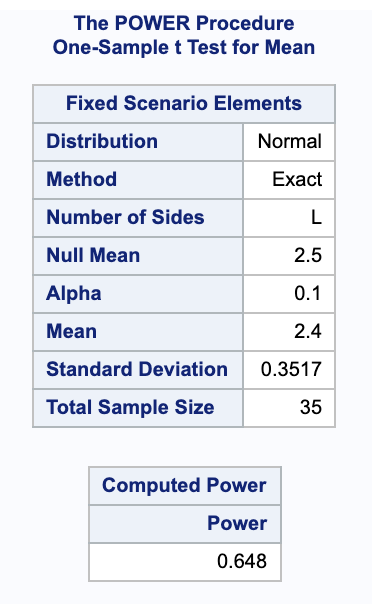

From this we get a power of 0.648.

## d.
**Obtain and plot the power curve for true infection rates ranging from 2 per month to 3 per month.**

Using the same call in SAS we can get the power curve. Notice that `min=2 max=3` varies the mean from 2 to 3.

```
proc power;
  onesamplemeans test=t dist=normal
  mean=2.4 stddev=0.3517 ntotal=35 power=.
  alpha=0.1 nullmean=2.5 sides=l;
  plot x=effect min=2 max=3 yopts=(crossref=yes);
run;
```

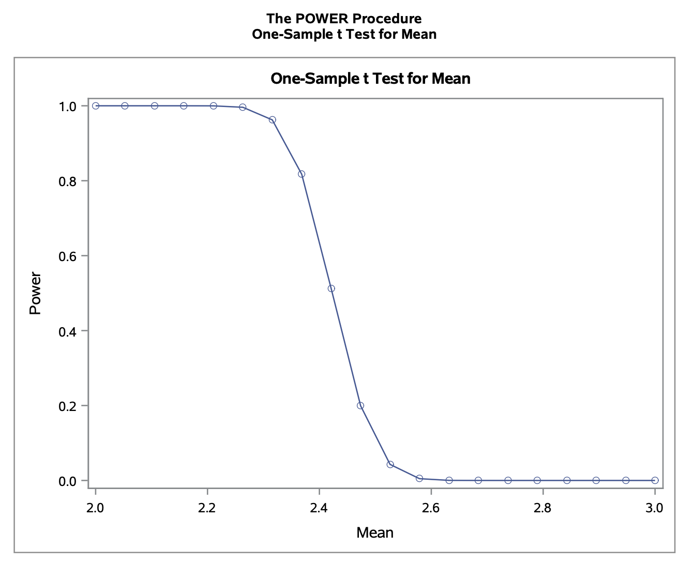


## e.
**What sample size would we need to detect that true infection rate for responding treated patients is 2.4 per month with power at least 0.9?**

Making the same assumptions as above, we could solve the power equation for sample size. We can also modify our previous SAS command to calculate the sample size. Notice that the `power` has been set to 0.9 and the `ntotal` is left blank. Otherwise, the rest of the parameters are unchanged.

```
proc power;
  onesamplemeans test=t dist=normal 
  mean=2.4 stddev=0.3517 ntotal=. power=0.9
  alpha=0.1 nullmean=2.5 sides=l;
run;
```

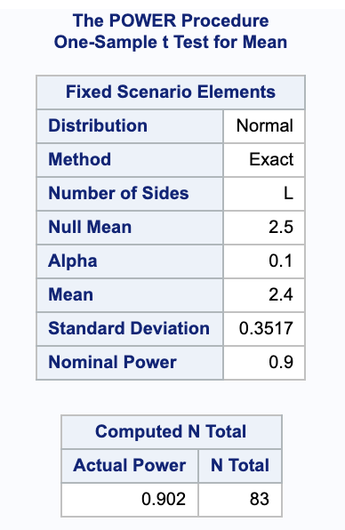

This shows that to get a power of at least 0.9 (exactly 0.902), we would need a sample size of 83.

## f.
**Overlay the power curve from (d) with the new power curve based on the sample size determined in (e).**

We can overlay the charts by adding two sample sizes to the SAS command. The legend for lines is provided at the bottom of the graph.

```
proc power;
  onesamplemeans test=t dist=normal
  mean=2.4 stddev=0.3517 ntotal=35 83 power=.
  alpha=0.1 nullmean=2.5 sides=l;
  plot x=effect min=2 max=3 yopts=(crossref=yes);
run;
```

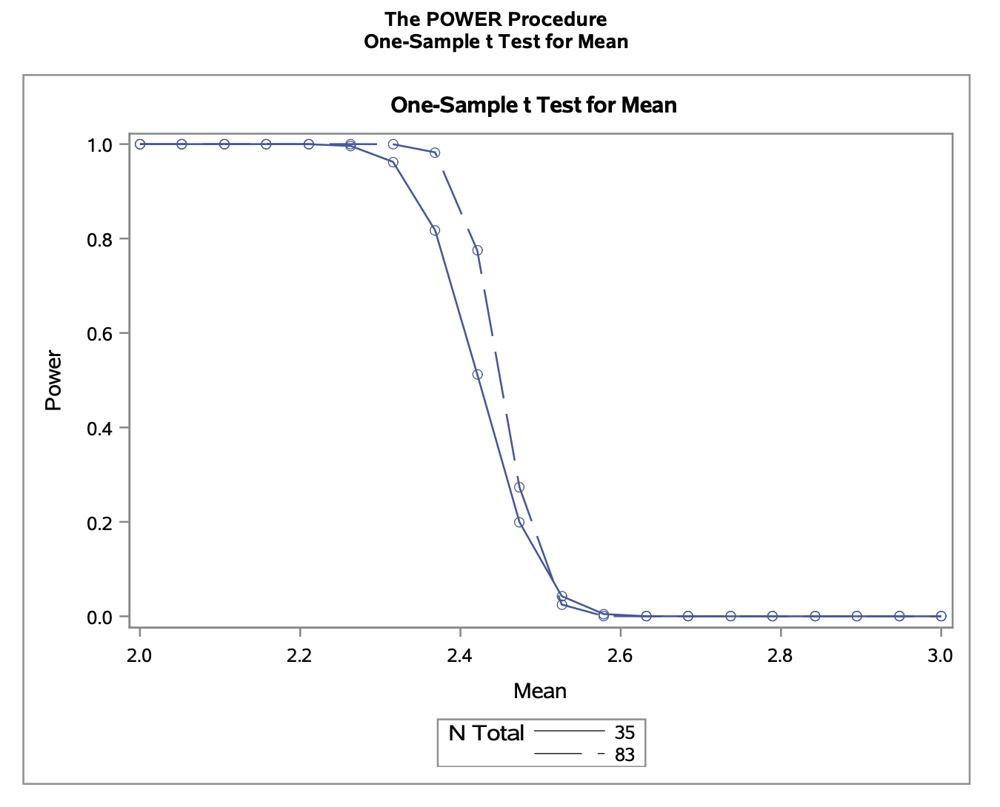


# 4.11


## a.
**Perform a statistical test to determine whether histamine increases PVR on average. Be sure to state the null and alternative hypotheses and the conclusions that can be drawn from the test.**

To test if histamine increases PVR on average, we will set up the following hypotheses.

$$
	\begin{align}
		H_0 & = \mu_2 - \mu_1 = 0 \\
		H_A & = \mu_2 - \mu_1 > 0
	\end{align}
$$

Notice that we have paired (dependent) data with a small sample size and $\sigma$ is unknown. Looking at the qqplot shows that we can reasonably assume normality.

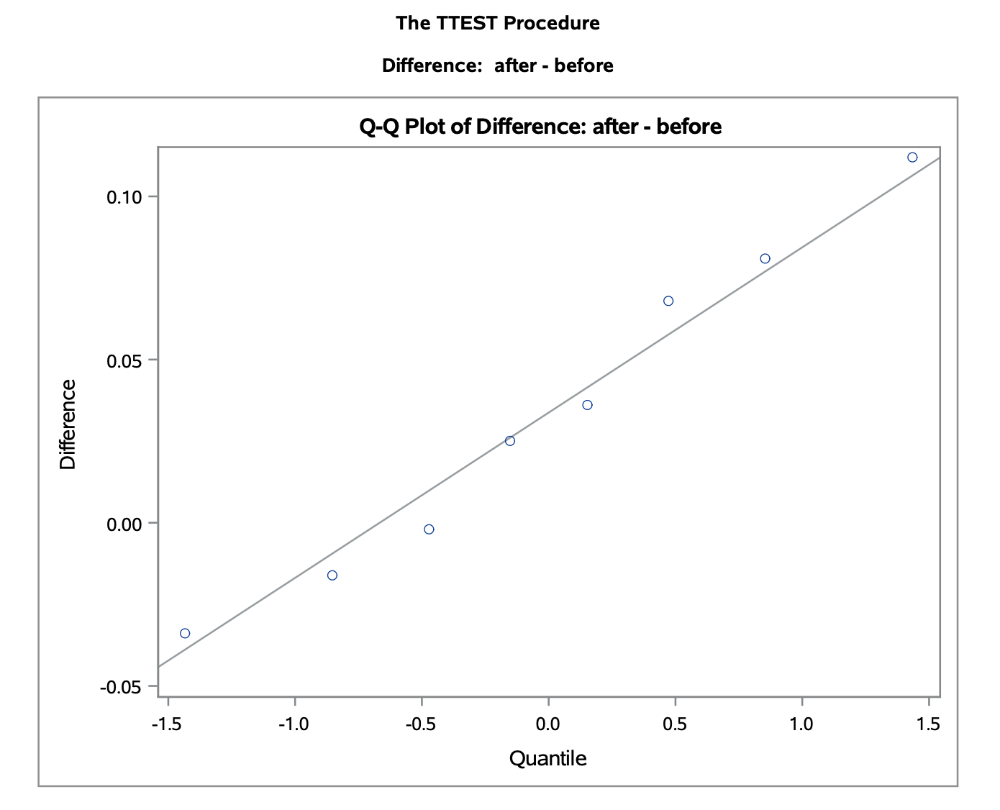

We could calculate the confidence upper bound by hand by treating the difference in means as one variable, $\mu_{diff} + t_{\alpha} \cdot \frac{ \sigma_{diff} }{ \sqrt{n} }$. Alternatively, we can calculate a 95% confidence upper bound in SAS. Notice that the null hypothesis is specified and only the upper bound is calculated.

```
proc ttest data=lambs sides=u h0=0 alpha=0.05;
  paired after*before;
run;
```

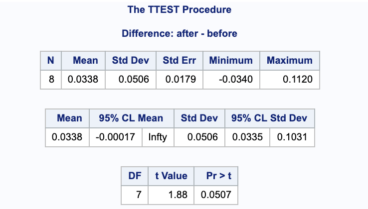

Notice that this gives us a p-value of $p=0.0507$. Since $p = 0.0507 > 0.05$, there is no justification to the claim that histamine increases PVR on average; we fail to reject the null hypothesis.

## b.
**Calculate lower and upper bounds that bracket the mean effect of histamine with 95% confidence. What does it mean to say that these bounds are calculated with 95% confidence?**

With the same assumptions from above, we can calculate the confidence interval using SAS (or by hand using the equation from a. and dividing $\alpha$ by 2 to get a 2 sided interval). Notice that in contrast to the code from part a. this does not take into account our hypothesis and is a two tailed confidence interval. Again, it is taken as $after - before$.

```
proc ttest data=lambs alpha=0.05;
  paired after*before;
run;
```

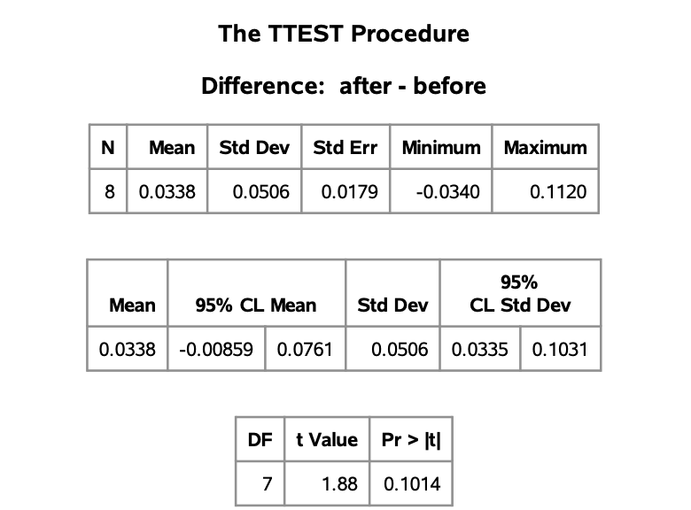

We are 95% confident that the true difference in mean PVR after compared to before taking histamine (after - before), is between -0.00859 and 0.0761.

## c.
**What is the power of the test to detect that histamine increases PVR on average by 0.05 units?**

The power can be calculated two ways in SAS. One way is to take the difference of the means as its own variable and use a `onesamplemeans`. Alternatively, I will use the `pairedmeans` option, for which some values needed to be calculated: $\sigma_{after} = 0.04091433, \ \sigma_{before} = 0.02563445, correlation = -0.1114011$. Notice that we are looking for an upper bound with `sides=u` because we testing histamine increasing PVR and we are taking our null hypothesis into account with `nulldiff=0`.

```
proc power;
  pairedmeans test=diff dist=normal 
  corr=-0.1114011 
  meandiff=0.05 pairedstddevs=(0.04091433, 0.02563445)
  npairs=8 power=.
  alpha=0.05 nulldiff=0 sides=u;
run;
```

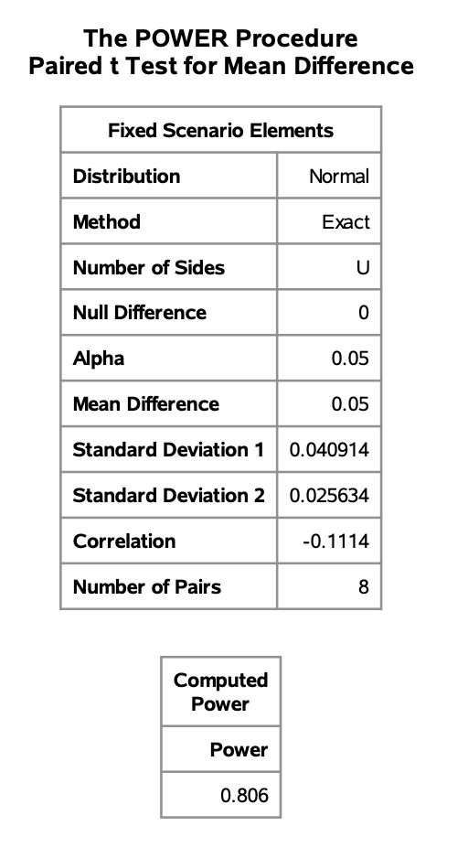

This gives us a power of 0.806 for the test to detect that histamine increases PVR on average by 0.05 units.

## d.
**What sample size is required to change the power in (c) to at least 0.9?**

Again, we will use `pairedmeans` to calculate the power. Notice again we are again using `sides=u` and `nulldiff=0` for the same reasons as before.

```
proc power;
  pairedmeans test=diff dist=normal
  corr=-0.1114011 
  meandiff=0.05 pairedstddevs=(0.04091433, 0.02563445)
  npairs=. power=0.9
  alpha=0.05 nulldiff=0 sides=u;
run;
```

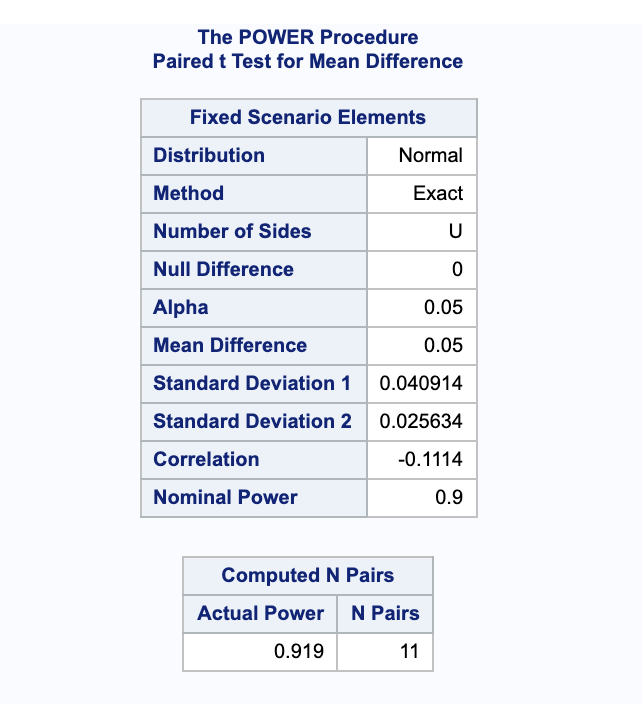

This gives a sample size of $N=11$ pairs to achieve a power of at least 0.9 (it gives a power of 0.919 because it needed to get to a whole number of pairs).

# 6.2

## a.
**Construct the required lower bound for the seed germination rate and interpret it.**

Since we have a large sample, we can use the Wald procedure to calculate our lower bound.

$$
\hat{p} - z_{\alpha/2} \sqrt{\frac{ \hat{p}\cdot(1-\hat{p}) }{ n }} = \frac{44}{50}-1.644 \sqrt{\frac{44 \left(1-\frac{44}{50}\right)}{50\ 50}} = 0.804448
$$

Our 95% lower bound is $(0.804448, 1)$. We are 95% confident that the true proportion of germinated seeds is above 0.804448.

## b.
**On the basis of the lower bound calculated in (a), what conclusions can you draw about the company's claim that the germination rate exceeds 90%?**

We do not have sufficient evidence to support the companies claim that the germination rate exceeds 90% because the lower bound of the germination rate is $0.804448 < 0.90$.

## c.
**Use the p-value of a suitable hypothesis test to draw conclusions about the claim that the germination rate exceeds 90%.**

We will first set up our hypotheses.

$$
	\begin{align}
		H_0: & p \leq 0.90 \\
		H_A: & p > 0.90
	\end{align}
$$

Again, with our large sample size we will assume normality and can use the Wald equation to find a test statistic.

$$
	\begin{align}
		z & = \frac{ \hat{p} - p_0 }{ \sqrt{\hat{p} \cdot (1-\hat{p}) / n} }\\
			& = \frac{\frac{44}{50}-0.9}{\sqrt{\frac{1}{50} 0.9 (1-0.9)}} \\
			& = -0.471405
	\end{align}
$$

We can use this to get our p-value.

$$
1 - P(Z \leq -0.471405) = 1 - 0.319 = 0.681
$$

Since the p-value $0.681 > 0.05$, we do not have sufficient evidence to support the alternative hypothesis and thus fail to reject the null hypothesis that the true proportion of germinated seeds is less than 90% (using a $\alpha = 0.05$ level of significance).

## d.
**Using the Wald procedure, obtain and plot the power curve for the test conducted in (c).**

We can use SAS to get the power curve. Notice that we are using the Wald procedure with the `CI=WALD` option. The `nullp=0.9` is from the null hypothesis. I have provided the full plot over the range [0,1] and a zoomed in graph on [0.8, 1].

```
proc power;
  onesamplefreq CI=WALD test=z method=normal alpha=0.05
    nullp=0.9 sides=u p=0.88 ntotal=50 power=.;
   plot x=effect min=0 max=1;
run;
```

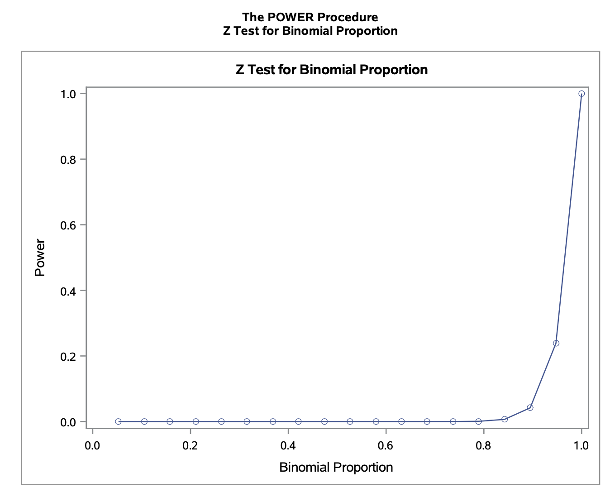
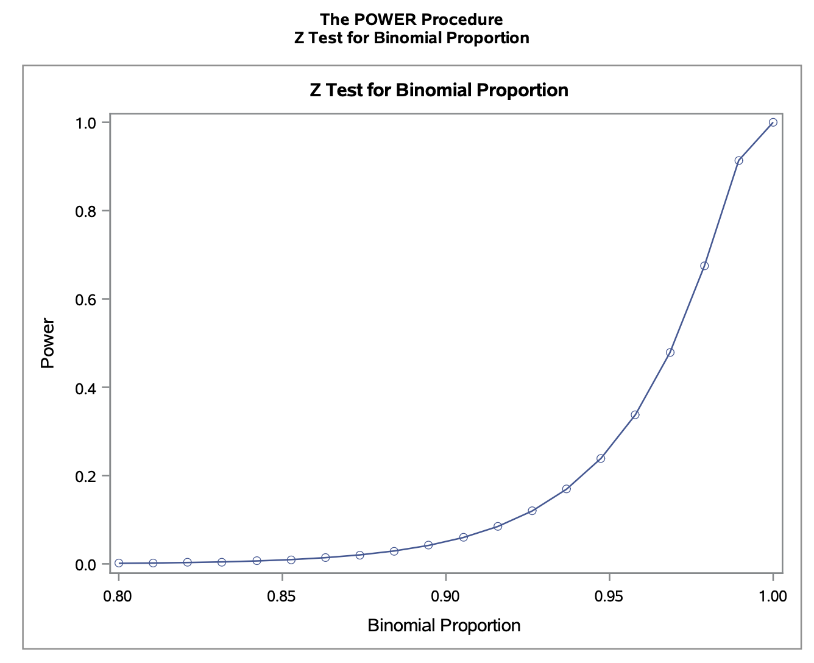


# 6.4

## a.
**Estimate the sensitivity, specificity, and predictive power of the diagnostic test.**

$$
	\begin{align}
		\text{sensitivity} & = P(Positive | Present ) \\
			& = \frac{ P(Positive \land Present) }{ P(Present) }\\
			& = \frac{ \frac{ 95 }{ 200 } }{ \frac{ 123 }{ 200 } }\\
			& = \frac{ 95 }{ 123 }\\
			& = 0.77236
	\end{align}
$$

$$
	\begin{align}
		\text{specificity} & = P(Negative | Absent ) \\
			& = \frac{ P(Negative \land Absent) }{ P(Absent) }\\
			& = \frac{ \frac{ 52 }{ 200 } }{ \frac{ 77 }{ 200 } }\\
			& = \frac{ 52 }{ 77 }\\
			& = 0.67532
	\end{align}
$$

$$
	\begin{align}
		\text{predictive power} & = P(correct)\\
			& = P(Positive \land Present) + P(Negative \land Absent) \\
			& = \frac{ 95 }{ 200 } + \frac{ 52 }{ 200 }\\
			& = 0.735
	\end{align}
$$

## b.
**Construct 95% confidence intervals for the parameters estimated in a. and interpret them.**

Because we have a large sample size, we will use the Wald confidence interval.

$$
\text{sensitivity: } \frac{95}{123} \pm 1.96 \sqrt{\frac{95 \left(1-\frac{95}{123}\right)}{123\ 123}} = (0.6983, 0.8465)
$$

We are 95% confident that the true sensitivity is between 0.6983 and 0.8465.

$$
\text{specificity: } \frac{52}{77}-1.96 \sqrt{\frac{52 \left(1-\frac{52}{77}\right)}{77\ 77}} = (0.570734, 0.7799)
$$

We are 95% confident that the true specificity is between 0.5707 and 0.7799.

$$
\text{predictive power: } \frac{147}{200} \pm 1.96 \sqrt{\frac{147 \left(1-\frac{147}{200}\right)}{200\ 200}} = (0.673834, 0.796166)
$$

We are 95% confident that the true predictive power is between 0.673834 and 0.796166.

## c.
**Perform a hypothesis test to verify the claim that the test will detect more than 70% of the cases who have the disease.**

First we will state our hypotheses.

$$
	\begin{align}
		H_{0} & = \text{sensitivity} \leq 0.7\\
		H_{A} & = \text{sensitivity} > 0.7
	\end{align}
$$

Then we will calculate our p-value. Note that since we have a large sample size, it is reasonable to use a normal approximation. We will start by finding $z$.

$$
	\begin{align}
		z & = \frac{ \hat{p} - p_0 }{ \sqrt{p_0 \cdot (1-p_0) / n}} \\
			& = \frac{\frac{95}{123}-0.7}{\sqrt{\frac{1}{123} 0.7 (1-0.7)}} \\
			& = 1.75117
	\end{align}
$$

Now we can plug this into our standard normal.

$$
1 - \Phi(z) = 1 - \Phi(1.75117) = 0.03995832
$$

Since $0.03995832 > 0.05$, we have evidence to reject the null hypothesis if favor of the alternative, that the true sensitivity is greater than 70% (using a significance level of $\alpha = 0.05$).

## d.
**Construct a 95% lower confidence bound to the predictive power of the test and interpret it.**

Since we have a large sample size, we can use the Wald procedure to calculate the confidence lower bound.

$$
\frac{147}{200}-1.664 \sqrt{\frac{147 \left(1-\frac{147}{200}\right)}{200\ 200}} = 0.683072
$$

We have 95% confidence that the true predictive power is within (0.683072, 1).

# 6.19

## a.
**Construct a 99% confidence interval for the difference between the proportions of consumers who like Brand A and the proportion who like Brand B ice creams. Interpret the interval you construct.**

We can use a large sample size approximation and use the McNemar test for paired samples to calculate our confidence interval. Notice that we are taking the difference in the order $p_A - p_B$.

$$
	\begin{align}
		CI & = \hat{p}_A - \hat{p}_B \pm z_{\alpha/2} \cdot SE( \hat{p}_A - \hat{p}_B ) \\
			& = \frac{ B-C }{ n } \pm z_{\alpha/2} \cdot \frac{ \sqrt{B+C-\frac{ 1 }{ n } (B-C)^2 } }{ n } \\
			& = \frac{92-13}{200} \pm 2.575 \cdot  \frac{\sqrt{92+13-\frac{1}{200} (92-13)^2}}{200} \\
			& = (0.284399, 0.505601)
	\end{align}
$$

We are 99% confidence that the true difference in proportion between consumers who like Brand A and consumers who like Brand B is between (0.284399, 0.505601).

## b.
**Is there support for the claim that people prefer Brand A?**

We can set up a hypothesis test to check this. 

$$
	\begin{align}
		H_0: & p_A \leq p_B \\
		H_A: & p_A > p_B \\
	\end{align}
$$
 
Again, since we have large, paired samples, we can calculate our test statistic using McNemar's Test (notice that $\Delta_O = 0$). We will use a rejection region of $\alpha = 0.05 \rightarrow z_{\alpha} = 1.645$.

$$
z = \frac{ B-C }{ \sqrt{B+C} } = \frac{92-13}{\sqrt{92+13}} = 7.70961
$$

Since $7.70961 = z > z_{\alpha}$, we have evidence to reject the null hypothesis in favor of the alternative; there is justification to the claim that people prefer Brand A.
