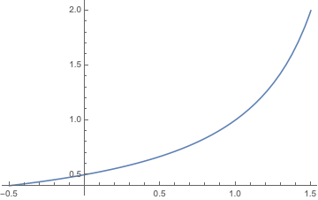
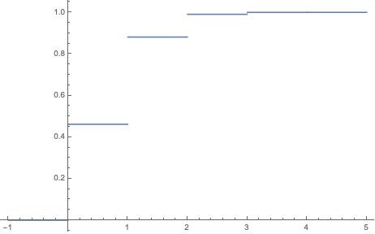

Problems: 1.24, 1.34, 1.38, 1.39, 1.51, 1.53

* Do not remove this line (it will not be displayed)
{:toc}

# 1.24
**Two players, $A$ and $B$, alternatively and independently flip a coin and the first player to obtain a head wins. Assume player $A$ flips first.**

## a.
**If the coin is fair, what is the probability that $A$ wins**

If player $A$ wins, that means that there have been an odd number of flips. One of these flips is a success tails (generally, with probability $p$) and the others (an even number) are tails (generally, with probability $1-p$). We can model this summation and use a geometric series to get a closed form.

$$
	\begin{align}
		P(A\ wins) & = p\cdot \sum^{\infty}_{i\in evens}(1-p)^{i/2}\cdot (1-p)^{i/2} \\
			& = p\cdot \sum^{\infty}_{i\in evens}(1-p)^{i}\\
			& = p \cdot \frac{ 1 }{ 1-(1-p)^2 }\\
			& = \frac{ 2 }{ 3 } & \text{with } p=0.5
	\end{align}
$$

## b.
**Suppose that $P(head) = p$, not necessarily $\frac{ 1 }{ 2 }$. What is the probability that $A$ wins?**

From above $P(A\ wins) = \frac{ p }{ 1-(1-p)^2 }$.

## c.
**Show that for all $p$, $0 < p < 1$, $P(A\ wins) > \frac{ 1 }{ 2 }$. (Hint: Try to write $P(A\ wins)$ in terms of the events $E_1, E_2, \dots$ where $E_i = \text{ {head first appears on ith toss} }$).**

We we look at the derivative of our function, we will see that it is always positive for $0 < p < 1$.

$$
\frac{ d P(A\ wins) }{ dp } = \frac{1}{(p-2)^2}
$$

We can also look at the graph of $P(A \ wins)$ vs. $p$. Note that at $p=0$, $P(A \ wins)=0.5$.

#  1.34
**Two litters of a particular rodent species have been born, one with two brown-haired and one gray-haired (litter 1), and the other with three brown-haired and two grayhaired (litter 2). We select a litter at random and then select an offspring at random from the selected litter.**

## a.
**What is the probability that the animal chosen is brown-haired?**

$$
	\begin{align}
		P(Brown) & = P((Brown \cap Litter 1) \cup (Brown \cap Litter 2))\\
		& = P(Brown \cap Litter 1) + P(Brown \cap Litter 2) & \text{disjoint events} \\
		& = \frac{ 1 }{ 2 }\cdot \frac{ 2 }{ 3 } + \frac{ 1 }{ 2 }\cdot \frac{ 3 }{ 5 }\\
		& = \frac{ 19 }{ 30 }
	\end{align}
$$

## b.
**Given that a brown-haired offspring was selected, what is the probability that the sampling was from litter 1?**

$$
	\begin{align}
		P(Litter 1 | Brown ) & = \frac{ P(Brown \cap Litter 1) }{ P(Brown) } \\
		& = \frac{ \frac{ 1 }{ 2 } \cdot \frac{ 2 }{ 3 }}{ \frac{ 19 }{ 30 } }\\
		& = \frac{ 10 }{ 19 }
	\end{align}
$$

#  1.38
**Prove each of the following statements (Assume that any conditioning event has positive probability.**

## a.
**If $P(B)=1$, then $P(A\|B) = P(A)$ for any $A$.**

$$
	\begin{align}
		P(A|B) & = \frac{ P(A\cap B) }{ P(B) }\\
			& = \frac{ P(A \cap B) }{ 1 }\\
			& = P(A) - P(A \cap B^C) \\
			& = P(A) - 0 & \text{Since } B^C = \varnothing\\
			& = P(A)
	\end{align}
$$

## b.
**If $A \subset B$, then $P(B\|A)=1$ and $P(A\|B)=P(A)/P(B)$.**

Notice that because $A \subset B$, $P(A\cap B) = P(A)$ and $P(A \cap B^C) = \varnothing$.

$$
	\begin{align}
		P(B|A)& = \frac{ P(A\cap B) }{ P(A) } \\
			& = \frac{ P(A) }{ P(A) } & \text{by subset}\\
			& = 1
	\end{align}
$$

$$
	\begin{align}
		P(A|B) & = \frac{ P(A\cap B) }{ P(B) } \\
			& = \frac{ P(A) - P(A \cap B^C) }{ P(B) }\\
			& = \frac{ P(A) - 0 }{ P(B) }\\
			& = \frac{ P(A) }{ P(B) }
	\end{align}
$$

## c.
**If $A$ and $B$ are mutually exclusive, then**

$$
P(A|A\cup B) = \frac{ P(A) }{ P(A)+P(B) }.
$$

$$
	\begin{align}
		P(A|A\cup B) & = \frac{ P(A \cap (A \cup B)) }{ P(A\cup B) }\\
			& = \frac{ P(A \cap (A \cup B)) }{ P(A) + P(B) } & \text{by mutual exclusivity} \\
			& = \frac{ P( (A \cap A) \cup (A \cap B)) }{ P(A) + P(B) } \\
			& = \frac{ P(A \cup (\varnothing)) }{ P(A) + P(B) } & \text{by mutual exclusivity}\\
			& = \frac{ P(A) }{ P(A) + P(B) } \\
	\end{align}
$$

## d.
$P(A \cap B \cap C) = P(A\|B\cap C)P(B\|C)P(C)$

$$
	\begin{align}
		P(A\cap B \cap C) & = P(A \cap (B \cap C))\\
			& = P(A|B\cap C)P(B \cap C) \\
			& = P(A|B\cap C)P(B|C)P(C) 
	\end{align}
$$

#  1.39
**A pair of events $A$ and $B$ cannot be simultaneously mutually exclusive and independent. Prove that if $P(A)>0$ and $P(B)>0$, then:**

## a.
**If $A$ and $B$ are mutually exclusive, they cannot be independent.**

Recall that if $A$ and $B$ are independent, than $P(A|B) = P(A)$. However,

$$
	\begin{align}
		P(A|B) & = \frac{ P(A\cap B) }{ P(B) }\\
			& = \frac{ 0 }{ P(B)) } & \text{by mutual exclusivity}\\
			& = 0 \neq P(A).
	\end{align}
$$

Thus, $A$ and $B$ cannot be independent.

## b.
**If $A$ and $B$ are independent, they cannot be mutually exclusive.**

Recall that if $A$ and $B$ are mutually exclusive, then $P(A\cap B) = 0$. However,

$$
	\begin{align}
		P(A\cap B) & = P(A)\cdot P(B) \neq 0& \text{by independence}
	\end{align}
$$

Thus, $A$ and $B$ cannot be mutually exclusive.
#  1.51
**An appliance store receives a shipment of 30 microwave ovens, 5 of which are (unknown to the manager) defective. The store manager selects 4 oven at random, without replacement, and tests to see to see if they are defective. Let $X=$ number of defectives found. Calculate the pmf and cdf of $X$ and plot the cdf.**

Notice that $X\sim Hypergeometric(n = 30, r = 5, m = 4)$. Thus, the PMF is

$$
P_X(x)=
    \begin{cases}
        \begin{align}
            & \frac{ {5 \choose x} \cdot {30 - 5 \choose 4 - x}}{ {30 \choose 4} } & x \in \{0, 1, 2, 3, 4\} \\
            & 0 & \text{Otherwise.} 
        \end{align}
    \end{cases}
$$

The CDF is

$$
F_X(x) = \sum_{i=0}^x \frac{ {5 \choose x} \cdot {25 \choose 4 - x}}{ {30 \choose 4} } 
$$

$$
F_X(x)=
    \begin{cases}
        \begin{align}
           & 0 & x \leq 0\\
		   & 0.461595 & 0 < x \leq 1\\
		   & 0.881266 & 1 < x \leq 2 \\
		   & 0.990695 & 2 < x \leq 3 \\
		   & 0.999818 & 3 < x \leq 4 \\
		   & 1 & 4 \leq x
        \end{align}
    \end{cases}
$$

# 1.53
**A certain river floods every year. Suppose that the low-water mark is set at 1 and the high-water mark $Y$ has distribution function**

$$
	\begin{align}
		F_Y(y) &= P(Y\leq y) = 1 - \frac{ 1 }{ y^2 }, & 1 \leq y < \infty
	\end{align}
$$

## a.
**Verify that $F_Y(y)$ is a cdf.**

To verify that $F_Y(y)$ is a cdf, we must show three properties.

1) That its limits go to 0 and 1.

$$
	\lim_{y\rightarrow \infty} 1 - \frac{ 1 }{ y^2 } = 1 - 0 = 1
$$

$$
	\lim_{y\rightarrow - \infty} 1 - \frac{ 1 }{ y^2 } = 0
$$

2) The function is nondecreasing. To show this we will take the derivative. Notice that it is always postive over the range $[1, \infty)$.

$$
F'_Y(y) = 0 - \frac{ -2 }{ y^3 } = \frac{ 2 }{ y^3 }
$$

3) The function is right continuous. Take $\epsilon > 0$.

$$
\lim_{\epsilon \rightarrow 0} F_Y(y+\epsilon) = \lim_{\epsilon \rightarrow 0} 1 - \frac{ 1 }{ (y+\epsilon)^2 } = 1 - \frac{ 1 }{ (y+0)^2 } = F_Y(y)
$$

Since all of these criteria hold for $F_Y(y)$, it is a valid CDF.

## b.
**Find $f_Y(y)$, the pdf of $Y$.**

$$
f_Y(y) = \frac{ d F_Y(y) }{ dy } = 0 - \frac{ -2 }{ y^3 } = \frac{ 2 }{ y^3 }
$$

## c.
**If the low-water mark is reset at 0 and we use a unit of measurement that is $\frac{ 1 }{ 10 }$ of that given previously, the high water mark becomes $Z = 10(Y-1)$. Find $F_Z(z)$.**

By rearranging our equation we get $Y = \frac{ Z }{ 10 } + 1$. Now we can use our definition of a variable transformation. Notice that we also must transforms the range as well.

$$
		F_Z(z) = F_Y(g^-1(z))
$$

$$
F_Z(z)=
    \begin{cases}
        \begin{align}
            & 1 - \frac{ 1 }{ (z/10+2)^2 } & 10 (1 - 1) = 0 \leq z \leq \infty \\
            & 0 & \text{Otherwise} 
        \end{align}
    \end{cases}
$$