Problems: 1, 2, 3, 4


* Do not remove this line (it will not be displayed)
{:toc}


# 1
**Galton provided a dataset that has become a classic. It investigates the relationship between the height of 928 adult males and the average height of their parents. This dataset is included in the database as GaltonHeightsL.txt and records heights in inches.**

## I.
**Suppose we ignore parents’ average height. Consider estimating the population mean height of adult males. Obtain a 95% confidence interval using this naïve analysis.**

We can ignore the parents' influence on the sons' height in SAS.

```
proc ttest data=galton sides=2 alpha=0.05;
  var son;
run;
```


From the SAS output, we are 95% confident that the true average height of one of the sons' is between 67.9263 and 68.2507 inches.

We can double check this calculation by hand. Notice that we do not know $\sigma$, our sample size is large, and we are assuming that our $Y_i$'s are normal (by the qqplot).

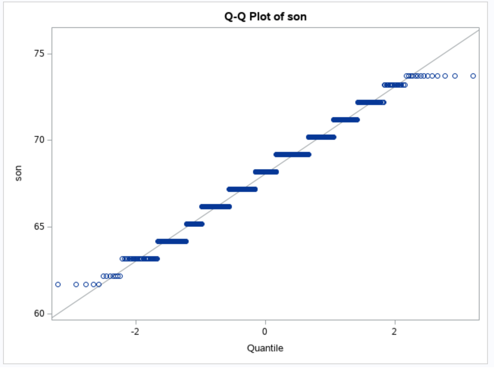

$$
	\begin{align}
		(\mu_L, \mu_U) & = \hat{y} \pm t_{\alpha/2, n-1} \frac{ s }{ \sqrt{n} }\\
			& = 68.0885 \pm t_{0.05/2, 928-1} \frac{ 2.5179 }{ \sqrt{928} }\\
			& = (67.9265, 68.2505)
	\end{align}
$$

## II.
**Is there a linear association between the height of adult males and the average height of their parents? More specifically, obtain a 95% confidence interval for the correlation between these variables.**

We can use the `proc corr` procedure in SAS to find information about the correlation. Notice that we are specifying a 2-sided, 95% confidence interval with no bias adjustment.

```
proc corr data=galton
  plots=matrix(histogram) csscp
  fisher(alpha=0.05 type=twosided biasadj=no);
  
  var parent son;
run;
```

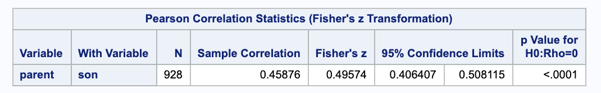

From the SAS output, we are 95% confident that the true correlation between the height of adult males and the average height of their parents is between 0.406407 and 0.508115. We also get the predicted correlation to be 0.45876.

We can also double check this by hand.

$$
	\begin{align}
		(\rho_L, \rho_U) & = \Bigg( \frac{\frac{(r+1) e^{-\frac{2 z}{\sqrt{n-3}}}}{1-r}-1}{\frac{(r+1) e^{-\frac{2 z}{\sqrt{n-3}}}}{1-r}+1}, \frac{\frac{(r+1) e^{\frac{2 z}{\sqrt{n-3}}}}{1-r}-1}{\frac{(r+1) e^{\frac{2 z}{\sqrt{n-3}}}}{1-r}+1} \Bigg) \\
		& = \Bigg( \frac{\frac{(0.45876+1) e^{-\frac{2 \cdot 1.96}{\sqrt{928-3}}}}{1-0.45876}-1}{\frac{(0.45876+1) e^{-\frac{2 \cdot 1.96}{\sqrt{928-3}}}}{1-0.45876}+1}, \frac{\frac{(0.45876+1) e^{\frac{2 \cdot 1.96}{\sqrt{928-3}}}}{1-0.45876}-1}{\frac{(0.45876+1) e^{\frac{2 \cdot 1.96}{\sqrt{928-3}}}}{1-0.45876}+1} \Bigg) \\
		& = (0.406403, 0.508114)
	\end{align}
$$

## III.
**Letting $Y$ denote the sons’ heights and $X$ denote the midparent heights (i.e., average height of parents), consider a simple linear regression model. Answer the following:**

For the following answers, the tables were generated in SAS using `proc reg`.

```
proc reg data=galton_pred simple;
  model son=parent / alpha=0.05 clb clm cli;
  id parent;
  output out=galton_reg
    residual=r pred=yhat
    ucl=pihigh lcl=pilow
    uclm=cihigh lclm=cilow
    stdp=stdmean;
run;
```

### a.
**What is the meaning, in words, of $\beta_1$?**

In our linear model $Y = \beta_0 + \beta_1 \cdot X + E$, $\beta_1$ is the (true) slope parameter for the predictor $X$. It represents the change in the son's height when the average height of his parents is increased by 1 inch.

### b.
**True or false: (1) $\beta_1$ is a statistic. (2) $\beta_1$ is a parameter. (3) With data, $\beta_1$ is unknown and cannot be determined/calculated.**

Note that $\beta_1$ is true slope for the population, not an estimation by the data.

(1) False

(2) True

(3) True

### c.
**What is the observed value of $\hat{\beta_1}$? Be sure to specify units.**

We can calculate $\hat{\beta_1}$.

$$
	\begin{align}
		\hat{\beta_1} & = r_{xy} \frac{ s_y }{ s_x }\\
			& = \frac{0.45876 \cdot 2.51794}{1.78733} \\
			& = 0.64629
	\end{align}
$$

We can also get $\hat{\beta_1}$ from the parameter estimate table in SAS.

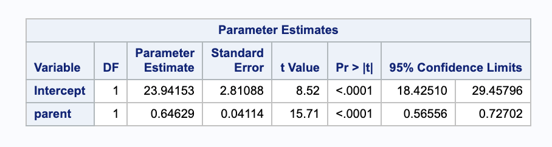

From this we get $\hat{\beta_1}=0.64629$. Given a one inch increase in the average height of a son's parents, we expect an increase in their son's height of 0.64629 inches.

### d.
**True or false: (1) $\hat{\beta_1}$ is a statistic. (2) $\hat{\beta_1}$ is a parameter. (3) With data, $\hat{\beta_1}$ is unknown and cannot be determined/calculated.**

Note that $\hat{\beta_1}$ is an estimate of the true slope based on the data.

(1) True

(2) False

(3) False


### e.
**True or false: $\hat{\beta_1}=\beta_1$**

False, $\hat{\beta_1}$ is a sample estimate of the parameter $\beta_1$.

### f.
**How much does $\hat{\beta_1}$ vary about $\beta_1$ from sample to sample? (Provide an estimate of the standard error, as well as an expression indicating how it was computed.)**

The standard error of $\hat{\beta_1}$ can be computed by hand with the following formula. Notice that $s_x^2 = \frac{\sum (x_i-\bar{x})^2 }{ n-2 }$

$$
	\begin{align}
		SE(\hat{\beta_1}) & = \sqrt{\frac{ s^2 }{ \sum(x_i - \bar{x})^2 }}\\
			& = \sqrt{ \frac{ s^2 }{ (n-2)\cdot s_x^2  } }\\
			& = \sqrt{ \frac{ \frac{ n-1 }{ n-2 } (s_y^2 - \hat{\beta_1^2} s_x^2) }{ (n-2)\cdot s_x^2  } }\\
			& = \sqrt{\frac{(930-1) \left(6.34003\, -0.64629^2 \cdot 3.19456\right)}{(930-2) ((930-2) 3.19456)}} \\
			& = 0.0411137
	\end{align}
$$

Notice that we can also read it from the SAS output parameter estimates under parent Standard Error.

The sample to sample variance of $\hat{\beta_1}$ is 0.041137 son-inches/parent-inch.


### g.
**What is a region of plausible values for $\beta_1$ suggested by the data?**

We can calculate a 95% confidence interval.

$$
	\begin{align}
		(\beta_{1L}, \beta_{1U}) & = \hat{\beta_0} \pm t_{928-2, 0.05/2} \cdot SE(\hat{\beta_0}) \\
			& = 0.64629 \pm 1.96253 \cdot 0.0411137 \\
			& = (0.565603, 0.726977)
	\end{align}
$$

Notice that we can also read it from the SAS output parameter estimates under parent 95% Confidence Limit.

We are 95% confident that the true value of $\beta_1$ is between 0.565603 and 0.726911 son-inches/parent-inch.

### h.
**What is the line that best fits these data, using the criterion that smallest sum of squared residuals is "best?"**

From SAS, we can get $\hat{\beta_0}=23.94153$ and $\hat{\beta_1}=0.64629$.With our beta parameters estimated, we can put together our regression model.

$$
\hat{y} = 23.94153 + 0.64629 \cdot x
$$

### i.
**What percent of the observed variation in the heights of sons (the y-axis) is explained by this “best” line?**

We can calculate this percent, the $R^2$, using some values from SAS.

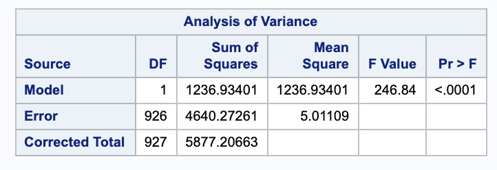

$$
	\begin{align}
		R^2 & = \frac{ SSRegression }{ SSTotal }\\
			& = 0.210463
	\end{align}
$$

We can also confirm this in SAS.

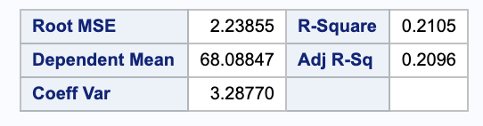

### j.
**What is the estimated average height of sons whose midparent height is 68?**

We are estimating $E(Y) \| X=68$.

$$
	\begin{align}
		\hat{Y_0} & = \hat{\beta_0} + \hat{\beta_1} \cdot x_0 \\
			& = 23.9415 +0.64629 \cdot 68\\
			& = 67.8892
	\end{align}
$$

We can also check this in SAS.

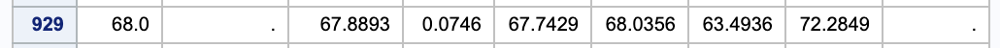


The estimated average height of sons whose mid parent height is 68 inches is 67.8892 inches.

### k.
**Is this the true average height of sons whose midparent height is 68?**

This is just an estimate based on the data, it is not the true average height.

### l.
**Under the model, what is the true average height of sons with midparent height of 68?**

The true average for the height of sons with midparent height of 68 inches could be calculated if the true population parameters were known.

$$
Y = \beta_0 + \beta_1 \cdot 68
$$

### m.
**Under the model, what is the estimated standard deviation of height among the population of sons whose parents have midparent height 68?**

We can use the unbiased estimator $s$ of $\sigma$.

$$
	\begin{align}
		s & = \sqrt{\frac{ SSE }{ n-2 }}\\
			& = \sqrt{\frac{4640.27}{928-2}} \\
			& = 2.23855
	\end{align}
$$

### n.
**Under the model, what is the estimated standard deviation among the population of sons whose parents have midparent height 72? Bigger, smaller, or the same as that for midparent height 68? Is your answer obviously supported or refuted by inspection of the scatterplot?**

The estimated standard deviation is the same at every point (under the assumption of constant variance we use in regression).

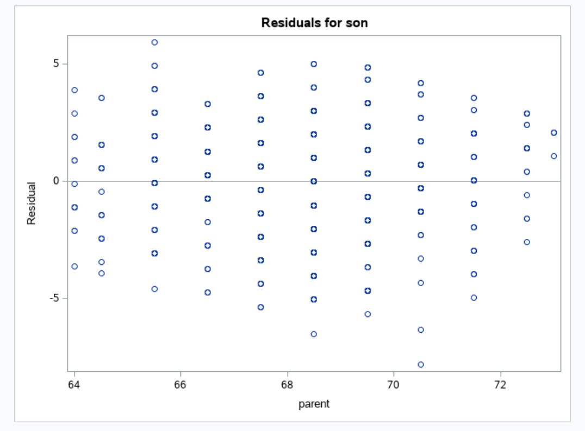

The variances of the residuals look fairly equal. So the claim is supported.

### o.
**What is the standard error of the estimated average height of sons with midparent height 68? Provide an expression for this standard error.**

We can calculate the estimated standard error at 68 inches of midparent height.

$$
	\begin{align}
		SE(\hat{Y_0}) & = s \cdot \sqrt{ \frac{ 1 }{ n } + \frac{ (x_0 - \bar{x})^2 }{ \sum(x_i - \bar{x})^2 } }\\
		& = s \cdot \sqrt{ \frac{ 1 }{ n } + \frac{ (x_0 - \bar{x})^2 }{ ((n-1) \cdot s_x^2) } }\\
		& = \sqrt{\frac{(68-68.0885)^2}{(928-2) 1.78733^2}+\frac{1}{928}} \sqrt{\frac{(928-1) \left(6.34003\, -0.64629^2 \cdot 3.19456\right)}{928-2}}\\
		& = 0.0735742
	\end{align}
$$

From the SAS output in part j., we get the estimated standard error to be 0.073574. 

### p.
**Is the standard error of the estimated average height of sons with midparent height 72 bigger, smaller, or the same as that for midparent height 68?**

We can calculate this as we did in part o.

$$
	\begin{align}
		SE(\hat{Y_0}) & = s \cdot \sqrt{ \frac{ 1 }{ n } + \frac{ (x_0 - \bar{x})^2 }{ \sum(x_i - \bar{x})^2 } }\\
		& = s \cdot \sqrt{ \frac{ 1 }{ n } + \frac{ (x_0 - \bar{x})^2 }{ ((n-1) \cdot s_x^2) } }\\
		& = \sqrt{\frac{(72-68.0885)^2}{(928-1) 1.78733^2}+\frac{1}{928}} \sqrt{\frac{(928-1) \left(6.34003\, -0.64629^2 \cdot 3.19456\right)}{928-2}}\\
		& = 0.17689
	\end{align}
$$


From SAS we get 0.1687.

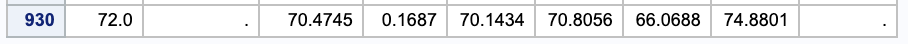

It is bigger than for the midparent height of 68.

### q.
**Is the observed linear association between son’s height and midparent height significant? Report all relevant aspects of a test of hypotheses, i.e., report null and alternative hypotheses, a test statistic, and a p-value.**

To test linear association, we can look at the correlation between the variables. We can start by setting up hypothesis.

$$
	\begin{align}
		H_0: & \rho = 0\\
		H_A: & \rho \neq 0
	\end{align}
$$

We can use our calculated value of $r = 0.45876$ from SAS in part II to calculate a test statistic.

$$
	\begin{align}
		z & = \sqrt{n-3} \left(\frac{1}{2} \log \left(\frac{1+r}{1-r}\right)-\frac{1}{2} \log \left(\frac{1+\rho_0}{1+\rho_0}\right)\right)\\
			& = \sqrt{928-3} \left(\frac{1}{2} \log \left(\frac{1+0.45876}{1-0.45876}\right)-\frac{1}{2} \log \left(\frac{1+0}{1+0}\right)\right) \\
			& = 15.0773\\
	\end{align}
$$

Using $\alpha = 0.05$, we get a small p-value (less than 0.001); thus, we have evidence to reject the null hypothesis in favor of the alternation that $\rho \neq 0$.

### r.
**Is the observed linear association between son’s height and midparent height strong? Use Pearson’s correlation coefficient to answer.**

$$
	\begin{align}
		r_{xy} & = \frac{ s_{xy} }{ s_x s_y }\\
			& = \frac{ \hat{\beta_1} s_x^2 }{ s_x s_y }\\
			& = \frac{ 0.64629 \cdot 1.78733 }{ 2.51794 } \\
			& = 0.458761
	\end{align}
$$

Our estimate of the linear association between son's height and midparent height is 0.458761 (which matches what we got from SAS from part II). This suggests that there is a moderately strong postive correlation.

### s.
**Comment on whether the simple linear regression model assumptions are reasonable.**

We have four assumptions to check when using linear regression. First we will check the normality of our residuals by looking at a qqplot.

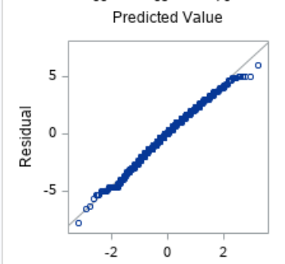

We see that for the most part, the line looks straight, but around the edges there is some curvature. 

With simple linear regression, we can check two assumptions by looking at a plot of our residuals against our predicted values. We cab see if our residuals have equal variance and if their mean is 0. If these are true, we will see a random scatter of points on this residual plot.


These data look fairly random (they are not following a pattern/curve), so this assumption holds.

The final assumption we need to check is that our data are independent of each other. In this case, we would assume that the midparent height of one person does not affect the height of another person. We would need more context about the data collection (no sibilings, etc.) to be confident in this. 


### t.
**Consider estimating the population mean height of adult males whose midparent height is 72. Obtain a set of plausible values for this mean, using 95% confidence. Compare and contrast this set to that found for part (I.) of this exercise.**

We can estimate the population mean by plugging 72 into our regression model.

$$
	\begin{align}
		\hat{Y_0} & = \hat{\beta_0} + \hat{\beta_1} \cdot x_0 \\
			& = 23.9415 +0.64629 \cdot 72\\
			& = 70.4744
	\end{align}
$$

We can find a 95% confindence interval $E(Y)$ at $X = 72$.

$$
	\begin{align}
		(\hat{Y_{0_L}}, \hat{Y_{0_U}}) & = \hat{Y_0} \pm t_{n-2, \alpha/2} \cdot SE(\hat{Y_0}) \\
			& = 70.4744 \pm 1.96 \cdot 0.1687 \\
			& = (70.1437, 70.8051)
	\end{align}
$$

We are 95% confident that the true mean of adult males whose midparent height is 72 is between 70.1437 and 70.8051 inches.

Notice that both our estimate and our confidence interval are larger than what we calculated in Part I without taking midparent height into account.

# 2

## a.
**Obtain an approximate 95% confidence interval for the population correlation coefficient $\rho$ when a bivariate random sample of size $n=20$ results in a sample correlation coefficient of $r_{xy}=-0.45$. Also, conduct a test of $H_0: \rho = 0$.**

We can a large sample confidence interval for $\rho$.

$$
	\begin{align}
		(\rho_L, \rho_U) & = \Bigg( \frac{\frac{(r+1) e^{-\frac{2 z}{\sqrt{n-3}}}}{1-r}-1}{\frac{(r+1) e^{-\frac{2 z}{\sqrt{n-3}}}}{1-r}+1}, \frac{\frac{(r+1) e^{\frac{2 z}{\sqrt{n-3}}}}{1-r}-1}{\frac{(r+1) e^{\frac{2 z}{\sqrt{n-3}}}}{1-r}+1} \Bigg) \\
			& = \Bigg( \frac{\frac{(-0.45+1) e^{-\frac{2 \cdot 1.96}{\sqrt{20-3}}}}{1-(-0.45)}-1}{\frac{(-0.45+1) e^{-\frac{2 \cdot 1.96}{\sqrt{20-3}}}}{1-(-0.45)}+1}, \frac{\frac{(-0.45+1) e^{\frac{2 \cdot 1.96}{\sqrt{20-3}}}}{1-(-0.45)}-1}{\frac{(-0.45+1) e^{\frac{2 \cdot 1.96}{\sqrt{20-3}}}}{1-(-0.45)}+1} \Bigg)\\
			& = (-0.744308, -0.00933018)
	\end{align}
$$

We are 95% confident that the true correlation coefficient $\rho$ is between -0.744308 and -0.00933018.

With $H_0: \rho = 0, \ H_A: \rho \neq 0$, we can find our test statistic. 

$$
	\begin{align}
		z & = \sqrt{n-3} \left(\frac{1}{2} \log \left(\frac{r+1}{1-r}\right)-\frac{1}{2} \log \left(\frac{\rho+1}{1-\rho}\right)\right) \\
			& = \sqrt{20-3} \left(\frac{1}{2} \log \left(\frac{(-0.45)+1}{1-(-0.45)}\right)-\frac{1}{2} \log \left(\frac{0+1}{1-0}\right)\right)\\
			& = -1.99847
	\end{align}
$$

Since this falls outside of our rejection region, $RR = \\{ \| -1.99847 \| \geq 1.96 \\}$, we have evidence to reject the null hypothesis in favor of the alternative that $\rho \neq 0$.

## b.
**Suppose that two random variables $X$ and $Y$ have correlation $\rho=0.6$. (that is, the correlation among two quantities in an entire population is $E[(X-\mu_x)(Y-\mu_y)/(\sigma_x \sigma_y)]=0.6$.) What is the probability that a random sample of $n=30$ bivariate observations will yield a sample correlation coefficient that exceeds 0.7, i.e., find $Pr(R > 0.7; \rho=0.6)$.**

We will start by setting up our hypotheses.

$$
	\begin{align}
		H_0: & R \leq 0.7\\
		H_A: & R > 0.7
	\end{align}
$$

Then we can the sample statistic.

$$
	\begin{align}
		z & = \sqrt{n-3} \left(\frac{1}{2} \log \left(\frac{r+1}{1-r}\right)-\frac{1}{2} \log \left(\frac{\rho+1}{1-\rho}\right)\right) \\
			& = \sqrt{30-3} \left(\frac{1}{2} \log \left(\frac{(0.7)+1}{1-(0.7)}\right)-\frac{1}{2} \log \left(\frac{0.6+1}{1-0.6}\right)\right)\\
			& = 0.904927
	\end{align}
$$

So, $P(R > 0.7; \rho = 0.6) =  P(Z > 0.904927) = 0.1827931$. Thus, we do not have enough evidence to reject the null hypothesis.


#  3
**Dataset ChirpFrequency.txt in the database provides information on striped ground crickets. Fifteen bivariate measurements of chirps per second $(y)$ and temperature $(x)$ in degrees Fahrenheit are given.**

Note that all SAS output was generated with `proc corr` and `proc reg`.

```
proc corr data=chirp
  plots=matrix(histogram) csscp;
  var chirps temperature;
run;

proc reg data=chirp_pred simple;
  model chirps=temperature / alpha=0.05 clb clm cli;
  id temperature;
  output out=chirp_reg
    residual=r pred=yhat
    ucl=pihigh lcl=pilow
    uclm=cihigh lclm=cilow
    stdp=stdmean;
run;
```

## a.
**Obtain a scatterplot of these measurements.**
We can get a scatterplot of temperature vs. chirps from `proc corr` in SAS.

```
proc corr data=chirp
  plots=matrix(histogram) csscp;
  var chirps temperature;
run;
```

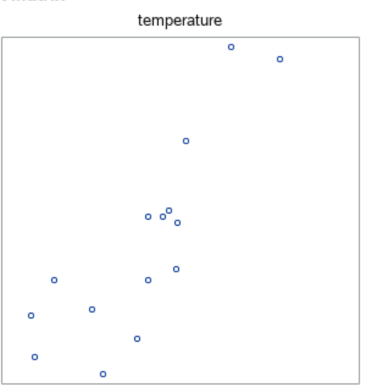


## b.
**Specify the simple linear regression model for these data. Identify all parameters in the model, providing the interpretation of each. Note that this does not require any data analysis.**

$$
Y = \beta_{0} + \beta_{1} \cdot x + E
$$


$$
\begin{array}{ r | l }
	Y & \text{The number of chirps per second} \\
	\beta_{0} & \text{The intercept. The expected number of chirps per second} \\
		& \text{if the temperature is 0 $^{\circ}$ F.} \\
	\beta_{1} & \text{The slope of the temperature. The expected change in chirps per second}\\
		& \text{in with a one degree F increase in temperature}\\
	x & \text{The temperature in degree F}\\
	E & \text{Random error. A measure of how Y differs from its mean.}\\
		& \text{Notice that } E \stackrel{iid}{\sim} N(0, \sigma^2)\\
	\sigma^2 & \text{The population variation of chirps per second.}
\end{array}
$$

## c.
**Explain how the interpretation (and the estimate) of the slope and intercept parameters change if temperature is expressed in Celsius. Note that this does not require any data analysis.**	

The slope and intercept would both need to be transformed.

$$
	\begin{align}
		\beta_{0, celsius} & = (\beta_{1, fahrenheit} - 32) \cdot \frac{ 5 }{ 9 }\\
		\beta_{1, celcius} & = (\beta_{1, fahrenheit} - 32) \cdot \frac{ 5 }{ 9 }
	\end{align}
$$


$$
\begin{array}{ r | l }
	Y & \text{The number of chirps per second} \\
	\beta_{0, celsius} & \text{The intercept. The expected number of chirps per second} \\
		& \text{if the temperature is 0 $^{\circ}$ C.} \\
	\beta_{1, celcius} & \text{The slope of the temperature. The expected change in chirps per second.}\\
		& \text{in with a one degree C increase in temperature}\\
\end{array}
$$

## d.
**Estimate the mean chirp frequency among crickets in a temperature of $80^{\circ} F$. Estimate the standard deviation among chirp frequency measurements made at this fixed temperature.**

To estimate this, we will need the $\hat{\beta}$ estimates from SAS.

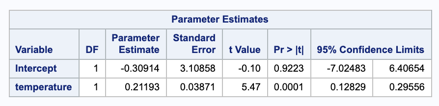

$$
\hat{Y_0} = -0.30914 + 0.21193 \cdot 80 = 16.453  
$$

This closely matches what SAS calculates.

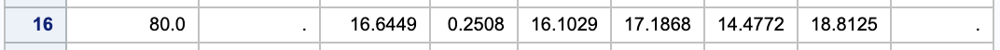


For the standard deviation, we will need more information about the data that SAS can provide.

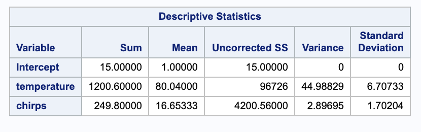

We can estimate the standard deviation $\sigma$ with the unbiased estimator $s$. We will need the Sum of Squared Error from the ANOVA table.

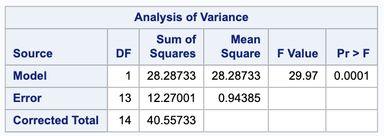

$$
	\begin{align}
		s & = \sqrt{\frac{ SSE }{ n-2 }}\\
			& = \sqrt{\frac{12.27001}{15-2}} \\
			& = 0.971518
	\end{align}
$$

## e.
**Use the regression line to estimate the mean chirp frequency among crickets in a temperature of $105^{\circ} F$. What is wrong with this estimate.**

We can calculate this using the same parameter estimates as in part d.

$$
\hat{Y_0} = -0.30914 + 0.21193 \cdot 105 = 21.9435 
$$

This is close to the prediction that SAS gives.

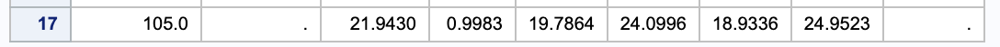

However, if we look at our data, we notice that are there are no points taken around 105, so this is not a useful estimate.

## f.
**Report the sum of squared deviations between the fitted values and the average chirp frequency $\bar{y}$.**

This is equal to the Sum of Squares for the regression, which can be found in SAS in the ANOVA table.


$$
\sum (\hat{y_i} - \bar{y_i})^2 = SSRegression = 28.28733
$$

## g.
**What proportion of variance in chirp frequencies is explained by the linear regression model?**

We can calculate this using the ANOVA table values again.

$$
R^2 = 1 - \frac{ SSE }{ SSTotal } = 1 = \frac{ 12.27001 }{ 40.5573 } = 0.697465
$$

This means that 69.75% of the variability in chirp frequencies is explained by the linear regression model.

This closely matches the value that SAS gives.

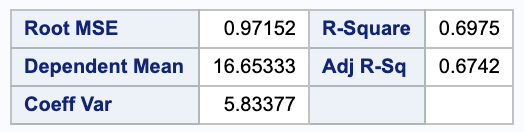

#  4
**A random sample leads to $n=11$ bivariate measurements of $(y_1, x_1), \dots , (y_{11}, x_{11})$ with sample means and sample variances**

$$
\bar{x} = 80, \bar{y} = 85, s_x^2=1, s_y^2=20.
$$


## a.
**Complete the ANOVA table.**

$$
	\begin{array}{c c c c c c}
		\text{Source} & \text{Sum of Squares} & \text{d.f.} & \text{Mean Square} & \text{F-ratio} & p \text{-value}\\ \hline
		\text{Regression} & 160 & 1 & 160 & ? & ? \\
		\text{Error} & ? & ? & ? & & \\
		\text{Corrected Total} & 200 & 10 & & & \\ \hline
	\end{array}
$$


\$$
	\begin{align}
		F-ratio & = \frac{ MSE_{Regn} }{ df_{Reg} }\\
			& = 36\\ \\
		p-value & = P(F_{n-p-1}^{p} < F_{obs}) \\
			& = P(F_{9}^{1} > 36) \\
			& = 0.0002024993 \\ \\
		SSE & = SSTotal - SSRegn\\
			& = 200 - 160 \\
			& = 40 \\ \\
		df_{Error} & = n - p - 1 \\
			& = (n-1) - p \\
			& = df_{total} - df_{Reg} \\
			& = 10 - 1 \\
			& = 9 \\ \\
		MSE & = \frac{ SSE }{ df_{Error} } \\
			& = \frac{ 40 }{ 9 }
	\end{align}
$$


$$
	\begin{array}{c c c c c c}
		\text{Source} & \text{Sum of Squares} & \text{d.f.} & \text{Mean Square} & \text{F-ratio} & p \text{-value}\\ \hline
		\text{Regression} & 160 & 1 & 160 & 36 & 0.0002024993
		\\\\\
		\text{Error} & 40 & 9 & \frac{ 40 }{ 9 } & & \\
		\text{Corrected Total} & 200 & 10 & & & \\ \hline
	\end{array}
$$

## b.
**Determine the uncorrected total sum of squares, $\sum y_i^2$.**

$$
	\begin{align}
		SSTotal & = \sum (y_i-\bar{y})^2 \\
			& = \sum (y_i^2 - 2 y_i \bar{y} + \bar{y}^2)\\
			& = \sum y_i^2 - 2 \bar{y}\sum y_i + \sum \bar{y}^2\\
			& = \sum y_i^2 - 2 \bar{y} \cdot n \bar{y} + n \bar{y}^2 \\
			& = \sum y_i^2 - 2 n \bar{y} ^ 2 + n \bar{y}^2\\
		\sum y_i^2 & = SSTotal + n \bar{y}^2 \\
			& = 200+11\cdot 85^2\\
			& = 79675
	\end{align}
$$

## c.
**The sample correlation coefficient was $r_{xy}=-0.894$. Report the slope of the least squares regression line.**

Notice that $r_{xy} = \frac{ s_{xy} }{ s_x s_y }$.

\$$
	\begin{align}
		\hat{\beta_1} & = \frac{ s_{xy} }{ s_x^2 } \\
			& = \frac{ r_{xy} s_x s_y }{ s_x^2 }\\
			& = \frac{ r_{xy} s_y }{ s_x }\\
			& = \frac{ -0.894 \cdot \sqrt{20} }{ \sqrt{1} }\\
			& = -3.99809
	\end{align}
$$