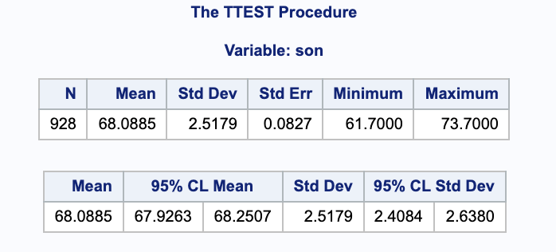

Problems: 1, 2, 3, 4


* Do not remove this line (it will not be displayed)
{:toc}


# 1
**Galton provided a dataset that has become a classic. It investigates the relationship between the height of 928 adult males and the average height of their parents. This dataset is included in the database as GaltonHeightsL.txt and records heights in inches.**

## I.
**Suppose we ignore parents’ average height. Consider estimating the population mean height of adult males. Obtain a 95% confidence interval using this naïve analysis.**

We can ignore the parents' influence on the sons' height in SAS.

```
proc ttest data=galton sides=2 alpha=0.05;
  var son;
run;
```



From the SAS output, we are 95% confident that the true average height of one of the sons' is between 67.9263 and 68.2507 inches.

## II.
**Is there a linear association between the height of adult males and the average height of their parents? More specifically, obtain a 95% confidence interval for the correlation between these variables.**

We can use the `proc corr` procedure in SAS to find information about the correlation. Notice that we are specifing a 2-sided, 95% confidence interval with no bias adjustment.

```
proc corr data=galton
  plots=matrix(histogram) csscp
  fisher(alpha=0.05 type=twosided biasadj=no);
  
  var parent son;
run;
```


From the SAS output, we are 95% confident that the true correlation between the height of adult males and the average height of their parents is between 0.406407 and 0.508115.

## III.
**Letting $Y$ denote the sons’ heights and $X$ denote the midparent heights (i.e., average height of parents), consider a simple linear regression model. Answer the following:**

For the following answers, the tables were generated in SAS using `proc reg`.

```
proc reg data=galton_pred simple;
  model son=parent / alpha=0.05 clb clm cli;
  id parent;
  output out=galton_reg
    residual=r pred=yhat
    ucl=pihigh lcl=pilow
    uclm=cihigh lclm=cilow
    stdp=stdmean;
run;
```

### a.
**What is the meaning, in words, of $\beta_1$?**

In our linear model $Y = \beta_0 + \beta_1 \cdot X + E$, $\beta_1$ is the (true) slope parameter for the predictor $X$. It represents the change in the son's height when the average height of his parents is increased by 1 inch.

### b.
**True or false: (1) $\beta_1$ is a statistic. (2) $\beta_1$ is a parameter. (3) With data, $\beta_1$ is unknown and cannot be determined/calculated.**

Note that $\beta_1$ is true slope for the population, not an estimation by the data.

(1) False

(2) True

(3) True

### c.
**What is the observed value of $\hat{\beta_1}$? Be sure to specify units.**

We can calculate $\hat{\beta_1}$.

$$
	\begin{align}
		\hat{\beta_1} & = r_{xy} \frac{ s_y }{ s_x }\\
			& = \frac{0.45876 2.51794}{1.78733} \\
			& = 0.64629
	\end{align}
$$

We can also get $\hat{\beta_1}$ from the parameter estimate table in SAS.


From this we get $\hat{\beta_1}=0.64629$. Given a one inch increase in the average height of a son's parents, we expect an increase in their son's height of 0.64629 inches.

### d.
**True or false: (1) $\hat{\beta_1}$ is a statistic. (2) $\hat{\beta_1}$ is a parameter. (3) With data, $\hat{\beta_1}$ is unknown and cannot be determined/calculated.**

Note that $\hat{\beta_1}$ is an estimate of the true slope based on the data.

(1) True

(2) False

(3) True


### e.
**True or false: $\hat{\beta_1}=\beta_1$**

False, $\hat{\beta_1}$ is a sample estimate of the parameter $\beta_1$.

### f.
**How much does $\hat{\beta_1}$ vary about $\beta_1$ from sample to sample? (Provide an estimate of the standard error, as well as an expression indicating how it was computed.)**

The standard error of $\hat{\beta_1}$ can be computed by hand with the following formula. Notice that $s_x^2 = \frac{\sum (x_i-\bar{x})^2 }{ n-2 }$

$$
	\begin{align}
		SE(\hat{\beta_1}) & = \sqrt{\frac{ s^2 }{ \sum(x_i - \bar{x})^2 }}\\
			& = \sqrt{ \frac{ s^2 }{ (n-2)\cdot s_x^2  } }\\
			& = \sqrt{ \frac{ \frac{ n-1 }{ n-2 } (s_y^2 - \hat{\beta_1^2} s_x^2) }{ (n-2)\cdot s_x^2  } }\\
			& = \sqrt{\frac{(930-1) \left(6.34003\, -0.64629^2 \cdot 3.19456\right)}{(930-2) ((930-2) 3.19456)}} \\
			& = 0.0411137
	\end{align}
$$

Notice that we can also read it from the SAS output parameter estimates under parent Standard Error.

The sample to sample variance of $\hat{\beta_1}$ is 0.041137 son-inches/parent-inch.


### g.
**What is a region of plausible values for $\beta_1$ suggested by the data?**

We can calculate a 95% confidence interval.

$$
	\begin{align}
		(\beta_{1L}, \beta_{1U}) & = \hat{\beta_0} \pm t_{928-2, 0.05/2} \cdot SE(\hat{\beta_0}) \\
			& = 0.64629 \pm 1.96253 0.0411137 \\
			& = (0.565603, 0.726977)
	\end{align}
$$

Notice that we can also read it from the SAS output parameter estimates under parent 95% Confidence Limit.

We are 95% confident that the true value of $\beta_1$ is between 0.565603 and 0.726911 son-inches/parent-inch.

### h.
**What is the line that best fits these data, using the criterion that smallst sum of squared residuals is "best?"**

From SAS, we can get $\hat{\beta_0}=23.94153$ and $\hat{\beta_1}=0.64629$.With our beta parameters estimated, we can put together our regression model.

$$
\hat{y} = 23.94153 + 0.64629 \cdot x
$$

### i.
**What percent of the observed variation in the heights of sons (the y-axis) is explained by this “best” line?**

We can calculate this percent, the $R^2$, using some values from SAS.


$$
	\begin{align}
		R^2 & = \frac{ SSRegression }{ SSTotal }\\
			& = 0.210463
	\end{align}
$$

We can also confirm this in SAS.


### j.
**What is the estimated average height of sons whose midparent height is 68?**

We are estimating $E(Y) | X=68$.

$$
	\begin{align}
		\hat{Y_0} & = \hat{\beta_0} + \hat{\beta_1} \cdot x_0 \\
			& = 23.9415 +0.64629 \cdot 68\\
			& = 67.8892
	\end{align}
$$

We can also check this in SAS.


The estimated average height of sons whose mid parent height is 68 inches is 67.8892 inches.

### k.
**Is this the true average height of sons whose midparent height is 68?**

This is just an estimate based on the data, it is not the true average height.

### l.
**Under the model, what is the true average height of sons with midparent height of 68?**

The true average for the height of sons with midparent height of 68 inches could be calculated if the true population parameters were known.

$$
Y = \beta_0 + \beta_1 \cdot 68
$$

### m.
**Under the model, what is the estimated standard deviation of height among the population of sons whose parents have midparent height 68?**

We can use the unbiased estimator $s$ of $\sigma$.

$$
	\begin{align}
		s & = \sqrt{\frac{ SSE }{ n-2 }}\\
			& = \sqrt{\frac{4640.27}{928-2}} \\
			& = 2.23855
	\end{align}
$$

### n.
**Under the model, what is the estimated standard deviation among the population of sons whose parents have midparent height 72? Bigger, smaller, or the same as that for midparent height 68? Is your answer obviously supported or refuted by inspection of the scatterplot?**

The estimated standard deviation is the same at every point (under the assumption of constant variance we use in regression).


The variances of the residuals look fairly equal. So the claim is supported.

### o.
**What is the standard error of the estimated average height of sons with midparent height 68? Provide an expression for this standard error.**

We can calculate the estimated standard error at 68 inches of midparent height.

$$
	\begin{align}
		SE(\hat{Y_0}) & = s \cdot \sqrt{ \frac{ 1 }{ n } + \frac{ (x_0 - \bar{x})^2 }{ \sum(x_i - \bar{x})^2 } }\\
		& = s \cdot \sqrt{ \frac{ 1 }{ n } + \frac{ (x_0 - \bar{x})^2 }{ (n-2 \cdot s_x^2) } }\\
		& = \sqrt{\frac{(68-68.0885)^2}{(928-2) 1.78733^2}+\frac{1}{928}} \sqrt{\frac{(928-1) \left(6.34003\, -0.64629^2 \cdot 3.19456\right)}{928-2}}\\
		& = 0.0735742
	\end{align}
$$

From the SAS output in part j., we get the estimated standard error to be 0.0746. 

### p.
**Is the standard error of the estimated average height of sons with midparent height 72 bigger, smaller, or the same as that for midparent height 68?**

We can calculate this as we did in part o.

$$
	\begin{align}
		SE(\hat{Y_0}) & = s \cdot \sqrt{ \frac{ 1 }{ n } + \frac{ (x_0 - \bar{x})^2 }{ \sum(x_i - \bar{x})^2 } }\\
		& = s \cdot \sqrt{ \frac{ 1 }{ n } + \frac{ (x_0 - \bar{x})^2 }{ (n-2 \cdot s_x^2) } }\\
		& = \sqrt{\frac{(72-68.0885)^2}{(928-2) 1.78733^2}+\frac{1}{928}} \sqrt{\frac{(928-1) \left(6.34003\, -0.64629^2 \cdot 3.19456\right)}{928-2}}\\
		& = 0.176969
	\end{align}
$$


From SAS we get 0.1687.


It is bigger than for the midparent height of 68.

### q.
**Is the observed linear association between son’s height and midparent height significant? Report all relevant aspects of a test of hypotheses, i.e., report null and alternative hypotheses, a test statistic, and a p-value.**

To test linear association, we can look at the correlation between the variables. We can start by setting up hypothesis.

$$
	\begin{align}
		H_0: & \rho = 0\\
		H_A: & \rho \neq 0
	\end{align}
$$


### r.
**Is the observed linear association between son’s height and midparent height strong? Use Pearson’s correlation coefficient to answer.**


### s.
**Comment on whether the simple linear regression model assumptions are reasonable.**


### t.
**Consider estimating the population mean height of adult males whose midparent height is 72. Obtain a set of plausible values for this mean, using 95% confidence. Compare and contrast this set to that found for part (I.) of this exercise.**


# 2

## a.
**Obtain an approximate 95% confidence interval for the population correlation coefficient $\rho$ when a bivariate random sample of size $n=20$ results in a sample correlation coefficient of $r_{xy}=-0.45$. Also, conduct a test of $H_0: \rho = 0$.**

We can a large sample confidence inteval for $\rho$.

$$
	\begin{align}
		(\rho_L, \rho_U) & = \Bigg( \frac{\frac{(r+1) e^{-\frac{2 z}{\sqrt{n-3}}}}{1-r}-1}{\frac{(r+1) e^{-\frac{2 z}{\sqrt{n-3}}}}{1-r}+1}, \frac{\frac{(r+1) e^{\frac{2 z}{\sqrt{n-3}}}}{1-r}-1}{\frac{(r+1) e^{\frac{2 z}{\sqrt{n-3}}}}{1-r}+1} \Bigg) \\
			& = \Bigg( \frac{\frac{(-0.45+1) e^{-\frac{2 \cdot 1.96}{\sqrt{20-3}}}}{1-(-0.45)}-1}{\frac{(-0.45+1) e^{-\frac{2 \cdot 1.96}{\sqrt{20-3}}}}{1-(-0.45)}+1}, \frac{\frac{(-0.45+1) e^{\frac{2 \cdot 1.96}{\sqrt{20-3}}}}{1-(-0.45)}-1}{\frac{(-0.45+1) e^{\frac{2 \cdot 1.96}{\sqrt{20-3}}}}{1-(-0.45)}+1} \Bigg)\\
			& = (-0.744308, -0.00933018)
	\end{align}
$$

We are 95% confident that the true correlation coefficient $\rho$ is between -0.744308 and -0.00933018.

With $H_0: \rho = 0, \ H_A: \rho \neq 0$, we can find our test statistic. 

$$
	\begin{align}
		z & = \sqrt{n-3} \left(\frac{1}{2} \log \left(\frac{r+1}{1-r}\right)-\frac{1}{2} \log \left(\frac{\rho+1}{1-\rho}\right)\right) \\
			& = \sqrt{20-3} \left(\frac{1}{2} \log \left(\frac{(-0.45)+1}{1-(-0.45)}\right)-\frac{1}{2} \log \left(\frac{0+1}{1-0}\right)\right)\\
			& = -1.99847
	\end{align}
$$

Since this falls outside of our rejection region, $RR = \\{ \| -1.99847 \| \geq 1.96 \\}$, we have evidence to reject the null hypothesis in favor of the alternative that $\rho \neq 0$.

## b.
**Suppose that two random variables $X$ and $Y$ have correlation $\rho=0.6$. (that is, the correlation among two quantities in an entire population is $E[(X-\mu_x)(Y-\mu_y)/(\sigma_x \sigma_y)]=0.6$.) What is the probability that a random sample of $n=30$ bivariate observations will yield a sample correlation coefficient that exceeds 0.7, i.e., find $Pr(R > 0.7; \rho=0.6)$.**

We will start by setting up our hypotheses.

$$
	\begin{align}
		H_0: & R \leq 0.7\\
		H_A: & R > 0.7
	\end{align}
$$

Then we can the sample statistic.

$$
	\begin{align}
		z & = \sqrt{n-3} \left(\frac{1}{2} \log \left(\frac{r+1}{1-r}\right)-\frac{1}{2} \log \left(\frac{\rho+1}{1-\rho}\right)\right) \\
			& = \sqrt{30-3} \left(\frac{1}{2} \log \left(\frac{(0.7)+1}{1-(0.7)}\right)-\frac{1}{2} \log \left(\frac{0.6+1}{1-0.6}\right)\right)\\
			& = 0.904927
	\end{align}
$$

So, $P(R > 0.7; \rho = 0.6) =  P(Z > 0.904927) = 0.1827931$. Thus, we do not  

#  3
**Dataset ChirpFrequency.txt in the database provides information on striped ground crickets. Fifteen bivariate measurements of chirps per second $(y)$ and temperature $(x)$ in degrees Fahrenheit are given.**

## a.
**Obtain a scatterplot of these measurements.**


## b.
**Specify the simple linear regression model for these data. Identify all parameters in the model, providing the interpretation of each. Note that this does not require any data analysis.**


## c.
**Explain how the interpretation (and the estimate) of the slope and intercept parameters change if temperature is expressed in Celcius. Note that this does not require any data analysis.**


## d.
**Estimate the mena chirp frequency among crickets in a termpature of $80^{\circ} F$. Estimate the standard deviation among chirp frequency measurements made at this fixed temperature.**


## e.
**Use the regression line to estiamte the mean chirp frequency among circkets in a temperature of $105^{\circ} F$. What is wrong with this estimate.**


## f.
**Report eh sum of squared deviations between the fitted values and the average chirp frequency $\bar{y}$.**


## g.
**What proportion of variance in chirp frequencies is explained by the linear regression model?**


#  4
**A random sample leads to $n=11$ bivariate measurements of $(y_1, x_1), \dots , (y_{11}, x_{11})$ with sample means and sample variances**

$$
\bar{x} = 80, \bar{y} = 85, s_x^2=1, s_y^2=20.
$$


## a.
**Complete the ANOVA table.**

$$
	\begin{array}{c c c c c c}
		\text{Source} & \text{Sum of Squares} & \text{d.f.} & \text{Mean Square} & \text{F-ratio} & p \text{-value}\\ \hline
		\text{Regression} & 160 & 1 & 160 & ? & ? \\
		\text{Error} & ? & ? & ? & & \\
		\text{Corrected Total} & 200 & 10 & & & \\ \hline
	\end{array}
$$


## b.
**Determine the uncorrected total sum of squares, $\sum y_i^2$.**


## c.
**The sample correlaction coefficient was $r_{xy}=-0.894$. Report the slope of the least squares regression line.**