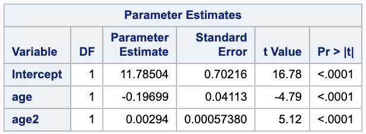
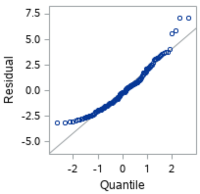
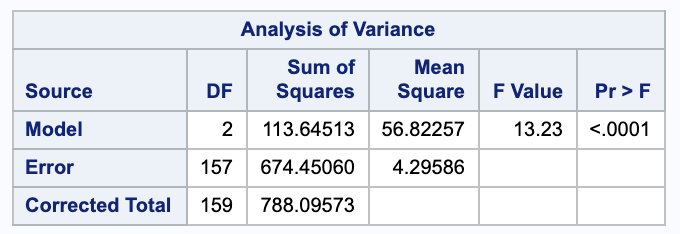
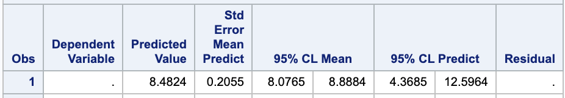
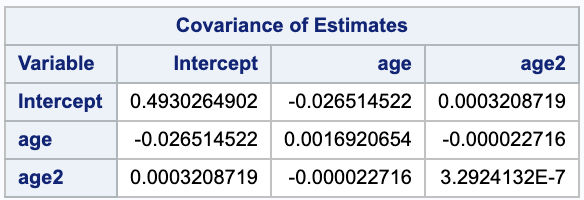
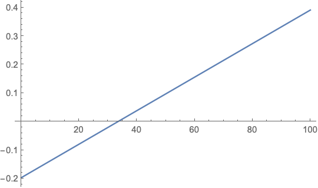

Problems: 1, 2, 3


* Do not remove this line (it will not be displayed)
{:toc}


# 1

**"Resolution 5K Runs" typically occur on January 1st as a way to "start the new year off right" and raise funds for charity. Dataset ResolutionRun2004.txt in the database provides information on a race that occurred in 2004, giving the pace (minutes per mile), sex, age (years), and squared age for each of $n = 160$ runners. Ignoring sex, and focusing on the bivariate data consisting of age ($X$) and pace ($Y$), you will investigate a regression that models the mean pace as a quadratic in age:**

$$
\mu(x) = \beta_0 + \beta_1 x + \beta_2 x^2
$$

## (a)
**Obtain the least squares regression equation.**

The $\hat{\beta}$'s can be estimated using ordinary least squares, which gives the following equation:

$$
\mathbf{\hat{\beta}} = (\mathbf{X}^T \mathbf{X})^{-}\mathbf{X}\mathbf{Y}
$$

(Note that $\hat{\beta}$ is the vector of $\beta$ estimates. I can't bold if for some reason.)

We can use SAS to compute this from our data.

```
proc reg data=run;
  model pace=age age2;
run;
```



From this we get,

$$
\hat{y} = 11.78504 + -0.19699 x + 0.00294 x^2.
$$

## (b)
**Construct 95% confidence intervals for $\beta_0$, $\beta_1$, and $\beta_2$ and interpret the results.**

We can construct a confidence interval for $\beta_i$ with 

$$
\hat{\beta_i} \pm t_{n-2, \alpha / 2} SE(\hat{\beta_i}).
$$


We will use the parameter estimates table from SAS given in (a). Notice that we have a large $n$ and are assuming normality even though the qqplot does not look great.





$$
	\begin{align}
		(\hat{\beta_{0_L}},\hat{\beta_{0_U}} ) & = \hat{\beta_0} \pm t_{157, 0.05 / 2} SE(\hat{\beta_0}) \\
			& = 11.78504 \pm 1.975189 \cdot 0.702106 \\
			& = ( 10.3982, 13.1718) \\
		(\hat{\beta_{1_L}},\hat{\beta_{1_U}} ) & = \hat{\beta_1} \pm t_{157, 0.05 / 2} SE(\hat{\beta_1}) \\
			& = -0.19699 \pm 1.975189 \cdot 0.04113 \\
			& = (-0.27823, -0.11575) \\
		(\hat{\beta_{2_L}},\hat{\beta_{2_U}} ) & = \hat{\beta_2} \pm t_{157, 0.05 / 2} SE(\hat{\beta_2}) \\
			& = 0.00294 \pm 1.975189 \cdot 0.00057380 \\
			& = (0.00180664, 0.00407336)
	\end{align}
$$


We are 95% confident that the true intercept $\beta_0$ (pace when age and age2 are 0) is between 10.3986 and 13.1718 minutes per mile.


If we look at the model in part (i), we see that $\beta_1$ is the true rate of change of pace when age (and consequently age squared) is equal to zero. We are 95% confident that the true $\beta_1$ is between -0.27823 and -0.11575 minutes per mile per age.


If we look at the model in part (i), we see that $\beta_2$ is the expected change in rate of change of pace when age is increased by 1. We are 95% confident that the true $\beta_2$ is between 0.00180664 and 0.00407336 minutes per mile per age^2. 

## (c)
**Estimate the error variance, $\sigma^2$, for an individual measurement of pace, given a fixed age.**

We can estimate $\sigma^2$ with $s^2$. We will need the SSE from the ANOVA table.




$$
	\begin{align}
		s^2 & = \frac{ SSE }{ n - rank(\mathbf{X}) } \\
			& = \frac{ SSE }{ n - (p+1) } \\
			& = \frac{ 674.45060 }{ 160 - (2+1) } \\
			& = 4.29586
	\end{align}
$$

## (d)
**Which do you expect would be larger, $Var(Y)$ or $Var(Y\|X=x)$? Which quantity was estimated in part (c)?**

We would expect $Var(Y)$ to be larger than $Var(Y\|X=x)$, which we calculated in (c). The second value should be smaller as it takes into account the model, which we expected to explain some of the variance of $Y$.


## (e)
**Report a standard error and 95% confidence interval for the mean pace for runners aged $x=34$.**

We can find a standard error estimate for $E(Y \| \mathbf{x}_0)$ with $\sqrt{\sigma^2 \mathbf{x}_0 (\mathbf{X}^T \mathbf{X})^{-1} \mathbf{x}_0^T}$ where $\mathbf{x_0} = [1\ 34\ 1156]$. We can use this to calculate the confidence interval

$$
E(Y | x = 34) \pm t_{n-3, \alpha/2} \cdot SE(E(Y | x = 34)).
$$

We can compute this is SAS as well.



Our standard error is 0.2055. We are 95% confident that the true mean pace for runners ages 34 is between 8.0765 and 8.8884 minutes per mile.


## (f)
**Obtain a 95% prediction interval for the pace of an individual runner selected from the cohort of 34 year-olds.**

We can find the prediction interval $Y \| x = 34$ with the following formula. Note that the variance of $Y \| x_0 = 34$ is $\sqrt{\sigma^2 + \sigma^2 \mathbf{x}_0 (\mathbf{X}^T \mathbf{X})^{-1} \mathbf{x}_0^T}$ where $\mathbf{x_0} = [1\ 34\ 1156]$.

$$
\hat{Y_0} \pm _{n-3, \alpha/2} \cdot SE(Y - \hat{Y_0})
$$

We can also read this from the SAS output in part (e).

We are 95% confident that the next new observation given an age of 34 will be within 4.3685 and 12.5964 minutes per mile.


## (g)
**Explain the difference between the two intervals in (e) and (f).**

Problem (e) is estimating the mean of the pace $\beta_0 + \beta_1 x + \beta_2 x^2$.

Problem (f) is asking to estimate the value given a new observation with an age of 34. We are estimating $Y = \beta_0 + \beta_1 x + \beta_2 x^2 + E$. 

Notice that the prediction interval has a wider range.

## (h)
**Construct a 99% confidence interval for the parameter $\theta = \beta_1 - \beta_2$.**


$$
(\hat{\beta_1} - \hat{\beta_2}) \pm t_{\nu, \alpha/2} \cdot \sqrt{ Var(\hat{\beta_1} - \hat{\beta_2}) }
$$

Notice that

$$
Var(\hat{\beta_1} - \hat{\beta_2})) = Var(\hat{\beta_1}) + Var(\hat{\beta_2})) - 2 Cov(\hat{\beta_1}), \hat{\beta_2}))
$$

We can use the estimates from part (a) to say $\hat{\beta_1} = -0.19699$, $\hat{\beta_2} =0.00294$, and we can get the variance and covariance from SAS.





Thus, our confidence interval is

$$
(-0.19699-0.00294) \pm 2.60751 \sqrt{0.00169207 + 3.29241 *10^{-7} - 2 (-0.000022716)} = (-0.30863, -0.0912303).
$$


We are 99% confident that the true value of $\theta$ is between -0.30863 and -0.0912303.

## (i)
**Consider the _rate_ at which the mean function for pace, $\mu(x)$, changes with age.**

### i.
**At what rate is the mean function for pace, $\mu(x)$, changing with age?**

We can take the derivative of regression function to find the mean function for pace.

$$
	\frac{ d }{ d\mu } = \beta_1 + 2 \beta_2 \cdot x_1
$$

### ii.
**Estimate the rate of change for 30 year-olds.**

Using the parameter estimates from part (a) we get,

$$
(\frac{ d }{ d\mu } | x = 30) = -0.19699 +2 \cdot  0.00294 \cdot 30 =-0.02059
$$

This means that the estimated rate of change for 30 year-olds is -0.02059 miles per minute per year. 

### iii.
**Estimate the rate of change for 50 year-olds.**

Using the parameter estimates from part (a) we get,

$$
(\frac{ d }{ d\mu } | x = 30) = -0.19699 + 2 \cdot 0.00294 \cdot 50 =0.09701
$$

This means that the estimated rate of change for 50 year-olds is 0.09701 miles per minute per year.

### iv.
**A simple and familiar test of one of the regression parameters can we used to investigate the claim that "the rate at which the mean function for pace changes with age is constant." State relevant hypotheses and conduct the test.**

The hypotheses are

$$
	\begin{align}
		H_0: & \beta_2 = 0 \\
		H_A: & \beta_2 \neq 0
	\end{align}
$$


We can calculate a t-statistic to test our hypothesis.


$$
	\begin{align}
		t & = \frac{ \hat{\beta_2} - \beta_{2,0} }{ SE(\hat{\beta_2}) } \\
			& = \frac{ 0.00294 - 0  }{ 0.00057380 }\\
			& = 5.12374
	\end{align}
$$


This gives a p value of less than 0.001.

## (j)
**Under the quadratic model, at what age is the mean function for pace minimized? Estimate this age.**

For this we want to check when the derivative is equal to 0.

$$
	\begin{align}
		0 & = \beta_1 + \beta_2 \cdot x_1 \\
			& = -0.19699 + 2 \cdot 0.00294 \cdot x_1 \\
		x_1 & = 33.5017
	\end{align}
$$

Looking at the graph of the derivative, we see that it goes from negative to positive at 33.5017, so this is indeed a minimum.




# 2
**Consider the four different regression functions in Exercise 11.2 as possible candidates for expressing the expected log(oxygen demand) as a function of five explanatory variables in Example 11.2.**

$$
E(Y \Big| a,b, c, d, f) = \beta_0 + \beta_1 a + \beta_2 b + \beta_3 c + \beta_4 d + \beta_5 f
$$

## (b)
**Interpret the parameters $\beta_1$ and $\beta_2$ in exercise 11.2a.**


$$
\begin{array}{ r | l }
	\beta_1 & \text{The change in expected log(oxygen demand) with a 1 unit increase in}  \\
		& \text{biological oxygen demand holding all other predictors constant.} \\
	\beta_2 & \text{The change in expected log(oxygen demand) with a 1 unit increase in}  \\
		& \text{the total Kjeldahl nitrogen holding all other predictors constant.}
\end{array}
$$

## (c)
**Interpret the quantity $\beta_1+\beta_2 + \beta_3$ in exercise 11.2a.**

The quantity $\beta_1+\beta_2 + \beta_3$ represents the change in expected log(oxygen demand) when $a,\ b,\ c$ (biological oxygen demand, total Kjeldahl nitrogen, and total solids, respectively) are increased by one unit each and $d, \ f$ are held constant.


$$
	\begin{align}
		E(Y | a+1, b+1, c+1) - E(Y|a,b,c) & = \beta_0 + \beta_1 (a+1) + \beta_2 (b+1) + \beta_3 (c+1) + \beta_4 d + \beta_5 f - (\beta_0 + \beta_1 a + \beta_2 b + \beta_3 c + \beta_4 d + \beta_5 f)\\
			& = \beta_1 a + \beta_1 + \beta_2 b + \beta_2 + \beta_3 c + \beta_3 - \beta_1 a - \beta_2 b - \beta_3 c\\
			& = \beta_1 + \beta_2 + \beta_3
	\end{align}
$$


# 3
**In Example 11.8, we considered a study in which responses were measured at $n=8$ settings of two independent variables $X_{1}$ and $X_{2}$. Suppose that we are considering two models for the study data:**


**model 1**

$$
Y_1 = \beta_0 + \beta_1 x_{i1} + \beta_{i2} x_{i2} + E_i;
$$


**and model 2**


$$
Y_i = \beta_0 + \beta_1 x_{i1} + \beta_{i2} x_{i2} + \beta_3 x_{i1} x_{i2} + E_i.
$$


## (a)
**Argue that, while the parameter $\beta_0$ has the same meaning in both models, the meanings of the parameters $\beta_1$ and $\beta_2$ are different in the two models.**

The difference in these two models is the presence of an interaction term in model 2. In this case, the intercept parameter, $\beta_0$ has the same interpretation, it is the expected value when all other predictors are 0.

The differences arise with $\beta_1$ and $\beta_2$ because of the interaction term. In model 1, $\beta_1$ and $\beta_2$ represent the change in the expected value of the response given a one unit increase in $x_{i1}$ or $x_{i2}$, respectively, while holding the other constant. The same cannot be said for model 2 unless the variable being held constant is 0; otherwise the interaction term and the value of $x_{i2}$ will play a role in the expected change in response.


Model 1:


$$
	\begin{align}
		E(Y| x_{i1}+1, a) - E(Y | x_{i1}, a) & = \beta_0 + \beta_1 (x_{i1} + 1) + \beta_{i2} a - (\beta_0 + \beta_1 x_{i1} + \beta_{i2} a) \\
			& = \beta_1 x_{i1} + \beta_1 \cdot 1 - \beta_1 x\\
			& = \beta_1
	\end{align}
$$


Model 2: 

$$
	\begin{align}
		E(Y| x_{i1}+1, a) - E(Y | x_{i1}, a) & = \beta_0 + \beta_1 (x_{i1}+1) + \beta_{i2} a + \beta_3 (x_{i1}+1) a - (\beta_0 + \beta_1 x_{i1} + \beta_{i2} a + \beta_3 x_{i1} a )\\
			& = \beta_1 x_{i1} + \beta_1 \cdot 1 + \beta_3 ax_{i1} + \beta_3 a- \beta_1 x_{i1} - \beta_3 ax_{i1}\\
			& = \beta_1 + \beta_3 a
	\end{align}
$$

## (b)
**Determine the estimated least squares prediction equation using model 1.**

We can get the estimated values of $\beta_i$ from the parameter estimates table, where they were calculated using ordinary least squares:


$$
\mathbf{\hat{\beta}} = (\mathbf{X}^T \mathbf{X})^{-}\mathbf{X}\mathbf{Y}.
$$


From that we get


$$
\hat{y} = -0.861140 + 0.800067 \cdot x_1 + -0.078780 \cdot x_2.
$$

## (d)
**Use the given ANOVA table to test the null hypothesis that $H_0: \ \beta_1 = \beta_2 = 0$ in model 1. Write your conclusion.**

In words, our null hypothesis, $H_0: \ \beta_1 = \beta_2 = 0$, means that neither of the variables are useful for predicting $Y$ while the alternative hypothesis is that at least one of $\beta_1$ or $\beta_2$ is useful. 


The F-Value in the ANOVA table for model 1 is $F = \frac{ MSRegn }{ MSE } = 34.555$ with a probability of 0.0012 when compared to an F distribution with 2 numerator and 5 denominator degrees of freedom. Using an $\alpha=0.05$, we have sufficient evidence to reject the null hypothesis in favor of the alternative, that at least one of $\beta_1$ or $\beta_2$ is useful. 

## (e)
**Determine the estimated least squares prediction equation based on model 2.**

Following the same process from part (b), we get

$$
\hat{y} = -0.597752 + 0.743553 \cdot x_1 + -0.126096 \cdot x_2 + 0.009976 \cdot x_1 x_2.
$$
