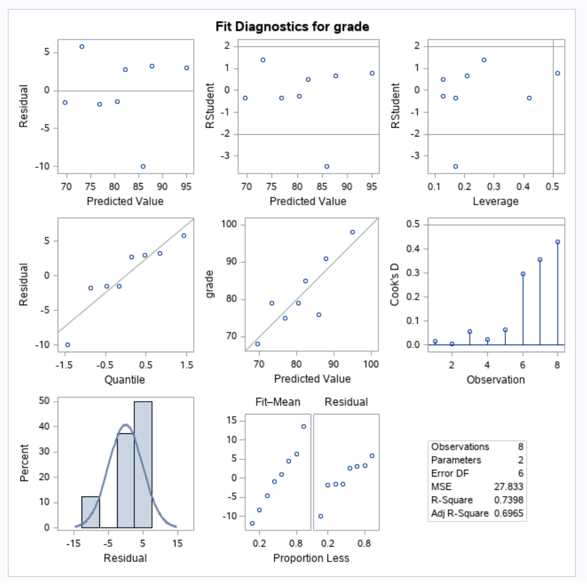
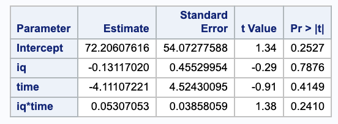
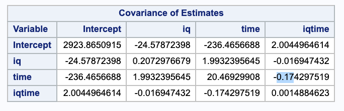
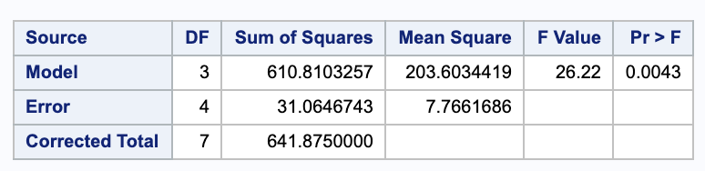
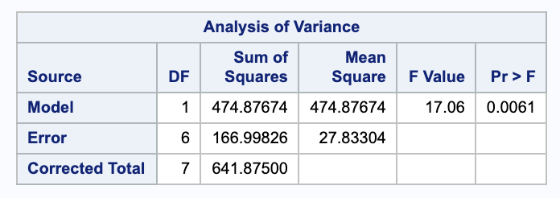
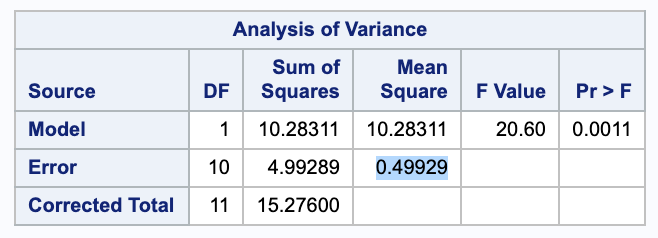
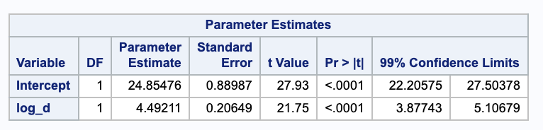
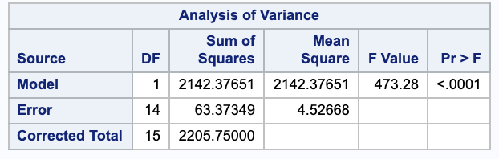
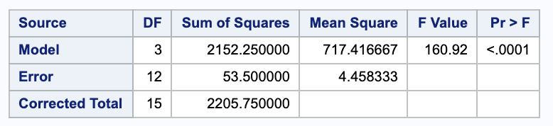
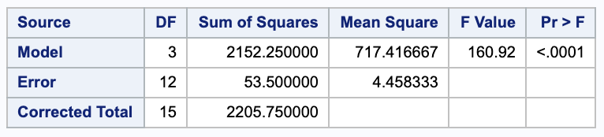

Problems: 1, 2, 3, 4, 5, 6

* Do not remove this line (it will not be displayed)
{:toc}

# 1
**Consider the dataset from class where grade (%) is modeled as a function of both IQ and
study time (hours). Fit the non-additive multiple linear regression model with explanatory
variables IQ, Time, and time*IQ.**

Since we will be building a regression model, we will need to check our regression assumptions.

Our qqplot doesn't look too abnormal, the residuals don't show any strong pattern, and we will assume that the data was collected independently.  Thus, our regression assumptions hold.

## (a)
**Estimate the (partial) slope for Time when IQ=100 and also when IQ=101.**

We can rearrange the terms in our model to get the partial slope of time (at a specific value of IQ) and then plug in our values.

$$
	\begin{align}
		Y & = \beta_0 + \beta_1 \cdot IQ + \beta_2 \cdot time + \beta_3 \cdot time \cdot IQ \\
			& = \beta_0 + \beta_1 \cdot IQ + (\beta_2 + \beta_3 \cdot IQ) \cdot time
	\end{align}
$$

Thus, our partial slope for time is $(\beta_2 + \beta_3 \cdot IQ)$, this can be double checked by taking the partial derivative with respect to time.

We can get our parameter estimates for our betas from SAS.

Thus, we get

$$
	\begin{align}
		\hat{\beta_2} + \hat{\beta_3} \cdot 100 & = 0.05 \cdot 100 - 4.11 \\
			& = 0.89 \\
		\hat{\beta_2} + \hat{\beta_3} \cdot 101 & = 0.05 \cdot 101 - 4.11 \\
			& = 0.94.
	\end{align}
$$

## (b)
**Report standard errors for the two slopes estimated in (a).**

First we need to derive the variance.

$$
	\begin{align}
		Var(\hat{\beta_2} + \hat{\beta_3} \cdot IQ) & = Var(\hat{\beta_1}) + IQ^2 \cdot Var(\hat{\beta_2}) + 2 IQ \cdot Cov(\hat{\beta_1}, \hat{\beta_2})
	\end{align}
$$

We can use the covariance matrix from SAS to get estimates of these variances.

We can plug in our estimates and take the square root of this to get the standard error.

$$
	\begin{align}
		SE & = \sqrt{Var(\hat{\beta_2} + \hat{\beta_3} \cdot IQ)} \\
			& = \sqrt{20.46929908+ IQ^2 \cdot 0.0014884623 + 2 IQ \cdot (-0.174297519)} \\ \\
		SE(@ IQ = 100) & = \sqrt{20.46929908+ 100^2 \cdot 0.0014884623 + 2 \cdot 100 \cdot (-0.174297519)}\\
			& = 0.703149 \\ \\
		SE(@ IQ = 101) & = \sqrt{20.46929908+ 101^2 \cdot 0.0014884623 + 2 \cdot 101 \cdot (-0.174297519)}\\
			& = 0.667086
	\end{align}
$$

## (c) 
**Estimate the difference in slopes for Time as IQ is contrasted from IQ=100 to IQ=110.**

As in part (a), we can calculate the partial slope at an IQ of 110.

$$
	\begin{align}
		\hat{\beta_2} + \hat{\beta_3} \cdot 100 & = 0.05 \cdot 110 - 4.11 \\
			& = 1.39 \\
	\end{align}
$$

So the difference is $1.39 - 0.89 = 0.5$.

## (d)
**Report a standard error for the difference estimated in (c).**

We will again start by deriving the variance and then calculating the standard error, using the variance estimates from (b) as needed.

$$
	\begin{align}
		Var\Big((\hat{\beta_2} + \hat{\beta_3} \cdot 110) - (\hat{\beta_2} + \hat{\beta_3} \cdot 100\Big) & = Var\Big(\hat{\beta_2} + \hat{\beta_3} \cdot 110 - \hat{\beta_2} - \hat{\beta_3} \cdot 100\Big) \\
			& = Var((110 - 100) \cdot \hat{\beta_3}) \\
			& = (110 - 100)^2 \cdot Var(\hat{\beta_3}) \\
		SE & = \sqrt{10^2 \cdot 0.0014884623} \\
			& = 0.385860
	\end{align}
$$

## (e)
**Consider a comparison of this full model with the simple linear regression on Time alone. Formally compare these models at level $\alpha = 0.05$. Include a statement of full and reduced models, a null hypothesis, an F-ratio, and a p-value.**

Our full model is as specified in part one and our reduced model is 

$$
Y_{red} = \beta_0 + \beta_2 \cdot time.
$$

Our hypotheses for testing these nested models are

$$
	\begin{align}
		H_0: & \beta_1 = \beta_3 = 0 \\
		H_A: & \text{ Not } H_0.
 	\end{align}
$$

We can test these with a nested F test. We will need the ANOVA table for both models. Here they are from SAS in the order full then reduced.

Thus,

$$
	\begin{align}
		F & = \frac{ (SSE_{red} - SSE_{full}) / (p-q) }{ MSE_{full} } \\
			& = \frac{ (166.00826 - 31.064743) / (3-1) }{ 7.7661686 } \\
			& = 8.75165.
	\end{align}
$$

Comparing this to an $F_{df error full}^{p-q}  = F^2_{4}$ distribution gives a p-value of 0.03460268. 

Using an $\alpha$ of 0.05, we have evidence to suggest that we should reject the null in favor of the alternative that we need the full model.

# 2
**When the quadratic model**

$$
Y= \beta_0+\beta_1 x_1 + \beta_2 x_2 + \beta_3 x_1 x_2 + \beta_4 x_1^2 + \beta_5 x_2^2 + E
$$

**is fitted to the hospital stress data in Exercise 11.12, a residual sum of squares $SS[E]=339,971.7162$ is obtained.**

## (a)
**Given that the total sum of squares does not depend on the assumed model, calculate the regression sum of squares for the quadratic model.**

Since $SSTotal = SSReg + SSE$,

$$
	\begin{align}
		SSR & = SST - SSE \\
			& = 608995.04 - 339971.7162 \\
			& = 269023.
	\end{align}
$$

## (b)
**Set up the ANOVA table showing the degrees of freedom, the sum of squares, and the mean squares associated with the quadratic model.**

Using the sum of squares from (a), we can fill out the whole ANOVA table.

$$
	\begin{array}{c c c c c c}
		\text{Source}  & \text{d.f.} & \text{Sum of Squares} & \text{Mean Square} & \text{F-ratio} & p \text{-value}\\ \hline
		\text{Regression} & 5 & 269023 & 53804.6 & 3.00699 & 0.03642241
		\\
		\text{Error} & 19 & 339971.7162 & 17893.2 & & \\
		\text{Corrected Total} & 24 & 608995.04 & & & \\ \hline
	\end{array}
$$

Notice that our F statistics was compared to a $F_{19}^5$ distribution to obtain our p-value.

## (c)
**Test the null hypothesis $H_0:\beta_1 = \beta_2 = \beta_3 = \beta_4 = \beta_5 = 0$ and write your conclusions.**

Notice that our alternative hypothesis would say that at least one of the predictors is useful.

With $\alpha = 0.05$, since the p-value in our ANOVA table is less than $0.05$, we have evidence to reject the null in favor of the alternative that at least one of the predictors is useful.

## (d)
**Calculate the extra regression sum of squares $R(\beta_3,\beta_4,\beta_5|\beta_0,\beta_1,\beta_2)$ and interpret this number.**

$$
	\begin{align}
		R(\beta_3, \beta_4, \beta_5 | \beta_0, \beta_1, \beta_2) & = SSE_{red} - SSE_{full} \\
			& = 427625.96612 - 339971.7162 \\
			& = 87654.20
	\end{align}
$$

This is the additional variablity explained by adding the terms from the full model ($x_1 \cdot x_2, x_1 ^2, x_2^2$) to the reduced model (cotaining only $x_1, x_2$).

## (e)
**Test the null hypothesis $H_0:\beta_3=\beta_4=\beta_5=0$ and write your conclusions.**

Notice that our alternative hypothesis would be "not $H_0$". We can again do an F test.

$$
	\begin{align}
		F & = \frac{ (87654.20) / (6 - 3) }{ 178930.20 } \\
			& = 1.63292
	\end{align}
$$

Comparing this against an $F_{19}^{3}$ distribution gives a p-value of 0.2151245. Thus, we do not have sufficient evidence to reject the null in favor of the alternative that $\beta_3=\beta_4=\beta_5=0$.

## (f) 
**Calculate the extra regression sum of squares $R(\beta_4,\beta_5|\beta_0,\beta_1,\beta_2,\beta_3)$ and interpret this number.**

$$
	\begin{align}
		R(\beta_4, \beta_5 | \beta_0, \beta_1, \beta_2, \beta_2) & = SSE_{red} - SSE_{full} \\
			& = 347831.10194 - 339971.7162 \\
			& = 7859.39
	\end{align}
$$

This is the additional variablity explained by adding the terms from the full model ($x_1 ^2, x_2^2$) to the reduced model (cotaining only $x_1, x_2, x_1 \cdot x_2$).

## (g) 
**Test the null hypothesis $H_0:\beta_4=\beta_5=0$ and write your conclusions.**

Notice that our alternative hypothesis would be "not $H_0$". We can again do an F test.

$$
	\begin{align}
		F & = \frac{ (7859.39) / (6 - 4) }{ 178930.20 } \\
			& = 0.219619
	\end{align}
$$

Comparing this against an $F_{19}^{2}$ distribution gives a p-value of 0.8048343. Thus, we do not have sufficient evidence to reject the null in favor of the alternative that $\beta_4=\beta_5=0$.

# 3
**In an observational study to assess the effects of menopause on cholesterol levels, a researcher measured the cholesterol levels of women in seven menopausal groups. The sample means, standard deviations, and the numbers of women in each group are as follows:**

**Note that the women were not randomly assigned to groups; they were served without experimental manipulation. Accordingly, this is an observational study. The objectives and hypotheses of interest, however , were similar to those of an experimental study with a one-way completely randomized design. For example, the investigator wanted to know whether the average of the means of the first six groups was equal to the mean of the last group; methods of testing such contrasts will be presented in Chapter 9. Using the summary statistics in the table, perform an ANOVA test to see if there are any differences between the mean cholesterol levels of the seven groups.**

$$
	\begin{align}
		df_{reg} & = t - 1\\
			& = 6\\
		df_{error} & = n_1 + n_2 + n_3 + n_4 + n_5 + n_6 + n_7 - 7 \\
			& = 11 + 9 +23 +3 +13 +23 + 21 - 7 \\
			& = 96 \\ \\
		SSTreatment & = \sum_{i=1}^{t} \sum_{j = 1}^{n_i}(\bar{y_{i+}} - \bar{y_{++}})^2 \\
			& = \sum_{i=1}^{t} n_i \cdot (\bar{y_{i+}} - \bar{y_{++}})^2 \\
		\bar{y_{++}} & = 1/103 (225 \cdot 11 + 9 \cdot 211 + 195 \cdot 23 + 248 \cdot 3 + 232 \cdot 13 + 210 \cdot 23 + 162 \cdot 21) \\
			& = 202.4369 \\
		SSTreatment & = 21 (162-202.437)^2+23 (195-202.437)^2+23 (210-202.437)^2+9 (211-202.437)^2+11 (225-202.437)^2+13 (232-202.437)^2+3 (248-202.437)^2 \\
			& = 60775.34 \\ \\
		SSE & = \sum_{i=1}^{t} \sum_{j = 1}^{n_i} ( y_{ij} - \bar{y_{i+}})^2 \\
			& = \sum_{i=1}^{t} s_i ^2 (n_i - 1)\\
			& = 133^2 (3-1)+19^2 (9-1)+45^2 (11-1)+30^2 (13-1)+24^2 (21-1)+31^2 (23-1)+53^2 (23-1) \\
			& = 163776
	\end{align}
$$

$$
	\begin{array}{c c c c c c}
		\text{Source}  & \text{d.f.} & \text{Sum of Squares} & \text{Mean Square} & \text{F-ratio} & p \text{-value}\\ \hline
		\text{Treatment} & 6 & 60775.34 & 10129.22 & 5.93741 & 0.00003
		\\
		\text{Error} & 96 & 163776 & 1706 & & \\
		\text{Corrected Total} & 102 & 22455.34 & & & \\ \hline
	\end{array}
$$

Notice that the F value was compared to a $F_{96}^6$ distribution to get the p-value.

Using $\alpha = 0.05$, since our p-value is less than $0.05$, we have evidence to reject the null in favor of the alternative that not all of the treatment means are the same.

# 4
**Refer to the insulin release data in Exercise 8.3.**

## (a)
**Construct a 95% confidence interval for the expected insulin release at each of the three glucose concentrations. Interpret the confidence intervals you construct.**

The general form for our confidence interval for a group $i$ will be $\bar{y_i} \pm t_{n-t, \alpha / 2} \cdot SE(\bar{y_i})$. In this case, we will use $t_{12-3, 0.05 / 2} = 2.26157$. Also, our standard error will be $SE(\bar{y_i}) = \sqrt{\sigma^2 \cdot c_i ^2/ n_i} = \sqrt{MSE \cdot 1^2 / 4}$, where MSE is given from a `proc reg` in SAS and $n_i = 4$ since all groups have the same size of 4.

Low:

$$
	2.2325 \pm 2.26157 \cdot \sqrt{0.553 / 4} = (1.39, 3.073)
$$

We are 95% confident that the true mean insulin release given a low concentration of glucose is between 1.39 and 3.073 units.

Medium:

$$
	3.4375 \pm 2.26157 \cdot \sqrt{0.553 / 4} = (2.5966, 4.2784)
$$

We are 95% confident that the true mean insulin release given a low medium of glucose is between 2.5966 and 4.2784 units.

High:

$$
	4.5 \pm 2.26157 \cdot \sqrt{0.553 / 4} = (3.6591, 5.3409)
$$

We are 95% confident that the true mean insulin release given a low medium of glucose is between 3.6591 and 5.3409 units.

## (b)
**Perform a hypothesis test to see if the data support the claim that the mean insulin release at high glucose concentration is at least one unit more than that at medium glucose concentration.**

First we will set up our hypotheses.

$$
	\begin{align}
		H_0: & \mu_{high} - \mu_{medium} \leq 1 \\
		H_A: & \mu_{high} - \mu_{medium} > 1
	\end{align}
$$

We will use a general test statistic $t = \frac{ \hat{\theta} - \theta_0 }{ SE(\hat{\theta}) }$ where $\theta_0 = 1$, $\hat{\theta} = \bar{y_{high}} - \bar{y_{medium}} = 4.5 - 3.4375 = 1.0625$, and $SE(\hat{\theta} = \sqrt{MSE \cdot (1/n_{high} - 1/n_{medium})}$. This gives 

$$
t = \frac{1.0625\, -1}{\sqrt{0.553 \left(\frac{1}{4}+\frac{1}{4}\right)}}
$$

Testing this against a $t_{n-2} = t_{9}$ distribution gives a p-value of 0.454. Using $\alpha = 0.05$, we do not have sufficient evidence to reject the null in favor of the alternative that the mean insulin release at high glucose concentration is at least one unit more than that at medium glucose concentration.

## (c)
**Perform the hypothesis test in (b) using the confidence interval approach. Interpret the interval you construct.**

Here we will test a confidence lower bound since we want to check that the difference in means is at least 1.

$$
	\begin{align}
		\hat{\theta} - t_{n-t, \alpha} \cdot SE(\hat{\theta}) & = (\bar{y}_{high} - \bar{y}_{medium}) - t_{9, 0.05} \cdot \sqrt{MSE \cdot (1/n_{high} - 1/n_{medium})} \\
			& = 1.065 - 1.83 \cdot \sqrt{0.553 \left(\frac{1}{4}+\frac{1}{4}\right)} \\
			& = 0.100226
	\end{align}
$$

Since this lower bound is less than 1, we do not have sufficient evidence to reject the null in favor of the alternative.

## (d)
**Let $\mu_1$, $\mu_2$, and $\mu_3$ denote, respectively, the expected amount of insulin release at low, medium, and high glucose concentrations. Construct two contrasts such that one measure the difference between the expected releases at low and medium concentrations, while the other measure the difference between the expected release at high concentration and the average of the expected releases at low and medium concentrations.**

Contrast 1:

$$
\mu_1 - \mu_2 \Rightarrow [1\ -1\ 0] \Rightarrow 1 + -1 = 0 \checkmark
$$

Contrast 2:

$$
\mu_3 - \frac{ 1 }{ 2 } (\mu_1 + \mu_2) \Rightarrow [-1/2 \ -1/2 \ 1] \Rightarrow -1/2 + -1/2 + 1 = 0 \checkmark
$$

## (e)
**Check whether the contrasts you constructed in (d) are orthogonal.**

$$
\frac{ 1 \cdot -1/2 }{ 4 } + \frac{ -1 \cdot -1/2 }{ 4 } + \frac{ 0 \dot 1 }{ 4 } = \frac{ -1/2 }{ 4 } + \frac{ 1/2 }{ 4 } = 0 \checkmark
$$

The contrasts are orthogonal.

## (f)
**Test the significance of the contrasts in (d). Write the corresponding conclusions.**

We can start by setting up our hypotheses for contrast 1.

$$
	\begin{align}
		H_0: & \mu_1 - \mu_2 = 0\\
		H_A: & \mu_1 - \mu_2 \neq 0 \\
	\end{align}
$$

$$
	\begin{align}
		t & = \frac{ \hat{\theta} - 0}{ SE(\hat{\theta}) } \\
			& = \frac{ 2.2325 - 3.4375 }{ \sqrt{MSE \cdot (1/n_1 + (-1)^2 / n_2 )} } \\
			& = \frac{ 2.2325 - 3.4375 }{ \sqrt{MSE \cdot (1/4 + 1/4 )} } \\
			& = -2.2916
	\end{align}
$$

Comparing this against a $t_{12 - 3}$ distribution gives a p-value of $2 \cdot 0.02382489 = 0.04764977$.

Using $\alpha = 0.05$, we have sufficient to reject the null in favor of the alternative that the mean insulin release at low and medium concentrations differ.

Our hypotheses for contrast 2 are:

$$
	\begin{align}
		H_0: & \mu_3 - \frac{ 1 }{ 2 } (\mu_1 + \mu_2) = 0\\
		H_A: & \mu_3 - \frac{ 1 }{ 2 } (\mu_1 + \mu_2) \neq 0
	\end{align}
$$

$$
	\begin{align}
		t & = \frac{ \hat{\theta} - 0}{ SE(\hat{\theta}) } \\
			& = \frac{ 4.5 - 1/2 \cdot (2.2325 + 3.4375) }{ \sqrt{MSE \cdot (1/n_3 + (1/2)^2 / n_1 + (1/2)^2 / n_2 )} } \\
			& = 3.65625
	\end{align}
$$

Comparing this against a $t_{12 - 3}$ distribution gives a p-value of $2 \cdot 0.002633058 = 0.005266116$.

Using $\alpha = 0.05$, we have sufficient to reject the null in favor of the alternative that the mean insulin release at high concentrations differs from the average insulin release at medium and low concentrations.

## (g)
**Do the sum of squares for the contrasts in (d) subdivide the treatment sum of squares into single degree of freedom sum of squares? Explain.**

Yes. Since we constructed $t-1$ orthogonal contrasts, we can say that their sum of squares will sum to the treatment sum of squares.

We can also test this. Note that the sum of square for a single contrast is $SS(\theta) = \frac{ \hat{\theta}^2 }{ Var(\hat{\theta})/\sigma^2 }$.

$$
\frac{(2.2325\, -3.437)^2}{\frac{1}{4}+\frac{1}{4}}+\frac{\left(4.5\, -\frac{1}{2} (2.2325\, +3.4375)\right)^2}{\frac{1}{4} \left(-\frac{1}{2}\right)^2+\frac{1}{4} \left(-\frac{1}{2}\right)^2+\frac{1}{4}} = 10.2942
$$

# 5
**Refer to the chemical influx data given in Example 10.3**

## (a)
**Using a simple linear regression model for Y=chemical influx as a function of $X=\log d$, construct a 95% confidence interval for the expected chemical influx when the drug dose is 100nM. Interpret the interval.**

Since we will be building a regression model, we will need to check our regression assumptions.

Our qqplot looks normal, the residuals don't show any strong pattern, and we will assume that the data was collected independently.  Thus, our regression assumptions hold.

We are getting a confidence interval for the expected value of $Y$ at $X = \log(100)$. We will need some parameter estimates from SAS and the MSE to estimate the standard deviation.

$$
	\begin{align}
		s_{xx} & = \sum x^2 - \frac{ \bar{x}^2 }{ n } \\
			& = 291.161 - \frac{ 55.28^2 }{ 16 } \\
			& = 106.1684 \\ \\
		\hat{Y}_0 \pm t_{n-2, \alpha / 2} \cdot SE(\hat{Y}_0) & = (\hat{\beta_0} + \hat{\beta_1} \cdot \log(100)) \pm t_{16 -2, 0.05 /2} \cdot s \sqrt{\frac{ 1 }{ n } + \frac{ (x_0 - \bar{x})^2 }{  s_{xx} }} \\
			& = (24.8548+4.49211 \log (100)) \pm 2.14479 \sqrt{4.4583 \left(\frac{1}{16}+\frac{(\log (100)-3.455)^2}{106.168}\right)} \\
			& = (33.3018, 46.7816)
	\end{align}
$$

We are 95% confident the true mean influx is between 44.3018 and 46.7816 with a dose of 100 nM.

## (b)
**Use the data to verify the claim that quadrupling the drug dose ($d_2/d_1=4$) will result in an increase in chemical influx of more than 5 nmol/mg protein. Answer this question using both hypothesis testing and confidence-interval approaches.**

Notice that

$$
	\begin{align}
		\theta & = (\hat{\beta_0} + \hat{\beta}_1 \cdot \log(4d)) - (\hat{\beta_0} + \hat{\beta}_1 \cdot \log(d))\\
			& = \hat{\beta}_1 (\log(4d) - \log(d))\\
			& = \hat{\beta}_1 (\log(4d / d )) \\
			& = \hat{\beta}_1  \cdot \log(4)
	\end{align}
$$

We will first conduct a hypothesis test with the following hypotheses.

$$
	\begin{align}
		H_0: & \theta \leq 5\\
		H_A: & \theta > 5
	\end{align}
$$

$$
	\begin{align}
		t_{\hat{\theta}} & = \frac{ \hat{\beta}_1 \cdot \log(4) - 5 }{ \sqrt{MSE (0 + 0 + (\log(4))^2 \cdot 1/s_{xx} )} } \\
			& = \frac{4.49211 \log (4)-5}{\sqrt{\frac{4.49211 \log ^2(4)}{106.293}}} \\
			& = 4.30678
	\end{align}
$$

Testing this against a $t_{16-2, 0.05}$ distribution gives a p value of 0.0003619932.

Using $\alpha = 0.05$, we have sufficient evidence to reject the null in favor of the alternative that quadrupling the dosage will result in a chemical influx increase of more that 5 nmol/mg.

We can also test this with a confidence lower bound.

$$
	\begin{align}
		\hat{\beta}_1 \cdot log(4) - t_{16 - 2, 0.05} \cdot \sqrt{MSE \cdot \log(4)^2 \cdot 1/s_{xx}} \\
			& = 4.49211 \log (4)-1.76131 \sqrt{\frac{4.49211 \log ^2(4)}{106.293}} \\
			& =5.72543
	\end{align}
$$

Since our lower bound is greater than 5, we can reject the null in favor of the alternative.

## (c)
**Use a one-way ANOVA model (see Exercise 10.1) to construct the 95% confidence interval for the expected chemical influx when the drug dose is 100nM. Compare this interval with the interval obtained in (a).**

Using a one-way ANOVA model, we get

$$
	\begin{align}
		CI & = \bar{y}_{100} \pm t_{16-4, 0.05/2} \cdot \sqrt{MSE \cdot 1/n_{100}} \\
			& = 46 \pm 2.178813 \cdot \sqrt{4.52668 / 4} \\
			& = (43.6822, 48.3178)
	\end{align}
$$

We are 95% confident that the true expected chemical influx when the drug dose is 100nM is between 43.6822 and 48.3178.

This interval is wider than the interval from (a).

## (e)
**Use the simple linear regression model to construct a 99% lower bound to the mean chemical influx for the population of all rats receiving a drug dose 10nM. Interpret this result.**

We can do this similar to part (a).

$$
	\begin{align}
		\hat{Y}_0 \pm t_{n-2, \alpha / 2} \cdot SE(\hat{Y}_0) & = (\hat{\beta_0} + \hat{\beta_1} \cdot \log(10)) - t_{16 -2, 0.01} \cdot s \sqrt{\frac{ 1 }{ n } + \frac{ (x_0 - \bar{x})^2 }{  s_{xx} }} \\
			& = (24.8548+4.49211 \log (10)) - 2.62449 \sqrt{4.4583} \sqrt{\frac{1}{16}+\frac{(\log (10)-3.455)^2}{106.168}} \\
			& = 33.6805
	\end{align}
$$

We are 99% confident that the true expected chemical influx for the population of all rats receiving a drug dose of 10nM is at least 33.6805.

## (f)
**On the basis of a simple linear regression model, perform a statistical test to see if the data suggest that drug does and chemical influx are associated.**

Our hypotheses are

$$
	\begin{align}
		H_0: & \beta_1 = 0 \\
		H_A: & \beta_1 \neq 0.
	\end{align}
$$

Our test statistic is

$$
	\begin{align}
		t & = \frac{ \hat{\beta}_1 - 0 }{ SE(\hat{\beta}_1) }\\
			& = \frac{ \hat{\beta}_1 }{ \sqrt{ s^2 / s_{xx}}} \\
			& = \frac{ \hat{\beta}_1 }{ \sqrt{ MSE / s_{xx}}} \\
			& = \frac{4.49211}{\sqrt{\frac{4.4583}{106.168}}} \\
			& = 21.9212.
	\end{align}
$$

Comparing this to a $t_{16 - 2} distribution gives a p-value less than 0.00001.

Using $\alpha = 0.05$, we have evidence to reject the null in favor of the alternative that the drug dose (more specifically the log of drug dose) and chemical influx are associated.

## (g)
**Do the data support the claim that, on average, rats receiving a dose $d=1$ will have a chemical influx of less than 25nM?**

Notice that when $d=1$ then $log(d)  = 0$. Thus, the $\beta_1$ term in our regression model goes away. So our hypotheses are

$$
	\begin{align}
		H_0: & \beta_0 \geq 25 \\
		H_A: & \beta_0 < 25.
	\end{align}
$$

Our test statistic is

$$
	\begin{align}
		t & = \frac{ \hat{\beta}_0 - 25 }{ SE(\hat{\beta}_0 ) } \\
			& = \frac{ \hat{\beta}_0 - 25 }{ \sqrt{MSE \cdot (1/n + \frac{ \bar{x}^2 }{ s_{xx} })} } \\
			& = \frac{24.8548\, -25}{\sqrt{4.4583 \left(\frac{1}{16}+\frac{55.262^2}{106.168}\right)}} \\
			& = -0.0128115
	\end{align}
$$

Testing against a $t_{16 - 2}$ distribution gives a p-value of 0.5050205.

Thus, we do not have sufficient evidence to reject the null in favor of the alternative.

# 6
**Refer to the chemical influx data in Example 10.3.**

## (a)
**Set up the ANOVA tables for simple linear regression analysis:**

We will use SAS to get these ANOVA tables, but they could be calculated as follows.

$$
	\begin{array}{c c c c c c}
		\text{Source}  & \text{d.f.} & \text{Sum of Squares} & \text{Mean Square} & \text{F-ratio} & p \text{-value}\\ \hline
		\text{Regression} & t - 1 & \sum_{i=1}^{t} \sum_{j=1}^{n_i} (\bar{y}_{i+} - \bar{y}_{++})^2 & SSR / df_R & MSR/MSE & test\ vs\ F^{df_{reg}}_{df_{error}}\\
		\text{Error} & \sum_{i=1}^{t} (n_i) - t & \sum_{i=1}^{t} \sum_{j=1}^{n_i} (y_{ij} - \bar{y}_{i+})^2 & SSE / df_E & & \\
		\text{Corrected Total} & \sum_{i=1}^{t} (n_i) - 1 & \sum_{i=1}^{t} \sum_{j=1}^{n_i} (\bar{y}_{i+} - \bar{y}_{++})^2 & & & \\ \hline
	\end{array}
$$

### (i)
**with $Y=$ chemical influx as the dependent variable and $X=d$ as the independent variable;**

### (ii) 
**with $Y=$ chemical influx as the dependent variable and $X= \log d$ as the independent variable;**

## (b)
**Calculate the coefficients of determination for the two models. Which fits the data better? Why?**

Dose:

$$
R^2 = 1-\frac{ SSE }{ SSTotal } = 1 - \frac{ 857.01980 }{ 2205.75 } = 0.611461
$$

Log Dose:

Dose:

$$
R^2 = 1-\frac{ SSE }{ SSTotal } = 1 - \frac{ 63.37349 }{ 2205.75 } = 0.971269
$$

These match the calculations given by SAS.

## (c)
**Use residual plots to see if the ANOVA assumptions appear reasonable for these data.**

We can again look at the plots from 5 (a). The qqplot looks normal, the residuals do not show a strong pattern, and we can assume the data were collected independently. Thus, the ANOVA assumptions hold.

