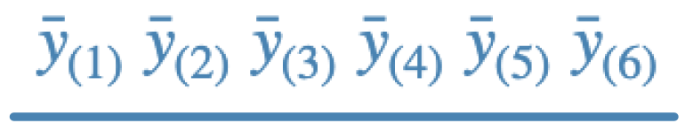
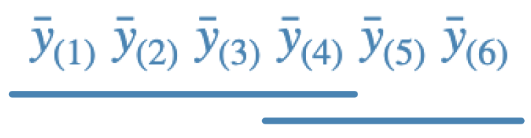
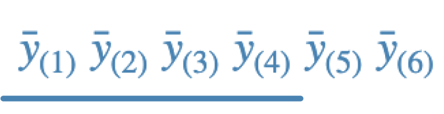
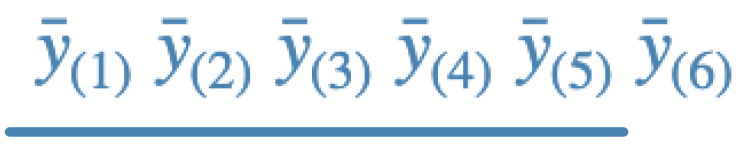

Problems: 1, 2, 3, 4

* Do not remove this line (it will not be displayed)
{:toc}

# 1
**Refer to the data in Exercise 8.17 on page 295 of Rao, where cholesterol levels of women in seven menopausal groups are to be compared. Conduct all ${7 \choose  2} $ pairwise comparisons of group means using the methods specified below. Compare and contrast your conclusions.**

## (a)
**Bonferroni to control familywise error rate to be at most 0.05.**

## (b)
**Scheffe to control familywise error rate to be at most 0.05.**

## (c)
**Tukey(-Kramer) to control familywise error rate to be at most 0.05.**

## (d)
**Benjamini-Hochberg to control false discovery rate to be at most 0.05.**

# 2
**The conclusions obtained on applying Fisher, Scheffe, Duncan, and Tukey multiple pairwise comparison procedures to the same set of six sample means may be summarized as follows,**

a.

b.

c.

d.

**Identify, giving reasons, the procedure that was responsible for the conclusion in each case. (Note: We have not discussed Duncan's adjustment procedure, but it is enough to know that Duncan tends to have fewer rejections than the Fisher procedure, and more rejections than the Tukey procedure.)**

# 3
**Consider the experiment described as Rao Example 8.2 (p. 280-281). Let the five treatment
means be denoted $\mu_1,\ \mu_2,\ \mu_3,\ \mu_4,\ \mu_5$ Consider these four contrasts:**

$$
	\begin{align}
		\theta_1 & = \mu_2 + \mu_3 - \mu_4 - \mu_5\\
		\theta_2 & = \mu_2 - \mu_3 + \mu_4 - \mu_5\\
		\theta_3 & = \mu_2 - \mu_3 - \mu_4 + \mu_5\\
		\theta_4 & = \mu_1 + \frac{ 1 }{ 4 }(\mu_2 + \mu_3 + \mu_4 + \mu_5)\\
	\end{align}
$$

## (a)
**Is this ~set~ of contrasts mutually orthogonal?**

## (b)
**Compute the sum of squares associated with each contrast.**

## (c)
**Compute the SUM of the four sums of squares computed in part (b).**

## (d)
**Compute the treatment sum of square in the ANOVA.**

## (e)
**Briefly describe the "effect" of being estimated by each contrast, using language of the experiment.**

## (f)
**Use SAS to conduct all ${5 \choose 2}$ pairwise comparisons of group means using the methods specified below. Also obtain 95% confidence intervals along with each hypothesis test. Compare and contrast your conclusions.**

### i.
**Bonferroni to control familywise error rate to be at most 0.05.**

### ii.
**Scheffe to control familywise error rate to be at most 0.05.**

### iii.
**Tukey(-Kramer) to control familywise error rate to be at most 0.05.**

### iv.
**Benjamini-Hochberg to control false discovery rate to be at most 0.05. But don't attempt to find confidence intervals.**
# 4
**García-Arenzana et al. (2014) tested associations of 25 dietary variables with mammographic density, an important risk factor for breast cancer, in Spanish women. They found the following results:**

$$
\begin{array}{r l}
	\text{Dietary value} & p-\text{value}\\ \hline
	\text{Total calories <} & 0.001 \\ 
	\text{Olive oil} & 0.008 \\ 
	\text{Whole milk} & 0.039 \\ 
	\text{White meat} & 0.041 \\ 
	\text{Proteins} & 0.042 \\ 
	\text{Nuts} & 0.06 \\ 
	\text{Cereals and pasta} & 0.074 \\ 
	\text{White fish} & 0.205 \\ 
	\text{Butter} & 0.212 \\ 
	\text{Vegetables} & 0.216 \\ 
	\text{Skimmed milk} & 0.222 \\ 
	\text{Red meat} & 0.251 \\ 
	\text{Fruit} & 0.269 \\ 
	\text{Eggs} & 0.275 \\ 
	\text{Blue fish} & 0.34 \\ 
	\text{Legumes} & 0.341 \\ 
	\text{Carbohydrates} & 0.384 \\ 
	\text{Potatoes} & 0.569 \\ 
	\text{Bread} & 0.594 \\ 
	\text{Fats} & 0.696 \\ 
	\text{Sweets} & 0.762 \\ 
	\text{Dairy products} & 0.94 \\ 
	\text{Semi-skimmed milk} & 0.942 \\ 
	\text{Total meat} & 0.975 \\ 
	\text{Processed meat} & 0.986
\end{array}
$$

## (a)
**By hand, apply the Benjamini-Hochberg Step-Up procedure to control the false discovery rate to be at most $\alpha = 0.25$ using the sorted raw p-values: reject each null hypothesis having $p_j \leq T_{BH}$, where**

$$
	\begin{align}
		T_{BH} & = \max \Big\{ p_{(j)} : p_{(j)} \leq \alpha_{j/k}, 1 \leq j \leq k \Big\} & p_{(1)} \leq \dots \leq p_{(k)}
	\end{align}
$$

## (b)
**By hand, apply the Benjamini-Hochberg Step-Up procedure to control the false discovery rate to be at most $\alpha = 0.25$ using the sorted raw p-values: reject each null hypothesis having $p_j^{adj} \leq \alpha$, where**

$$
	\begin{align}
		p_{(k)}^{adj} = p_{(k)}, & & p_{(k)}^{adj} = \min \Big\{ p_{(j+1)}^{adj}, \frac{ k }{ j }p_{(k)}^{adj} \Big\} & & j = k-1, \dots , 1
	\end{align}
$$
