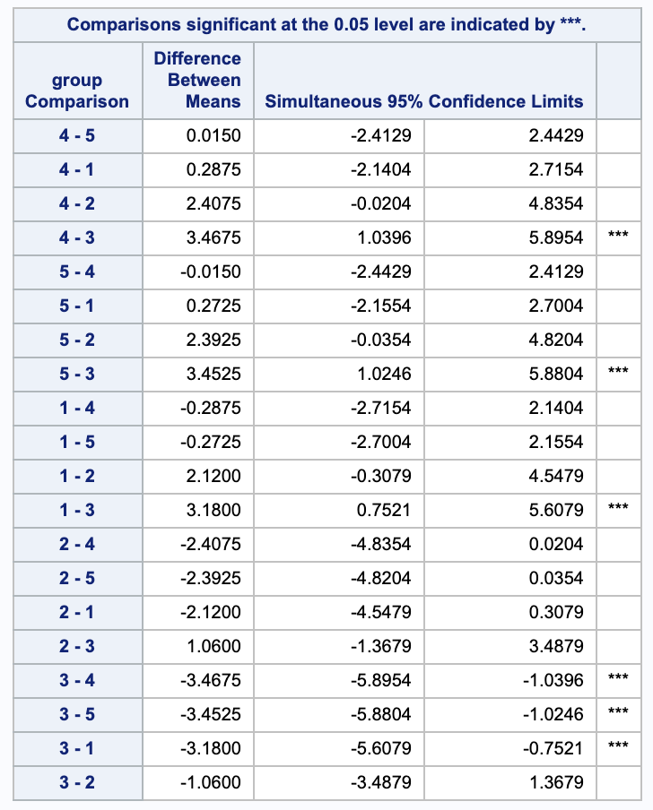
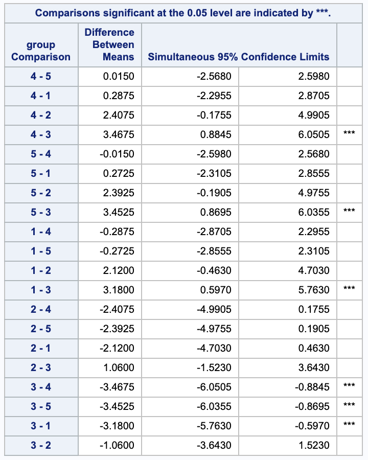
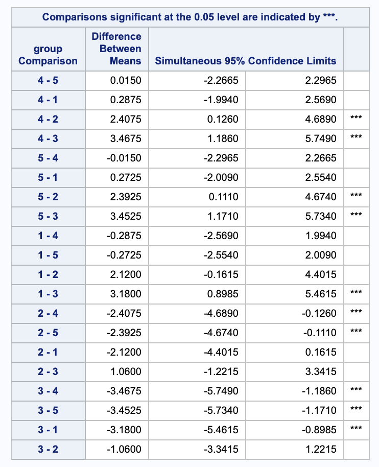
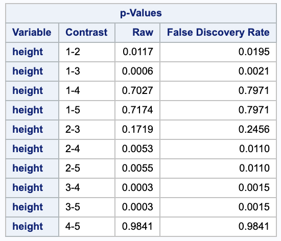

Problems: 1, 2, 3, 4


* Do not remove this line (it will not be displayed)
{:toc}


# 1
**Refer to the data in Exercise 8.17 on page 295 of Rao, where cholesterol levels of women in seven menopausal groups are to be compared. Conduct all ${7 \choose  2} $ pairwise comparisons of group means using the methods specified below. Compare and contrast your conclusions.**


Notice that for these problems, the T value was calculated as 

$$
t = \Big| \frac{ \bar{y_i} - \bar{y_j} }{ \sqrt{MSE \cdot (1/n_i + 1/n_2)} } \Big|.
$$

Where the MSE is 1706. From this we get the following table.

$$
\begin{array}{c c c c c c c}
	i	&	j	&	\bar{y_i}	&	n_i	&	\bar{y_j}	&	n_j	&	t	\\ \hline
	1	&	2	&	225	&	11	&	211	&	9	&	0.754121151	\\
	1	&	3	&	225	&	11	&	195	&	23	&	1.98131051	\\
	1	&	4	&	225	&	11	&	248	&	3	&	0.854931413	\\
	1	&	5	&	225	&	11	&	232	&	13	&	0.413686096	\\
	1	&	6	&	225	&	11	&	210	&	23	&	0.990655255	\\
	1	&	7	&	225	&	11	&	162	&	21	&	4.098095142	\\
	2	&	3	&	211	&	9	&	195	&	23	&	0.985236863	\\
	2	&	4	&	211	&	9	&	248	&	3	&	1.343703566	\\
	2	&	5	&	211	&	9	&	232	&	13	&	1.172496005	\\
	2	&	6	&	211	&	9	&	210	&	23	&	0.061577304	\\
	2	&	7	&	211	&	9	&	162	&	21	&	2.977671892	\\
	3	&	4	&	195	&	23	&	248	&	3	&	2.090375119	\\
	3	&	5	&	195	&	23	&	232	&	13	&	2.58164519	\\
	3	&	6	&	195	&	23	&	210	&	23	&	1.231546079	\\
	3	&	7	&	195	&	23	&	162	&	21	&	2.647107958	\\
	4	&	5	&	248	&	3	&	232	&	13	&	0.604787465	\\
	4	&	6	&	248	&	3	&	210	&	23	&	1.49875952	\\
	4	&	7	&	248	&	3	&	162	&	21	&	3.373444672	\\
	5	&	6	&	232	&	13	&	210	&	23	&	1.535032275	\\
	5	&	7	&	232	&	13	&	162	&	21	&	4.802312215	\\
	6	&	7	&	210	&	23	&	162	&	21	&	3.850338847
\end{array}
$$

For the following problems, the table will be sorted by t-value.

## (a)
**Bonferroni to control familywise error rate to be at most 0.05.**

We want to compare our t-values to the following value for the Bonferroni adjustment.


$$
t_{0.05 / (2 * k). n-k} =  t_{0.05 / (21 *2), 96} = -3.121027
$$

## (b)
**Scheffe to control familywise error rate to be at most 0.05.**

We want to compare our t-values to the following value for the Scheffe adjustment.

$$
\sqrt{(t - 1) F^{t-1}_{dferror, \alpha}} = \sqrt{(7 - 1) F^{7-1}_{96, 0.05}} = 3.628649335
$$

## (c)
**Tukey(-Kramer) to control familywise error rate to be at most 0.05.**

We want to compare our t-values to the following value for the Tukey-Kramer adjustment.

$$
q_{t, dferror, \alpha} \cdot \sqrt{1/2} = q_{7, 96, 0.05} \cdot \sqrt{1/2} = 3.011567781
$$


## (d)
**Benjamini-Hochberg to control false discovery rate to be at most 0.05.**

For the Benjamini-Hochberg procedure, we will change the comparison value each for each pair.

In the following table, an empty cell will denote a failure to reject the null hypothesis that the pair is different and a $\checkmark$ will denote a rejection of the null.


$$
\begin{array}{ c c c c c c c c }
	i	&	j	&	t	&	\text{Benjamini } \alpha	&	\text{BH}	&	\text{Bonferroni}	&	\text{Scheffe}	&	\text{Tukey-Kramer}	\\ \hline
	2	&	6	&	0.061577304	&	0.05	&		&		&		&		\\
	1	&	5	&	0.413686096	&	0.047619048	&		&		&		&		\\
	4	&	5	&	0.604787465	&	0.045238095	&		&		&		&		\\
	1	&	2	&	0.754121151	&	0.042857143	&		&		&		&		\\
	1	&	4	&	0.854931413	&	0.04047619	&		&		&		&		\\
	2	&	3	&	0.985236863	&	0.038095238	&		&		&		&		\\
	1	&	6	&	0.990655255	&	0.035714286	&		&		&		&		\\
	2	&	5	&	1.172496005	&	0.033333333	&		&		&		&		\\
	3	&	6	&	1.231546079	&	0.030952381	&		&		&		&		\\
	2	&	4	&	1.343703566	&	0.028571429	&		&		&		&		\\
	4	&	6	&	1.49875952	&	0.026190476	&		&		&		&		\\
	5	&	6	&	1.535032275	&	0.023809524	&		&		&		&		\\
	1	&	3	&	1.98131051	&	0.021428571	&		&		&		&		\\
	3	&	4	&	2.090375119	&	0.019047619	&		&		&		&		\\
	3	&	5	&	2.58164519	&	0.016666667	&	\checkmark	&		&		&		\\
	3	&	7	&	2.647107958	&	0.014285714	&	\checkmark	&		&		&		\\
	2	&	7	&	2.977671892	&	0.011904762	&	\checkmark	&		&		&		\\
	4	&	7	&	3.373444672	&	0.00952381	&	\checkmark	&	\checkmark	&		&	\checkmark	\\
	6	&	7	&	3.850338847	&	0.007142857	&	\checkmark	&	\checkmark	&	\checkmark	&	\checkmark	\\
	1	&	7	&	4.098095142	&	0.004761905	&	\checkmark	&	\checkmark	&	\checkmark	&	\checkmark	\\
	5	&	7	&	4.802312215	&	0.002380952	&	\checkmark	&	\checkmark	&	\checkmark	&	\checkmark	\\ \hline
	 & & & \textbf{Totals} & 7 & 4 & 3 & 4
\end{array}
$$

You'll notice that the Benjamini-Hochberg procedure has the most rejections with 7, the Bonferroni and Tukey-Kramer both have 4, and the Scheffe has 3 rejections.

# 2
**The conclusions obtained on applying Fisher, Scheffe, Duncan, and Tukey multiple pairwise comparison procedures to the same set of six sample means may be summarized as follows,**

a.


b.


c.


d.


**Identify, giving reasons, the procedure that was responsible for the conclusion in each case. (Note: We have not discussed Duncan's adjustment procedure, but it is enough to know that Duncan tends to have fewer rejections than the Fisher procedure, and more rejections than the Tukey procedure.)**

In order from least conservative to most conservative:

1. c - Fisher; this is usually the least conservative as it does not control FWE at all. The line says that means ordered 1-4 are not different. There are 9 rejections.
2. a - Scheffe; this is the generally most conservative test so the line says that none of the means differ. There are 0 rejections.
3. b - Duncan; this is more conservative than Fisher, but less than Tukey. The lines say that means ordered 1-4 are not different and means ordered 4-6 are not different. There are 8 rejections.
4. d - Tukey; this is generally least conservative than Fisher, more than Duncan, and generally less conservative than Scheffe. The line says that means ordered 1-5 are not different. There are 5 rejections.


# 3
**Consider the experiment described as Rao Example 8.2 (p. 280-281). Let the five treatment
means be denoted $\mu_1,\ \mu_2,\ \mu_3,\ \mu_4,\ \mu_5$ Consider these four contrasts:**

$$
	\begin{align}
		\theta_1 & = \mu_2 + \mu_3 - \mu_4 - \mu_5\\
		\theta_2 & = \mu_2 - \mu_3 + \mu_4 - \mu_5\\
		\theta_3 & = \mu_2 - \mu_3 - \mu_4 + \mu_5\\
		\theta_4 & = \mu_1 + \frac{ 1 }{ 4 }(\mu_2 + \mu_3 + \mu_4 + \mu_5)\\
	\end{align}
$$


## (a)
**Is this _set_ of contrasts mutually orthogonal?**

Yes, this set of contrasts are mutually orthogonal. We can show this by looking at them each pairwise. Since they are the same sample size, we just need to multiply the coefficients on each $mu_i$ together and add those products.

$$
	\begin{align}
		1-2: & 0 \cdot 0 + 1 \cdot 1 + -1 \cdot 1 + -1 \cdot 1 + -1 \cdot -1 \\
			& = 0 + 1 - 1 - 1 + 1 \\
			& = 0 \\
		1-3: & 0 \cdot 0 + 1 \cdot 1 + 1 \cdot- 1 + -1 \cdot -1 + -1 \cdot 1 \\
			& = 0 + 1 - 1 + 1 - 1 \\
			& = 0 \\
		1-4: & 0 \cdot 1 + -1/4 \cdot 1 + -1/4 \cdot 1 + -1/4 \cdot -1 + -1/4 \cdot -1 \\
			& = 0 + -1/4 - 1/4  + 1/4 + 1/4 \\
			& = 0 \\
		2-3: & 0 \cdot 0 + 1 \cdot 1 + -1 \cdot -1 + 1 \cdot -1 + -1 \cdot 1 \\
			& = 0 + 1 + 1 - 1 - 1 \\
			& = 0 \\
		2-4: & 0 \cdot 1 + -1/4 \cdot 1 + -1/4 \cdot -1 + -1/4 \cdot -1 + -1/4 \cdot -1 \\
			& = 0 - 1/4 + 1/4 - 1/4 + 1/4 \\
			& = 0 \\
		3-4: & 0 \cdot 0 + -1/4 \cdot 1 + -1/4 \cdot -1 + -1/4 \cdot -1 + -1/4 \cdot 1 \\
			& = 0 + -1/4 - 1/4 + 1/4 + 1/4\\
			& = 0 \\
	\end{align}
$$

## (b)
**Compute the sum of squares associated with each contrast.**

The general form to compute the sum of squares for a contrast is

$$
SS( \hat{\theta}) = \frac{ c_1 \hat{\mu_1} + c_2 \hat{\mu_2} + c_3 \hat{\mu_3} + c_4 \hat{\mu_4} + c_5 \hat{\mu_5} }{ \frac{ c_1^2 }{ n_1 } + \frac{ c_2^2 }{ n_2 } + \frac{ c_3^2 }{ n_3 } + \frac{ c_4^2 }{ n_4 } + \frac{ c_5^2 }{ n_5 } }
$$

Using that, we get

$$
	\begin{align}
		SS(\hat{\theta_1}) & = 34.3396 \\
		SS(\hat{\theta_2}) & = 1.1664 \\
		SS(\hat{\theta_3}) & = 1.0816 \\
		SS(\hat{\theta_4}) & = 4.49252.
	\end{align}
$$


## (c)
**Compute the SUM of the four sums of squares computed in part (b).**

$$
34.3396 + 1.1664 + 1.0816 + 4.49352 = 41.0811
$$

## (d)
**Compute the treatment sum of square in the ANOVA.**

$$
	\begin{align}
		SSTreat & = \sum_{i=1}^{t} \sum_{j=1}^{n_i} (\bar{y}_{i+} - \bar{y}_{++})^2\\
			& = 4 (30.84\, -33.072)^2+4 (31.9\, -33.072)^2+4 (34.02\, -33.072)^2+4 (34.29\, -33.072)^2+4 (34.31\, -33.072)^2 \\
			& = 41.0811
	\end{align}
$$


## (e)
**Briefly describe the "effect" of being estimated by each contrast, using language of the experiment.**

$\theta_1 = (\mu_2 + \mu_3) - (\mu_4 + \mu_5)$

Is the sum of the means for the source A low intensity and source A high intensity groups different than the sum of the means for the source B low intensity and source B high intensity groups?


$\theta_2 = (\mu_2 + \mu_4) - (\mu_3 + \mu_5)$

Is the sum of the means for the source A low intensity light and source B low intensity light groups different than the sum of the means for source A high intensity and source B high intensity groups?


$\theta_3 = (\mu_2 + \mu_5) - (\mu_3 + \mu_4)$

Is the sum of the means for the source A low intensity light and source B high intensity light different than the sum of the mans for source A high intensity light and source B low intensity light?


$\theta_4 = \mu_1 + \frac{ 1 }{ 4 }(\mu_2 + \mu_3 + \mu_4 + \mu_5) $

Is the mean of the darkness group different than the average means of all the other groups under lights?


## (f)
**Use SAS to conduct all ${5 \choose 2}$ pairwise comparisons of group means using the methods specified below. Also obtain 95% confidence intervals along with each hypothesis test. Compare and contrast your conclusions.**


This is the code for the comparison tests. The `proc glm` performs Scheffe, Bonferroni, and Tukey-Kramer adjustments and the `proc multtest` performs the Benjamini-Hochberg procedure. The groups are coded 1 = D, 2 = AL, 3 = AH, 4 = BL, 5 = BH.

```
proc glm data=plants;
  class group;
  model height=group / clparm e;
  means group;
  contrast 'theta1'  group 0 1 1 -1 -1;
  contrast 'theta2'  group 0 1 -1 1 -1; 
  contrast 'theta3'  group 0 1 -1 -1 1;
  contrast 'theta4'  group 4 -1 -1 -1 -1; 

  estimate 'theta1'  group 0 1 1 -1 -1;
  estimate 'theta2'  group 0 1 -1 1 -1; 
  estimate 'theta3'  group 0 1 -1 -1 1;
  estimate 'theta4'  group 4 -1 -1 -1 -1; 

  means group / t scheffe bon tukey cldiff;
run;

proc multtest data=plants order=data fdr 
          plots=(adjusted(unpack) pbytest(vref=.05));
  class group;
  test mean(height / ddfm=pooled); 
  contrast '1-2' 1 -1;
  contrast '1-3' 1 0 -1; 
  contrast '1-4' 1 0 0 -1; 
  contrast '1-5' 1 0 0 0 -1; 
  contrast '2-3' 0 1 -1; 
  contrast '2-4' 0 1 0 -1; 
  contrast '2-5' 0 1 0 0 -1; 
  contrast '3-4' 0 0 1 -1;
  contrast '3-5' 0 0 1 0 -1;
  contrast '4-5' 0 0 0 1 -1;
run;
```


### i.
**Bonferroni to control familywise error rate to be at most 0.05.**

Bonferroni has 3 rejections between groups 4 and 3, 5 and 3, and 1 and 3.




### ii.
**Scheffe to control familywise error rate to be at most 0.05.**

Scheffe has the same 3 rejections as Bonferroni (4-3, 4-3, 1-3), but notice that it has different confidence intervals.




### iii.
**Tukey(-Kramer) to control familywise error rate to be at most 0.05.**


Tukey-Kramer contains the same 3 rejections as Scheffe and Bonferroni and has 2 additional rejections, 4-2, 4-3, 5-2, 5-3, and 1-3.



### iv.
**Benjamini-Hochberg to control false discovery rate to be at most 0.05. But don't attempt to find confidence intervals.**

Looking at the false discovery rates that are below our 0.05 threshold gives us the 5 rejections from Tukey-Kramer and 1 additional rejection, 1-2, 1-3, 2-4, 2-5, 3-4, and 3-5.




# 4
**García-Arenzana et al. (2014) tested associations of 25 dietary variables with mammographic density, an important risk factor for breast cancer, in Spanish women. They found the following results:**


$$
\begin{array}{r l}
	\text{Dietary value} & p-\text{value}\\ \hline
	\text{Total calories <} & 0.001 \\ 
	\text{Olive oil} & 0.008 \\ 
	\text{Whole milk} & 0.039 \\ 
	\text{White meat} & 0.041 \\ 
	\text{Proteins} & 0.042 \\ 
	\text{Nuts} & 0.06 \\ 
	\text{Cereals and pasta} & 0.074 \\ 
	\text{White fish} & 0.205 \\ 
	\text{Butter} & 0.212 \\ 
	\text{Vegetables} & 0.216 \\ 
	\text{Skimmed milk} & 0.222 \\ 
	\text{Red meat} & 0.251 \\ 
	\text{Fruit} & 0.269 \\ 
	\text{Eggs} & 0.275 \\ 
	\text{Blue fish} & 0.34 \\ 
	\text{Legumes} & 0.341 \\ 
	\text{Carbohydrates} & 0.384 \\ 
	\text{Potatoes} & 0.569 \\ 
	\text{Bread} & 0.594 \\ 
	\text{Fats} & 0.696 \\ 
	\text{Sweets} & 0.762 \\ 
	\text{Dairy products} & 0.94 \\ 
	\text{Semi-skimmed milk} & 0.942 \\ 
	\text{Total meat} & 0.975 \\ 
	\text{Processed meat} & 0.986
\end{array}
$$

## (a)
**By hand, apply the Benjamini-Hochberg Step-Up procedure to control the false discovery rate to be at most $\alpha = 0.25$ using the sorted raw p-values: reject each null hypothesis having $p_j \leq T_{BH}$, where**

$$
	\begin{align}
		T_{BH} & = \max \Big\{ p_{(j)} : p_{(j)} \leq \alpha \cdot j/k, 1 \leq j \leq k \Big\} & p_{(1)} \leq \dots \leq p_{(k)}
	\end{align}
$$


$$
	\begin{array}{c c c c}
	\text{Dietary Value}	&	\text{p-value}	&	\alpha	&	\text{Result}	\\ \hline
	\text{processed meat}	&	0.986	&	0.25	&	\text{Fail to Reject}	\\
	\text{total meat}	&	0.975	&	0.24	&	\text{Fail to Reject}	\\
	\text{semi-skimmed milk}	&	0.942	&	0.23	&	\text{Fail to Reject}	\\
	\text{dairy produce}	&	0.94	&	0.22	&	\text{Fail to Reject}	\\
	\text{sweets}	&	0.762	&	0.21	&	\text{Fail to Reject}	\\
	\text{fats}	&	0.696	&	0.2	&	\text{Fail to Reject}	\\
	\text{bread}	&	0.594	&	0.19	&	\text{Fail to Reject}	\\
	\text{potatoes}	&	0.569	&	0.18	&	\text{Fail to Reject}	\\
	\text{carbohydrates}	&	0.384	&	0.17	&	\text{Fail to Reject}	\\
	\text{legumes}	&	0.341	&	0.16	&	\text{Fail to Reject}	\\
	\text{blue fish}	&	0.34	&	0.15	&	\text{Fail to Reject}	\\
	\text{eggs}	&	0.275	&	0.14	&	\text{Fail to Reject}	\\
	\text{fruit}	&	0.269	&	0.13	&	\text{Fail to Reject}	\\
	\text{red mead}	&	0.251	&	0.12	&	\text{Fail to Reject}	\\
	\text{skimmed milk}	&	0.222	&	0.11	&	\text{Fail to Reject}	\\
	\text{vegetables}	&	0.216	&	0.1	&	\text{Fail to Reject}	\\
	\text{butter}	&	0.212	&	0.09	&	\text{Fail to Reject}	\\
	\text{white fish}	&	0.205	&	0.08	&	\text{Fail to Reject}	\\
	\text{cereals and pasta}	&	0.074	&	0.07	&	\text{Fail to Reject}	\\
	\text{nuts}	&	0.06	&	0.06	&	\text{Reject}	\\
	\text{protiens}	&	0.042	&	0.05	&	\text{Reject}	\\
	\text{white meat}	&	0.041	&	0.04	&	\text{Reject}	\\
	\text{whole milk}	&	0.039	&	0.03	&	\text{Reject}	\\
	\text{olive oil}	&	0.008	&	0.02	&	\text{Reject}	\\
	\text{total calories}	&	0.0000001	&	0.01	&	\text{Reject}	\\
\end{array}
$$

## (b)
**By hand, apply the Benjamini-Hochberg Step-Up procedure to control the false discovery rate to be at most $\alpha = 0.25$ using the sorted raw p-values: reject each null hypothesis having $p_j^{adj} \leq \alpha$, where**

$$
	\begin{align}
		p_{(k)}^{adj} = p_{(k)}, & & p_{(j)}^{adj} = \min \Big\{ p_{(j+1)}^{adj}, \frac{ k }{ j }p_{(j)}^{adj} \Big\} & & j = k-1, \dots , 1
	\end{align}
$$


$$
\begin{array}{c c c c}
	\text{Dietary Value}	&	\text{p-value}	&	\alpha	&	\text{Result}	\\ \hline
	\text{processed meat}	&	0.986	&	0.986	&	\text{Fail to Reject}	\\
	\text{total meat}	&	0.975	&	0.986	&	\text{Fail to Reject}	\\
	\text{semi-skimmed milk}	&	0.942	&	0.986	&	\text{Fail to Reject}	\\
	\text{dairy produce}	&	0.94	&	0.986	&	\text{Fail to Reject}	\\
	\text{sweets}	&	0.762	&	0.907142857	&	\text{Fail to Reject}	\\
	\text{fats}	&	0.696	&	0.87	&	\text{Fail to Reject}	\\
	\text{bread}	&	0.594	&	0.781578947	&	\text{Fail to Reject}	\\
	\text{potatoes}	&	0.569	&	0.781578947	&	\text{Fail to Reject}	\\
	\text{carbohydrates}	&	0.384	&	0.564705882	&	\text{Fail to Reject}	\\
	\text{legumes}	&	0.341	&	0.5328125	&	\text{Fail to Reject}	\\
	\text{blue fish}	&	0.34	&	0.5328125	&	\text{Fail to Reject}	\\
	\text{eggs}	&	0.275	&	0.491071429	&	\text{Fail to Reject}	\\
	\text{fruit}	&	0.269	&	0.491071429	&	\text{Fail to Reject}	\\
	\text{red mead}	&	0.251	&	0.491071429	&	\text{Fail to Reject}	\\
	\text{skimmed milk}	&	0.222	&	0.491071429	&	\text{Fail to Reject}	\\
	\text{vegetables}	&	0.216	&	0.491071429	&	\text{Fail to Reject}	\\
	\text{butter}	&	0.212	&	0.491071429	&	\text{Fail to Reject}	\\
	\text{white fish}	&	0.205	&	0.491071429	&	\text{Fail to Reject}	\\
	\text{cereals and pasta}	&	0.074	&	0.264285714	&	\text{Fail to Reject}	\\
	\text{nuts}	&	0.06	&	0.25	&	\text{Reject}	\\
	\text{protiens}	&	0.042	&	0.21	&	\text{Reject}	\\
	\text{white meat}	&	0.041	&	0.21	&	\text{Reject}	\\
	\text{whole milk}	&	0.039	&	0.21	&	\text{Reject}	\\
	\text{olive oil}	&	0.008	&	0.1	&	\text{Reject}	\\
	\text{total calories}	&	0.0000001	&	0.0000025	&	\text{Reject}	\\
\end{array}
$$