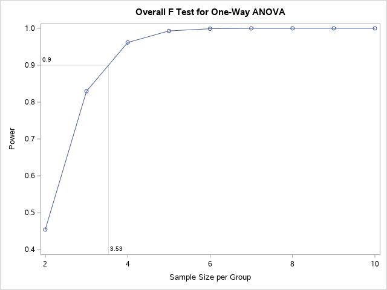
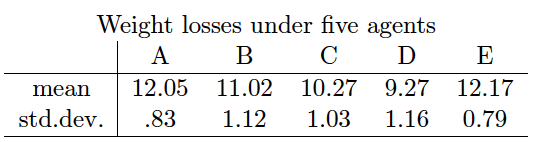

Problems: 1, 2, 3, 4

* Do not remove this line (it will not be displayed)
{:toc}

# 1
**We considered the posttest scores of children who received one of three therapies.**

$$
Y = \beta_0 + \beta_1 x_1 + \beta_2 x_2 + \beta_3 z + E
$$


## b
**Write the reduced model under $H_{0 \tau} : \beta_1 = \beta_2 = 0$.**

$$
Y_{reduced} = \beta_0 + \beta_3 z + E
$$

Also notice that $H_{1 \tau}$ is that $H_{0 \tau}$ is not true.

## d
**In what way does the null hypothesis $H_0: \beta_1 = \beta_2$ differ from $H_{0 \tau}$.**

$H_0$ says that the effects from treatment 1 and 2 are the same.

$H_{0 \tau}$ says that all three treatments have the same effect.


## e
**Write the reduced model under $H_0$.**

$$
Y_{reduced} = \beta_0 + \beta_1 x_1 + \beta_1 x_2 + \beta_3 z + E
$$


## f
**Given that the model sum of square for the reduced model in (e) is 3282.6955, test the null hypothesis $H_0$ and write conclusions.**


$$
	\begin{align}
		H_0: & \beta_1 = \beta_2 \\
		H_A: & \beta_1 \neq \beta_2
	\end{align}
$$


Since we are comparing nested models, we can do an F-test.

$$
	\begin{align}
		F & = \frac{ (SSE_{red} - SSE_{full}) / (p - q) }{ MSE_{full} }\\
			& = \frac{\Big( (5279.87\, -3282.7)-380.579 \Big)/(3-2)}{ 14.6376} \\
			& = 110.441
	\end{align}
$$

We can compare this to $F^{3-2}_{26, 0.05} = 4.225$. Since our F value is greater than this, we have evidence to reject the null in favor of the alternative that the effects from treatment 1 and 2 are not the same.

# 2
**In a study, four bags of ten oysters each were randomly placed at each of five locations in the cooling water canal of a power plant. Table 12.4 gives the initial and final (one month later) weights of the oyster bags in the five environments.**


## a
**Write an analysis of covariance model for predicting the final weight as a function of the treatment and initial weight. Clearly describe the assumptions you are making and explain how the parameters in the model can be interpreted.**

We need our standard regression assumptions, equal variance, independence, normally distributed errors with a mean of 0, and we also need an important ANCOVA specific assumption that the covariate does not interact with the experimental factors.

$$
Y_{ij} = \beta_0 + \beta_1 x_1 + \beta_2 x_2 + \beta_3 x_3 + \beta_4 x_4 + \beta_5 z + E_{ij}
$$

Note that we are assuming $E_{ij} \sim N(0, \sigma^2)$ are iid where $\sigma^2$ is the variation obtained from the location and the initial weight.

Where $\beta_0$ is the effect from location 5, $\beta_{1-4}$ are the differences in effects between locations 1-4 and 5, $x_{1-4}$ are indicator variables for locations 1-4, $\beta_5$ is the effect on final weight from a one unit increase in initial weight (holding all other variables fixed), $z$ is the initial weight, and $E$ is our error term.

## b
**For each of the five locations, determine the equation for predicting the final weight as a function of the initial weight.**

$$
	\begin{align}
		\hat{Y} | loc_1 & = \hat{\beta}_0 + \hat{\beta}_1 + \hat{\beta}_5 z \\
			& = 2.50+-0.24+1.08 z \\
		\hat{Y} | loc_2 & = \hat{\beta}_0 + \hat{\beta}_2 + \hat{\beta}_5 z \\
			& = 2.50+-0.28+1.08 z \\
		\hat{Y} | loc_3 & = \hat{\beta}_0 + \hat{\beta}_3 + \hat{\beta}_5 z \\
			& = 2.50+1.62+1.08 z \\
		\hat{Y} | loc_4 & = \hat{\beta}_0 + \hat{\beta}_4 + \hat{\beta}_5 z \\
			& = 2.50+1.107+1.08 z \\
		\hat{Y} | loc_5 & = \hat{\beta}_0 + \hat{\beta}_5 z \\
			& = 2.50+1.08 z \\
	\end{align}
$$

## c
**Calculate the adjusted means for comparing the effects of locations on the final weights of the oysters. Compare the adjusted means with the corresponding unadjusted means and give an intuitive explanation for the pattern of adjustments.**

We can estimate the unadjusted means by using the equations from part (b) or by taking the average of the final weights for each location.

$$
	\begin{align}
		\bar{Y}_{1+} & = \frac{1}{4} (32.6\, +36.6\, +37.7\, +31) \\
			& = 34.475 \\
		\bar{Y}_{2+} & = \frac{1}{4} (33.8\, +31.7\, +30.7\, +30.4) \\
			& = 31.65 \\
		\bar{Y}_{3+} & = \frac{1}{4} (35.2\, +29.1\, +28.9\, +30.2) \\
			& = 30.85 \\
		\bar{Y}_{4+} & = \frac{1}{4} (35.\, +27.\, +36.4\, +30.5) \\
			& = 32.25 \\
		\bar{Y}_{5+} & = \frac{1}{4} (24.6\, +23.4\, +30.3\, +21.8) \\
			& = 25.025
	\end{align}
$$


We can adjust these means by plugging in an average initial weight for the covariate term.

$$
	\begin{align}
		\bar{Y}_{++} & = \frac{1}{20} (27.2\, +26.8\, +28.6\, +26.8\, +26.5\, +26.8\, +28.6\, +22.4\, +23.2\, +24.4\, +29.3\, +21.8\, +30.3\, +24.3\, +20.4\, +19.6\, +25.1\, +32+33+18.1) \\
			& = 25.76 \\
		\bar{Y}_{1+, adj} & = 2.50 + -0.24 + 1.08 \cdot 25.76 \\
			& = 30.0808 \\
		\bar{Y}_{2+, adj} & = 2.50 + -0.28 + 1.08 \cdot 25.76 \\
			& = 30.0408\\
		\bar{Y}_{3+, adj} & = 2.50 + 1.65 + 1.08 \cdot 25.76 \\
			& = 31.9708 \\
		\bar{Y}_{4+, adj} & = 2.50 + 1.107 + 1.08 \cdot 25.76\\
			& = 31.4278 \\
		\bar{Y}_{5+, adj} & = 2.50 + 1.08 \cdot 25.76\\
			& = 30.3208 \\
	\end{align}
$$


Notice that the unadjusted means that are lower than the overall mean are pulled up while the unadjusted means that are greater than the adjusted mean are pulled down.

## d
**Construct a 90% confidence interval for tha expected difference between the final weight of oysters who have the same initial weight but are grown in two different locations -- location 1 and location 5. What conclusions can be drawn from this interval?**

Notice that our hypotheses are

$$
	\begin{align}
		H_0: & \tau_{1} - \tau_{5}  = 0\\
		H_A: & \tau_{1} - \tau_{5} \neq 0.
	\end{align}
$$

We can find a confidence interval to test this hypothesis.

$$
	\begin{align}
		(\tau_{1} - \tau_{5}) & \pm t_{20 - 5 - 1, \ 0.10 / 2} \cdot SE(\tau_{1} - \tau_{5}) \\
		(-0.244) & - 1.76131 \cdot 0.576 \\
		(-1.260, & \ 0.77)
	\end{align}
$$

Since this interval contains 0, we fail to reject the null in favor of the alternative that the treatment effects between location 1 and 5 are different.


## f
**Perform a statistical test to see if differences in the initial weight are associated with difference in the final weight.**

Notice that our hypotheses are

$$
	\begin{align}
		H_0: & \beta_5 = 0 \\
		H_A: & \beta_5 \neq 0.
	\end{align}
$$


From the parameter estimates table, we see that the p-value is $ Pr > \| T \| = 0.001$. Using and $\alpha = 0.05$, we have evidence to reject the null in favor of the alternative that initial weight is associated with final weight.

## g
**Construct a 95% confidence interval for a parameter that measures the association in (f). On the basis of this interval, what can you say about the initial weight as a predictor of the final weight?**

$$
	\begin{align}
		\hat{\theta} & \pm t_{20 - 5 - 1,\ 0.05 / 2} \cdot SE(\hat{\theta}) \\
		1.08 & \pm 2.144787 \cdot 0.0476 \\
		(0.98, & \ 1.18)
	\end{align}
$$

We are 95% confident that the true change in final weight with a one unit increase in initial weight is between 0.98 and 1.18.

## h
**Construct a 95% confidence lower prediction bound for the final weight of a bag of oysters with an intial weight of 25 in location 3. Interpret this lower bound.**

We are trying to predict $\mathbf{x}_0 = [1, 0, 0, 1, 0, 25]$. 

$$
E( Y | loc= 3, \ z = 25) = \beta_0 + \beta_3 + 25 \cdot \beta_5
$$

We can estimate this with

$$
E( Y | loc= 3, \ z = 25) = \hat{\beta_0} + \hat{\beta_3} + 25 \cdot \hat{\beta_5} = 2.50 + 1.65 + 1.08 \cdot 25 = 31.15
$$


To predict $Y \| \mathbf{x}_0$ we also need to find a standard error. 

$$
SE = \sqrt{Var} = \sqrt{\sigma^2 + \sigma^2 \mathbf{x}_0 (\mathbf{X}^T \mathbf{X})^{-1} \mathbf{x}_0^T}
$$


We will focus on the second term of this first. 

$$
\mathbf{x}_0 (\mathbf{X}^T \mathbf{X})^{-1} \mathbf{x}_0^T = Var(\hat{\beta}_0) + Var(\hat{\beta}_3) + 25^2 \cdot Var(\hat{\beta}_5) + 2 Cov(\hat{\beta}_0, \hat{\beta}_3) + 2 \cdot 25 Cov(\hat{\beta}_3, \hat{\beta}_5) + 2 \cdot 25 Cov(\hat{\beta}_0, \hat{\beta}_5)
$$

We can get these variances and covariances from the $(X^T X)^{-1}$. Notice that we can estimate $\sigma^2$ with MSE. Thus, for our standard error we get

$$
SE = \text{Sqrt[0.30159 + 0.30159*(3.503 + 0.434 + 25${}^{\wedge}$2*0.0075 + 2*0.352 + 2*25*-0.0289 + 2*25*-0.156)]} = 0.57164 
$$

Our t-value is $t_{n - t -1, \ \alpha} = t_{20 - 5 -1, \ 0.05} = 1.7613$. 

Thus, our lower bound is

$$
\text{31.15 - 1.76131*Sqrt[0.30159 + 0.30159*(3.503 + 0.611 + 25${}^{\wedge}$2*0.0075 + 2*0.352 + 2*25*-0.0289 + 2*25*-0.156)]} = 30.064.
$$

We are 95% confident that a bag of oysters placed in location 3 with an initial weight of 25 will have a final weight of at least 30.064.


# 3
**Test the adequacy of the simple linear regression model in which the mean soil water content is linear in depth. Which model would you select, the linear regression model of the one-factor classification model with 4 treatment means?**

We can do a lack of fit test.

$$
	\begin{align}
		H_0: & \text{ SLR is ok} \\
		H_1: & \text{ we need the full (one-way) model}
	\end{align}
$$

$$
	\begin{align}
		F & = \frac{ (SSE_{current} - SSE_{pure \ error}) / (\#\ params) }{ MSE_{pure \ error} } \\
			& = \frac{ (0.00232661 - 0.00208659) / (3-1) }{ 0.00017388 } \\
			& = 0.690447
	\end{align}
$$

We can compare this to $F^{2}_{16 - 4, 0.05} = 3.885294$. Since our F value is less than this, we fail to reject the null hypothesis and conclude that simple linear regression is ok.


# 4
**Consider designing an experiment to evaluate the potential effectiveness of $t=5$ weight reducing agents. Suppose that $n$ subjects are to be assigned at random to each of $t=5$ treatment groups. Suppose that the smallest meaningful effect on weight loss that researchers involved in the study would like to detect is one which the variance among the weight loss treatment means is at least as great as those given in the alternative below.**


$$
H_1: \mu_1 = \mu_5 = 12,\ \mu_2 = 11, \ \mu_3 = 10, \ \mu_4 = 9.
$$

**Suppose further that the standard deviation among weight losses for any treatment group is about $\sigma = 1$. Hold the type I error rate at $\alpha = 0.05$.**

## a
**Compute the number of subjects necessary to obtain a power of at least $1 - \beta = 0.9$.**

Notice that

$$
\mu = \frac{12+12+11+10+9}{5.} = 10.8
$$

From here we can use SAS to compute a sample size for us.

```
data numbahfour;
  nn=4; 
  power=1-
  	cdf('F', quantile('F',.95,5-1,nn*5-5), 
	5-1, nn*5-5, nn*6.8);
run;
```

Using a sample size of 3 per group gives a power of 0.83. Using a sample size of 4 per group gives a power of 0.96, so we will use 4 per group.


## b
**Obtain a plot of the power against sample sizes between 2 and 10.**

```
proc power;
  onewayanova test=overall alpha=0.05 
     groupmeans= 12 | 12 | 11 | 10 | 9 stddev=1
     npergroup=2 to 10 by 1 power=.;

  plot x=n min=2 max=10 yopts=(ref=.9 crossref=yes); 
run;
```




## c
**Describe how the power would change if $\sigma$ were actually larger.**

An increase in $\sigma$ would result in a decrease in $\gamma$ which would result in a decrease in power.

## d
**Describe how the power would change if the population mean weight gain for agent 1 were $\mu_1 = 15$.**

Power will increase because the sum of the $\tau_j$s increases.

$$
	\begin{align}
		\mu & = \frac{12+12+11+10+9}{5.} \\
			& = 10.8 \\
		\sum \tau_i & = 2*(12 - 10.8)^2 + (11 - 10.8)^2 + (10 - 10.8)^2 + (9 - 10.8)^2 \\
			& = 6.8 \\ \\
		\mu_{new} & = \frac{15+12+11+10+9}{5.} \\
			& = 11.4 \\
		\sum \tau_i &= (9-11.4)^2+(10-11.4)^2+(11-11.4)^2+(12-11.4)^2+(15-11.4)^2 \\
			& = 21.2
	\end{align}
$$

## e
**Suppose that $n=10$ is adopted, and data are observed as given in the table below.**



### i
**Carry out a test for the hypothesis that the treatment has no effect on weight loss. Use $\alpha = 0.05$.**

$$
	\begin{align}
		H_0: & \tau_A = \tau_B = \tau_C = \tau_D = \tau_E = 0 \\
		H_A: & \text{ not } h_0
	\end{align}
$$


We can perform an F test.

$$
	\begin{align}
		\bar{y}_{++} & = \text{(10*12.05 + 10*11.02 + 10*10.27 + 10*9.27 + 10*12.17)/50} \\
			& = 10.956 \\ \\
		SSModel & = \sum_{i=1}^{t} \sum_{j=1}^{n_i} (\bar{y}_{i+} - \bar{y}_{++})^2 \\
			& = 10 (9.27\, -10.956)^2+10 (10.27\, -10.956)^2+10 (11.02\, -10.956)^2+10 (12.05\, -10.956)^2+10 (12.17\, -10.956)^2 \\
			& = 59.8792 \\ \\
		MSModel & = \frac{ 59.8792 }{ 5 - 1 }\\
			& = 14.9698 \\ \\
		SSE & = \sum_{i=1}^{t} \sum_{j=1}^{n_i} (y_{ij} - \bar{y}_{i+})^2 \\
			& = \sum_{i=1}^{t} \sum_{j=1}^{n_i} s_i^2 (n_i - 1) \\
			& = 9 \cdot 0.83^2 + 9 \cdot 1.12^2 + 9 \cdot 1.03^2 + 9 \cdot 1.16^2 + 9 \cdot 0.79^2 \\
			& = 44.7651 \\ \\
		MSE & = \frac{ 44.7651 }{ 50 - 5 } \\
			& = 0.99478 \\ \\
		F & = \frac{ MSModel } { MSE } \\
			& = 15.0484
	\end{align}
$$

We can compare this to $F^4_{45, 0.05} = 2.56873$. Thus, using an $\alpha = 0.05$ we have sufficient evidence to reject the null in favor of the alternative that not all the treatment effects are 0.


### ii
**After carrying out all pairwise comparisons at a familywise error rate $\alpha = 0.05$, identify which differences are significant. Be clear about which multiple comparison procedure you use.**

We will use the Tukey-Kramer procedure since it is good for checking all pairwise differences. Our critical value will be

$$	
\sqrt{1/2} \cdot q_{t, df error, 0.05} = \sqrt{1/2} \cdot 4.018417 = 2.84145
$$


Notice that we will have a constant standard error throughout.

$$
SE(\hat{\theta}) = \sqrt{MSE ( 1/10 + 1/10 )} = 0.44605
$$


$$
\begin{array}{c c c | c}
i	&	j	&	t	&	\text{Result}	\\ \hline
1	&	2	&	2.30918	&	\text{Fail to Reject}	\\
1	&	3	&	3.99063	&	\text{Reject}	\\
1	&	4	&	6.23256	&	\text{Reject}	\\
1	&	5	&	0.269031	&	\text{Fail to Reject}	\\
2	&	3	&	1.68144	&	\text{Fail to Reject}	\\
2	&	4	&	3.92337	&	\text{Reject}	\\
2	&	5	&	2.57822	&	\text{Fail to Reject}	\\
3	&	4	&	2.24193	&	\text{Fail to Reject}	\\
3	&	5	&	4.25966	&	\text{Reject}	\\
4	&	5	&	6.50159	&	\text{Reject}	\\
\end{array}
$$

The significant differences are between groups 1 and 3, 1 and 4, 2 and 4, 3 and 5, and 4 and 5.