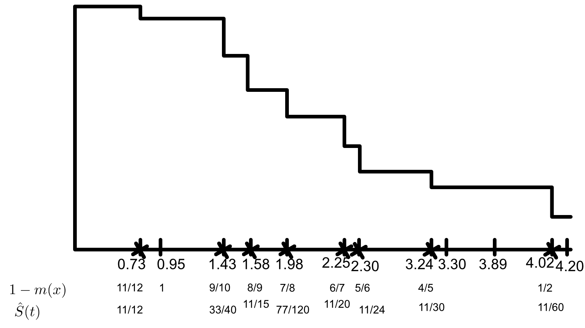
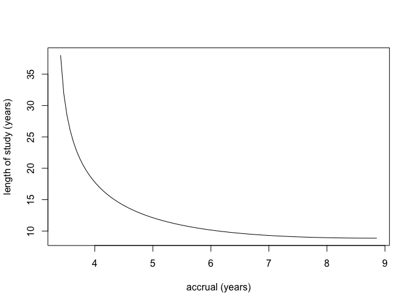
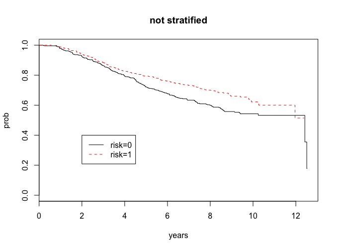
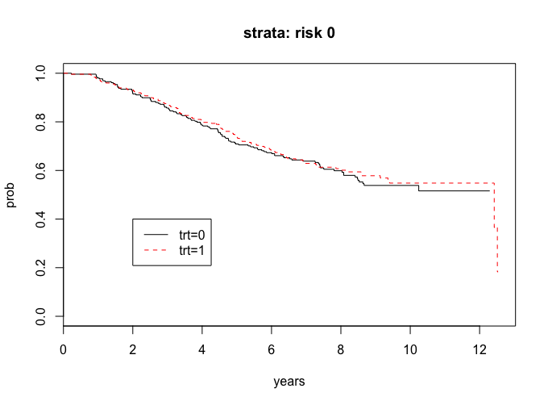
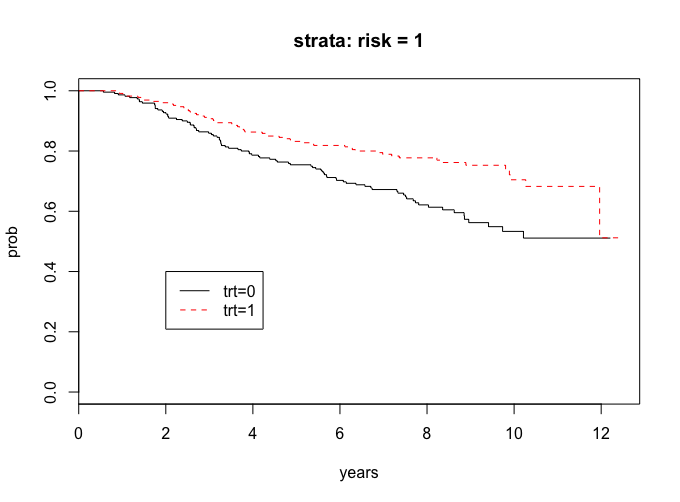

Problems: 1, 2, 3, 4, 5, 6

* Do not remove this line (it will not be displayed)
{:toc}


# 1
**A three arm trial is about to be conducted where two new treatments, say, treatment 2 and treatment 1, are to be compared to the standard treatment 0. The response is a continuous measurement which we denote by $Y$ and, absent any additional information, we will assume that the treatment-specific variances are all equal for design purposes. The null hypothesis of treatment equality**


$$
H_0: \mu_0 = \mu_1 = \mu_2
$$

**where $\mu_0$, $\mu_1$, $\mu_2$, denote the treatment-specific mean responses for treatments 0, 1, 2 respectively is to be tested against the alternative that some treatment difference exists. The investigators of the trial come to you for advise on sample size considerations. They are mostly interested in comparing the new treatments to the standard treatment and not particularly interested in comparing the two new treatments to each other. After quizzing the investigators about important differences they tell you that the average response on the standard treatment is about 100 with a standard deviation of 40. They also tell you that if a new treatment can increase the mean response to 115 or more, then this would be an important treatment difference to detect. Their belief is that both new treatments will yield clinically important differences and they insist that the study be powered with that
alternative in mind. That is, $\mu_{0A} = 100$, $\mu_{1A} = 115$, and $\mu_{2A} = 115$.**


## a
**What test would you use to test $H_0$.**

We would use a 3 sample test for a continuous response to test

$$
	\begin{align}
		H_0: & \mu_{0A} = \mu_{1A} = \mu_{2A} \\
		H_A: & \mu_{0A} = 100, \mu_{1A} = 115, \mu_{2A} = 115.
	\end{align}
$$

## b
**If you were to randomize with equal probability to all three arms, then how large a sample size is necessary so that a test at the .05 level of significance would have 90% power to detect the clinically important difference given by the investigators?**


$$
\phi^2 = \frac{ \sum n_j (\mu_{jA} - \bar{\mu}_A)^2 }{ \sigma^2_Y } \geq \phi^2(\alpha, \beta, k-1)
$$


Since we have equal allocation, $n_j = \frac{ n }{ 3 }$. Also,

$$
	\begin{align}
		\bar{\mu}_A & = \frac{ \sum n_j \mu_{jA}}{ n } \\
			& = \frac{ n/3 \cdot 100 + n/3 \cdot 115 + n/3 \cdot 115 }{ n } \\
			& = 110
	\end{align}
$$


Also $\phi ^ 2(\alpha, \beta, k-1) = \phi^2 (0.05, 0.1, 3-1) = 12.653936$. Thus,

$$
	\begin{align}
		12.653936 & \leq \frac{ n/3 (100-110)^2 + n/3 (115-110)^2 + n/3 (115-110)^2}{ 40^2 } \\
		20246.3 & \leq n/3 \cdot 100 + n/3 \cdot 25 + n/3 \cdot 25 \\
		n \geq 404.926 \approx 405
	\end{align}
$$

Rounding to 405 gives us 135 patients per treatment.

## c
**In contrast, what is the sample size necessary so that a test at the .05 level of significance would be guaranteed to have 90% power if any two treatments had a mean difference of 15 or more?**


**Regardless of your answers above, a clinical trial was conducted and the results are summarized in the table below**


$$
\begin{array}{c c c c}
	\text{treatment} & \text{sample average} & \text{sample stdev} & \text{sample size} \\ \hline
	0 & 130.2 & 62.3 & 210 \\
	1 & 125.8 & 40.6 & 202 \\
	2 & 149.5 & 43.7 & 195
\end{array}
$$


**If we denote by $Y_{ij}$ the response for the $i$-th individual in treatment $j$, where $j=0,1,2$ and $i = 1, \dots , n_j$, then the treatment specific sample average is**


$$
\bar{Y}_j = \frac{ \sum^{n_j}_{i=1} Y_{ij} }{ n_j }, \ j = 0, 1, 2
$$

 **and the sample standard deviation is**


$$
s_j = \sqrt{\frac{ \sum^{n_j}_{i=1} (Y_{ij} - \bar{Y}_J)^2 }{ n_j - 1 }} , \ j = 0 , 1, 2
$$


**Looking at the data, it seems that the assumption that the treatment-specific variances are all the same may not be so reasonable. Keep this in mind when constructing the test statistics for parts d. and e.**


$$
	\begin{align}
		n & = \frac{ 2 K \sigma_Y^2 \phi^2(\alpha, \beta, K-1) }{ \Delta_{A}^2 } \\
			& = \frac{ 2 \cdot 3 \cdot 40^2  \cdot \phi^2(0.05, 0.10, 3-1) }{ 15^2 } \\
			& = \frac{ 2 \cdot 3 \cdot 40^2 \cdot 12.653936 }{ 15^2 } \\
			& = 539.901 \approx 540
	\end{align}
$$

We would need a sample size of 540, or 180 per treatment.
## d
**What is the p-value for the data above? (To get credit you must show what test statistic you used) What are your conclusions regarding the null hypothesis?**

Our test statistic is

$$
	T_n = \sum_{j=0}^{2} w_j ( \bar{Y}_j - \bar{\bar{Y}})^2.
$$

With

$$
\bar{\bar{Y}} = \frac{ \sum w_j \bar Y_j}{ \sum w_j }.
$$


We will need to calculate the weights.

$$
	\begin{align}
		w_j & = \frac{ n_j }{ s_{Y_j}^2 } \\ \\
		w_0 & = 0.0541057 \\
		w_1 & = 0.122546 \\
		w_2 & = 0.102111
	\end{align}
$$


Now we can calculate $\bar{\bar{Y}}$.


$$
	\begin{align}
		\bar{\bar{Y}} & = \frac{ w_0 \bar{Y}_0 + w_1 \bar{Y}_1 + w_2 \bar{Y}_2 }{ w_0 + w_1 + w_2 }  \\
			& = \frac{0.0541057 \cdot 130.2+0.122546 \cdot 125.8+0.102111\cdot  149.5}{0.0541057\, +0.122546\, +0.102111} \\
			& = 135.55
	\end{align}
$$


So 

$$
T_n = 0.122546 (125.8\, -135.335)^2+0.0541057 (130.2\, -135.335)^2+0.102111 (149.5\, -135.335)^2 = 33.0564
$$


Comparing this to a $\chi^{2}_{0.05, 3-1}$ gives us a p-value of $6.64 \cdot 10^{-8}$.


## e
**It was always intended to make pairwise comparisons between treatment 1 versus treatment 0 and treatment 2 versus treatment 0. Accounting for multiple comparisons what conclusions would you draw regarding these comparisons? (Show all your calculations including relevant p-values and discuss how you reached your conclusion).**

We will do a Bonferroni correction with 3 groups. Thus, $\alpha / 2 \Rightarrow \frac{ \alpha }{ 2 \cdot 3 } = \frac{ \alpha }{ 6 }$. The value we will test against is $Z_{\alpha / 6} = Z_{0.008333} = 2.394$.

Testing 1-0:

$$
	\begin{align}
		Z & = \frac{ 125.8 - 130.2 }{ \sqrt{ \frac{ 40.6^2 }{ 202 } + \frac{ 62.3^2 }{ 310 } } } \\
			& = -0.85
	\end{align}
$$


Thus, we fail to reject that there is a difference between treatment 1 and treatment 0.


Testing 2-0:

$$
	\begin{align}
		Z & = \frac{ 149.5 - 130.2 }{ \sqrt{\frac{ 43.7^2 }{ 195 } + \frac{ 63.2^2 }{ 210 }} } \\
			& = 3.62954
	\end{align}
$$


Thus, we have enough to reject the null in favor of the alternative that the means between treatment 2 and treatment 0 are different.


# 2
**There are several treatments that have been proven to be effective in increasing CD4 counts for patients with HIV disease. However, it is well known that such treatments over time become resistant to the HIV virus and lose their effectiveness. Consequently, there is still room for new treatments to be considered that are equivalent in effectiveness to the current treatments. A pharmaceutical company has developed a new drug that they believe is similar in effectiveness to the drugs currently used and decide to conduct an equivalency (non-inferiority) trial. Because the distribution of CD4 counts is right skewed it is more convenient to work with the logarithm (natural) of CD4 counts as this will have a distribution that is closer to a normal distribution. Patients with advanced disease will be recruited for this clinical trial. Based on previous data the median CD4 counts is about 200 for such patients which translates to median log CD4 counts of 5.3. Also from past experience the effective treatment can increase CD4 counts by 50% over a period of one year or an increase in log CD4 counts of .41. This would correspond to increasing the median CD4 counts from 200 to 300. Based on these considerations the primary outcome Y is the difference in log CD4 count for each patient one year after treatment is initiated. You are asked to help design this non-inferiority trial. A randomized clinical trial will be conducted where patients will be randomized to either a current effective treatment (positive control) versus the new treatment. As stated above, the primary endpoint will be the difference in the log CD4 count one year after treatment. For planning purposes we assume that the mean log CD4 count difference for patients on positive control will be .41 with a standard deviation of .25. The FDA has decided that equivalence can be claimed if the company can prove that the response in CD4 counts is within 10% of the current effective drug. On the log scale this would correspond to a mean log CD4 count difference for patients on the new drug of .315 or greater or a tolerable difference of .095 on the log scale. We also assume that the standard deviation of response (log CD4 count difference) will be the same as the other treatment; namely, .25. Let $\mu_2$ denote the mean response for patients if they were treated with positive control and $\mu_1$ the mean response for patients if they were assigned the new drug.**


## a
**In terms of $\mu_1$ and $\mu_2$ state the null and alternative hypothesis that will be tested in this equivalency test.**

$$
	\begin{align}
		H_0: & \mu_1 \leq \mu_2 - 0.95 \\
		H_A: & \mu_1 > \mu_2 - 0.95
	\end{align}
$$


## b
**Let $n_1$, $\hat{Y}_1$, and $s_1$ denote the sample size, sample average and sample standard deviation computed from the patients in the trial that would be randomized to the new treatment and similarly $n_2$, $\hat{Y}_2$, and $s_2$ for patients in the trial that would be randomized to positive control. In terms of these what would you use to compute the test statistic? At the .05 level of significance when would you reject the null hypothesis?**

Our test statistic would be 

$$
T_n = \frac{ \bar{Y}_1 - \bar{Y}_2 + \Delta_A }{ \sqrt{\frac{ s_1^2 }{ n_1 } + \frac{ s_2^2 }{ n_2 }} }.
$$


We would compare it to $Z_{\alpha} = Z_{0.05} = 1.64$.


## c
**In designing your trial the investigators want to do some additional testing on resistance for the new drug. Therefore in order to get more experience they decide to randomize twice as many patients on the new drug versus positive control; that is, $n_1$ is twice $n_2$. If you wanted 90% or greater power to be able to declare equivalency if, in truth, your new treatment had a population mean response equal to or better than that of the positive control then how large a sample size will be needed?**

Our sample sizes are $2 n_1 = n_2 \Rightarrow n_1 = \frac{ 2}{  3 }n$ and $n_2 = \frac{ 1 }{ 3 } n$. 

$$
	\begin{align}
		T_n & = \frac{ \Delta_A }{ \sqrt{ \frac{ s_1^2 }{ 2/3 n } + \frac{ s_2^2 }{ 1/3 n }} } \\
			& = \frac{ 0.095 }{ \sqrt{ \frac{ 3 }{ 2 } \frac{ s_1^2 }{ n }  + \frac{ 3 s_2^2 }{ n }} } \\
			& \Rightarrow \\
		Z_{\alpha} + Z_{\beta} & = \frac{ 0.095 }{ \sqrt{ \frac{ 3 }{ 2 } \frac{ s_1^2 }{ n }  + \frac{ 3 s_2^2 }{ n }} }  \\
			& \Rightarrow \\
		n & = \frac{ 3/2 (s_1^2 + 2 s_2^2) (Z_{\alpha} + Z_{\beta})^2 }{ \Delta_A^2 } \\
			& = \frac{ 3/2 (0.25^2 + 2 \cdot 0.25^2) (1.64+1.28)^2 }{ 0.095^2 } \\
			& = 265.712 \approx 267
	\end{align}
$$

So, $n_2 = 89$ and $n_1 = 178$.
## d
**Regardless of your answer to part (c.) a clinical trial was conducted with 150 patients; 100 randomized to the new treatment and 50 to the positive control. The sample average response and sample standard deviation on the new treatment were .40 and .22 respectively and the sample average response and sample standard deviation on the positive control were .39 and .26 respectively. Compute the value of your test statistic and whether or not you will be able to conclude that your new treatment is equivalent to control.**

$$
T = \frac{ (-0.39 + 0.40) + 0.095 }{ \sqrt{\frac{ 0.22^2 }{ 100 } + \frac{ 0.26^2 }{ 50 }} } = 2.45
$$


Since $T > 1.64$, we have evidence to reject the null in favor of the alternative that the treatments are equivalent.

# 3
**Let $T$ denote a positive continuous random variable with hazard rate**

$$
\lambda(t) = \gamma t, \ \gamma>0
$$

**where time $t$ is in units of years. In terms of $\gamma$**


## a
**What is the survival distribution of $S(t) = P(T \geq t)$?**

$$
S(T) = \exp\Big[ - \int_{0}^{t} \lambda (u) du \Big] = \exp\Big[ - \int_{0}^{t} \gamma u du \Big] = e^{-\frac{ \gamma }{ 2 }\cdot t^2}
$$

## b
**What is the median survival time?**


$$
	\begin{align}
		0.5 & = e^{-\frac{ \gamma }{ 2 }\cdot t^2} \\
		t & = \sqrt{ - \frac{ 2 }{ \gamma } \log(0.5)} \\
			& = \frac{ 1.17741 }{ \sqrt{\gamma} }
	\end{align}
$$


# 4

**In the table below are the results of a small clinical trial comparing two treatments. The endpoint of interest is time to death (in years) which may be right censored.**


$$
	\begin{array}{c c | c c}
		 \rlap{\text{Treatment A}} & &  \rlap{\text{Treatment B}} & \\ \hline
		 \text{time to failure of censoring} & \text{failure indicator} & \text{time to failure or censoring} & \text{failure indicator} \\ \hline
		 1.43 & 1 & 2.30 & 1\\
		 0.95 & 0 & 1.98 & 1 \\
		 3.89 & 0 & 4.03 & 1 \\
		 2.25 & 1 & 3.30 & 0 \\
		 0.73 & 1 & 4.20 & 0 \\
		 3.24 & 1 & 1.58 & 1
	\end{array}
$$


**Using only a calculator and showing all your work (i.e. risk set calculations)**

## a
**Combining the two treatments together compute and plot the Kaplan-Meier estimator of the survival curve.**



## b
**Test the null hypothesis of equality of the treatment specific survival distributions using a two-sided logrank test. Compute the standardized test statistic and the p-value.**

Here our hypotheses are

$$
	\begin{align}
		H_0: & \lambda_A (t) = \lambda_B (t) \\
		H_A: & \lambda_A (t) \neq \lambda_B (t).
	\end{align}
$$


We will calculate all of the contingency tables at each point of death.

$$
\begin{array}{r | c | c | l}
t = 0.73 & A & B & \\ \hline
d & 1& 0& 1\\
n-d &5 & 6& 11\\ \hline
&6 &6 & 12
\end{array}\\

\begin{array}{r | c | c | l}
t = 1.43 & A & B & \\ \hline
d & 1 & 0 & 1\\
n-d & 3 & 6 & 9\\ \hline
& 4 & 6 & 10 
\end{array}\\

\begin{array}{r | c | c | l}
t = 1.58 & A & B & \\ \hline
d & 0 & 1 & 1 \\
n-d & 3 & 5 & 8\\ \hline
& 3 & 6 & 9 
\end{array}\\

\begin{array}{r | c | c | l}
t = 1.98 & A & B & \\ \hline
d & 0 & 1 & 1 \\
n-d & 0 & 4 & 7\\ \hline
& 3 & 5 & 8 
\end{array}\\

\begin{array}{r | c | c | l}
t = 2.25 & A & B & \\ \hline
d & 1 & 0 & 1 \\
n-d & 2 & 4 & 6 \\ \hline
& 3 & 4 &  7
\end{array}\\

\begin{array}{r | c | c | l}
t = 2.30 & A & B & \\ \hline
d & 0 & 1 & 1 \\
n-d & 2 & 3 & 5 \\ \hline
& 2 & 4 &  6
\end{array}\\

\begin{array}{r | c | c | l}
t = 3.24 & A & B & \\ \hline
d & 1 & 0 & 1 \\
n-d & 1 & 3 & 4\\ \hline
& 2 & 3 &  5
\end{array}\\

\begin{array}{r | c | c | l}
t = 4.03 & A & B & \\ \hline
d & 0 & 1 & 1 \\
n-d & 0 & 1 & 1\\ \hline
& 0 & 2 & 2 
\end{array}\\
$$


We can now calculate our test statistic.

$$
T_n = \frac{ \sum \Big[ d_1(u) - \frac{ d(u) }{ n(u) } n_1(u) \Big] }{ \Big[ \sum \frac{ n_1(u) n_0(u) d(u) (n(u) - d(u)) }{ n^2(u)(n(u) -1) } \Big]^2 }
$$


Numerator:

$$
\left(0-\frac{0}{2}\right)+\left(1-\frac{2}{5}\right)+\left(0-\frac{2}{6}\right)+\left(1-\frac{3}{7}\right)+\left(0-\frac{3}{8}\right)+\left(0-\frac{3}{9}\right)+\left(1-\frac{4}{10}\right)+\left(1-\frac{6}{12}\right) = \frac{1033}{840}
$$


Denominator:


$$
\sqrt{\frac{0\cdot 2 (2-1)}{2^2 (2-1)}+\frac{2\cdot 3 (5-1)}{5^2 (5-1)}+\frac{2\cdot 4 (6-1)}{6^2 (6-1)}+\frac{3\cdot 4 (7-1)}{7^2 (7-1)}+\frac{3\cdot 5 (8-1)}{8^2 (8-1)}+\frac{3\cdot 6 (9-1)}{9^2 (9-1)}+\frac{4\cdot 6 (10-1)}{10^2 (10-1)}+\frac{6\cdot 6 (12-1)}{12^2 (12-1)}} = \frac{\sqrt{1166863}}{840}
$$


$$
T_n = \frac{1033}{\frac{840 \sqrt{1166863}}{840.}} = 0.956292
$$


Comparing this to $Z_{0.05}$ gives a p-value of 0.33892, so we fail to reject the null in favor of the alternative. So, the hazard rates are equal.

# 5
**In designing a clinical trial the investigators tell you that the standard
treatment used for the treatment of multiple myeoloma results in a median survival of 5.0 years and that the survival distribution is well approximated by an exponential distribution. Two new promising treatments are to be tested against the standard treatment in a three-arm randomized clinical trial with equal allocation to all three arms. After quizzing the investigators they decide that they want at least 90% power to detect any difference between the standard treatment and either new treatment if either new treatment can increase the median survival to 7.0 years or greater using a three sample logrank test at the .05 level of significance. Again after quizzing them further they tell you that they believe that they can accrue 200 patients per year into the study.**

* **Assume that all three survival distributions are exponentially distributed and that you compute your power calculations under the least favorable configuration; namely, where the median survival for the worst treatment is 5.0 years, the median survival for the best treatment is 7.0 years and for the least favorable configuration the median survival of the third treatment is the geometric mean of 5 and 7 years; i.e., $\sqrt{5 \cdot 7}$ or 5.92 years. You can use the formula given at the end of page 137 of Chapter 8 of the notes to determine the requisite number of deaths for the least favorable configuration. Assuming no loss due to patient drop-out or competing risks, compute and plot all the possible combinations of accrual period and total length of study that would meet the goals of the study.**


First we will need to calculate our $\lambda_i$'s.


$$
	\begin{align}
		e^{\lambda_i \cdot m } & = 0.5 \\
		\lambda_i & = \frac{ \log(2) }{ m } \\ \\
		\lambda_1 & = \frac{ \log(2) }{ 5 } = 0.1368 \\
		\lambda_2 & = \frac{ \log(2) }{ 7 } = 0.099 \\
		\lambda_3 & = \frac{ \log(2) }{ 5.92 } = 0.1171 \\
	\end{align}
$$


Then we can calculate the required number of deaths for our desired power.

$$
	\begin{align}
		d & = \frac{ k \phi^2 (\alpha, \beta, k-1 ) }{  \sum_{j=1}^{k} \Big[ \log(\lambda_i) - \frac{ \sum_{j=1}^{k} \log(\lambda_i) }{ k } \Big]^2 } \\
			& = \frac{3 12.654}{\left(\frac{6.434}{3}+\log (0.099)\right)^2+\left(\frac{6.434}{3}+\log (0.11701)\right)^2+\left(\frac{6.434}{3}+\log (0.1386)\right)^2} \\
			& = 670.617 \approx 671
	\end{align}
$$

We can use this with the attached R code to get the following accrual plot.




# 6
**In class we discussed CALGB 8541 ( the three arm randomized clinical trial of women with stage II node positive breast cancer) that we've been using for illustration. I have given you access to a subset of these data on the class web-site. The dataset is in a file "calrisk.dat". I have only included patients that were randomized to either treatment 2 (low dose CAF) or treatment 3 (standard dose CAF). There are four variables in this file. Variable 1 denotes days on study, variable 2 denotes failure indicator (1=death, 0=censored), variable 3 is treatment indicator (1 if they received treatment 3 and 0 if they received treatment 2), and finally variable 4 is a risk indicator (coded as 0 or
1).**


**I want you to analyze the data looking at the relationship of treatment and the risk indicator. I want you to consider two groups, women with risk indicator equal to 1, and women with risk indicator equal to 0. Using SAS or R**


## a
**First I want you to compare the survival distribution of these two groups (risk indicator 1 versus risk indicator 0), by plotting the survival curves and computing the two-sample logrank test. What are your conclusions?**

This question can be answered in the attached R code.



```
lr <- survdiff(Surv(years,cens)~risk)
lr
	Chisq= 8.3  on 1 degrees of freedom, p= 0.00391
```

Our risk groups look different, and since the p-value is less than 0.05, we have evidence to support that they are different.

## b
**I want you to analyze the treatment comparisons separately within the strata for women with risk indicator 1 and for women with risk
indicator 0. That is, for each stratum separately, plot the treatment specific survival curves and compute the logrank test. What are your conclusions?**

We can also address this problem with the attached R code.



```
lr_risk0 <-survdiff(Surv(years, cens)~trt, subset = (risk==0))
lr_risk0 <-survdiff(Surv(years, cens)~trt, subset = (risk==0))
lr_risk0
	# Chisq= 0.2  on 1 degrees of freedom, p= 0.688 
```

The curves look the same and since the p-value is greater than 0.05, we do not have evidence to say that there are significant treatment in the risk = 0 group.





```
lr_risk1 <-survdiff(Surv(years, cens)~trt, subset = (risk==1))
lr_risk1
	#  Chisq= 11.7  on 1 degrees of freedom, p= 0.000628 
```

The curves seem to show a treatment difference and since the p-value is less than 0.05, we have evidence that there is a treatment difference in the risk = 1 group.
