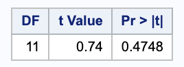

Problems: 1, 2, 3, 4, 5

* Do not remove this line (it will not be displayed)
{:toc}


# 1.

**A person's blood-clotting ability is typically expressed in terms of a "prothrombin time," which is defined to be the interval between the initiation of the prothrombin-thrombin (two proteins) reaction and the formation of the final clot. Does aspirin affect this function? Measurements of prothrombin time are made before administration of two aspirin tablets, and three hours after.**


$$
\begin{array}{c c c c}
\hline
& \rlap{\text{Prothrombin Times (seconds)}} & & \\ \hline
\text{Subject} & \text{Before Aspirin } (Y_1) & \text{After Aspirin } (Y_2) & \text{Difference } (D) \\ \hline
1 & 12.3 & 12.0 & 0.3 \\
2 & 12.0 & 12.3 & -0.3 \\
3 & 12.0 & 12.5 & -0.5 \\
4 & 13.0 & 12.0 & 1.0 \\
5 & 13.0 & 13.0 & 0.0 \\
6 & 12.5 & 12.5 & 0.0 \\
7 & 11.3 & 10.3 & 1.0 \\
8 & 11.8 & 11.3 & 0.5 \\
9 & 11.5 & 11.5 & 0 \\
10 & 11.0 & 11.5 & -0.5 \\
11 & 11.0 & 11.0 & 0 \\
12 & 11.3 & 11.5 & -0.2 \\ \hline
\end{array}
$$


## (a)
**Carry out a paired $t$-test of the hypothesis that prothrombin time is unaffected by aspirin.**

We are testing the hypotheses

$$
	\begin{align}
		H_0: & \mu_1 - \mu_2 = 0 \\
		H_A: & \mu_1 - \mu_2 \neq 0.
	\end{align}
$$


We will be using a paired t-test.

```
proc ttest data=aspirin;
  paired before*after;
run;
```




Using a significance level of 0.05, since 0.47 > 0.05, we do not have evidence to reject the null in favor of the alternative; the means are not different across treatments.


## (b)
**Carry out an $F$-test of the same hypothesis treating subjects as blocks in an analysis for a RCBD**

Here we can consider each subject as a block with data before the aspirin as a treatment and data after taking the aspiring as another treatment.

```
proc glm data=aspirin_treatment;
  class subject treatment ;
  model proth =  treatment subject;
run;
```


Here we want to look at the type III sum of squares for treatment. You will notice that it gives the same p-value and in part (a), so we still fail to reject the null.


# 2.
**[from Lab10] Refer to the example on cholesterol measurements obtained as a balanced 2x2
factorial with factors AGE and GENDER.**

## (a)
**Use `proc glm` to fit the 1-way classification model.**

```
proc glm data=cholest;
  class cohort;
  model chol = cohort / clparm ;
  
  contrast 'Ages' cohort 0.5 0.5 -0.5 -0.5 ;
  contrast 'Genders' cohort 0.5 -0.5 0.5 -0.5 ;
  contrast 'Ages for Women' cohort 1 0 -1 0 ;
  contrast 'Ages for Men' cohort 0 1 0 -1 ;
  contrast 'Genders for younger' cohort 1 -1 0 0 ;
  contrast 'Genders for Older' cohort 0 0 1 -1 ;
  contrast 'Between ages for men and women the same' 
  	cohort 1 -1 -1 1 ;
  contrast 'Between genders for the same ages the same' 
  	cohort 1 -1 -1 1 ;
 
  estimate 'Ages' cohort 0.5 0.5 -0.5 -0.5 ;
  estimate 'Genders' cohort 0.5 -0.5 0.5 -0.5 ;
  estimate 'Ages for Women' cohort 1 0 -1 0 ;
  estimate 'Ages for Men' cohort 0 1 0 -1 ;
  estimate 'Genders for younger' cohort 1 -1 0 0 ;
  estimate 'Genders for Older' cohort 0 0 1 -1 ;
  estimate 'Between ages for men and women the same' 
  	cohort 1 -1 -1 1 ;
  estimate 'Between genders for the same ages the same' 
  	cohort 1 -1 -1 1 ;
  
run;
```


### i.
**Separately test that each of the seven contrasts as given on the first slide of Notes12 equal zero. What do you conclude?**


Using a significance level of 0.05, we see that there are significant differences across age, genders, ages for men, and gender for older people.


### ii.
**Estimate and obtain 95% confidence intervals for each of the seven contrasts**

Notice that some contrasts may not be divided by 2 for readability, so the confidence intervals and the tests will stay the same, but the estimates will be doubled.


We are 95% confident that the true estimates for these contrasts are within these intervals. Notice that the contrasts that we rejected in (i) are the only confidence intervals not containing 0 (supporting our claims in (i)).

### iii.
**Verify mutual orthogonality of the set of contrasts 2,3,4 as decomposing SSModel.**

$$
	\begin{align}
		SS_2 + SS_3 +SS_4 & = 5103 + 1045.7857 + 6132.07142 \\
			& = 12280.9 = SSModel
	\end{align}
$$


### iv.
**Verify mutual orthogonality of the set of contrasts 1,5,6 as decomposing SSModel.**


$$
	\begin{align}
		SS_1 + SS_5 +SS_6 & = 6121.2857 + 757.7857 + 5401.7857 \\
			& = 12280.9 = SSModel
	\end{align}
$$


## (b)
**Use `proc glm` to fit the 2-way classification model that lists class variables in order "class age gender".**

```
proc glm data = cholest order = data;
  class age gender;
  model chol = age|gender / clparm;

  contrast '1 Ages' age 1 -1 gender 0 0 
  	age*gender 0.5 0.5 -0.5 -0.5 ;
  contrast '2 Gender' age 0 0 gender 1 -1 
  	age*gender 0.5 -0.5 0.5 -0.5 ;
  contrast '3 Ages, Women' age 1 -1 gender 0 0 
  	age*gender 1 0 -1 0;
  contrast '4 Ages, Men' age 1 -1 gender 0 0 
  	age*gender 0 1 0 -1;
  contrast '5 Gender, Young' age 0 0 gender 1 -1 
  	age*gender 1 -1 0 0;
  contrast '6 Gender, Older' age 0 0 gender 1 -1 
  	age*gender 0 0 1 -1;
  contrast '7 Age, Gender' age 0 0 gender 0 0 
  	age*gender 1 -1 -1 1;
  
  estimate 'Main effect: Age' age 1 -1 gender 0 0 
  	age*gender 0 0 0 0;
  estimate 'Main effect: Gender' age 0 0 gender 1 -1 
  	age*gender 0 0 0 0;
  
  estimate '1 Ages' age 1 -1 gender 0 0 
  	age*gender 0.5 0.5 -0.5 -0.5 ;
  estimate '2 Gender' age 0 0 gender 1 -1 
  	age*gender 0.5 -0.5 0.5 -0.5 ;
  estimate '3 Ages, Women' age 1 -1 gender 0 0 
  	age*gender 1 0 -1 0 ;
  estimate '4 Ages, Men' age 1 -1 gender 0 0 
  	age*gender 0 1 0 -1 ;
  estimate '5 Gender, Young' age 0 0 gender 1 -1 
  	age*gender 1 -1 0 0 ;
  estimate '6 Gender, Older' age 0 0 gender 1 -1 
  	age*gender 0 0 1 -1 ;
  estimate '7 Age, Gender' age 0 0 gender 0 0 
  	age*gender 1 -1 -1 1 ;
  
run;
```

### i.
**Rewrite the hypotheses from (a)(i) using parameters of the 2-way model.**

Here we are taking $\alpha$ to be age with levels 1 for young and 2 for old and $\beta$ for gender with 1 for women and 2 for men.

$$
	\begin{align}
		1 \\
		(\mu + \alpha_{1} + \beta_{1} + (\alpha \beta)_{11})+ (\mu + \alpha_{1} + \beta_{2} + (\alpha \beta)_{12}) - (\mu + \alpha_{2} + \beta_{1} + (\alpha \beta)_{21}) -	(\mu + \alpha_{2} + \beta_{2} + (\alpha \beta)_{22}) \\
		= 2 \alpha_1 - 2 \alpha_2 + (\alpha \beta)_{11} +(\alpha \beta)_{12} - (\alpha \beta)_{21} - (\alpha \beta)_{22} \\ \\
		2 \\
		(\mu + \alpha_{1} + \beta_{1} + (\alpha \beta)_{11}) + 	(\mu + \alpha_{2} + \beta_{1} + (\alpha \beta)_{21}) - (\mu + \alpha_{1} + \beta_{2} + (\alpha \beta)_{12}) - (\mu + \alpha_{2} + \beta_{2} + (\alpha \beta)_{22}) \\
		= 2 \beta_1 - 2\beta_2 + (\alpha \beta)_{11} + (\alpha \beta)_{21} - (\alpha \beta)_{12} - (\alpha \beta)_{22} \\ \\
		3 \\
		(\mu + \alpha_{1} + \beta_{1} + (\alpha \beta)_{11}) - (\mu + \alpha_{2} + \beta_{1} + (\alpha \beta)_{21}) \\
		= \alpha_1 - \alpha_2 + (\alpha \beta)_{11} - (\alpha \beta)_{21} \\ \\
		4 \\
		(\mu + \alpha_{1} + \beta_{2} + (\alpha \beta)_{12})- (\mu + \alpha_{2} + \beta_{2} + (\alpha \beta)_{22}) \\
		= \alpha_1 - \alpha_2 + (\alpha \beta)_{12} - (\alpha \beta)_{22} \\ \\
		5 \\
		(\mu + \alpha_{1} + \beta_{1} + (\alpha \beta)_{11})- (\mu + \alpha_{1} + \beta_{2} + (\alpha \beta)_{12}) \\
		\beta_1 - \beta_2 + (\alpha \beta)_{11} - (\alpha \beta)_{12} \\ \\
		6 \\
		(\mu + \alpha_{2} + \beta_{1} + (\alpha \beta)_{21}) - (\mu + \alpha_{2} + \beta_{2} + (\alpha \beta)_{22}) \\
		\beta_1 - \beta_2 + (\alpha \beta)_{21} - (\alpha \beta)_{22} \\ \\
		7 \\ 
		(\mu + \alpha_{1} + \beta_{1} + (\alpha \beta)_{11}) - (\mu + \alpha_{1} + \beta_{2} + (\alpha \beta)_{12}) + (\mu + \alpha_{2} + \beta_{1} + (\alpha \beta)_{21}) - (\mu + \alpha_{2} + \beta_{2} + (\alpha \beta)_{22}) \\
		(\alpha \beta)_{11} - (\alpha \beta)_{12}  + (\alpha \beta)_{21}  - (\alpha \beta)_{22} 
	\end{align}
$$

### ii.
**Test the hypotheses you state in (i).**


These are the same p-values as before (as they should be), so our conclusions are unchanged. This is expected since they are the same contrasts.

### iii.
**Estimate and obtain 95% confidence intervals for each of the seven contrasts.**

These are the same confidence as before (as they should be), so our interpretations are unchanged. This is expected since they are the same contrasts.


# 3.
**[from Lab10] Refer to the example on energy expended by honeybees obtained as a balanced
3x3 factorial with factors TEMP and SUCROSE.**

## (a)
**Use `proc glm` to fit the 1-way classification model where treatment combinations are ordered as: $1=\\{T=20,S=20\\}, 2=\\{T=20,S=40\\}, 3=\\{T=20,S=60\\}, 4=\\{T=30,S=20\\}, \dots , 9=\\{T=40,S=60\\}.$**


```

proc glm data = bees;
  class trmt;
  model energy = trmt / clparm;
  
  contrast 'A' trmt 0 -1 1 0 1 -1 0 0 0 ;
  contrast 'B' trmt 0 0.5 -0.5 0 0.5 -0.5 0 -1 1;
  contrast 'C' trmt -1 0.5 0.5 1 -0.5 -0.5 0 0 0;
  contrast 'D' trmt 0.5 -0.25 -0.25 0.5 
  	-0.25 -0.25 -1 0.5 0.5;
  
  contrast 'A & B'
  	trmt 0 -1 1 0 1 -1 0 0 0,
	trmt 0 0.5 -0.5 0 0.5 -0.5 0 -1 1;
     
  contrast 'C & D'
  	trmt -1 0.5 0.5 1 -0.5 -0.5 0 0 0,
	trmt 0.5 -0.25 -0.25 0.5 -0.25 -0.25 -1 0.5 0.5;
run;
```

### i.
**Conduct hypothesis testing for the following null hypotheses:**


#### A.
**$H_0: \mu_3 - \mu_2 = \mu_6 - \mu_5$  (This is true if the "temperature curve" at sucrose=60 is parallel to the temperature curve at sucrose=40.)**

Using a significance level of 0.05 < 0.3299, we do not have sufficient evidence to reject the null in favor of the alternative.


#### B.
**$H_0: \mu_9 - \mu_8 = \frac{ 1 }{ 2} (\mu_3 - \mu_2) + \frac{ 1 }{ 2 }(\mu_6 - \mu_5)$ (This is true if the temperature curve at sucrose=60 is parallel to the temperature curve at sucrose=40.)**

Using a significance level of 0.05 < 0.3833, we do not have sufficient evidence to reject the null in favor of the alternative.


#### C.
**$H_0: \frac{ 1 }{ 2 }(\mu_3 + \mu_2) - \mu_1 = \frac{ 1 }{ 2 } (\mu_6 + \mu_5) - \mu_4$ (This is true if the temperature curve at sucrose=20 is parallel to the _averaged_ temperature curves at sucrose=40 and 60.)**


Using a significance level of 0.05 > 0.0011, we have sufficient evidence to reject the null in favor of the alternative.


#### D.
**$H_0: \frac{ 1 }{ 2 } (\mu_9+\mu_8) - \mu_7 = \frac{ 1 }{ 2 } \\{ [ \frac{ 1 }{ 2 }(\mu_3 + \mu_2) -\mu_1 ] + [\frac{ 1 }{ 2 } (\mu_6 + \mu_5) - \mu_4] \\}$  (This is true if the temperature curve at sucrose=20 is parallel to the _averaged_ temperature curves at sucrose=40 and 60.**

Using a significance level of 0.05 > 0.0019, we have sufficient evidence to reject the null in favor of the alternative.

### ii.
**Consider the contrasts that arise from the hypothesis testing in part (i). Are they mutually orthogonal?**

In order to be mutually orthogonal, we need to check that all of the contrasts are pairwise orthogonal. Notice that the sample sizes for each group are the same, so we will omit those from our calculations. Our contrasts are

$$
	\begin{align}
		A & = [0\ -1\ 1\ 0\ 1\ -1\ 0\ 0\ 0] \\
		B & = [0\ \frac{ 1 }{ 2 }\ \frac{ -1 }{ 2 }\ 0\ \frac{ 1 }{ 2 }\ -\frac{ 1 }{ 2 }\ 0\ -1\ 1] \\
		C & =[-1\ \frac{ 1 }{ 2 }\ \frac{ 1 }{ 2 }\ 1 \frac{ -1 }{ 2 }\ \frac{ 1 }{ 2 }\ 0\ 0\ 0] \\
		D & = [\frac{ 1 }{ 2 }\ -\frac{ 1 }{ 4 }\ -\frac{ 1 }{ 4 }\ \frac{ 1 }{ 2 }\ \frac{ -1 }{ 4 }\ \frac{ -1 }{ 4 }\ -1\ \frac{ 1 }{ 2 }\ \frac{ 1 }{ 2 }] \\ \\
		A-B & -1 \frac{ 1 }{ 2 } + 1 \frac{ -1 }{ 2 } + 1 \frac{ 1 }{ 2 } + -1 \frac{ -1 }{ 2 } \\
			& = 0 \\
		A-C & = 	0 \cdot -1 + -1 \frac{ 1 }{ 2 } + 1 \frac{ 1 }{ 2 } + 1 \cdot 0 + 1 \frac{ -1 }{ 2 } + -1 \frac{ -1 }{ 2 } \\
			& = 0 \\
		B-C & = 0 \cdot -1 + \frac{ 1 }{ 2 } \frac{ 1 }{ 2 } + \frac{ -1 }{ 2 } \frac{ 1 }{ 2 } + 0 \cdot 1 + \frac{ 1 }{ 2 } \frac{ -1 }{2  } + 0 \cdot 0 + -1 \cdot 0 + 1 \cdot 0 \\
			& = 0 \\
		A-D & = 0 \cdot \frac{ 1 }{ 2 } + -1 \cdot \frac{ -1 }{ 4 } + 1 \cdot \frac{ -1 }{ 4 }  + 0 \cdot \frac{ 1 }{ 2 } + 1 \cdot \frac{ -1 }{ 4 } + -1 \frac{ -1 }{ 4 } + 0 \cdot -1 + 0 \frac{ 1 }{ 2 } + 0 \cdot \frac{ 1 }{ 2 } \\ 
			& = 0 \\
		B-D & = 0 \frac{ 1 }{ 2 } + \frac{ 1 }{ 2 } \frac{ -1 }{ 4 } + \frac{ -1 }{ 2 } \frac{ -1 }{ 4 } + 0 \frac{ 1 }{ 2 } + \frac{ 1 }{ 2 } \frac{ -1 }{ 4 } + \frac{ -1 }{ 2 } \frac{ -1 }{ 4 } + 0 \cdot -1 + -1 \frac{ 1 }{ 2 } + 1 \frac{ 1 }{ 2 } \\
			& = 0 \\
		C-D & = -1 \frac{ 1 }{ 2 } + \frac{ 1 }{ 2 } \frac{ -1 }{ 4 } + \frac{ 1 }{ 2 }\frac{ -1 }{ 4 }+ 1 \frac{ 1 }{ 2 } + \frac{ -1 }{ 2 } \frac{ -1 }{ 4 } + 0 \cdot -1 + 0 \frac{ 1 }{ 2 } + 0 \frac{ 1 }{ 2 } \\
			= 0
 \end{align}
$$


They are mutually orthogonal.

### iii.
**Do you believe the temperature curve at sucrose=60 is parallel to the temperature curve at sucrose=40? Conduct a formal hypothesis test.**

We can think of this as a multiple test where we are our null is that these two contrasts are equal to zero (the lines are parallel) and the alternative is that the lines are not parallel.

$$

\begin{bmatrix}
	0 & -1 & 1 & 0 & 1 & -1 & 0 & 0 & 0\\
	0 & 0.5 & -0.5 & 0 & 0.5 & -0.5 & 0 & -1 & 1 \\
\end{bmatrix}

=

\begin{bmatrix}
	0 \\
	0
\end{bmatrix}

$$

We can perform this in SAS by the following contrast statement.

```
  contrast 'A & B'
  	trmt 0 -1 1 0 1 -1 0 0 0,
	trmt 0 0.5 -0.5 0 0.5 -0.5 0 -1 1;
```

Referring to our contrast output above, can see that the p-value 0.4238 > 0.05, so we do not have evidence to reject the null in favor of the alternative. So, the lines are parallel.


### iv.
**Do you believe the temperature curve at sucrose=20 is parallel to the averaged temperature curves at sucrose=40 and 60? Conduct a formal hypothesis test.**

We can think of this as a multiple test where we are our null is that these two contrasts are equal to zero (the lines are parallel) and the alternative is that the lines are not parallel.

$$

\begin{bmatrix}
	-1 & 1/2 & 1/2 & 1 & -1/2 & -1/2 & 0 & 0 & 0\\
	1/2 & -1/4 & -1/4 & 1/2 & -1/4 & -1/4 & -1 & 1/2 & 1/2 \\
\end{bmatrix}

=

\begin{bmatrix}
	0 \\
	0
\end{bmatrix}

$$

We can perform this in SAS by the following contrast statement.

```
 contrast 'C & D' 
 	trmt -1 0.5 0.5 1 -0.5 -0.5 0 0 0,
	trmt 0.5 -0.25 -0.25 0.5 -0.25 -0.25 -1 0.5 0.5;
```


Referring to our contrast output above, can see that the p-value 0.0002 < 0.05, so we do have evidence to reject the null in favor of the alternative. So, the lines are not parallel.


## (b)
**Use `proc glm` to fit the 2-way classification model that lists class variables in order "class temp sucrose".**


### i.
**Rewrite the hypotheses from (a)(i) using parameters of the 2-way model.**

Here we are taking $\alpha$ to be temperature with levels 1 for 20, 2 for 30, and 3 for 40 and $\beta$ to be sucrose with levels 1 for 20, 2 for 40, and 3 for 60.

Since all of the $\mu$'s will cancel, we will omit them.

$$
	\begin{align}
		A \\
		(\alpha_{1} + \beta_{3} + (\alpha \beta)_{13}) - (\alpha_{1} + \beta_{2} + (\alpha \beta)_{12}) - (\alpha_{2} + \beta_{3} + (\alpha \beta)_{23}) + (\alpha_{2} + \beta_{2} + (\alpha \beta)_{22}) \\
		=(\alpha \beta)_{13} - (\alpha \beta)_{12} - (\alpha \beta)_{23} + (\alpha \beta)_{22}\\ \\
		B \\
		(\alpha_{3} + \beta_{3} + (\alpha \beta)_{33}) - (\alpha_{3} + \beta_{2} + (\alpha \beta)_{32}) - 1/2 (\alpha_{1} + \beta_{3} + (\alpha \beta)_{13}) + 1/2 (\alpha_{1} + \beta_{2} + (\alpha \beta)_{12}) - 1/2 (\alpha_{2} + \beta_{3} + (\alpha \beta)_{23}) + 1/2 (\alpha_{2} + \beta_{2} + (\alpha \beta)_{22}) \\
		= (\alpha \beta)_{33} - (\alpha \beta)_{32} - 1/2 (\alpha \beta)_{13} + 1/2 (\alpha \beta)_{12} - 1/2 (\alpha \beta)_{23} + 1/2 (\alpha \beta)_{22}\\ \\
		C \\
		-(\alpha_{1} + \beta_{1} + (\alpha \beta)_{11}) + 1/2 (\alpha_{1} + \beta_{2} + (\alpha \beta)_{12}) + 1/2  \(\alpha_{1} + \beta_{3} + (\alpha \beta)_{13}) -1/2 (\alpha_{2} + \beta_{3} + (\alpha \beta)_{23}) -1/2 (\alpha_{2} + \beta_{2} - 1/2 (\alpha \beta)_{22}) +  (\alpha_{2} + \beta_{1} + (\alpha \beta)_{21}) \\
		= - (\alpha \beta)_{11} + 1/2 (\alpha \beta)_{12} + 1/2 (\alpha \beta)_{13} + -1/2 (\alpha \beta)_{23} + -1/2 (\alpha \beta)_{22} + (\alpha \beta)_{21}\\ \\
		D \\
		1/2 (\alpha_{3} + \beta_{3} + (\alpha \beta)_{33}) + 1/2  (\alpha_{3} + \beta_{2} + (\alpha \beta)_{32}) + - (\alpha_{3} + \beta_{1} + (\alpha \beta)_{31}) + -1/4 (\alpha_{1} + \beta_{3} + (\alpha \beta)_{13}) + -1/4 (\alpha_{1} + \beta_{2} + (\alpha \beta)_{12}) + 1/2 (\alpha_{1} + \beta_{1} + (\alpha \beta)_{11}) + -1/4(\alpha_{2} + \beta_{3} + (\alpha \beta)_{23}) + -1/4 (\alpha_{2} + \beta_{2} + (\alpha \beta)_{22}) + 1/2 (\alpha_{2} + \beta_{1} + (\alpha \beta)_{21}) \\
		= 1/2  (\alpha \beta)_{33} + 1/2  (\alpha \beta)_{32} -  (\alpha \beta)_{31} + -1/4 (\alpha \beta)_{13}+ -1/4  (\alpha \beta)_{12} + 1/2  (\alpha \beta)_{11} + -1/4  (\alpha \beta)_{23} + - 1/4  (\alpha \beta)_{22} + 1/2  (\alpha \beta)_{21}
		\end{align}
$$

### ii.
**Test the hypotheses you state in (i).**

```
proc glm data = bees order = data;
  class temp sucrose;
  model energy = temp|sucrose / clparm;

  contrast 'A' 
    temp 0 0 0
    sucrose 0 0 0
    temp*sucrose 0 -1 1 0 1 -1 0 0 0 ;
  contrast 'B'
    temp 0 0 0 
    sucrose 0 0 0 
    temp*sucrose 0 0.5 -0.5 0 0.5 -0.5 0 -1 1 ;
  contrast 'C'
    temp 0 0 0 
    sucrose 0 0 0 
    temp*sucrose -1 0.5 0.5 1 -0.5 -0.5 0 0 0 ;
  contrast 'D'
    temp 0 0 0 
    sucrose 0 0 0
    temp*sucrose 0.5 -0.25 -0.25 0.5 -0.25 -0.25 -1 0.5 0.5;
    
run;
```


Using a significance level of 0.05, we can reject tests C and D since their p-values are smaller than 0.05. However, we cannot reject tests A and B. This is the same result we got from the one way classification (which it should be, becuase they are testing the same contrasts.)

### iii.
**Is there any relationship between the sum of squares obtained in (ii) and any of the default sum of squares given for the 2-way model?**

The sum of the contrast sum of squares from (ii) is equal to the type III sum of square for the interaction.


# 4.
**An experiment measures “Ortho-P” reduction after running material through a centrifuge and adding either lime only ($L$) or an experimental floculant only ($F$), or both ($LF$) or neither ($C$). $N = 12$ total samples are randomized to the four treatment combinations and run through the centrifuge. Complete this exercise by hand.**

```
Treatment	ortho_p (reduction)
c		53
c		67
c		57
f		58
f		68
f		57
l		50
l		44
l		56
lf		89
lf		80
lf		77
```


## (a)
**Obtain the sum of squares for treatments (based on 3 df).**

This will give the sum of squares treatment for the one way model, so we can use that equation.

$$
SSTreat = \sum_{i=1}^{t} \sum_{j=1}^{n_1} (\bar{y}_{i+} - \bar{y}_{++} )^2
$$


The means are 

$$
	\begin{align}
		\bar{y}_{++} & = \frac{1}{12} (53+67+57+58+68+57+50+44+56+89+80+77) \\
			& = 63 \\
		\bar{y}_{1+} & = \frac{1}{3} (53+67+57) \\
			& = 59 \\
		\bar{y}_{2+} & = \frac{1}{3} (58+68+57) \\
			& = 61 \\
		\bar{y}_{3+} & = \frac{1}{3} (50+44+56)\\
			& = 50 \\
		\bar{y}_{2+} & = \frac{1}{3} (89+80+77) \\
			& = 82 \\ \\
		SSTreat & = 3 (50-63)^2+3 (59-63)^2+3 (61-63)^2+3 (82-63)^2 \\
			& = 1650
	\end{align}
$$


Thus,

$$
	\begin{align}
		SSTreat & = 3 (50-63)^2+3 (59-63)^2+3 (61-63)^2+3 (82-63)^2 \\
			& = 1650
	\end{align}
$$


## (b)
**Obtain the sum of squares for three single degree-of-freedom contrasts.**


* **interaction between lime and floculant ($SS(l * f$)**

Here we can use the formula for the sum of squares for a two way interaction.

$$
SSAB = \sum _{i} \sum _{j} \sum _{k} (\bar{y}_{ij+} -\bar{y}_{i++} - \bar{y}_{+j+} + \bar{y}_{+++})^2
$$


We will take $A$ to be lime (first sum) $B$ to be floculant (second sum) such that

$$
\begin{array}{r| c c}
	& \text{lime} & \text{floculant} \\ \hline
	L & 1 & 0 \\
	LF & 1 & 1 \\
	F & 0 & 1 \\
	C & 0 & 0
\end{array}
$$


Our means will be

$$
	\begin{align}
		\bar{y}_{1++} & = \frac{ 50+82 }{ 2 } = 66 \\
		\bar{y}_{0++} & = \frac{ 59+61 }{ 2 } = 60 \\
		\bar{y}_{+1+} & = \frac{ 61+82 }{ 2 } = 71.5 \\
		\bar{y}_{+0+} & = \frac{ 50+59 }{ 2 } = 54.5 \\
		\bar{y}_{00+} & = 59 \\
		\bar{y}_{01+} & = 61 \\
		\bar{y}_{10+} & = 50 \\
		\bar{y}_{11+} & = 82 \\
		\bar{y}_{+++} & = 63 
	\end{align}
$$

Thus,

$$
	\begin{align}
		SSAB & = 3 (-71.5\, +82-66+63)^2+3 (-71.5\, +61-60+63)^2+3 (-54.5\, +50-66+63)^2+3 (-54.5\, +59-60+63)^2 \\
			& = 675.
	\end{align}
$$


* **main effect of lime $SS(l)$**

Here we can use our main effect sum of squares formula.


$$
	\begin{align}
		SSA & = \sum _{i} \sum _{j} \sum_{k} (\bar{y}_{i++} - \bar{y}_{+++})^2 \\
			& = 6 (60-63)^2+6 (66-63)^2 \\
			& = 108
	\end{align}
$$

* **main effect of floculant $SS(f)$**

Here we can use our main effect sum of squares formula.


$$
	\begin{align}
		SSB & = \sum _{i} \sum _{j} \sum_{k} (\bar{y}_{+j+} - \bar{y}_{+++})^2 \\
			& = 6 (54.5\, -63)^2+6 (71.5\, -63)^2\\
			& = 867
	\end{align}
$$

## (c)
**Does adding lime improve Ortho-P reduction? Address this question by obtaining 95% confidence intervals for the simple lime effects in the absence or presence of the floculant.**

We will need the SSE to calculate our standard error.

$$
	\begin{align}
		SSE & = \sum_i \sum_j \sum_k (y_{ijk} - \bar{y}_{ij+})^2\\
			& = (77-82)^2+(80-82)^2+(89-82)^2+(57-61)^2+(58-61)^2+(68-61)^2+(53-59)^2+(57-59)^2+(67-59)^2+(44-50)^2+(50-50)^2+(56-50)^2 \\
			& = 328 \\
		MSE & = SSE / (12-2\cdot 2) \\
			& = 41
	\end{align}
$$


We will be testing two sets of hypotheses. The first will test the effect of lime in the presence of floculant and the second will test the effect of lime in the absence of floculant.


$$
	\begin{align}
		H_0: & \mu_{LF} - \mu_{F} \leq 0 \\
		H_A:  & \mu_{LF} - \mu_{F} > 0 \\ \\
		H_0: & \mu_{L} - \mu_{C} \leq 0 \\
		H_A:  & \mu_{L} - \mu_{C} > 0
	\end{align}
$$

Notice that we are looking for an improvement in Orhto-P reduction, so we will be looking for confidence lower bounds. We will be testing with a $t_{12-2\cdot 2, 0.05} = 1.859555$ value. Let's start with the first set of hypotheses. 

$$
	\begin{align}
		(\bar{Y}_{LF} - \bar{Y}_F) & - 1.859555 \cdot \sqrt{MSE (1/n_{LF} + 1/n_{F})} \\
		(82 - 61) & - 1.859555 \cdot \sqrt{41 ( 1/3 + 1/3) } \\
		(11.278, & \infty)
	\end{align}
$$

Since 0 is not in our interval, we are 95% confident that there is a reduction in Ortho P when lime is added in the presence of floculant.


$$
	\begin{align}
		(\bar{Y}_{L} - \bar{Y}_C) & - 1.859555 \cdot \sqrt{MSE (1/n_{L} + 1/n_{C})} \\
		(50 - 59) & - 1.859555 \cdot \sqrt{41 ( 1/3 + 1/3) } \\
		(-18.722, & \infty)
	\end{align}
$$

Since 0 is in our interval, we are 95% confident that there is not a reduction in Ortho P when lime is added in the absence of floculant.


## (d)
**Obtain an interaction plot to convey the effects of the treatments on Ortho-P reduction.**


# 5.
**An experiment to study the effect of sleep deprivation on the ability to perform mental tasks was conducted with 36 subjects, all of whom has similar mental capacities as measured by their IQ score. Of the 36 subjects, 18 were males and 18 were females. In each gender group, nine subjects were between the 20 and 30 years of age, while the other nine were between 30 and 40 years of age. The nine subjects in each of the four age-gender groups were divided into three groups of three subjects each, and the three groups were assigned to three treatments (sleep deprivation levels) at random. Over a period of 48 hours, every subject was observed in the act of performing a set of tasks -- reading, writing, exercising, and resting. The resting activities differed from group to group. Subjects in treatment group 1 were allowed 8 hours of sleep at the end of a 24-hour period whereas subjects in treatment group 2 and 3 were allowed 6 and 4 hours, respectively. At the end of 48 hours, the subjects were asked to take a test that measured their mental capacity. The mean test scores obtained are as follows:**

$$
\begin{array}{c c c c c c c}
\hline
& & \text{Male} & & & \text{Female} & \\
& \text{4 hrs} & \text{6 hrs} & \text{8 hrs} & \text{4 hrs} & \text{6 hrs} & \text{8 hrs} \\ \hline
\text{Young} & 35 & 72 & 80 & 45 & 78 & 90\\
\text{Old} & 34 & 28 & 60 & 10 & 32 & 80 \\ \hline
\end{array}
$$


**The corresponding ANOVA table may be written in the following form:**

$$
\begin{array}{l r}
\hline
\text{Source} & \text{Mean Square} \\ \hline
\text{Age} & 6084 \\
\text{Gender} & 169\\
\text{Treatment} & 6499\\
\text{Age} \times \text{Gender} & 169\\
\text{Age} \times \text{treatment} & 819\\
\text{Gender} \times \text{treatment} & 364\\
\text{Age} \times \text{gender} \times \text{treatment}  & 388\\
\text{Error} & 143\\
\hline
\end{array}
$$


## (a)
**Draw the appropriate interaction plots to display the nature of the second and first order interactions between the three factors.**

2nd order interaction


1st order interactions

Sex and Sleep


Sex and Age


Age and sleep


## (b)
**Use the plots in (a) to draw conclusions about the interactions between age, gender, and sleep deprivation.**


The plots show that there may be some 2nd order interaction and there may be some interaction between sex and age.


## (c)
**Perform the appropriate $F$-tests to analyze the factorial effects at the 5% significance level.**

The general formula for our F statistic is

$$
F = \frac{ MS(interaction) }{ MSE }.
$$

Depending on the effect, we will be testing against either

$F^{1}_{34 - 3 \cdot 2 \cdot 2, 0.05} = 4.259677$

or 
$F^{2}_{24} = 3.4028$
. The degrees of freedom for our age is 1, for our sex is 1, and for our sleep is 2.

$$
	\begin{align}
		\text{second order} \\
		F(ABC) & = \frac{ 388 }{ 143 } = 2.71 \\
			& < 3.4028 & FTR \\
		\text{fire order}\\
		F(AB) & = \frac{ 169 }{ 143 } = 1.1818 \\
			& < 4.259677 & FTR \\
		F(BC) & = \frac{ 364 }{ 143 } = 2.545 \\
			& < 3.4028 & FTR \\
		F(AC) & = \frac{ 819 }{ 143 } = 5.727 \\
			& > 3.4028 & Reject \\
		\text{main effects}\\
		F(A) & = \frac{ 6084 }{ 143 } = 42.546 \\
			& > 3.4028 & Reject \\
		F(B) & = \frac{ 169 }{ 143 } = 1.182 \\
			& < 3.4028 & FTR \\
		F(C) & = \frac{ 6499 }{ 143 } = 45.4476 \\
			& > 4.259677 & Reject 
	\end{align}
$$

This suggests the second order interaction term is not significant, but the interaction between age and treatment is. It also shows that the main effects of Age and Treatment are significant.

## (d)
**Does your analysis in (c) confirm the conclusions from (b)?**


These relationships can be seen in our plots.

## (e)
**Use a multiple comparison method to compare the mean test scores at the three sleep deprivation levels at each of the two age groups. Comment on the results.**

Because we are doing pairwise comparisons, we will use the Tukey-Kramer comparison. Our critical value is $q_{t=3, df = 24, 0.05} \cdot \sqrt{1/2} = 3.531697 \cdot \sqrt{1/2} = 2.497286898$. Also, our $T$ values are calculated as $\frac{ \hat{\theta} }{ SE(\hat{\theta}) }$ where $ SE(\hat{\theta}) = \sqrt{MSE (1/n_1 + 1/n_2)} = \sqrt{41 \cdot (1/3 + 1/3)} = 6.904105059$.


$$
\begin{array}{c c | c c c c}
	&		&		&		&	\theta	&	T	&	\text{Reject ?}	\\
\text{Avg Young 8hrs}	&	\text{Avg Young 6 Hours}	&	85	&	75	&	10	&	1.448413649	&	\text{Fail to Reject}	\\ \hline
\text{Avg Young 8hrs}	&	\text{Avg Young 4 Hours}	&	85	&	40	&	45	&	6.517861419	&	\text{Reject}	\\
\text{Avg Young 6 Hours}	&	\text{Avg Young 4 Hours}	&	75	&	40	&	35	&	5.069447771	&	\text{Reject}	\\
\text{Avg Old 8hrs}	&	\text{Avg Old 6 Hours}	&	70	&	30	&	40	&	5.793654595	&	\text{Reject}	\\
\text{Avg Old 8hrs}	&	\text{Avg Old 4 Hours}	&	70	&	22	&	48	&	6.952385514	&	\text{Reject}	\\
\text{Avg Old 6 Hours}	&	\text{Avg Old 4 Hours}	&	30	&	22	&	8	&	1.158730919	&	\text{Fail to Reject}	\\
\end{array}
$$

Here a rejection means that the average test score for the two groups are difference while failing to reject means that they are the same. We rejected 4 hypotheses and failed to reject 2.


## (f)
**Is the multiple comparison in (e) justified by the analysis in (c)? Explain.**

For the most part, it shows that there is an interaction between age and treatment. This is the same conclusion that we saw in part (c).