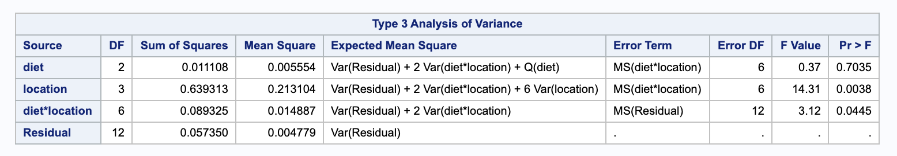
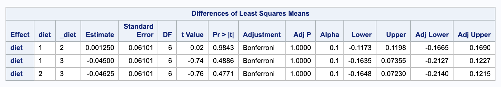

Problems: 1, 2, 3, 4

* Do not remove this line (it will not be displayed)
{:toc}

# 1
**Assume that the one-way random-effects model in Box 14.1 is appropriate for the protein content data in Exercise 14.1.**


## a.
**Construct the ANOVA table showing the mean squares and their expected values.**

$$
	\begin{array}{c c c c c c c}
		\text{Source}  & \text{d.f} & \text{Sum of Squares} & \text{Mean Square} & \text{F-ratio} & p \text{-value} & E\\  \hline
		\text{Model} & 9 & 11.879 & 12.431 & 2.17935 & 0.07 & \sigma^2+ 3 \sigma^2_T \\
		\text{Error} & 20 & 114.08 & 5.709 & & & \sigma^2\\
		\text{Corrected Total} & 29 & 225.959 & & & & \\ \hline
	\end{array}
$$


$$
	\begin{align}
		df_{Model} & = t - 1 \\
			& = 10 - 1 = 9 \\ \\
		df_{Error} & = N - t \\
			& = 30 - 10 = 20 \\ \\
		df_{Total} & = df_{Model} + df_{Error} \\
			& = 9 + 20 = 29 \\ \\
		\bar{y}_{++} & = \frac{1172.8}{30} \\
			& = 39.093 \\ \\
		SSModel & = \sum^{t}_{i = 1} \sum_{j = 1}^n (\bar{y}_{i+} - \bar{y}_{++})^2 \\
			& = 3 \left(\left(\frac{107.1}{3}-39.093\right)^2+\left(\frac{107.6}{3}-39.093\right)^2+\left(\frac{114.3}{3}-39.093\right)^2+\left(\frac{116.1}{3}-39.093\right)^2+\left(\frac{118.9}{3}-39.093\right)^2+\left(\frac{119.2}{3}-39.093\right)^2+\left(\frac{120.4}{3}-39.093\right)^2+\left(\frac{120.7}{3}-39.093\right)^2+\left(\frac{123}{3}-39.093\right)^2+\left(\frac{125.5}{3}-39.093\right)^2\right) \\ \\
		MSModel & = \frac{ SSModel }{ dfModel } \\
			& = \frac{111.879}{9} = 12.431 \\ \\
		SSE & = \sum_{i=1}^{t} \sum_{j=1}^{n} (y_{ij} - \bar{y}){i+})^2 \\
			& = \left(28.6\, -\frac{107.1}{3}\right)^2+\left(36.3\, -\frac{107.1}{3}\right)^2+\left(42.2\, -\frac{107.1}{3}\right)^2+\left(35.6\, -\frac{107.6}{3}\right)^2+\left(35.9\, -\frac{107.6}{3}\right)^2+\left(36.1\, -\frac{107.6}{3}\right)^2+\left(37.9\, -\frac{114.3}{3}\right)^2+\left(38.1\, -\frac{114.3}{3}\right)^2+\left(38.3\, -\frac{114.3}{3}\right)^2+\left(37.2\, -\frac{116.1}{3}\right)^2+\left(39.4\, -\frac{116.1}{3}\right)^2+\left(39.5\, -\frac{116.1}{3}\right)^2+\left(38.9\, -\frac{118.9}{3}\right)^2+\left(39.6\, -\frac{118.9}{3}\right)^2+\left(40.4\, -\frac{118.9}{3}\right)^2+\left(39.6\, -\frac{119.2}{3}\right)^2+\left(39.7\, -\frac{119.2}{3}\right)^2+\left(39.9\, -\frac{119.2}{3}\right)^2+\left(38.3\, -\frac{120.4}{3}\right)^2+\left(41.1\, -\frac{120.4}{3}\right)^2+\left(38.9\, -\frac{120.7}{3}\right)^2+\left(40.8\, -\frac{120.7}{3}\right)^2+\left(39.6\, -\frac{123}{3}\right)^2+\left(42.4\, -\frac{123}{3}\right)^2+\left(42.1\, -\frac{125.3}{3}\right)^2+\left(40.2\, -\frac{125.5}{3}\right)^2+\left(43.2\, -\frac{125.5}{3}\right)^2+\left(41-\frac{120.4}{3}\right)^2+\left(41-\frac{120.7}{3}\right)^2+\left(41-\frac{123}{3}\right)^2 \\
			& = 114.08 \\ \\
		MSE & = \frac{ SSE }{ dfError } \\
			& = \frac{ 114.08 }{ 20 } = 5.704 \\ \\
		SSTotal & = SSModel + SSE \\
			& = 111.879\, +114.08 = 225.959 \\ \\
		F & = \frac{ MSModel }{ MSE } \\
			& = \frac{ 12.431 }{ 5.704 } = 2.18625 \\ \\
	\end{align}
$$


We compare this $F$ value to an $F^{9}_{20}$ distribution to get a p-value of $0.07$.

## b.
**On the basis of the ANOVA table constructed in (a), would it be reasonable to conclude that there is a significant plant-to-plant variation in the protein content of seeds produced by the $F_3$ generation plants?**

$$
	\begin{align}
		H_0: & \text{There is no plant-to-plant variation}  \\
		H_A: & \text{There is plant-to-plant variation}
	\end{align}
$$

Using a significance level of 0.05, since our p-value 0.07 > 0.05, we fail to reject the null hypothesis, there is no significant plant-to-plant variation.

## c.
**Estimate the components of variance, and comment on their relative magnitudes.**

$$
	\begin{align}
		\hat{\sigma}^2 & = MSE \\
			& = 5.709 \\ \\
		\hat{\sigma}^2 + n_0 \hat{\sigma}^2_{T} & = MSModel \\
		\hat{\sigma}^2_{T} & = \frac{ MSModel - \hat{\sigma}^2 }{ n } \\
			& = \frac{ 12.431 - 5.709 }{ 3 } \\
			& = 2.24067
	\end{align}
$$

Here the intragroup variation, $\sigma^2$, is $5.709 / 2.24067 = 2.548$ time larger than the intergroup variation, $\sigma_T^2$.

## d.
**Calculate an estimate of the coefficient of variation of the protein content measurements, and comment of its value.**

$$
CV = \frac{ \sqrt{\sigma^2_T + \sigma^2} }{ | \mu | } = \frac{ \sqrt{2.24067 + 5.709} }{ 39.093 } = 0.072
$$

The standard deviation of the response is about 7.2% of its mean.

<!--
## e.
**Construct a 95% confidence interval for the proportion of the varaince of the measured protein content values that can be ascribed to plant-to-plant varaition. Interpret this interval.**

Here we want a confidence interval for $\rho_I = \frac{ \sigma_T^2 }{ \sigma_T^2 + \sigma^2 }$.

$$
\frac{ F_C - F_{\alpha/2} }{ F_C + (n-1) F_{\alpha / 2} } \leq \rho \leq \frac{ F_C - F_{1 - \alpha/2} }{ F_C + (n-1) F_{1 - \alpha / 2} }
$$

Where $F_C = \frac{ MSModel }{ MSE }$ and $F_\alpha = F(t - 1, t(n - 1), \alpha)$.


$$
	\begin{align}
		F_C & = \frac{ 12.431 }{ 5.709 } \\
			& = 2.17935 \\ \\
		F_{\alpha} & = F(10 - 1, 10 ( 3 - 1), 0.05 / 2 ) \\
			& = 2.8365 \\ \\
		F_{1 - \alpha} & = F(10 - 1, 10 ( 3 - 1), 1 - 0.05 / 2 ) \\
			& = 0.2727
	\end{align}
$$


Thus,

$$
	\begin{align}
		\frac{ 2.17935 - 2.8365 }{ 2.17935+(3-1)\cdot 2.8365 } & \leq \rho_I \leq \frac{ 2.17935 - 0.2727 }{ 2.17935+(3-1)\cdot 0.2727 } \\
		-0.0837 & \leq \rho_I \leq 0.242813.
	\end{align}
$$


We are 95% confident that the true proportion of varaince ascribed to the plant-to-plant variation is between -0.0837 (round to 0) and 0.2727.
-->

## f.
**On the basis of the observed data, would it be reasonable to conclude that the average protein content of seeds produced in the $F_3$ generation is more than 40%?**

$$
	\begin{align}
		H_0: & \mu \leq 40 \\
		H_A: & \mu > 40
	\end{align}
$$


We can address this with a confidence lower bound.

$$
\bar{Y}_{++} - t_{t-1, \alpha} \sqrt{\frac{ MSModel }{ n t }}
$$


Where $t_{t - 1, alpha} = t_{10 - 1, 0.05} = 1.833113$.

$$
	\begin{align}
		39.093 & -1.833113 \cdot \sqrt{\frac{ 12.431 }{ 3 \cdot 10 }} \\
		(37.913, & \infty)
	\end{align}
$$


Since the lower bound is less than 40, we fail to reject the null in favor of the alternative. The average protein content of seeds produced in the $F_3$ generations is not more than 40%.


# 2
**To see how the effect of diet supplements on the weights of wethers varied with environmental conditions, a study was conducted in four randomly selected locations; each location represented a randomly selected environment. The experimenters randomly assigned 24 crossbred wethers to the four locations in such a way that each location had six wethers. Within each location, the animals were randomized to receive three diets, with two animals on each diet. Teh four-week weight gains in wethers are as follows:**


$$
\begin{array}{c c c c c}
	\hline
	\text{Diet} & & \rlap{\text{Location}} & & \\
	& 1 & 2 & 3 & 4 \\ \hline
	1 & 2.10 & 2.02 & 2.16 & 1.98 \\
	& 2.32 & 2.04 & 2.18 & 1.86 \\ \hline
	2 & 2.24 & 2.30 &2.22 & 1.64 \\
	& 2.22 & 2.12 & 2.18 & 1.73  \\ \hline
	3 & 2.27 & 2.14 & 2.26 & 1.83 \\
	& 2.24 & 2.17 & 2.21 & 1.89 \\ \hline
\end{array}
$$


## a.
**Write a suitable ANOVA model for the data. Explain all the terms in your model.**

$$
Y_{ijk} = \mu + \alpha_i + B_j + (\alpha B)_{ij} + E_{ijk}
$$

* $Y_{ijk}$ - weight of the $k$th wether in the $i$th diet group in the $j$th location.
* $\mu$ - the overall mean weight.
* $\alpha_i$ - the fixed effect of the $i$th diet.
	* $i = 1,2,3 \rightarrow a = 3$
	* $\alpha_i \stackrel{iid}{\sim} N(0, \sigma_\alpha^2) $
* $B_j$ - the random effect of the $j$th location.
	* $j = 1,2,3,4 \rightarrow b = 4$
	* $B_j \stackrel{iid}{\sim} N(0, \sigma_B^2)$
* $(\alpha B)_{ij}$ - the random interaction effect of the $ij$th group.
	* $(\alpha B)_{ij} \stackrel{iid}{\sim}  n(0, \sigma^2\_{\alpha B}))$
* $E_{ijk}$ - random error of the $k$th wether in the $i$th diet group in the $j$th location.
	* $E_{ijk} \stackrel{iid}{\sim} N(0, \sigma^2)$
		* $\sigma^2$ - the variance within each a group.


Finally, $\alpha_i, B_j, (\alpha B)\_{ij}, E\_{ijk}$ are mutually independent.


## b.
**Obtain estimates of the components of the variance due to location, interaction between location and diet, and error. Interpret the results.**

We will use SAS to help us obtain our estimates.

```
proc mixed data=wethers method=type3 cl covtest;
  class diet location;
  model weight = diet / ddfm = satterthwaite solution;
  random location diet*location;
run;
```



We will need the following mean square values.

$$
	\begin{align}
		MSE & = \frac{ 1 }{ n a b - a b } \sum_i \sum_j \sum_k (y_{ijk} - \bar{y}_{ij+})^2 \\
			& = 0.004779 \\ \\
		MSB & = \frac{ 1 }{ b - 1 } \sum_i \sum_j \sum_k (\bar{y}_{+j+} - \bar{y}_{+++})^2 \\
			& 0.213104 \\ \\
		MSAB & = \frac{ 1 }{ (a-1)(b-1) } \sum_i \sum_j \sum_k (\bar{y}_{ij+}  - \bar{y}_{i++} - \bar{y}_{+j+} + \bar{y}_{+++})^2 \\
			& = 0.014887
	\end{align}
$$

We can use these to estimate our variance components. Notice that $n = n_{ij} = 2$.

$$
	\begin{align}
		\hat{\sigma}^2 & = MSE \\
			& = 0.004779 \\ \\
		\hat{\sigma}_B^2 & = \frac{ MSB - MSAB }{ n \cdot a } \\
			& = \frac{ 0.213104 - 0.014887 }{ 2 \cdot 3 } \\
			& = 0.0330362 \\ \\
		\hat{\sigma}_{\alpha B}^2 & = \frac{ MSAB - MSE }{ n } \\
			&  =\frac{ 0.014887 - 0.004779 }{ 2 } \\
			& = 0.005054
	\end{align}
$$

* $\hat{\sigma}^2$ estimates the population variability to be 0.004779.
* $\hat{\sigma}_B^2$ estimates the variability between location groups to be 0.0330362.
* $\hat{\sigma}_{\alpha B}$ estimates the variability between diet-location groups to be 0.005054.

## c.
**Construct the appropriate ANOVA table for the data and perform all ANOVA $F$-tests. Interpret the results.**

We can use our ANOVA table from (b). First, we must give the formulas for the pieces that we haven't calculated.

$$
	\begin{align}
		df_E & =  a \cdot b \\
		df_{\alpha} & = a - 1 \\
		df_{B} & = b - 1\\
		df_{\alpha B} & = (a - 1) (b-1) \\ \\
		SSE & = MSE \cdot df_{E} \\
		SSB & = MSB \cdot df_{B} \\
		SS\alpha B & = MS\alpha B \cdot df_{\alpha B} \\
		SS\alpha & = \sum_i \sum_j \sum_k (\bar{y}_{i++} - \bar{y}_{+++})^2 \\ \\
		MS\alpha & = SS\alpha / df_{\alpha} \\ \\
		SSTotal & = SSA + SSB + SSAB + SSE
	\end{align}
$$

Now we can do our F-tests. We will start with the interaction term and then proceed with the main effects. We will use a significance value of 0.05 throughout.

$$
	\begin{align}
		H_0: & \sigma^2_{\alpha \beta} = 0 \\
		H_A: & \sigma^2_{\alpha \beta} \neq 0
	\end{align}
$$


We can check $F = \frac{ MSAB }{ MSE } = \frac{ 0.014887 }{ 0.004779 } = 3.12$. Comparing this to an $F^{6}_{12}$ distribution gives $p = 0.0445 < 0.05$, so we would reject the null in favor of the alternative that there is an interaction effect.


Though we have an interaction effect, we will also check our main effects. We will start by looking at the diet effect.

$$
	\begin{align}
		H_0: & \sigma_{\alpha}^2 = 0 \\
		H_A: & \sigma_{\alpha}^2 \neq 0
	\end{align}
$$

We can check $F = \frac{ MSA }{ MSAB } = \frac{ 0.00554 }{ 0.014887 } = 0.37$. Comparing this to an $F^{2}_{6}$ we get a p value of $0.7035 > 0.05$, so we fail to reject the null in alternative; there is no diet effect.


Then we can check the location effect.

$$
	\begin{align}
		H_0: & \sigma^2_{B} = 0 \\
		H_A: & \sigma^2_{B} \neq 0
	\end{align}
$$

We can check $F = \frac{ MSB }{ MSAB }  = \frac{ 0.213104 }{ 0.014887 } = 14.31$. Comparing this to an $F^{3}_{6}$ distribution, we get a p-value of $0.0038 < 0.05$, so we reject the null in favor of the alternative; there is a location effect.

## d.
**Construct a 90% confidence interval for the true mean weight gain of animals fed diet 1 in a randomly selected location.**

First we will need to find the standard error.

$$
	\begin{align}
		V(\bar{Y}_{1++}) & = V[ \mu + \alpha_1 + \bar{B}_{+} + \bar{(\alpha \beta)}_{1+} + \bar{E}_{1++}] \\
			& = V[ \bar{B}_{+} + \bar{(\alpha \beta)}_{1+} + \bar{E}_{1++}] \\
			& = V(\bar{B}_{+}) + V(\bar{(\alpha \beta)}_{1+})  +V(\bar{E}_{1++})
	\end{align}
$$

Notice that the covariance terms are 0 because of the independence structure. We will now look at each term individually.

$$
	\begin{align}
		V(\bar{B}_{+}) & = \frac{ \sum V(B_i) }{ 4^2 } \\
			& = \frac{ \sum \sigma^2_B }{ 16 } \\
			& = \frac{ 4 \hat{\sigma}^2_B }{ 16 } \\
			& = \frac{ \hat{\sigma}^2_B }{ 4 } \\ \\
		 V(\bar{(\alpha \beta)}_{1+}) & = V\Big[ \frac{ \sum (\alpha \beta)_{ij} }{ 4 } \Big] \\
		 	& = \frac{ \sum V((\alpha \beta)_{ij}) }{ 4^2 } \\
			& = \frac{ 4 \hat{\sigma}^2_{AB} }{ 16 } \\
			& = \frac{ \hat{\sigma}^2_{AB} }{ 4 } \\ \\
		 V(\bar{E}_{++}) & = V\Big[ \frac{ \sum_{i=1}^{4} \sum_{j=1}^{2} E_{ij} }{ 8 } \Big] \\
		 	& = \frac{ \sum \sum V(E_{ij}) }{ 8^2 } \\
			& =  \frac{ 8 \hat{\sigma}^2 }{ 8^2 } \\
			& = \frac{ \hat{\sigma}^2 }{ 8 }
	\end{align}
$$

Now we can go back and combine them.

$$
	\begin{align}
		V(\bar{Y}_{1++}) & = V(\bar{B}_{+}) + V(\bar{(\alpha \beta)}_{1+})  +V(\bar{E}_{1++}) \\
			& = \frac{ 1 }{ 4 } \frac{ MSB - MSAB }{ 6 } + \frac{ 1 }{ 4 } \frac{ MSAB - MSE }{ 2 } + \frac{ MSE }{ 8 } \\
			& = \frac{ MSB }{ 24 } + \frac{ MSAB }{ 12 }
	\end{align}
$$


Because this variance includes multiple mean squares, we will estimate our degrees of freedom with the Satterthwaite approximation.

$$
	\begin{align}
		\hat{df} & = \frac{ (\frac{ 1 }{ 24 }MSB + \frac{ 1 }{ 12 } MSAB)^2 }{ \frac{ (\frac{ 1 }{ 24 }MSB)^2 }{ 3 } + \frac{ (\frac{ 1 }{ 12 }MSAB)^2 }{ 6 } } \\
			& = \frac{\left(\frac{0.213104}{24}+\frac{0.014887}{12}\right)^2}{\frac{1}{6} \left(\frac{0.014887}{12}\right)^2+\frac{1}{3} \left(\frac{0.213104}{24}\right)^2} \\
			& = 3.85919
	\end{align}
$$


We can also calculate our standard error.

$$
	\begin{align}
		SE(\bar{Y}_{1++}) & =\sqrt{\frac{ 1 }{ 24 } MSB + \frac{ 1 }{ 12 } MSAB} \\
			& = \sqrt{\frac{0.213104}{24}+\frac{0.014887}{12}} \\
			& = 0.100598
	\end{align}
$$

Now we can calculate our confidence interval.

$$
	\begin{align}
		\bar{y}_{1++} & \pm t_{3.85919, 0.10 / 2} \sqrt{SE(\bar{Y}_{1++})} \\
		2.0825 & \pm 2.154393 \cdot 0.100598 \\
		(1.86577, & 2.29923)
	\end{align}
$$

We are 90% confident that the true value of the mean weight gain of animals fed diet 1 is between 1.86577 and 2.29923.


## e.
**Construct a set of Bonferonni 90% simultaneous confidence intervals for all possible difference between diet means. Interpret the intervals.**

 
We can use SAS to calculate these confidence intervals. Notice that we have 3 comparisons.




Notice that the adjusted confidence intervals all contain 0, so none of the differences are significant.

# 3
**To estimate the average cost of hospital stay, a random sample of four hospitals (factor $A$) was selected from the population of all hospitals in a large region. For each hospital, patient admission records for three randomly selected days (factor $B$) were examined. Two patients were selected at random from all the patients admitted on each day to each hospital. On the basis o the average daily hospital bill (in dollars) for each selected patient, the following ANOVA table was constructed:**


$$
\begin{array}{c c}
\hline
\text{Source} & \text{Mean square} \\ \hline
A \text{ (hospitals)} & 2240.05 \\
B(A) \text{ (days in hospital)} & 312.32 \\
\text{Error (patients)} & 122.02 \\ \hline
\end{array}
$$

**The average of all 24 patient bills was $380.24.**

## a.
**Estimate the components of variability in the daily hospital cost due to difference between hospitals, due to differences between days, and due to differences between patients. Calculate the proportion of total variability in daily costs due to each of these sources. Comment on the results.**

$$
	\begin{align}
		\hat{\sigma}^2 & = MSE \\
			& = 122.02 \\ \\
		\hat{\sigma}^2_{A} & = \frac{ MSA - MSB(A) }{ nb }\\
			& = \frac{ 2240.05 - 312.32 }{ 2 \cdot 3 } \\
			& = 321.288 \\ \\
		\hat{\sigma}^{2}_{B(A)} & = \frac{ MSB(A) - MSE  }{ n } \\
			& = \frac{ 312.32 - 122.02 }{ 2 } \\
			& = 95.15
	\end{align}
$$


$$
	\begin{align}
		\frac{ \hat{\sigma}^2 }{ \hat{\sigma}^2 + \hat{\sigma}^2_{A} +\hat{\sigma}^{2}_{B(A)}  } & = 0.23 \\
		\frac{ \hat{\sigma}^2_{A} }{ \hat{\sigma}^2 + \hat{\sigma}^2_{A} +\hat{\sigma}^{2}_{B(A)}  } & = 0.5898 \\
		\frac{ \hat{\sigma}^2_{B(A)} }{ \hat{\sigma}^2 + \hat{\sigma}^2_{A} +\hat{\sigma}^{2}_{B(A)}  } & = 0.179712
	\end{align}
$$


The hospital effect contains about 59% of the variability followed error at 23% and the nested effect of days in hospital at 18%.
## b.
**Construct a 95% confidence interval for the expected daily cost for a patient admitted to one of the hospitals in the region.**

We want to find a confidence interval for $\bar{Y}_{+++}$.

$$
	\begin{align}
		\bar{Y}_{+++} & = 380.24 \\ \\
		V(\bar{Y}_{+++}) & = V(\bar{A} + \bar{B(A)} + \bar{E}) \\
			& = \frac{ \hat{\sigma}^2_{A} }{ nb } + \frac{ \hat{\sigma}^2_{B(A)} }{ n } + \frac{ \hat{\sigma}^2  }{ nab } \\
			& = \frac{ MSA - MSB(A) }{ a } + \frac{ MSB(A) - MSE }{ nba } + \frac{ MSE  }{ nab } \\
			& = \frac{ MSA }{ nab } \\
			& = \frac{ 2240.05 }{ 2 \cdot 4 \cdot 3 } \\
			& = 93.3354
	\end{align}
$$

We do not need to use a Satterthwaite approximation since there is only one MS term, so we can use $df_A = 3$. We get a t-value of $t_{0.05 / 2, 3}$. 

$$
	\begin{align}
		380.24 & \pm 3.182446 \cdot \sqrt{93.3354} \\
		(349.494&, 410.986)
	\end{align}
$$

We are 95% confidence that the true expected cost for a patient admitted to one of the hospitals in the region is between 349.494 and 410.986 dollars.


## c.
**Construct a 95% lower confidence interval for the expected daily cost to a patient admitted to one of the hospitals in the region. Interpret the result.**

We will do the same as above, but with a one sided t-value of  $t_{0.05, 3} = 2.353363$.


$$
	\begin{align}
		380.24 & \pm 2.353363 \cdot \sqrt{93.3354} \\
		(357.502&, \infty)
	\end{align}
$$

We are 95% confident that the lower bound for the true expected cost for a patient admitted to one of the hospitals in the region is between 357.502 dollars.


# 4
**In an experiment to compare the serum amylase values determined be four laboratories, 160 serum specimens with a known amylase value of 4.2 were used. The specimens were randomized to 16 technicians (four from each lab) in such a way that each technician was assigned ten specimens. The technicians made independent measurements of the amylase values of the specimens assigned to them. On the basis of the results, the following ANOVA table was constructed:**


$$
\begin{array}{c c}
\hline
\text{Source} & \text{Mean square} \\ \hline
A \text{ (labs)} & 9.07 \\
B(A) \text{ (technician)} & 1.63 \\
\text{Error (Specimens)} & 1.02 \\ \hline
\end{array}
$$

**The totals for each lab may be summarized as follows:**

$$
\begin{array}{c c c c c c}
\hline
\text{Lab} & 1 & 2 & 3 & 4 & \text{Total} \\ \hline
\text{Total} & 152 & 144 & 184 & 176 & 656 \\ \hline
\end{array}
$$

## a.
**Write a model for the data on the assumption that the four technicians in each lab constitute a random sample from the population of technicians working in that lab. Explain all the terms in the model.**

$$
Y_{ijk} = \mu + \alpha_{i} + B_{j(i)} + E_{ijk}
$$

* $Y_{ijk}$ - measure of amylase for $k$th specimen in lab $i$ by technician $j$
* $\mu$ - the overall mean amylase
* $\alpha_i$ - the fixed effect from lab $i$
	* $i = 1, 2, 3, 4 \rightarrow a = 4$
* $B_{j(i)}$ - the random effect of technician $j$ in lab $i$
	* $j = 1, 2, 3, 4 \rightarrow b = 4$
	* $B_{j(i)} \stackrel{iid}{\sim} n(0, \sigma^2\_{B(A)})$
* $E_{ijk}$ - the random error for $k$th specimen in lab $i$ by technician $j$
	* $E_{ijk} \stackrel{iid}{\sim} n(0, \sigma^2)$

Finally, $B_{j(i)}, E_{ijk}$ are independent.

## b.
**Perform a pairwise multiple comparison of the mean values for the four labs. Interpret the result.**

Our hypotheses would be.

$$
	\begin{align}
		H_0: & \mu_i = \mu_j \\
		H_A: & \mu_i \neq \mu_j
	\end{align}
$$

First we need the average values of each lab. Notice that there are $4 \cdot 10 = 40$ replicates in each, so we need to divide the totals by 40.

$$
\begin{array}{c c c c c c}
\text{Lab} & 1 & 2 & 3 & 4 & \text{Total} \\
\text{Average} & 3.8 & 3.6 & 4.6 & 4.4 & 4.1
\end{array}
$$

Then we can find the variance. We will use the fact that $\alpha_i$ is fixed and that our covariances are 0.

$$
	\begin{align}
		V(\bar{Y}_{i++} - \bar{Y}_{l++}) & = V(\mu + \alpha_i + \bar{B}_{+(i)} + \bar{E}_{i++} - (\mu + \alpha_l + \bar{B}_{+(l)} + \bar{E}_{l++})) \\
			& = V(\bar{B}_{+(i)} + \bar{E}_{i++} -\bar{B}_{+(l)} - \bar{E}_{l++})) \\
			& = \frac{ 2 \hat{\sigma}^2_{B(A)} }{ b } + \frac{ 2 \hat{\sigma}^2 }{ nb } \\
			& = 2 \Big( \frac{ MSB(A) }{ nb }  - \frac{ MSE }{ nb } + \frac{ MSE }{ nb }\Big) \\
			& = \frac{ 2 MSB(A) }{ nb }\\
			& = \frac{ 201.63 }{ 40 } \\
			& = 0.0815 \\ \\
		SE(\bar{Y}_{i++} - \bar{Y}_{l++}) = \sqrt{0.0815} \\
			& = 0.285482
	\end{align}
$$

We again do not need to use Satterthwaite approximated degrees of freedom as we only have one MS term, we can just use $df_{B(A)} = 12$. We will do a Tukey adjustment since we are performing all pairwise comparisons. Here we have our critical value of $q_{12, 4, 0.05} \cdot \sqrt{\frac{ 1 }{ 2 }} = 4.19866 \cdot \sqrt{\frac{ 1 }{ 2 }} = 2.9689$. We will compare $\frac{ \|\bar{Y}_{i++} - \bar{Y}_{j++}\| }{ SE(\bar{Y}_{i++} - \bar{Y}_{j++}) }$ to this value.


i	&	j	&	t	&	\text{result}	\\
1	&	2	&	0.700569563	&	\text{Fail To Reject}	\\
1	&	3	&	2.802278252	&	\text{Fail To Reject}	\\
1	&	4	&	2.101708689	&	\text{Fail To Reject}	\\
2	&	3	&	3.502847815	&	\text{Reject}	\\
2	&	4	&	2.802278252	&	\text{Fail To Reject}	\\
3	&	4	&	0.700569563	&	\text{Fail To Reject}	\\

Notice that the only significant difference is between lab 2 and 3.


## c.
**Let $\sigma^2_{B(A)}$ and $\sigma^2$ denote, respectively, the components of variance due to differences between technicians and due to differences between specimens. Compute an estimate of the quantity**


$$
\rho = \frac{ \sigma^2_{B(A)} }{  \sigma^2_{B(A)} + \sigma^2 }.
$$

**What conclusions can be drawn from the estimated value of $\rho$?**

$$
	\begin{align}
		\rho & = \frac{ \sigma^2_{B(A)} }{  \sigma^2_{B(A)} + \sigma^2 } \\
			& = \frac{ \frac{ MSB(A) - MSE}{ n } }{ \frac{ MSB(A) - MSE}{ n } + MSE } \\
			& = \frac{ \frac{ 1.63 - 1.02 }{ 10 } }{ \frac{ 1.63 - 1.02 }{ 10 } + 1.02 } \\
			& = 0.0564
	\end{align}
$$

About 5.6% of variabilty is explained by the technician.

## d.
**Let $\mu_i$ denote the true mean amylase values for lab $i$ ($i = 1, \dots , 4$). Construct a set of 90% simultaneous confidence intervals for the contrasts:**

$$
	\begin{align}
		\theta_1 & = \mu_1 - \mu_2 \\
		\theta_2 & = \frac{ 1 }{ 2 }(\mu_1 + \mu_2) - \frac{ 1 }{ 2 }(\mu_3 + \mu_4) \\
		\theta_3 & = \mu_3 - \mu_4.
	\end{align}
$$

**Interpret the intervals.**

We will use a Bonferonni adjustment. Notice that $\theta_1$ and $\theta_3$ are both testing so we can use the same standard errors from part (b). We will need to compute a new variance for $\theta_2$.

$$
	\begin{align}
		V(\theta_2) & = V( \frac{ 1 }{ 2 } (\bar{B}_{+(1)} + \bar{E}_{1++} ) + \frac{ 1 }{ 2 } (\bar{B}_{+(2)} + \bar{E}_{2++} ) + \frac{ 1 }{ 2 } (\bar{B}_{+(3)} + \bar{E}_{3++} ) + \frac{ 1 }{ 2 } (\bar{B}_{+(4)} + \bar{E}_{4++} )) \\
			& = \frac{ 1 }{ 4 } [4 \frac{ \hat{\sigma}_{B(A)} }{ b } + \frac{ 4 \hat{\sigma} }{ nb }] \\ \\
		SE(\theta_2) & = V( \frac{ 1 }{ 2 } (\bar{B}_{+(1)} + \bar{E}_{1++} ) \\
			& = \sqrt{\frac{ MSB(A) }{ nb }}
	\end{align}
$$


$$
\begin{array}{c c c c c}
	&	\hat{\theta}	&	SE	&	\text{lower}	&	\text{upper}	\\
\theta_1	&	0.2	&	0.285482	&	-0.486024665	&	0.886024665	\\
\theta_2	&	-0.8	&	0.201866	&	-1.285092073	&	-0.314907927	\\
\theta_3	&	0.2	&	0.285482	&	-0.486024665	&	0.886024665	\\
\end{array}
$$

Our interval for $\theta_1$ tells us that we have 95% confidence that the difference between the true mean amylase values of lab 1 and 2 is within -0.486024665 and 0.886024665.

Our interval for $\theta_2$ tells us that we have 95% confidence that the difference between the average of the true means of labs 1 and 2 and the average of the true means of labs 3 and 4 is within -1.285092073 and -0.314907927.

Our interval for $\theta_3$ tells us that we have 95% confidence that the difference between the true mean amylase values of lab 3 and 4 is within -0.486024665 and 0.886024665.