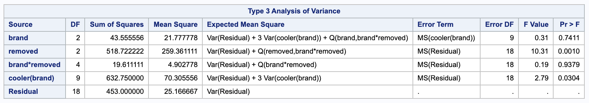
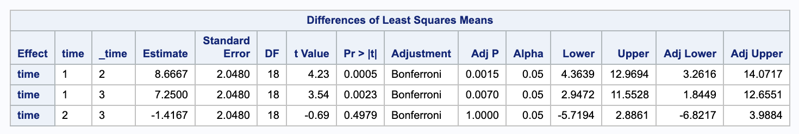
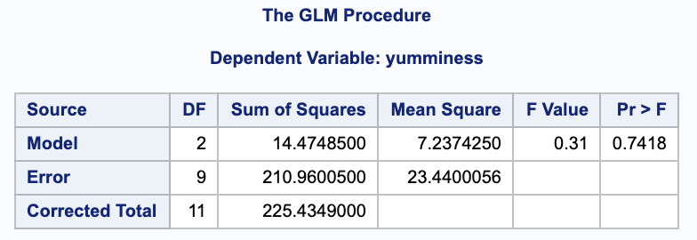
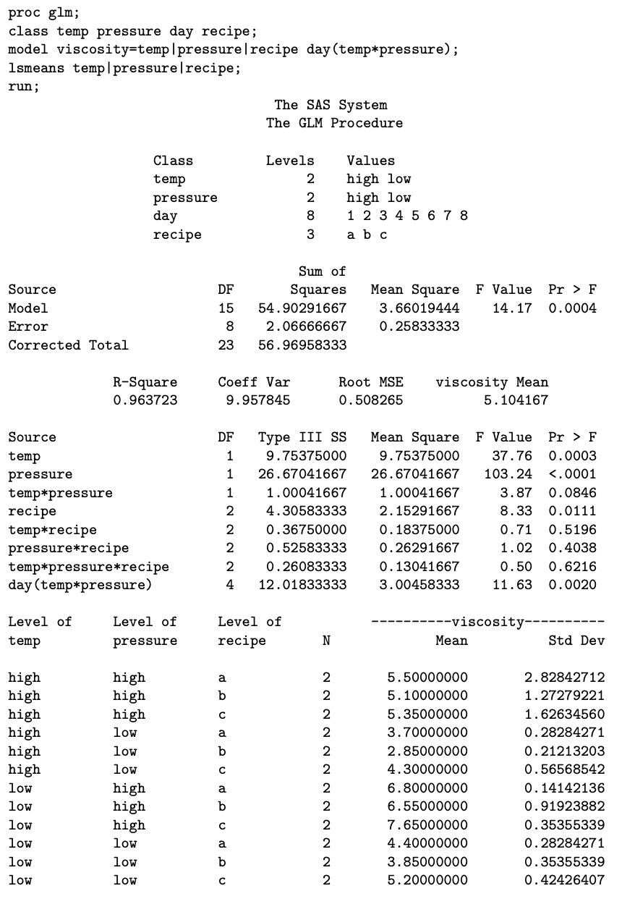

Problems: 1, 2, 3, 4

* Do not remove this line (it will not be displayed)
{:toc}

# 1
**An experiment evaluates the taste of three brands of ice cream under different storage conditions. The experiment calls for 12 coolers to be randomized to the 3 brands (4 coolers per brand). Within each cooler, there is room for three half-gallon cartons of ice cream, all from the same brand. One carton was sampled at random at the end of one day, then at the end of one week and then one month. Each carton was evaluated for flavor by a panel of tasters. These panel scores can be found in "icecream.dat" (or also "storage.dat") on the course webpage.**

$$
Y_{ijk} = \mu + \alpha_i + S_{k(i)} + \beta_j + (\alpha \beta)_{ij} + E_{ijk}
$$

* $Y_{ijk}$ - the taste of the $k$th replication of the $i$th brand tasted on the $j$th treatment (storage time)
* $\mu$ - the overall mean
* $\alpha_i$ - The brand of ice cream
	* $i = 1,2,3$
* $S_{k(i)}$ - The error associated with the $k$th replicate of the $i$th brand. (Between cooler of the same brand)
* $\beta_j$ - The treatment effect of how long the ice cream is stored.
	* $j = 1,2,3$.
* $(\alpha \beta)_{ij}$ - the joint effect of brand and time removed.
* $E_{ijk}$ - the error of the $j$th storage time for the $k$th cooler on the $i$th brand.


Notice there are $k=4$ replicates (4 coolers) for each brand-storage time combination.

## a.
**This is a split-plot experiment. What are the whole plot units?**

The coolers are the whole plot units.


## b.
**What is/are the whole plot factor(s)?**

The ice cream brand is the whole plot factor.

## c.
**What is/are the sub plot factor(s)?**

The sub plot factor is when the ice cream is removed from the cooler.

## d.
**Test for an interaction between storage time and brand. (Use $\alpha = 0.05$.)**

To test this, we want to check $MSAB / MSE$.

$$
	\begin{align}
		H_0: & \psi^2_{\alpha \beta} = 0 \\
		H_A: & \psi^2_{\alpha \beta} \neq 0
	\end{align}
$$


We can get an ANOVA table from SAS

```
proc mixed data = icecream method = type3;
  class brand cooler time;
  model taste = brand|time / ddfm=satterthwaite;
  random cooler(brand);
  
  lsmeans time / adjust = bon cl alpha = 0.05;
run;
```



We get $F = \frac{ 4.902778 }{ 25.167 }$. Comparing this to an  $F^{(a-1)(b-1)}\_{a(n-1)(b-1)} = F^{4}_{18}$ distribution, we get a p-value of 

$0.9379 > 0.05$, we fail to reject the null; the interaction effect is not significant.

## e.
**Test for main effects of storage time. Carry out pairwise comparisons among the three storage time tastes, using a Bonferroni correction to control the experimentwise error rate at .05.**

We can test the main effect of storage by testing $MSB / MSE$.

$$
	\begin{align}
		H_0: & \beta_i = 0 \\
		H_A: & \beta_i \neq 0
	\end{align}
$$

SAS gives us $F = \frac{ 259.3611 }{ 25.167 } = 10.31$. Comparing this to an  $F^{b-1}_{a(n-1)(b-1)} =F^{2}\_{18}$  distribution, we get a p-value of $0.0010 > 0.05$. Thus, we reject the null in favor of the alternative  that the effect due to time is significant.

We can do the Bonferonni adjustments in SAS. We are testing the confidence intervals between the difference in $\beta_j$ and $\beta_m$.

$$
\hat{Y}_{+j+} - \hat{Y}_{+m+} \pm t_{0.05 / (2\cdot 3), 18} \sqrt{\frac{ 2 }{ an } MSE}
$$




Here we can see the differences between time 1 and 2 and between 1 and 3 are significant but not the difference between 2 and 3.

## f.
**Test for main effects of brand. Report the standard error on any pairwise difference among brands.**

We can test the main effects between brand by testing $MSA / MS S(A)$.

$$
	\begin{align}
		H_0: & \alpha_i = 0 \\
		H_A: & \alpha_i \neq 0
	\end{align}
$$

From SAS we get $F = \frac{ 21.778 }{ 70.3056 } = 0.31$. Comparing this to a $F^{a}\_{a(n-1)} = F^{2}\_{9}$ distribution gives us a p-value of $0.741 > 0.05$. So we fail to reject the null; that is, the effect of brand is insignificant.

When comparing two brands, we would use $SE = \sqrt{\frac{ 2 }{ bn }MS S(A) } = \sqrt{\frac{ 2 }{ 3 \cdot 4 } \cdot 70.30556} = 3.4231$.


## g.
**Suppose you had averaged the data over storage time, reducing the total number of observations from 36 down to 12. Would the F-ratio for brand effect in a one-way ANOVA be the same as the F-ratio from part (f)? Try it and see.**
 
We can check in SAS and notice that the F-Value is the same between the one way model and the split plot model.


```
proc glm data = averageicecream; 
  class brand;
  model yumminess = brand;
run;
```





# 2
**Consider an experiment like the one described in 1.), with $a$ levels of a between-plots factor $A$, $n$ plots per level of $A$, for a total of $nA$ plots and $b$ levels of a within-plots factor $B$. Let $Y_{ijk}$ denote the measurement at level $j$ of factor $B$, from the $k^{th}$ whole plot randomized to level $i$ of factor $A$. The model is then**

$$
Y_{ijk} = \mu + \alpha_i + S_{k(i)} + \beta_j + (\alpha \beta)_{ij} + E_{ijk}
$$


**where $S_{k(i)} \stackrel{iid}{\sim} n(0, \sigma^2_s)$ and**

**$E_{ijk} \stackrel{iid}{\sim} n(0, \sigma^2)$, independently of $S_{k(i)}$.**

## a.
**Derive the standard error for a difference across levels of**

### i.
**$B$, for a fixed level of $A$, for example, $\overline{Y}\_{12+} - \overline{Y}\_{11+}$.**


$$
	\begin{align}
		V(\overline{Y}_{12+} - \overline{Y}_{11+}) & = V((\alpha_1 + \overline{S}_{+(1)} + \beta_{2} + (\alpha \beta)_{12} + \overline{E}_{12+}) \\
			& - (\alpha_1 + \overline{S}_{+(1)} + \beta_{1} + (\alpha \beta)_{11} + \overline{E}_{11+}))\\
			& = V((\beta_2 - \beta_1) + (\overline{ E }_{+2+} - \overline{ E }_{+1+}))\\
			& = 2 \cdot \frac{ \sigma^2 }{ n } \\
			& = 2 \cdot \frac{ MSE }{ n } \\ \\
		SE(\overline{Y}_{12+} - \overline{Y}_{11+}) & = \sqrt{2 \cdot \frac{ MSE }{ n }}
	\end{align}
$$

Since there is only one MS term here, we do not need to do a Satterthwaite approximation for the degrees of freedom.


### ii.
**$B$, after averaging over levels $A$, for example, $\overline{Y}\_{+2+} - \overline{Y}\_{+1+}$.**

$$
	\begin{align}
		V(\overline{Y}_{+2+} - \overline{Y}_{+1+}) & = V((\overline{\alpha}_+ + \overline{S}_{+(+)} + \beta_{2} + \overline{(\alpha \beta)}_{+2} + \overline{E}_{+2+}) \\
			& - (\overline{\alpha}_+ + \overline{S}_{+(+)} + \beta_{1} + \overline{(\alpha \beta)}_{+1} + \overline{E}_{+1+}))\\
			& = V((\beta_2 - \beta_1) + (\overline{ E }_{+2+} - \overline{ E }_{+1+}))\\
			& = 2 \cdot \frac{ \sigma^2 }{ a n } \\
			& = 2 \cdot \frac{ MSE }{ a n } \\ \\
		SE(\overline{Y}_{+2+} - \overline{Y}_{+1+}) & = \sqrt{ 2 \cdot \frac{ MSE }{ a n } }
	\end{align}
$$

Since there is only one MS term here, we do not need to do a Satterthwaite approximation for the degrees of freedom.

### iii.
**$A$, for a fixed level of $B$, for examples $\overline{Y}\_{21+} - \overline{Y}\_{11+}$.**

$$
	\begin{align}
		V(\overline{Y}_{21+} - \overline{Y}_{11+}) & = V( (\alpha_2 + \overline{ S }_{+(2)} + \beta_{1} + (\alpha \beta)_{21} + \overline{ E }_{21+} ) \\
			& - (\alpha_1 + \overline{ S }_{+(1)} + \beta_{1} + (\alpha \beta)_{11} + \overline{ E }_{11+}) ) \\
			& = V((\overline{ S }_{+(2)} - \overline{ S }_{+(1)}) + (\overline{ E }_{21+} - \overline{ E }_{11+})) \\
			& = 2 \cdot \frac{ \sigma_S^2 }{ n } + 2 \cdot \frac{ \sigma^2 }{ n } \\
			& = 2 \cdot \frac{ \sigma_S^2 + \sigma^2 }{ n } \\
			& = \frac{ 2 }{ n } \cdot \frac{ b \sigma_S^2 + b \sigma^2 }{ b } \\
			& = \frac{ 2 }{ n } \cdot \frac{ b \sigma_S^2 + 1 \sigma^2  +  (b-1) \sigma^2 }{ b } \\
			& = \frac{ 2 }{ nb } \cdot ( MS S(A) + (b-1)MSE) \\
		SE(\overline{Y}_{21+} - \overline{Y}_{11+}) & = \sqrt{ \frac{ 2 }{ nb } \cdot ( MS S(A) + (b-1)MSE)} \\
	\end{align}
$$

Since we have multiple MS terms, we need to do a Satterthwaite approximation of the degrees of freedom.


### iv.
**$A$, after averaging over levels of $B$, for example $\overline{Y}\_{2++} - \overline{Y}\_{1++}$.**

$$
	\begin{align}
		V(\overline{Y}_{2++} - \overline{Y}_{1++}) & = V( (\alpha_2 + \overline{ S }_{+(2)} + \overline{\beta}_{+} + \overline{(\alpha \beta)}_{2+} + \overline{ E }_{2++} ) \\
			& - (\alpha_1 + \overline{ S }_{+(1)} + \overline{\beta}_{+} + \overline{(\alpha \beta)}_{1+} + \overline{ E }_{1++} ) ) \\
			& = V((\overline{ S }_{+(2)} - \overline{ S }_{+(1)}) + (\overline{ E }_{2++} - \overline{ E }_{1++})) \\
			& = 2 \cdot \Big( \frac{ \sigma_S^2  }{ n }  + \frac{ \sigma^2 }{ nb } \Big) \\
			& = 2 \cdot \frac{ b \sigma_S^2 + \sigma^2 }{ nb } \\
			& = \frac{ 2  }{ bn } MSS(A) \\ \\
		SE(\overline{Y}_{2++} - \overline{Y}_{1++}) & = \sqrt{ \frac{ 2  }{ bn } MSS(A) }
	\end{align}
$$

Since there is only one MS term here, we do not need to do a Satterthwaite approximation for the degrees of freedom.

### v.
**$A$, and across levels of $B$, for example $\overline{Y}\_{22+} - \overline{Y}\_{11+}$.**

$$
	\begin{align}
		V(\overline{Y}_{22+} - \overline{Y}_{11+}) & = V( (\alpha_2 + \overline{ S }_{+(2)} + \beta_{2} + (\alpha \beta)_{22} + \overline{ E }_{22+} ) \\
			& - (\alpha_1 + \overline{ S }_{+(1)} + \beta_{1} + (\alpha \beta)_{11} + \overline{ E }_{11+} ) ) \\
			& = V( (\overline{ S }_{+(2)} - \overline{ S }_{+(1)}) + (\overline{ E }_{22+} - \overline{ E }_{11+}) )\\
			& = 2 \cdot \frac{ \sigma_{S}^2 }{ n } -2\cdot \frac{ \sigma^2 }{ n } \\
			& = \frac{ 2 }{ n } \cdot \frac{ b \sigma_S^2 + b \sigma^2 }{ b } \\
			& = \frac{ 2 }{ n } \cdot \frac{ b \sigma_S^2 + 1 \sigma^2  +  (b-1) \sigma^2 }{ b } \\
			& = \frac{ 2 }{ nb } \cdot ( MS S(A) + (b-1)MSE) \\ \\
		SE(\overline{Y}_{22+} - \overline{Y}_{11+}) & = \sqrt{ \frac{ 2 }{ nb } \cdot ( MS S(A) + (b-1)MSE)  }
	\end{align}
$$


Since we have multiple MS terms, we need to do a Satterthwaite approximation of the degrees of freedom.

## b.
**For each of the above, construct an estimate of the standard error using linear combinations of $MS$ terms and indicate whether or not an approximation for $df$ is required.**


<!--

Nevermind don't do these.

# 3
**An experiment investigates three formulations of a diet for rats. The response is absorption of a certain chemical by the kidneys. The design involves four litters, each with three rats (a total of 12 rats). Within each litter, rats are randomized to diet formulation. Another factor of interest is the method of measuring this absorption. There are three methods up for investigation, with differences that may be subtle compared to diet formulation effects. So, three specimens are sampled from each rat, and these specimens are randomized to the methods. Data are available as "absorb.dat".**


## a.
**Identify the name of the experimental design used here.**


## b.
**Propose a statistical model.**


## c.
**Sketch an ANOVA table, with columns for source, df and EMS.**


## d.
**Test for an interaction between formulation and method. Use $\alpha = 0.05$.**


## e.
**Test ($\alpha = 0.05$) for simple method effects separately at each level of formulation. (It may be helpful to use the slice option for the lsmeans statement.)**


## f.
**Test for the simple effects of formulation using method 3. Carry out all three pairwise comparisons among formulations using this method, identifying any significant differences.**


# 4
**A food scientist studies the effects of three factors on the viscosity of ice cream:**

* $A$: temperature (2 levels)
* $B$: pressure (2 levels)
* $C$: recipe (3 levels).


**The production equipment is such that temperature and pressure must be held constant for the entire day. The experiment is conducted over 8 days, which are randomly assigned to the four treatment combinations of temperature and pressure. Three batches are produced each day, one of each recipe, for a total of 24 batches. Each batch will have a single viscosity measurement taken. Pertinent SAS code and output are given on the next page.**


## a.
**Propose a mixed model for the viscosity measurements with random day effects. Take the effects of all three treatment factors, $A, B, C$ and their first and second order interactions to be fixed. Assume normal distributions for all random effects.**


## b.
**Carry out $F$-tests for the four hypotheses listed below. For each, report the $F$-ratio, the
associated degrees of freedom, a conclusion regarding the hypothesis, and where available
from the output, a $p$-value**


$$
\begin{array}{l}
\text{Hypothesis} \\ \hline
\text{No } 2^{nd} \text{ order interaction between temperature, pressure and recipe} \\
\text{No } 1^{st} \text{ order interaction between temperature and pressure} \\
\text{No main effect of pressure} \\
\text{No main effect of recipe} \\ \hline
\end{array}
$$


## c.
**Estimate the variance component for the random day effect.**


## d.
**Report an estimate and standard error for**


### i.
**the marginal mean of recipe 1**


### ii.
**the difference between recipes 1 and 2**


### iii.
**the marginal mean of temperature 1**


### iv.
**the difference between tempeartures 1 and 2.**


-->
