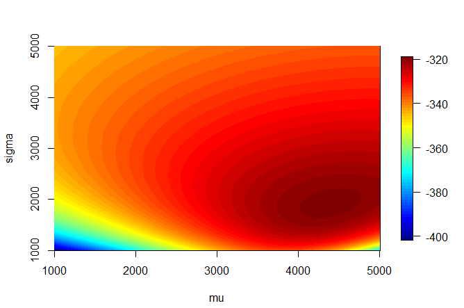
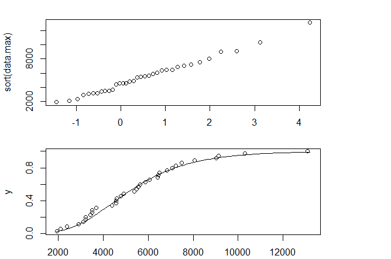

* Do not remove this line (it will not be displayed)
{:toc}


# 2.1
**Let $Y_1, \dots, Y_n$ be iid positive random variables such that $Y^{(\lambda)}$ is assumed to have a normal$(\mu, \sigma^2)$ distributions where**

$$
Y^{(\lambda)} = 
\begin{cases}
\frac{ Y^\lambda -1 }{ \lambda } & \text{when } \lambda \neq 0 \\
\log(Y) & \text{when } \lambda = 0
\end{cases}
$$

**(The normality assumption is actually only possible for $\lambda = 0$, but ignore that detail.) Derive the log likelihood $\ell_n (\mu, \sigma, \lambda \| \mathbf Y)$ of the observed data $Y_1, \dots, Y_n$. Note that $y^{(\lambda)}$ is a strictly increasing function of $y$ (the derivative is always positive). It might be easiest to use the "distribution funtion" method to get the density of $Y_i$, but feel free to use Jacobians, etc.**


$$
\begin{align}
L(\mu, \sigma, \lambda | Y) 
\end{align}
$$

# 2.2
**One of the data sets obtained from the 1984 consulting session on max flow of rivers was $n=35$ yearly maxima from one station displayed in the following R printout.**


```
> data.max
[1] 5550 4380 2370 3220 8050 4560 2100
[8] 6840 5640 3500 1940 7060 7500 5370
[15] 13100 4920 6500 4790 6050 4560 3210
[22] 6450 5870 2900 5490 3490 9030 3100
[29] 4600 3410 3690 6420 10300 7240 9130
```

## a.
**Find the maximum likelihood estimates for the extreme value location-scale density $f(y; \mu, \sigma) = f_0((y-\mu)/\sigma)/\sigma$, where**

$$
f_0(t)=e^{-t}e^{-e^{-t}}.
$$

Before coding this up to find the MLEs, we need to find the log-likelihood.

$$
\begin{align}
L(\mu, \sigma | Y) & = \prod_{i=1}^n f_0(\frac{ y-\mu }{ \sigma })/\sigma \\
    & = \frac{ 1 }{ \sigma^n } \prod_{i=1}^n e^{-\frac{ y_i - \mu }{ \sigma }} \exp(-e^{-\frac{ y_i - \mu }{\sigma}}) \\ \\
\ell(\mu, \sigma | Y ) & = -n \log(\sigma) + \sum_{i=1}^n (\frac{ -y_i + \mu }{ \sigma }) - \sum_{i=1}^n \exp(\frac{ -y_i + \mu }{\sigma}) \\
\end{align}
$$

```
# log likelihood
llik = function(mu, sigma, dta=data.max){
  n = length(dta)
  return(
    -n * log(sigma) + (-sum(dta) + n * mu)/sigma - sum(exp( (-dta + mu)/sigma ))
  )
}


mu <- seq(1000,5000, length.out =1000)
sigma  <- seq(1000,5000, length.out =1000)
mu_grid <- rep(mu, each=1000)
sigma_grid  <- rep(sigma, 1000)
out <- mapply( FUN=llik , mu_grid , sigma_grid)

out_mat <- matrix(out, nrow=1000, byrow = TRUE)

require(fields)

image.plot(mu, sigma, out_mat)
```



We would expect our estimates to lie in the dark red region of this heatmap.

```
# NLM minimizes so take the negative to find the max
nllik = function(theta,dta=data.max){
  return(-llik(mu=theta[1], sigma=theta[2], dta=dta))
}

nlm_out <- nlm(nllik, c(1,2), dta=data.max)
nlm_out
# $minimum
# [1] 319.3639
# 
# $estimate
# [1] 4395.147 1882.499
# 
# $gradient
# [1]  2.904802e-08 -2.645145e-08
# 
# $code
# [1] 1
# 
# $iterations
# [1] 36
```

Our estimates are $\mu = 4395.147$ and $\sigma = 1882.499$. These are where we would expect from our heatmap. These values also seemed invariant to different starting values after a few tests.


## b.
**Draw a QQ plot and the parametrically estimated distribution function overlaid with the empirical distribution function.**

```
muhat=nlm_out$estimate[1]
sigmahat=nlm_out$estimate[2]

par(mfrow = c(2,1)) # gives two plots per page
qextval<-function(t,mu,sigma){-sigma*log(-log(t))+mu}
pextval<-function(x,mu,sigma){exp(-exp(-(x-mu)/ sigma))}

plot(qextval(ppoints(data.max),0,1),sort(data.max))
seq(1900,13200,,100)->x # a grid of values
pextval(x,muhat,sigmahat)->y # est. cdf for grid
plot(x,y,type="l") # plots est. ext. value cdf
1:35/35->ht # heights for empirical cdf
points(sort(data.max),ht) # adds empirical cdf
```



Our QQ Plot looks like a straight line, which means we have a good estimate. Also the CDF follows the data fairly well.

# 2.3
**Recall the ZIP model**

\$$
\begin{align}
P(Y = 0) & = p + (1-p) e^{-\lambda} \\
P(Y = y) & = (1-p) \frac{ \lambda^y e^{-\lambda} }{ y! } & y = 1, 2, \dots
\end{align}
$$


## a. 
**Reparameterize the model by defining**

$$
\pi \equiv P(Y = 0) = p + (1-p)e^{-\lambda}.
$$

**Solve for $p$ in terms of $\lambda$ and $\pi$, and then substitute so that the density depends on only $\lambda$ and $\pi$.**

$$
\begin{align}
\pi & = p + (1-p)e^{-\lambda} \\
\pi & = p + e^{-\lambda} - p e^{-\lambda} \\
\pi - e^{-\lambda} & = p (1 -  e^{-\lambda}) \\
\frac{ \pi -  e^{-\lambda} }{ 1 - e^{-\lambda} }& = p
\end{align}
$$


$$
F_Y(y; \pi, \lambda) =
\begin{cases}
\pi & y = 0\\
\Big( 1 -  \frac{ \pi -  e^{-\lambda} }{ 1 - e^{-\lambda} } \Big) \frac{ e^{-\lambda} \lambda^y }{ y! } & y = 1, 2, \dots
\end{cases}
$$

## b.
**For an iid sample of sample of size $n$, let $n_0$ be the number of zeroes in the sample. Assuming that the complete data is available (no grouping), show that the likelihood factors into two pieces and that $\widehat \pi = n_0 / n$ (This illustrates why we obtained exact fits for the 0 cell in Example 2.1 p 32.) Also show that the maximum likelihood estimator for $\lambda$ is the solution to a simple nonlinear equation involving $\overline{ Y_+ }$ (the average of the nonzero values).**

$$
\begin{align}
L(\lambda, \pi | Y) & = \prod_{i=1}^n f_Y(y_i) \\
    & = \pi^{n_0} \Big[ \Big( 1 -  \frac{ \pi -  e^{-\lambda} }{ 1 - e^{-\lambda} } \Big) e^{-\lambda}\Big]^{n-n_0} \prod_{Y_i > 0} \frac{ \lambda^{y_i} }{ y_i ! } \\
\ell(\lambda, \pi | Y) & = n_0 \log(\pi) + (n - n_0) \Big[ \log\Big( 1 -  \frac{ \pi -  e^{-\lambda} }{ 1 - e^{-\lambda} } \Big) - \lambda\Big] + \sum_{Y_i > 0} y_i \log(\lambda) - \log(y_i!) \\ \\
\frac{ \partial \ell }{\partial \pi} & = \frac{ n_0 }{ \pi } -\frac{ n - n_0 }{ 1 - \pi } + 0 \stackrel{\text{set}}{=}0\\
0 & = \frac{ n_0( 1-\widehat\pi) - \widehat\pi(n-n_0) }{ \widehat\pi (1-\widehat\pi) } \\
\widehat\pi = \frac{ n_0 }{ n } \\ \\
\frac{ \partial \ell }{\partial \lambda } & = 0 + \frac{ e^\widehat\lambda(-n + n_0) }{ -1 + e^\widehat\lambda } + \sum_{y_i > 0} \frac{ y_i }{ \widehat\lambda } \stackrel{\text{set}}{=}0 \\
\frac{ e^\widehat\lambda(-n + n_0) }{ -1 + e^\widehat\lambda } & = - \sum_{y_i > 0} \frac{ y_i }{ \widehat\lambda } \\

\frac{ \widehat\lambda }{ 1 - e^{-\widehat\lambda} } & = \overline{ Y }_+
\end{align}
$$

## c.
**Now consider the truncated or conditional sample consisting of the $n-n_0$ nonzero value. Write down the conditional likelihood for these values and obtain the same equation for $\hat \lambda_{MLE}$ as in a). (First write down the conditional density of $Y$ given $Y > 0$.)**

Instead of a Zero Inflated Poisson, we are now dealing with a Zero Truncated Poisson.

$$
g(y ; \lambda) = P(Y = y | Y > 0) = \frac{ f(y; \lambda) }{ 1- f(0; \lambda) } = \frac{ \lambda^y e^-\lambda }{ y! (1-e^-\lambda) } = \frac{ \lambda^y}{ y!(e^\lambda - 1) }
$$

We can now find the MLE using this PDF.

$$
\begin{align}
L(\lambda | Y) & = \prod_{i=1}^{n-n_0} g(y; \lambda) \\
    & = \prod_{i=1}^{n-n_0} \frac{ \lambda^{y_i}}{ y_i!(e^\lambda - 1) } \\
\ell(\lambda | Y) & = \sum_{i=1}^{n-n_0} y_i \log(\lambda) - \log(y_i!) - \log(e^\lambda - 1) \\
\frac{ \partial \ell }{\partial \lambda} & = \frac{ \sum  y_i }{ \lambda } - 0 - \frac{ (n-n_0) e^\lambda }{ e^\lambda - 1} \stackrel{\text{set}}{=}0 \\
\frac{ \widehat\lambda }{ 1 - e^{-\widehat\lambda} } & = \overline{ Y }_+
\end{align}
$$

# 2.9
**The sample $Y_1, \dots , Y_n$ is iid with distribution function**

$$
F_Y(y; p_0, p_1, \alpha, \beta) = p_0 I(0 \leq y) + (1 - p_0 - p_1) F(y ; \alpha, \beta) + p_1 I(y \geq 1).
$$

**where $F(y; \alpha, \beta)$ is the beta distribution. You may recall that the beta density is positive on $0 < y< 1$ so that $F(0; \alpha, \beta) = 0$ and $F(1; \alpha , \beta) = 1$,**

**but otherwise you do not need to use or know its form in the following; just use $F(y; \alpha, \beta)$ or $f(y; \alpha, \beta)$ where needed. The physical situation relates to test scores standardized to lie in $[0,1]$, but where $n_0$ of the sample values are exactly 0 (turned into a blank test), $n_1$ values are 1 (a perfect score), and the rest are in between 0 and 1. Use the $2h$ method to show that the likelihood is**

$$
p_0^{n_0}p_1^{n_1}(1 - p_0 - p_1)^{n-n_0-n_1} \prod_{0 < Y_i<1} f(Y_i; \alpha, \beta).
$$


$$
\begin{align}
L(\alpha, \beta | y) & =  \prod_{i=1}^n f_Y(y_i; \alpha, \beta) \\
    & = \lim_{h\rightarrow = 0^+} \prod_{i=1}^n \frac{ 1 }{ 2 h } (F(y+h) - F(y - h)) \\
    & = \lim_{h\rightarrow = 0^+}  \prod_{i=1}^n \frac{ 1 }{ 2h }\Big[ p_0 \mathbb I (0 \leq y_i +h) +p_1 \mathbb I (y_i+h > 1) + (1-p_0-p_1) F(y_i + h) - p_0 \mathbb I (0 \leq y_i -h) -p_1 \mathbb I (y_i-h > 1) + (1-p_0-p_1) F(y_i - h)\Big] \\
    & = \lim_{h\rightarrow = 0^+} p_0^{n_0} p_1^{n_1} \prod_{0 \leq Y_i \leq 1} \frac{ 1 }{ 2h } (1-p_0-p_1) (F(y+h) - F(y-h)) \\
    & = \lim_{h\rightarrow = 0^+} p_0^{n_0} p_1^{n_1} (1-p_0-p_1)^{n-n_0-n_1} \prod_{0 \leq Y_i \leq 1}\frac{ 1 }{ 2h }  (F(y+h) - F(y-h)) \\ 
    & = p_0^{n_0} p_1^{n_1} (1-p_0-p_1)^{n-n_0-n_1} \prod_{0 \leq Y_i \leq 1} f(y_i; \alpha, \beta)
\end{align}
$$

# 2.16
**The standard Box-Cox regression model (Box and Cox 1964) assumes that after transformation of the observed $Y_i$ to $Y^{(\lambda)}$ we have the linear model**

$$
Y_i^{(\lambda)} = x_i^T \beta + e_i,\ i = 1, \dots , n.
$$

**where $Y_i$ is assumed positive and the $x_i$ are known constants, $i = 1, \dots , n$. In addition assume that $e_1, \dots , e_n$ are iid normal$(0, \sigma^2)$ errors. Recall that the Box-Cox transformation is defined in Problem 2.1 (p.107) and is strictly increasing for all $\lambda$. Show that the likelihood is**

$$
L(\beta, \sigma, \lambda | \{ Y_i, x_i\}^n_{i=1} ) = \Big( \frac{ 1 }{ \sqrt{ 2 \pi \sigma^2 }} \Big)^n \exp \Big[ - \sum_{i=1}^n \frac{ (Y_i^{(\lambda)} - x_i^T \beta)^2 }{ 2 \sigma^2 } \Big] \times \prod_{i=1}^n \Bigg\lvert \frac{ \partial t^{(\lambda)} }{\partial t} \Big\rvert_{t=Y_i} \Bigg\rvert.
$$

# 2.22 (part a)
**Consider the standard one-way ANOVA situation with $Y_{ij}$ distributed as $N(\mu_i, \sigma^2), \ i = 1, \dots, k, \ j = 1, \dots, n_i$, and all the random variables are independent.**

## a
**Form the log likelihood, take derivatives, and show that the MLEs are**

$\widehat\mu_i = \overline{ Y }_i, \ i = 1, \dots k,$

$\widehat\sigma^2 = SSE/ N$ 

**where $SSE = \sum_{i=1}^{k} \sum_{j=1}^{n_i} \Big( Y_{ij} - \overline{ Y }_i \Big)^2$**

**and $N = \sum_{i=1}^{k} n_i$.**

