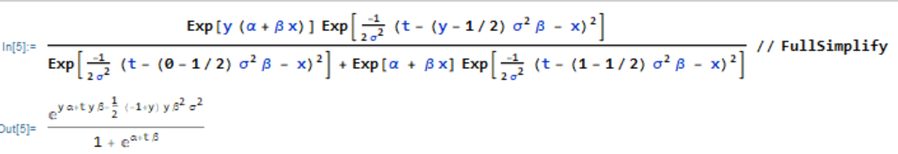

* Do not remove this line (it will not be displayed)
{:toc}

2.12, 2.22, 2.24, 2.25, 1

# 2.12
**For an iid sample $Y_1 , \dots , Y_n$, Type II censoring occurs when we observe only the smallest $r$ value. For example, in a study of light bulb lifetimes, we might stop the study after the first $r = 10$ bulbs have failed. Assuming a continuous distribution with density $f(y; \theta)$, the likelihood is just the joint density of the smallest $r$ order statistics evaluated at those order statistics:**

$$
L(\theta; Y_{(1)}, \dots Y_{(r)}) = \frac{ n! }{ (n-r)! } \Big[ \prod_{j=1}^r f(Y_{(j)}; \theta) \Big] [1 - F(Y_{(r)}; \theta)]^{n-r}.
$$

**For this situation, let $f(y; \sigma) = e^{-y / \sigma} / \sigma$ and find the MLE of $\sigma$. Also provide an example.**

Thinking of this in the context of right censoring, notice that the first $r$ order statistics will follow the distribution and the following values will all be taken via the CDF. Thus, we can use our exponential distribution provided for the PDF and CDF of the likelihood.

$$
F_Y(y) = \int_{0}^{\infty} \frac{ 1 }{ \sigma } e^{-y / \sigma} dy = 1 - e^{-y / \sigma}
$$

Now we can find our likelihood.

$$
\begin{align}
L(\theta | Y_{(1)}, \dots , Y_{(r)}) & = \frac{ n! }{ (n-r)! } \Big[ \prod_{j=1}^r f(Y_{(j)}; \theta) \Big] [1 - F(Y_{(r)}; \theta)]^{n-r} \\
    & = \frac{ n! }{ (n-r)! } \Big[ \prod_{j=1}^r \frac{ 1 }{ \sigma } e^{ y_{(i)} / \sigma}\Big] [1 -(1 - e^{-y_(r) / \sigma})]^{n-r} \\
    & = \frac{ n! }{ (n-r)! } \sigma^{-r}  e^{\sum_{j=1}^r y_{(i)} / \sigma} [e^{-y_(r) / \sigma})]^{n-r} \\
\ell(\theta | Y_{(1)}, \dots , Y_{(r)}) & = c + -r \log(\sigma) _ \frac{ \sum_{j=1}^r  y_{(i)}}{ \sigma } + \frac{ (n-r) y_{(r)} }{ \sigma } \\ 
\frac{ \partial \ell }{\partial \sigma} & = \frac{ -r }{ \sigma } + \frac{  \sum_{j=1}^r y_{(i)} +  (n-r) y_{(r)}}{ \sigma^2 } \stackrel{\text{set}}{=} 0 \\
\widehat \sigma & = \frac{ \sum_{j=1}^r y_{(i)} +  (n-r) y_{(r)} }{ r }
\end{align}
$$

Finally, we can check the second derivative to ensure that our optimum is a max.

$$
\begin{align}
\frac{ \partial ^2  \ell }{\partial \sigma^2} |_{\sigma = \widehat \sigma} & = \frac{ r }{  \widehat \sigma^2 } - \frac{ 2 r \widehat \sigma }{ \sigma^3 } \\
    & = \frac{ -r }{ \widehat \sigma^2 } < 0
\end{align}
$$

One example of a Type II censoring would be a longitudinal clinical trial where the trial is stopped when a certain number of participants die.
# 2.22

## b

**Now define $V_1^T = (Y_{i1} - \overline{ Y }\_i, \dots , Y\_{i,n_i-1} - \overline{ Y }_i)$. Using standard matrix manipulation with the mulitvariate normal distribution, the density of $V_i$ is given by**

$$
(2 \pi)^{(n_i-1)/2} n_i^{1/2} \sigma^{-(n_i-1)} \exp \Big( -\frac{ 1 }{ 2 \sigma^2 } v_i^T (I_{n_i-1} +J_{n_i-1} ) v_i \Big)
$$

**where $I_{n_i-1}$ is the $n_i-1$ by $n_i - 1$ identity matrix and $J_{n_i-1}$ is an $n_i - 1$ by $n_i - 1$ matrix of 1's. Now form the (marginal) likelihood based on $V_1, \dots , V_k$ and show that the MLE for $\sigma^2$ is now $\widehat \sigma^2 = SSE/(N-k)$.**

Notice that the distribution of $V_i$ does not have $\mu$ in it, and is thus ancillary for $\mu$. So, we can maximize this likelihood to get a marginal likelihood estimate of $\sigma^2$.

$$
\begin{align}
L_M(\sigma^2) & = \prod_{i=1}^k f_{V_i} \\
    & = (2 \pi)^{\frac{ - \sum_{i=1}^k (n_i - 1) }{ 2 }} \Big( \prod_{i=1}^k n_i^{1/2} \Big) \sigma^{- \sum_{i=1}^k(n_i -1)} \exp{\frac{ -1 }{ 2 \sigma^2 } \sum_{i=1}^k v_i^T (I_{n_i-1} + J_{n_i - 1}) v_i} \\
\ell_M(\sigma^2) & = c + (-\frac{ 1 }{ 2 } \sum_{i=1}^k (n_i-1)) \log(\sigma^2) - \frac{ \sum_{i=1}^k v_i^T (I_{n_i-1} + J_{n_i - 1}) v_i }{ 2 \sigma^2 } \\
\frac{ \partial \ell_M }{\partial \sigma^2} & = \frac{ -(N-k) }{ 2 \sigma^2 } + \frac{ \sum_{i=1}^k v_i^T (I_{n_i-1} + J_{n_i - 1}) v_i }{ 2 (\sigma^2)^2 } \stackrel{\text{set}}{=} 0 \\
\widehat\sigma^2_{M,MLE} & = \frac{ \sum_{i=1}^k v_i^T (I_{n_i-1} + J_{n_i - 1}) v_i }{ N - k } \\ \\
\sum_{i=1}^{k} v_i^T (I_{n_i-1} + J_{n_i - 1} ) v_i & = \sum_{i=1}^k v_i^T v_i + v_i ^T J_{i-1} v_i \\
    & = \sum_{i=1}^k \Big[ \sum_{j=1}^{n_i-1} (Y_{ij} - \overline{ Y_i })^2 +
    \begin{bmatrix}
    \sum_{j=1}^{n_1-1} (Y_{ij} - \overline{ Y_i })^2 & \dots & \sum_{j=1}^{n_1-1} (Y_{ij} - \overline{ Y_i })^2
    \end{bmatrix}
     v_i \Big]\\
    & = \sum_{i=1}^k \Big[ \sum_{j=1}^{n_i-1} (Y_{ij} - \overline{ Y_i })^2 + \sum_{l=1}^{n_i-1} \Big( (Y_{il} - \overline{ Y_i }) \sum_{j=1}^{n_i-1}(Y_ij - \overline{ Y_i }) \Big) \Big]\\
    & = \sum_{i=1}^k \Big[ \sum_{j=1}^{n_i-1} (Y_{ij} - \overline{ Y_i })^2 + \Big( \sum_{j=1}^{n_i-1} Y_{ij} - \overline{ Y }\Big)^2 \Big]\\
    & = \sum_{i=1}^k \Big[ \sum_{j=1}^{n_i-1} (Y_{ij} - \overline{ Y_i })^2 + \Big( Y_{n_i} - \overline{ Y }\Big)^2 \Big]\\
    & = \sum_{i=1}^k \sum_{j=1}^{n_i} (Y_{ij} - \overline{ Y_i })^2 \\
& = SSE \\ \\
\widehat\sigma^2_{M,MLE} & = \frac{ SSE }{ N -k}
\end{align}
$$

## c
**Finally, let us take a more general approach and assume that $Y$ has an $N$ - dimensional multivariate normal distribution with mean $X \beta$ and covariance matrix $\Sigma = \sigma^2 Q(\theta)$, where $X$ is an $N \times p$ full rank matrix of known constants, $\beta$ is a $p$-vector of regression parameters, and $Q(\theta)$ is an $N \times N$ standardized covariance matrix depending on the unknown parameter $\theta$. Typically $\theta$ would consist of variance component and/or spatial correlation parameters. We can concentrate the likelihood by noting that if $Q(\theta)$ were known, then the generalized least squares estimator would be $\widehat\beta(\theta) = (X^T Q(\theta)^{-1} X)^{-1} X^T Q(\theta)^{-1} Y$. Substituting for $\beta$ yields the profile log likelihood**

$$
\frac{ -N }{ 2 } \log(2\pi) - N \log(\sigma) - \frac{ 1 }{ 2 } \log ( | Q(\theta) | ) - \frac{ GSSE(\theta) }{ 2 \sigma^2 }.
$$

**where $GSSE(\theta) = (Y - X \widehat\beta(\theta)^T Q(\theta)^{-1}(Y - X \widehat\beta(\theta)$. To connect with part a), let $Q(\theta)$ be the identity matrix (so that $GSSE(\theta)$ is just SSE) and find the maximum likelihood estimator of $\sigma^2$.**

$$
\begin{align}
\ell_P(\sigma^2) & = -\frac{ N }{ 2 } \log(2 \pi) - \frac{ N }{ 2 }\log(\sigma^2) - \frac{ 1 }{ 2 } \log( |Q(\theta) |) - \frac{ GSSE(\theta) }{ 2 \sigma^2 } \\
\frac{ \partial \ell_P }{\partial \sigma^2} & = \frac{ -N }{ 2 \sigma^2 } + \frac{ SSE }{ 2 (\sigma^2)^2 } \stackrel{\text{set}}{=} 0 & Q(\theta) = I \\
\widehat \sigma^2_{P,MLE} & = \frac{ SSE }{ N }
\end{align}
$$

## d
**Continuing part c), the REML approach is to transform to $V = A^T Y$, where the $N-p$ columns of $A$ are linearly independent and $A^T X = 0$ so that $V$ is $MN(0, A^T \Sigma A)$. A special choice of $A$ to the REML log likelihood**

$$
-\frac{ N-p }{ 2 } \log(2 \pi) - (N-p) \log(\sigma) - \frac{ 1 }{ 2 } \log (|X^T X|) - \frac{ 1 }{ 2 } \log(| X^T Q(\theta)^{-1} X|) - \frac{ 1 }{ 2 } \log(|Q(\theta)|) - \frac{ GSSE(\theta) }{ 2 \sigma^2 }
$$

**To connect with part b) let $Q(\theta)$ be the identity matrix and find the maximum likelihood estimator of $\sigma^2$**

$$
\begin{align}
\frac{ \partial \ell_P }{\partial \sigma^2} & = \frac{ N-p }{ 2 \sigma^2 } + \frac{ SSE }{ 2 (\sigma^2)^2 } \stackrel{\text{set}}{=} 0 \\
\widehat \sigma^2_{REML} & = \frac{ SSE }{ N-p }
\end{align}
$$

# 2.24
**For the Neyman-Scott solution in the section 2.4.3 (p. 59), use the fact that if $(X_1, X_2)^T$ is distributed as $MN\\{ (\mu_1, \mu_2)^T, \Sigma\\}$, then $(X_1 \| X_2)$ is distributed as $MN \\{ \mu_1 + \Sigma_{12} \Sigma_{22}^{-1}(X_2 - \mu_2), \Sigma_{11} - \Sigma_{12} \Sigma_{22}^{-1} \Sigma_{21} \\}$, to show that $Y_{i1}\| Y_{i1}+Y_{i2}$ is distributed as $N\\{ (Y_{i1} + Y_{i2})/2, \sigma^2/2 \\}$.**

Recall $Y_{i1} \sim N(\mu_i, \sigma^2)$ and $Y_{i1} + Y_{i2} \sim N(2 \mu_i, 2 \sigma^2)$. Also notice that

$$
\begin{align}
Cov(Y_{i1}, Y_{i1} + Y_{i2}) & = E(Y_{i1} (Y_{i1} + Y_{i2})) - E(Y_{i1}) E(Y_{i1} + Y_{i2}) \\
    & = E(Y_{i1}^2 + Y_{i1} Y_{i2}) - \mu_i 2 \mu_i \\
    & = E(Y_{i1}^2) + E(Y_{i1} Y_{i2}) - 2 \mu_i^2 \\
    & = (\mu_i^2 + \sigma^2) + E(E(Y_{i1} Y_{i2})|Y_{i1}) - 2 \mu_i^2 \\
    & = \sigma^2 + E(Y_{i1} E( Y_{i2}|Y_{i1})) - \mu_i^2 \\
    & = \sigma^2 + \mu_i^2 - \mu_i^2 \\
    & = \sigma^2.
\end{align}
$$

Let 

$$
A = \begin{bmatrix}
1 & 0 \\
1 & 1 
\end{bmatrix}.
$$

Thus,

$$
\begin{align}
A \begin{bmatrix}
Y_{i1} \\
Y_{i2}
\end{bmatrix} = 
\begin{bmatrix}
Y_{i1} \\
Y_{i1} + Y_{i2}
\end{bmatrix} \sim 
MVN ( A (\mu_i, \mu_i)^T, A (\sigma^2 I )A^T)
= 
MVN \Big( 
\begin{bmatrix}
\mu_i \\
2 \mu_i
\end{bmatrix},
\begin{bmatrix}
\sigma^2  & \sigma^2 \\
\sigma^2 & 2 \sigma^2
\end{bmatrix}
\Big).
\end{align}
$$

Finally,

$$
\begin{align}
Y_{i1}| Y_{i1}+Y_{i2} & \sim N(a, b) \\
a & = \mu_i + \sigma^2 \frac{ 1 }{ 2\sigma^2 } (Y_{i1} + Y_{i2} - 2 \mu_i) \\
    & = \mu_i + \frac{ 1 }{ 2 } (Y_{i1} + Y_{i2}) - \mu_i \\
    & = \frac{ Y_{i1} + Y_{i2} }{ 2 } \\
b & = \sigma^2 - \sigma^2 \frac{ 1 }{ 2 \sigma^2 } \sigma^2 \\
    & = \sigma^2 - \frac{ 1 }{ 2 } \sigma^2 \\
    & = \frac{ \sigma^2 }{ 2 }.
\end{align}
$$

# 2.25 
**If $Y$ is from an exponential family where $(W , V)$ are jointly sufficient for
$(\theta_1, \theta_2)$, then the conditional density of $W \| V$ is free of the nuisance parameter $\theta_2$
and can be used as a conditional likelihood for estimating $\theta_1$. In some cases it may
be difficult to find the conditional density. However, from (2.19, p. 57) we have**

$$
\frac{ f_Y(y; \theta_1, \theta_2) }{ f_V(v; \theta_1, \theta_2) } = f_{W|V} (w|v; \theta_1)
$$

**Thus, if you know the density of $Y$ and of $V$, then you can get a conditional likelihood equation.**

## a. 
**Now let $Y_1, \dots , Y_n$ be iid $N(\mu, \sigma^2)$, $V = \overline{ Y }$, and $\theta = (\sigma, \mu)^T$. Form the ratio above and note that it is free of $\mu$. (It helps that $\sum(Y_i - \mu)^2 = \sum(Y_i - \overline{ Y }^2) + n(\overline{ Y }-\mu)^2.$)**

Notice that $V \sim N(\mu, \frac{ \sigma^2 }{ n })$. 

$$
\begin{align}
f_{W|V} (w|v; \theta_1) &= \frac{ f_Y(y; \theta_1, \theta_2) }{ f_V(v; \theta_1, \theta_2) }\\
    & = \frac{ \Big( \frac{ 1 }{ \sqrt{ 2 \pi \sigma^2 } } \Big)^n \exp\Big[ \frac{ -1 }{ 2 \sigma^2 } \sum_{i=1}^n (Y_i - \mu)^2 \Big] }{ \Big( \frac{ 1 }{ \sqrt{ 2 \pi \sigma^2/n } } \Big) \exp\Big[ \frac{ -n }{ 2 \sigma^2 } (V - \mu)^2 \Big] } \\
    & = n^{-1/2} (2 \pi \sigma^2)^{\frac{ -(n-1) }{ 2 }} \exp\Big[ \frac{ -1 }{ 2\sigma^2 } \Big( \sum_{i=1}^n(Y_i - \overline{ Y })^2 + n(\overline{ Y } - \mu)^2 \Big) + \frac{ n }{ 2 \sigma^2 }(V-\mu)^2 \Big] \\
    & = n^{-1/2} (2 \pi \sigma^2)^{\frac{ -(n-1) }{ 2 }} \exp\Big[ \frac{ -1 }{ 2\sigma^2 } \Big( \sum_{i=1}^n(Y_i - \overline{ Y })^2 \Big) + \frac{ n }{ 2 \sigma^2 }[(V-\mu)^2 + (V- \mu)^2]\Big] \\
     & = n^{-1/2} (2 \pi \sigma^2)^{\frac{ -(n-1) }{ 2 }} \exp\Big[ \frac{ -1 }{ 2\sigma^2 } \sum_{i=1}^n (Y_i - \overline{ Y })^2 \Big] \\
\end{align}
$$

## b.
**Find the conditional maximum likelihood estimator of $\sigma^2$.**

$$
\begin{align}
\ell_C(\sigma^2) & = C + \frac{ -(n-1) }{ 2 } \log(\sigma^2) + \frac{ -1 }{ 2\sigma^2 } \sum(Y_i - \overline{ Y })^2 \\
\frac{ \partial \ell_C }{\partial \sigma^2} & = \frac{ - \frac{ (n-1) }{ 2 } }{ \sigma^2 } + \frac{ \sum_{i=1}^n (Y_i - \overline{ Y }) }{ 2 (\sigma^2)^2 } \stackrel{\text{set}}{=} 0 \\
\widehat \sigma^2_{C, MLE} & = \frac{ \sum (Y_i - \overline{ Y })^2 }{ n-1 }
\end{align}
$$

# 1
**Assume we observe data $(y_i, w_i)$ for $i =1,\dots, n$ where $y_i$ and $w_i$ arise from the model:**

\$$
\begin{align}
Y_i &\sim  Bernoulli(p_i)\\
logit(p_i) & = \alpha +\beta X_i \\
W_i &= X_i +E_i, \text{where } E_i ~ N(0, \sigma^2)
\end{align}
$$

**The parameters of interest are alpha and beta. Construct a conditional likelihood for the parameter of interest by using the idea of finding a sufficient statistic for the nuisance parameter (in this case  the so called "sufficient statistic" depends on parameters).**

Notice that since $U_i \perp Y_i$ we know that $W_i \| X_i \perp Y_i \| X_i$. Thus,

$$
\begin{align}
f(Y_i = y_i, W_i = w_i | X_i = x_i) & = f_Y(y_i | x_i) f_W(w_i | x_i) \\
    & = \frac{ \exp(y_i ( \alpha + \beta x_i)) }{ 1 + \exp(\alpha + \beta x_i) } \cdot \frac{ 1 }{ \sqrt{ 2 \pi \sigma^2 } } \exp(\frac{ -1 }{ 2 \sigma^2 } (w_i - x_i)^2) \\
     & = \frac{ \exp(y_i ( \alpha + \beta x_i)) }{ 1 + \exp(\alpha + \beta x_i) } \cdot \frac{ 1 }{ \sqrt{ 2 \pi \sigma^2 } } \exp(\frac{ -w_i^2 + 2 w_i x_i - x_i^2}{ 2 \sigma^2 } ) \\
     & = \frac{ \exp(y_i  \alpha ) }{ 1 + \exp(\alpha + \beta x_i) } \frac{ 1 }{ \sqrt{ 2 \pi \sigma^2 } } \exp(y_i x_i \beta) \exp(\frac{ -w_i^2 + 2 w_i x_i - x_i^2}{ 2 \sigma^2 } ) \\
     & = \frac{ \exp(y_i  \alpha ) }{ 1 + \exp(\alpha + \beta x_i) } \frac{ 1 }{ \sqrt{ 2 \pi \sigma^2 } } \exp(y_i x_i \beta) \exp(\frac{ -w_i^2 + 2 w_i x_i - x_i^2}{ 2 \sigma^2 } ) \\
    & = \frac{ 1 }{ \sqrt{ 2 \pi \sigma^2 } } \frac{ \exp(y_i  \alpha ) }{ 1 + \exp(\alpha + \beta x_i) } \exp( \frac{ -w_i^2 }{ 2\sigma^2 }) \exp(\frac{ -x_i^2 }{ 2 \sigma^2 }) \exp(\frac{2 w_i x_i}{ 2 \sigma^2 } + y_i x_i \beta) \\
    & = \frac{ 1 }{ \sqrt{ 2 \pi \sigma^2 } } \frac{ \exp(y_i  \alpha ) }{ 1 + \exp(\alpha + \beta x_i) } \exp( \frac{ -w_i^2 }{ 2\sigma^2 }) \exp(\frac{ -x_i^2 }{ 2 \sigma^2 }) \exp(\frac{2 w_i x_i}{ 2 \sigma^2 } + y_i x_i \beta) \\
    & = \frac{ 1 }{ \sqrt{ 2 \pi \sigma^2 } } \frac{ \exp(y_i  \alpha ) }{ 1 + \exp(\alpha + \beta x_i) } \exp( \frac{ -w_i^2 }{ 2\sigma^2 }) \exp(\frac{ -x_i^2 }{ 2 \sigma^2 }) \exp(\frac{w_i x_i + \sigma^2 y_i x_i \beta }{  \sigma^2 }) \\
   & = \frac{ 1 }{ \sqrt{ 2 \pi \sigma^2 } } \frac{ \exp(y_i  \alpha ) }{ 1 + \exp(\alpha + \beta x_i) } \exp( \frac{ -w_i^2 }{ 2\sigma^2 }) \exp(\frac{ -x_i^2 }{ 2 \sigma^2 }) \exp(\frac{w_i x_i + \sigma^2 y_i x_i \beta - 1/2 \sigma^2 \beta x_i + 1/2 \sigma^2 \beta x_i }{  \sigma^2 }) \\
   & = \frac{ 1 }{ \sqrt{ 2 \pi \sigma^2 } } \frac{ \exp(y_i  \alpha ) }{ 1 + \exp(\alpha + \beta x_i) } \exp( \frac{ -w_i^2 }{ 2\sigma^2 }) \exp(\frac{ 1/2 \sigma^2 \beta x_i  }{ \sigma^2 })\exp(\frac{ -x_i^2 }{ \sigma^2 }) \exp(\frac{x_i(w_i +  \sigma^2 y_i \beta - 1/2 \sigma^2 \beta) }{  \sigma^2 })
\end{align}
$$

By the Factorization Theorem, we can see that $T_i = W_i + (Y_i - \frac{ 1 }{ 2 })\sigma^2 \beta$ is sufficient for $X_i$. From here, we can find the joint density between $Y_i$ and $T_i$. Then we can find the marginal density of $T_i$. Finally, conditioning $Y_i \| T_i$ will give us a distribution independent of $X_i$, which we can then maximize with respect to $\alpha$ and $\beta$.

Since we know the joint density of $f(Y_i, W_i \| X_i)$, we can perform a transformation to get $f(Y_i, T_i \| X_i)$

$$
\begin{align}
Y_i & = Y_i \\
T_i = W_i + (Y_i - \frac{ 1 }{ 2 })\sigma^2 \beta & \Rightarrow W_i = T_i- (Y_i - \frac{ 1 }{ 2 })\sigma^2 \beta \\
\det(J) = 
\begin{vmatrix}
\frac{ \partial Y_i }{\partial Y_i} & \frac{ \partial Y_i }{\partial T_i} \\
\frac{ \partial W_i }{\partial Y_i} & \frac{ \partial W_i }{\partial T_i} 
\end{vmatrix}
& = 
\begin{vmatrix}
1 & 0 \\
-\sigma^2 \beta & 1 
\end{vmatrix} = 1
\end{align}
$$

$$
\begin{align}
f(Y_i, T_i  | X_i) & = f_{Y_i, W_i} (y_i, w_i | X_i) (1) \\
    & = f_{Y_i, W_i} (y_i, t_i - (y_i - 1/2) \sigma^2 \beta | X_i) \\
    & =\frac{ \exp(y_i(\alpha + \beta x_i)) }{ 1 + \exp(\alpha + \beta x_i) } \frac{ 1 }{ \sqrt{ 2 \pi \sigma^2 } } \exp(\frac{ -1 }{ 2 \sigma^2 } (t_i - (y_i - 1/2) \sigma^2 \beta - x_i)^2) \\
f(T_i | X_i) & = \sum_{y_i \in \mathcal Y} f(Y_i, T_i  | X_i) \\
    & = \sum_{y = 0}^1 f(Y_i, T_i  | X_i) \\
    & = \frac{ \exp(0 (\alpha + \beta x_i)) }{ 1 + \exp(\alpha + \beta x_i) } \frac{ 1 }{ \sqrt{ 2 \pi \sigma^2 } } \exp(\frac{ -1 }{ 2 \sigma^2 } (t_i - (0 - 1/2) \sigma^2 \beta - x_i)^2) \\
    & + \frac{ \exp(1(\alpha + \beta x_i)) }{ 1 + \exp(\alpha + \beta x_i) } \frac{ 1 }{ \sqrt{ 2 \pi \sigma^2 } } \exp(\frac{ -1 }{ 2 \sigma^2 } (t_i - (1 - 1/2) \sigma^2 \beta - x_i)^2) \\
    & = \frac{ 1 }{ \sqrt{ 2 \pi \sigma^2 } } \frac{ 1 }{ 1 + \exp(\alpha + \beta x_i) } \Big[  \exp(\frac{ -1 }{ 2 \sigma^2 } (t_i + 1/2 \sigma^2 \beta - x_i)^2)  + \exp(\alpha + \beta x_i)  \exp(\frac{ -1 }{ 2 \sigma^2 } (t_i - 1/2 \sigma^2 \beta - x_i)^2) \Big]
\end{align}
$$

$$
\begin{align}
f(Y_i | T_i ) & = \frac{ f(Y_i, T_i  | X_i) }{ f(T_i | X_i) } \\
    & = \frac{ \frac{ \exp(y_i(\alpha + \beta x_i)) }{ 1 + \exp(\alpha + \beta x_i) } \frac{ 1 }{ \sqrt{ 2 \pi \sigma^2 } } \exp(\frac{ -1 }{ 2 \sigma^2 } (t_i - (y_i - 1/2) \sigma^2 \beta - x_i)^2) }{ \frac{ 1 }{ \sqrt{ 2 \pi \sigma^2 } } \frac{ 1 }{ 1 + \exp(\alpha + \beta x_i) }  } \\
    & \times \frac{ 1 }{ \exp(\frac{ -1 }{ 2 \sigma^2 } (t_i + 1/2 \sigma^2 \beta - x_i)^2)  + \exp(\alpha + \beta x_i)  \exp(\frac{ -1 }{ 2 \sigma^2 } (t_i - 1/2 \sigma^2 \beta - x_i)^2)  } \\
    & = \frac{\exp(y_i(\alpha + \beta x_i))  \exp(\frac{ -1 }{ 2 \sigma^2 } (t_i - (y_i - 1/2) \sigma^2 \beta - x_i)^2) }{ \exp(\frac{ -1 }{ 2 \sigma^2 } (t_i + 1/2 \sigma^2 \beta - x_i)^2)  + \exp(\alpha + \beta x_i)  \exp(\frac{ -1 }{ 2 \sigma^2 } (t_i - 1/2 \sigma^2 \beta - x_i)^2) }
\end{align}
$$

Using Mathematica, we can simplify this to see that there is no $X_i$ dependency. Thus, we can take the product of this conditional distribution to find the conditional likelihood. Then we would take derivatives with respect to $\alpha$ and $\beta$, setting them to 0 and optimizing. Check the second order conditions to make sure that you get a maximum.

$$
L(\alpha, \beta | Y_i , T_i) = \prod_{i=1}^{n} y_i F(\alpha + \beta t_i) + (1 - y_i) (1 - F(\alpha + \beta t_i))
$$

