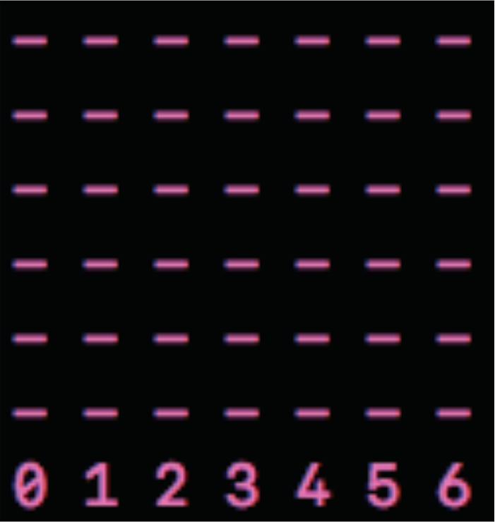
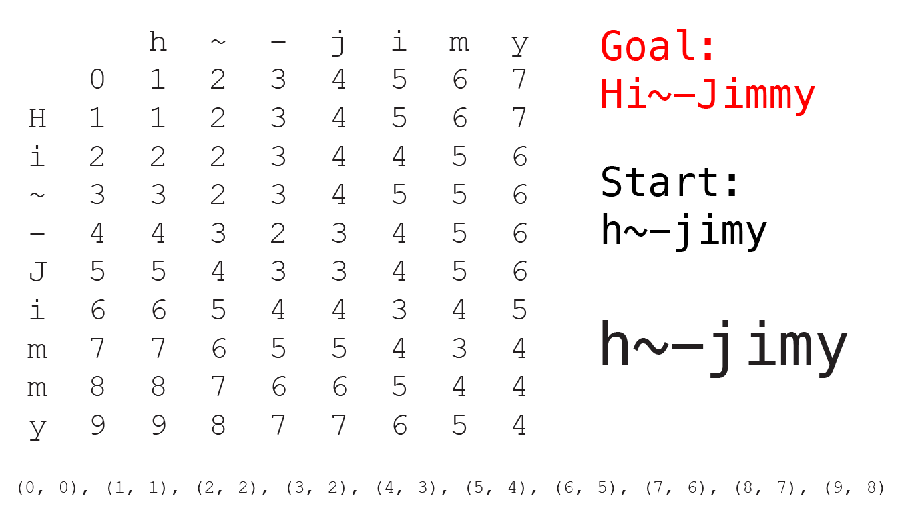

<h1> Projects </h1>

Here's a big list of the programming projects I've worked on. You can click on the titles to go to the web pages or repositories. You can view all of my [GitHub projects here](https://github.com/JimmyJHickey).

* Do not remove this line (it will not be displayed)
{:toc}

## [EM For Transmission Tomography](https://github.com/JimmyJHickey/EM-for-Transmission-Tomography)

I worked on this project with [Eric Yanchenko](http://www.ericyanchenko.com/) and [Alvin Sheng](https://www.linkedin.com/in/alvin-sheng-b06351110?original_referer=https%3A%2F%2Fwww.google.com%2F). We demonstarte the finite sample properties of the EM algorithm applied to simulated transmission tomography slides. We show how the number of projection angles affects the ability of the algorithm to recover the scan. You can read our <a href="/files/EM.pdf" target="_blank">report here</a> 

## [Gradient Descent Blog Post](https://jimmyjhickey.shinyapps.io/gradient_descent/)

I wrote an interactive article explaining Gradient Descent. It includes some real world examples as well as simple theoretical examples. The article includes mathematical derivations and algorithmic analysis as well. You can find the code [here](https://github.com/JimmyJHickey/ST790/tree/master/mini_project) and see it live [here](https://jimmyjhickey.shinyapps.io/gradient_descent/).

## [Craigslist Webscraper](https://github.com/JimmyJHickey/craigslist-scraper)

I received the first two novels in Terry Pratchett's Discworld series as gifts. Since then I have been on a quest to collect the other 39 books. This web scraper check Craigslist every hour for new postings and emails me if there is any activity. Nobody moves a Pratchett novel in this town without me hearing about it first.

## [Spotify Collaborations](https://github.com/JimmyJHickey/spotify-contributions)

Each month I create a themed Spotify playlist for my friends and I to add songs to. I collected from each play list and created a [GitHub style contribution chart to visualize our data](https://github.com/JimmyJHickey/spotify-contributions/blob/master/contributions_plot.png). I reign supreme atop the leaderboard.

## [Dr. Bergen's Letter of Recommendation](https://jimmyjhickey.github.io/old-site/silas.html)

I built this website as to recommend Dr. [Silas Bergen](http://driftlessdata.space/) for tenure. This was a more creative, personal way to show my support than simply writing a letter. The user clicks on objects in Dr. Bergen's office (drawn slightly out of scale), revealing associated reasons as to why he should get his promotion. It was my first endeavor into web development.

## [My Old Portfolio Website](https://jimmyjhickey.github.io/old-site/index.html)

This was my original portfolio website. I made it from scratch to learn HTML and CSS.

## [Computer Color Correction](https://github.com/JimmyJHickey/Computer-Color-Blind-Correction)

This machine learning project is a prototype of a color correction application. It is planned to be used to help correct images for those affected with color blindness. I made a few initial test images myself. It was trained with k-means clustering. The program was implemented in Python.

## [TFTP Client](https://github.com/JimmyJHickey/TFTP-Client)

I worked on this project with [Ben Andrews](https://www.linkedin.com/in/benjamin-andrews-b3213214a/) and [Will Diedirck](https://www.linkedin.com/in/william-diedrick-32690b14b/). We implemented a Trivial File Transfer Protocol (TFTP) client as described in [RFC 1350](https://tools.ietf.org/html/rfc1350). It includes its own set of commands used to communicate with a TFTP server. It is implemented in Java using Apache Commons libraries.

## [Machine Learning Connect 4](https://github.com/JimmyJHickey/Machine-Learning-Connect-Four)

I worked on this project with [Ben Andrews](https://www.linkedin.com/in/benjamin-andrews-b3213214a/). We implemented connect 4 and trained a supervised neural network to play against. We used a [minimax algorithm](https://github.com/erikackermann/Connect-Four) to generate training data for the network. We implemented this in Python and were working on another C++ implementation.

## [Red Hat Simulation](https://github.com/JimmyJHickey/Rambunctious-Homunculi)

I worked on this project with [Ben Andrews](https://www.linkedin.com/in/benjamin-andrews-b3213214a/) and [Erika Jensen](https://www.linkedin.com/in/erikarjensen/). We simulated Linux process management. It includes process synchronization with semaphore locks, CPU scheduling using a Completely Fair Scheduler, and local paging memory management. The system takes a CSV with a process name, memory requirements, and CPU and I/O burst information. We implemented it in Java.

## Calculus Projects

I worked on a couple of programming projects to illustrate ideas from advanced calculus. I used the [Discrete Metric](https://github.com/JimmyJHickey/Discrete-Metric-NLP) for basic Natural Language Processing. It compares how similar words are based on the letters in them; it can similarly compare passages by word. I also made an example of [Probability and Measure](https://github.com/JimmyJHickey/Probability-And-Measure) using Python and to simulate coin flipping and chart the results.
