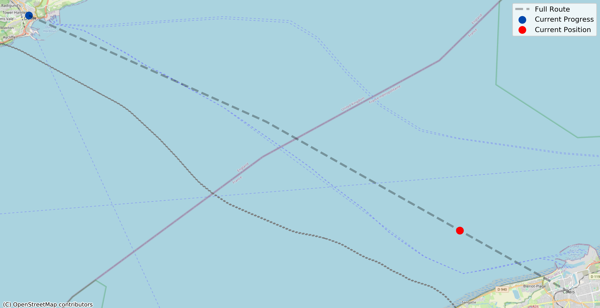
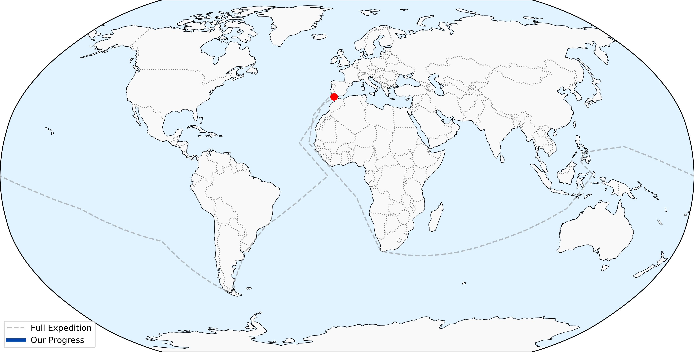

# Simian Sculling

Just some apes in boats.

## Rowing the English Channel

People can swim this, right? Surely we can row it.

**Dates:** 2026-04-17 -- Present

**Meters rowed:** 34,016

**Total meters:** 43,050.6

**Completion Percentage:** 79.01%

| Name | Meters Rowed | % of Total | Time Rowed | Calories Burned |
| :--- | :--- | :--- | :--- | :--- |
| Ham the Ast-row Chimp | 19,168 | 44.52% | 1h 50m 49s | 1,033 |
| Jim Chimpsky | 14,848 | 34.49% | 1h 37m 52s | 722 |

## Circumnavigating the Globe like Magellan

Will we mutiny as well?

**Dates:** 2026-04-17 -- Present

**Meters rowed:** 34,016

**Total meters:** 56,478,072.1

**Completion Percentage:** 0.06%

| Name | Meters Rowed | % of Total | Time Rowed | Calories Burned |
| :--- | :--- | :--- | :--- | :--- |
| Ham the Ast-row Chimp | 19,168 | 0.03% | 1h 50m 49s | 1,033 |
| Jim Chimpsky | 14,848 | 0.03% | 1h 37m 52s | 722 |