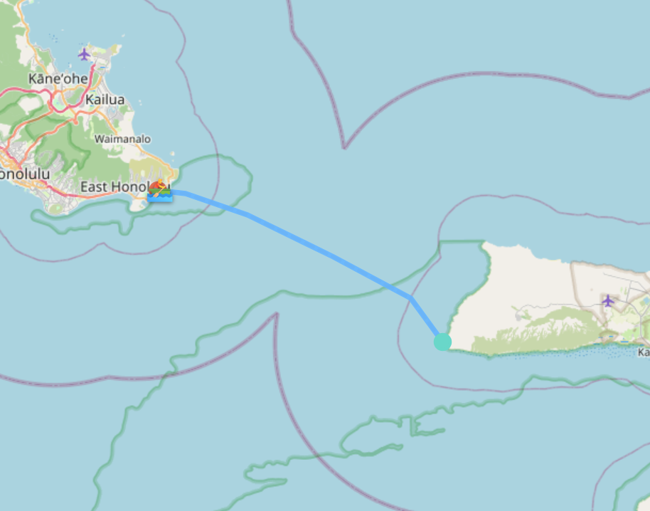
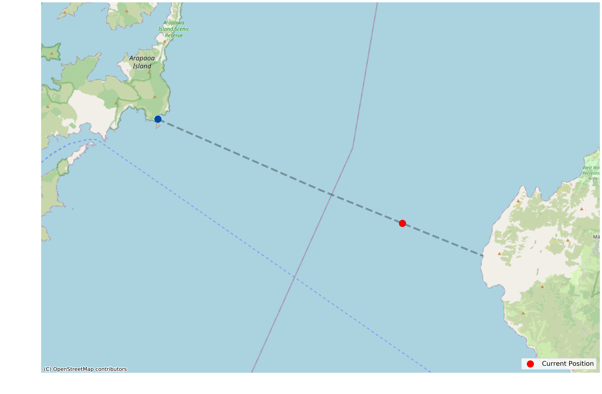
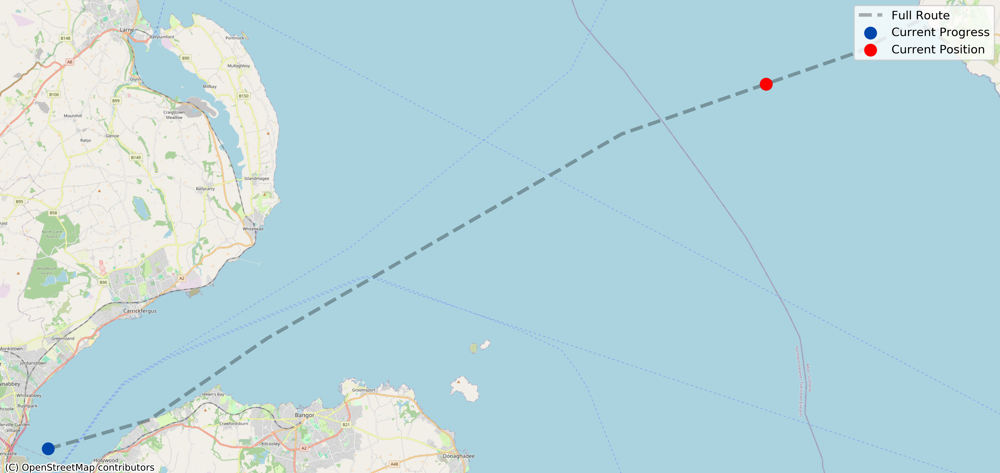

# Simian Sculling

Just some apes in boats.

## Rowing the Catalina Channel

You already know what Wine Mixer occurs here.

<iframe src="img/rowing/Rowing_the_Catalina_Channel.html" style="display:block; width:100%; max-width:800px; height:520px; border:none; border-radius:10px; margin:20px auto;" loading="lazy" title="Rowing the Catalina Channel map"></iframe>

**Dates:** 2026-05-24 -- Present

**Meters rowed:** 27,805

**Total meters:** 31,796.4

**Completion Percentage:** 87.45%

| Name | Meters Rowed | % of Total | Time Rowed | Calories Burned |
| :--- | :--- | :--- | :--- | :--- |
| Jim Chimpsky | 12,000 | 37.74% | 1h 13m 04s | 613 |
| Ham the Ast-row Chimp | 10,073 | 31.68% | 1h 00m 18s | 541 |
| Oar-angutan | 5,732 | 18.03% | 0h 30m 05s | 305 |

## Circumnavigating the Globe like Magellan

Will we mutiny as well?

<iframe src="img/rowing/Circumnavigating_the_Globe_like_Magellan.html" style="display:block; width:100%; max-width:800px; height:520px; border:none; border-radius:10px; margin:20px auto;" loading="lazy" title="Circumnavigating the Globe like Magellan map"></iframe>

**Dates:** 2026-04-17 -- Present

**Meters rowed:** 280,396

**Total meters:** 56,478,072.1

**Completion Percentage:** 0.5%

| Name | Meters Rowed | % of Total | Time Rowed | Calories Burned |
| :--- | :--- | :--- | :--- | :--- |
| Ham the Ast-row Chimp | 123,958 | 0.22% | 12h 01m 29s | 6,775 |
| Jim Chimpsky | 111,224 | 0.2% | 11h 58m 52s | 5,576 |
| Oar-angutan | 36,624 | 0.06% | 3h 31m 03s | 1,882 |
| Mo Monkeys Mo Problems | 8,590 | 0.02% | 0h 45m 13s | 450 |

# Archive

## Rowing the Molokaʻi Channel

The sharks and man-of-war jellyfish won't impede us.

**Dates:** 2026-05-16 -- 2026-05-23

**Meters rowed:** 49,551

**Total meters:** 44,131.5

**Completion Percentage:** 100.0%

| Name | Meters Rowed | % of Total | Time Rowed | Calories Burned |
| :--- | :--- | :--- | :--- | :--- |
| Jim Chimpsky | 24,018 | 54.42% | 2h 30m 50s | 1,229 |
| Ham the Ast-row Chimp | 20,050 | 45.43% | 1h 48m 38s | 1,102 |
| Oar-angutan | 5,483 | 12.42% | 0h 30m 06s | 285 |

## Rowing the Cook Strait

Also known as Te Moana-o-Raukawa, which is probably better than naming it after a colonizer.

**Dates:** 2026-05-12 -- 2026-05-15

**Meters rowed:** 41,277

**Total meters:** 22,722.0

**Completion Percentage:** 100.0%

| Name | Meters Rowed | % of Total | Time Rowed | Calories Burned |
| :--- | :--- | :--- | :--- | :--- |
| Jim Chimpsky | 17,021 | 74.91% | 1h 42m 42s | 879 |
| Oar-angutan | 12,161 | 53.52% | 1h 10m 16s | 622 |
| Ham the Ast-row Chimp | 10,063 | 44.29% | 0h 59m 24s | 545 |
| Mo Monkeys Mo Problems | 2,032 | 8.94% | 0h 10m 02s | 110 |

## Rowing the North Channel

Also known as the Sruth na Maoile or the Sheuch.

**Dates:** 2026-05-04 -- 2026-05-11

**Meters rowed:** 72,773

**Total meters:** 55,576.7

**Completion Percentage:** 100.0%

| Name | Meters Rowed | % of Total | Time Rowed | Calories Burned |
| :--- | :--- | :--- | :--- | :--- |
| Jim Chimpsky | 27,744 | 49.92% | 3h 02m 33s | 1,375 |
| Ham the Ast-row Chimp | 25,223 | 45.38% | 2h 29m 42s | 1,389 |
| Oar-angutan | 13,248 | 23.84% | 1h 20m 36s | 670 |
| Mo Monkeys Mo Problems | 6,558 | 11.8% | 0h 35m 11s | 340 |

## Rowing the English Channel

People can swim this, right? Surely we can row it.

**Dates:** 2026-04-17 -- 2026-04-23

**Meters rowed:** 44,270

**Total meters:** 43,050.6

**Completion Percentage:** 100.0%

| Name | Meters Rowed | % of Total | Time Rowed | Calories Burned |
| :--- | :--- | :--- | :--- | :--- |
| Ham the Ast-row Chimp | 24,240 | 56.31% | 2h 24m 55s | 1,304 |
| Jim Chimpsky | 20,030 | 46.53% | 2h 11m 26s | 980 |

